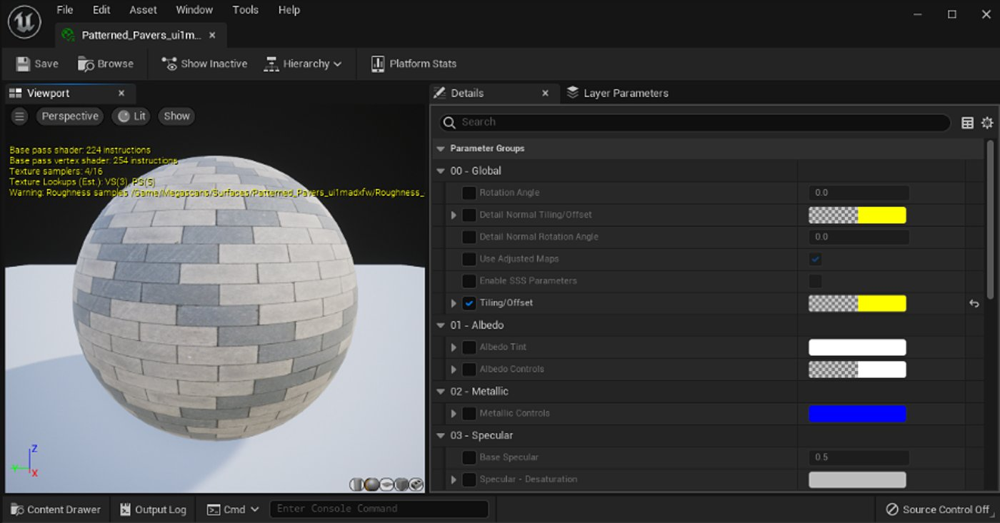
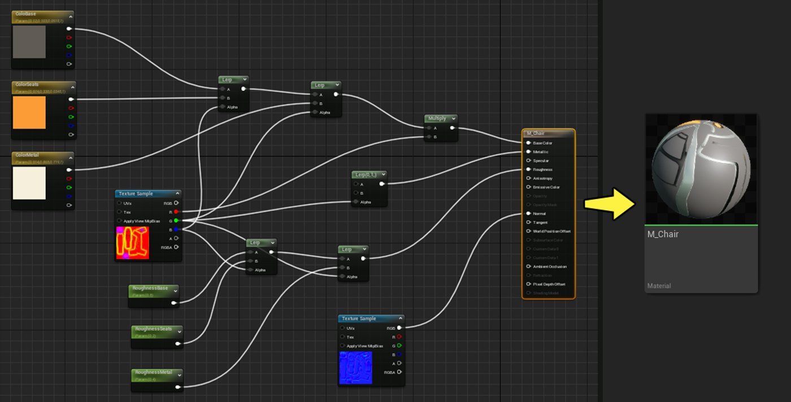
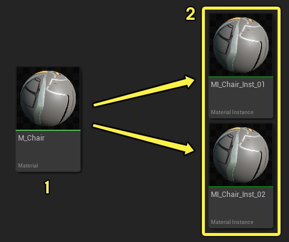
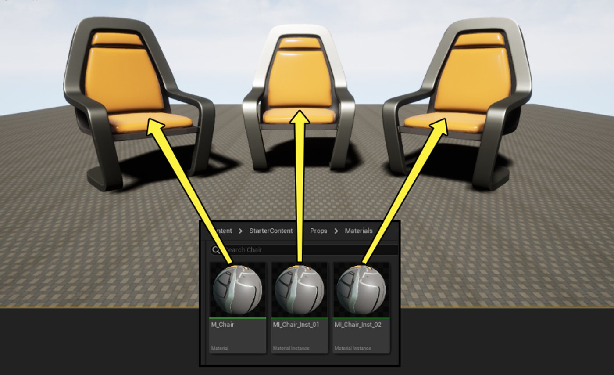
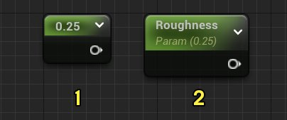
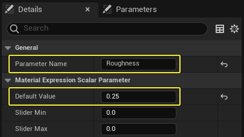
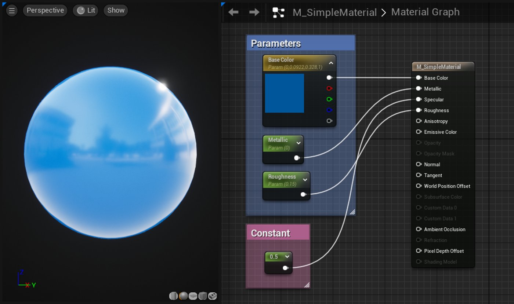
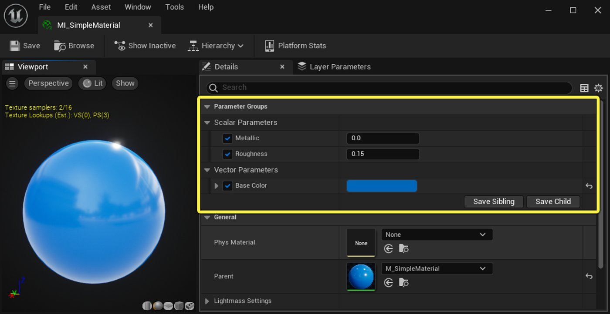

# 材质实例

> 路径：虚幻引擎5.7文档 / 设计视觉、渲染和图形效果 / 材质 / 材质实例

> 原始页面：https://dev.epicgames.com/documentation/unreal-engine/instanced-materials-in-unreal-engine

在虚幻引擎中，**材质实例化（Material instancing）**是一种更改材质外观同时避免材质重新编译（开销很大）的方法。

虽然常规材质必须在重新编译（必须在Gameplay之前进行的操作）后更改才能生效，但是参数化材质可以在材质实例中编辑，无需重新编译。 此功能具有许多工作流优势，并且可以提高材质性能。

*在材质实例编辑器中打开的材质实例。 你可以从此界面自定义参数组（Parameter Groups）下列出的属性。*

某些类型的实例化材质甚至可以在Gameplay期间根据游戏中的事件发生变化（例如，一棵树的材质在燃烧时变黑并烧成炭）。 这为你的美术元素提供了巨大的视觉灵活性。

## 材质继承

材质和材质实例之间的关系是层级父子关系。 材质实例从父（或主）材质继承所有属性。 例如，这是在初学者内容包中找到的一个椅子道具的材质图表：

从**M_Chair**创建的所有材质实例都继承上图所示的所有属性。

> [!NOTE]
> 请注意上面使用的命名规范。 这是很好的做法，有利于在内容浏览器中轻松识别父材质和材质实例。
>
> 1. 前缀**M_**表示父材质，比如**M_Chair**。
> 2. 前缀**MI_**表示材质实例，比如右图的两个示例。

因为从父级继承属性，所以新创建的材质实例在应用于关卡中的对象时，看起来与父材质相同。 在下图中，最左侧的椅子应用了父材质，而中间和右侧的椅子使用未更改的材质实例。

材质实例的主要工作流优势在于，你可以非常快速地在**材质实例编辑器（Material Instance Editor）**中自定义，无需编辑节点图表或重新编译材质。

在下面的视频中，从内容浏览器（Content Browser）打开了两个材质实例，并在材质实例编辑器（Material Instance Editor）中进行了编辑。 更改会立即出现在主视口中，而标准材质可能需要长达一分钟的时间来重新编译，具体取决于复杂性。

## 材质参数化

值得注意的是，默认情况下，你无法编辑材质实例的每个特性。 要使材质属性在实例中可编辑，你必须将它们指定为父材质中的参数。 这称为**参数化**材质。

参数的创建与材质编辑器（Material Editor）中的所有其他数据节点一样，并且包含与非参数化版本相同的信息。

例如，**常量（Constant）**表达式包含单个浮点值，并且经常用于控制材质输入，比如粗糙度（Roughness）和金属感（Metallic）。 此节点的参数化版本称为**标量参数（Scalar Parameter）**。

*常量材质表达式（1）和标量参数（2）。*

请注意，标量参数也成为命名值，用作将数据值发送到材质实例的管道。 在**细节（Details）面板**中，务必要为每个参数指定唯一的描述性名称。 在材质图表中点击节点可在细节面板中查看其属性。

在上面的示例中，参数的名称是**粗糙度（Roughness）**，它的默认值为0.25。

在下面显示的简单参数化材质中，**向量参数（Vector Parameter）**连接到基础颜色（Base Color）输入，而**标量参数（Scalar Parameters）**插入金属感（Metallic）和粗糙度（Roughness）。

为了进一步说明参数化理念，还需要传入**高光度（Specular）**输入的常量值0.5。

在材质实例编辑器（Material Instance Editor）中打开时，这三个参数公开且可编辑，而常量则不是。 你要向美术师公开的值应该是参数，而你不想让别人更改的值应该保持为常量。

*基础颜色（Base Color）、金属感（Metallic）和粗糙度（Roughness）的参数在材质实例编辑器（Material Instance Editor）中可编辑，而常量值不会向美术师公开。*

## 参数类型

参数可用于材质图表中的任意位置，驱动各种材质效果。

下文罗列了一些关键参数类型，此处可以找到[参数表达式](https://dev.epicgames.com/documentation/assets/designing-visuals-rendering-and-graphics/materials/material-expressions/parameters)的完整列表。

### 标量参数

**ScalarParameter**是包含单个浮点值的参数。 标量参数可以驱动基于单个值的效果，比如上面的粗糙度和金属感示例所示。

标量参数也经常用于控制属性的倍增因子。

> 图片已省略：标量参数驱动自发光能力

在此图表中，标量参数乘以纯色，效果插入自发光颜色（Emissive Color）输入。 标量参数中的值将控制自发光效果的强度。 较高的值会增加自发光亮度。

### 向量参数

**VectorParameter**是包含4通道向量值或四个浮点值的参数。

> 图片已省略：向量参数节点

这些通常用于提供可配置颜色，但也可用于表示位置数据，或驱动需要多个值的效果。

### 纹理参数

最常用的纹理参数是TextureSampleParameter2D，它允许你更改材质实例中的纹理。

> 图片已省略：纹理示例 2D

有几种其他类型的纹理参数可用。 每一种都专用于它接受的纹理类型或它的使用方式。 例如：

- TextureSampleParameterCube接受TextureCube或立方体贴图。
- TextureSampleParameterFlipbook接受FlipbookTexture。
- TextureSampleParameterMeshSubUV接受用于网格体发射器子UV效果的Texture2D。
- TextureSampleParameterMeshSubUV接受用于网格体发射器子UV混合效果的Texture2D。

有关纹理参数的完整列表，请参阅[材质表达式参考](../unreal-engine-material-expressions-reference/index.md)。

### 静态参数

**静态**参数在编译时应用，因此它们可以在材质实例编辑器（Material Instance Editor）中编辑，但不能从脚本编辑或在运行时编辑。

它们可用于遮罩材质的分支。 例如，**StaticSwitch**参数需要两个输入。 如果参数值为true，则输出第一个值，如果为false，则输出第二个值。 这会产生更理想的代码，因为被静态参数遮罩的分支不会在运行时执行。

> 图片已省略：静态切换参数

有关特定静态参数类型的信息，请参阅[静态切换参数](https://dev.epicgames.com/documentation/assets/designing-visuals-rendering-and-graphics/materials/material-expressions/parameters#StaticSwitchParameter)和[静态组件遮罩参数](https://dev.epicgames.com/documentation/assets/designing-visuals-rendering-and-graphics/materials/material-expressions/parameters#StaticComponentMaskParameter)。

> [!WARNING]
> 对于实例使用的基础材质，系统会为其中的每个静态参数组合编译新材质。
>
> 这可能导致需要编译的着色器过多。 请尽量减少材质中的静态参数数目以及实际使用的静态参数排列数。

## 常量和动态实例

虚幻引擎中有两种类型的材质实例可用：

- **常量材质实例（Material Instance Constant）**— 仅在运行前计算。
- **动态材质实例（Material Instance Dynamic）**— 可以在运行时计算（和编辑）。

### 常量材质实例

**常量材质实例（Material Instance Constant）**是实例化材质，在运行前只计算一次。 这意味着它不能在Gameplay期间改变。 尽管它们在整个游戏过程中保持不变，但它们仍然具有不需要编译的性能优势。

例如，如果你的游戏中有多种具有不同绘图作业且颜色在Gameplay期间不会改变的汽车，那么最佳实践方法是，创建代表泛型车漆基础方面的主材质。 然后，创建**常量材质实例（Material Instance Constants）**来表示不同类型汽车的变化，例如不同的颜色、不同程度的粗糙度等。 本页前面的椅子示例演示了此方法。

常量材质实例在[内容浏览器（Content Browser）](../../../understanding-the-basics/content-browser/index.md)中创建，并在[材质实例编辑器（Material Instance Editor）](unreal-engine-material-instance-editor-ui/index.md)中进行编辑。

### 动态材质实例

**动态材质实例（MID）**是可以在Gameplay期间（运行时）计算的实例化材质。 这意味着在玩游戏时，你可以使用脚本（编译代码或蓝图可视化脚本）更改材质的参数，从而更改整个游戏的材质。 这方面的潜在应用是无限的，从显示不同程度的损坏到改变架构可视化中的漆色。

MID在脚本中从参数化材质或常量材质实例创建。 在蓝图中，可以采用具有参数化属性的给定材质，并通过**Create Dynamic Material Instance**节点馈送它。。 然后，将该节点的效果应用到具有**Set Material**节点的相关对象。 这会产生可以在Gameplay期间更改的新材质。

## 创建和使用材质实例

创建并使用材质实例分为两步。 首先，你必须创建父材质，该材质将参数表达式用于你希望能够在材质实例中覆盖的属性。 然后，你可以创建材质实例，并在材质实例编辑器（Material Instance Editor）中自定义属性。

要了解如何创建参数化材质，并在材质实例中使用，请阅读此处：[创建并使用材质实例](creating-and-using-material-instances/index.md)。
