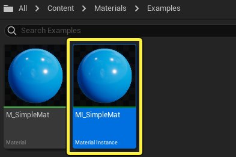
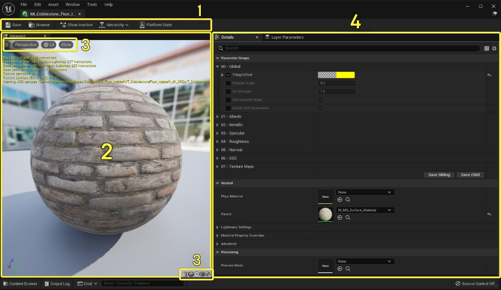
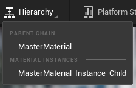
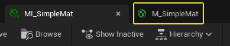
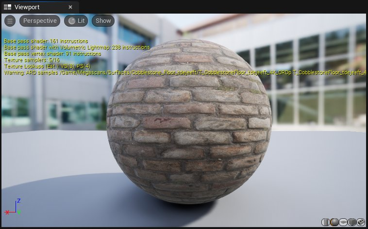
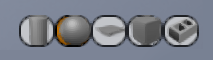
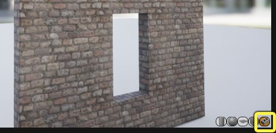
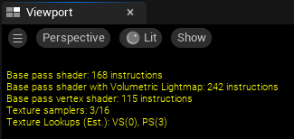

# 材质实例编辑器用户界面

> 路径：虚幻引擎5.7文档 / 设计视觉、渲染和图形效果 / 材质 / 材质实例 / 材质实例编辑器用户界面

> 原始页面：https://dev.epicgames.com/documentation/unreal-engine/unreal-engine-material-instance-editor-ui

材质实例编辑器用于修改材质实例中的参数。 如果你不熟悉材质参数化和实例化，请阅读以下页面：

1. 材质实例概述
2. 创建和使用材质实例

## 打开材质实例编辑器

双击内容浏览器中的 **材质实例（Material Instance）** ，打开材质实例编辑器。

你还可以 **右键点击** 内容浏览器中的材质实例缩略图，然后从上下文菜单选择 **编辑（Edit）** 。

## 材质实例编辑器界面

材质实例编辑器包含以下区域：

1. 工具栏（Toolbar）

   - 保存你的资产，在内容浏览器中查找资产，显示隐藏的参数，显示继承层级和平台统计数据。
2. 视口（Viewport）

   - 一个实时视口，其中显示材质实例的预览。
3. 视口显示选项（Viewport display options）

   - 允许你编辑视口中的摄像机和显示设置，以及更改用于材质预览的网格体。
4. 细节面板（Details Panel）

   - 所有公开的材质参数和属性都位于此处。

### 工具栏

| **图标** | **说明** |
| --- | --- |
|  | 保存当前资产。 |
| 内容浏览器 | 查找并选择 **内容浏览器（Content Browser）** 中的材质实例。 |
| 显示隐藏项 | 显示隐藏在静态开关背后的不激活参数。 |
| 层级 | 显示材质实例的继承层级。[见下](#%E5%B1%82%E7%BA%A7%E8%8F%9C%E5%8D%95)。 |
| 平台统计数据 | 打开一个窗口，其中显示不同目标平台的渲染统计数据。 |

#### 层级菜单

**层级菜单（Hierarchy menu）** 显示当前材质实例的继承链。由于材质实例可以用作其他材质实例的父节点，因此父节点和子节点都在层级菜单中列出。

- 当前材质实例的

  父节点

  在父节点链下列出。 如果有多个父节点，列出的第一个父节点位于继承层级顶端。
- 当前材质实例的

  子节点

  在材质实例下列出。

从层级菜单选择父材质或材质实例会在材质实例编辑器窗口的 **新选项卡** 中打开该资产。

### 视口

视口显示应用于静态网格体的材质实例的预览。 当你更改材质实例中的参数时，材质预览会实时更新。

你可以使用以下功能按钮与视口交互：

- 点击并拖动

  鼠标左键

  以旋转预览网格体。
- 点击并拖动

  鼠标中键

  以平移摄像机。
- 点击并拖动

  鼠标右键

  以放大和缩小，或使用滚轮。
- 按住

  L

  键并使用

  鼠标左键

  拖动以旋转光源方向。

### 视口显示选项

| **图标** | **说明** |
| --- | --- |
| 视口选项 | 包含用于启用实时预览、显示FPS以及更改预览窗口的FOV开关。 |
| 摄像机选项 | 在视角和正交视口摄像机之间切换。 |
| 视图模式选项 | 包含标准视图模式，如"光照（Lit）"、"无光照（Unlit）"、"线框（Wireframe）"，等等。 还包含曝光覆盖。 |
| 显示选项 | 启用或禁用渲染统计数据、网格和背景。 |
| 圆柱体预览 | 在圆柱体上预览材质实例。 |
| 球体预览 | 在球体上预览材质实例。 |
| 平面预览 | 在平面上预览材质实例。 |
| 立方体预览 | 在立方体上预览材质实例。 |
| 自定义静态网格体 | 在自定义静态网格体上预览材质实例。 |

你可以点击视口底部的某个形状图标，以更改材质预览网格体。

要在自定义网格体上预览材质实例，请选择内容浏览器中的 **静态网格体（Static Mesh）** 资产，然后点击 **砖图标**。 预览网格体会与材质实例一起保存，这样下次打开该实例时，它就会显示在相同的预览网格体上。

视口还会显示有关材质的统计数据，例如，各种着色器类型的指令数，以及 该材质使用的纹理示例数量。

要预览材质实例中的某种动作或动画，你必须启用 **实时（Realtime）** 视口选项。 点击汉堡菜单以打开视口选项，并确保"实时（Realtime）"已选中。该选项默认为启用。

> 图片已省略：切换实时

你还可以按 **Ctrl+R** 以切换实时渲染。

### 细节面板

你可以在"细节面板（Details panel）"中覆盖材质实例中的参数和设置。 你对材质实例进行的所有更改都会在此界面中进行。

> 图片已省略：细节面板

"细节面板（Details panel）"中有三个主要子分段：

#### 参数组

你已通过父材质中的参数公开的材质属性在此处列出。 要覆盖参数值，请选中参数名称左侧的框，然后修改字段中的值。[参见此处](#%E8%A6%86%E7%9B%96%E6%9D%90%E8%B4%A8%E5%AE%9E%E4%BE%8B%E5%8F%82%E6%95%B0)，了解有关覆盖参数的更多信息。

#### 通用

"通用（General）"分段允许你选择不同的父材质或物理材质。 你还可以调整此材质实例将如何影响Lightmass编译，并覆盖从父材质继承的一些属性。 阅读[此处关于这些设置](#%E8%A6%86%E7%9B%96%E6%9D%90%E8%B4%A8%E5%AE%9E%E4%BE%8Blightmass%E8%AE%BE%E7%BD%AE)的更多信息。

#### 预览

本分段提供了另一个输入，以更改用于材质实例预览的静态网格体。

## 覆盖材质实例参数

参数在"细节面板（Details Panel）"中的 **参数组（Parameter Groups）** 分段下列出。要覆盖材质参数，请执行以下操作：

1. 选中该参数名称左侧的框。
2. 在字段中输入新值，或使用取色器设置新值。

> 图片已省略：覆盖参数

选中的参数当前在材质实例中已覆盖。 未选中的参数使用父材质中的值，即使字段中有不同的值：

> 图片已省略：未选中的参数

编辑参数完成后，请务必 **保存（Save）** 材质实例，以免你的工作丢失。 为了节省内存，关闭材质实例编辑器窗口时，未选中字段中的值将丢失。

要将参数重置为默认值，请点击该参数右侧的 **重置（Reset）** 按钮。

> 图片已省略：重置参数

### 覆盖材质实例Lightmass设置

你可以在 **通用（General）> Lightmass设置（Lightmass Settings）** 分段下覆盖材质与Lightmass交互的方式。

例如，如果你增大自发光材质的"自发光增强（Emissive Boost）"属性，该材质将向Lightmass生成的静态光照解决方案贡献更多自发光。 这会使结果更明亮。

> 图片已省略：覆盖自发光增强

### 覆盖父材质属性

"材质属性覆盖"分段允许你覆盖实例的父材质中的某些材质属性。

例如，如果你需要材质实例同时在表面的正面和背面渲染，可以启用"双面（Two Sided）"选项。

> 图片已省略：覆盖双面

在材质实例编辑器中覆盖这些属性而不是编辑父材质的优势是，这样做只影响材质的单个实例。 其他每个实例将从父材质继承设置。
