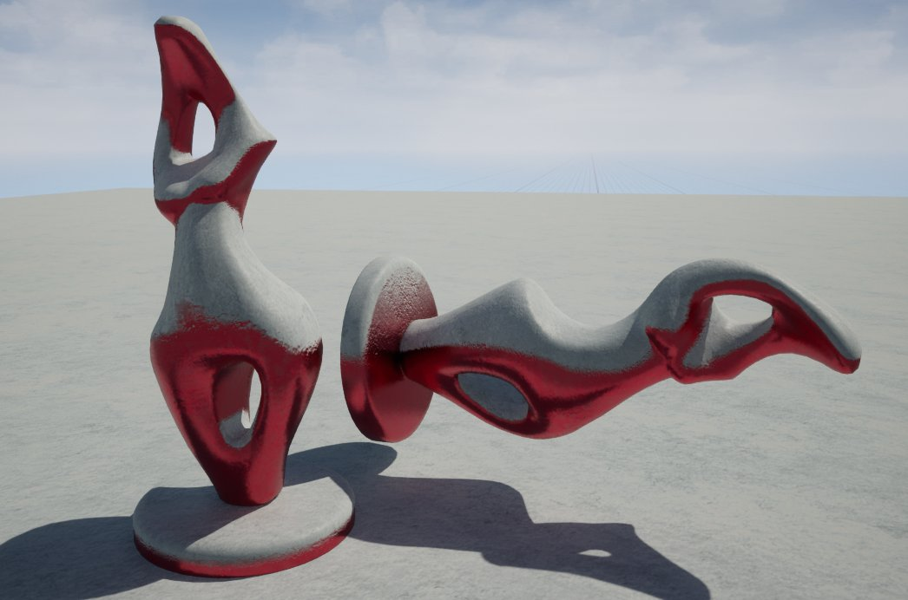
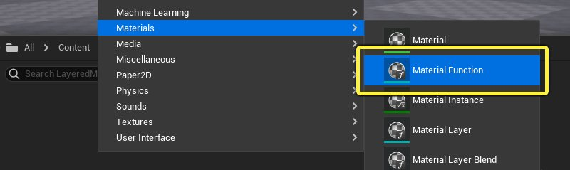
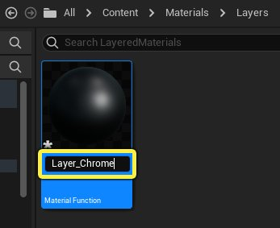
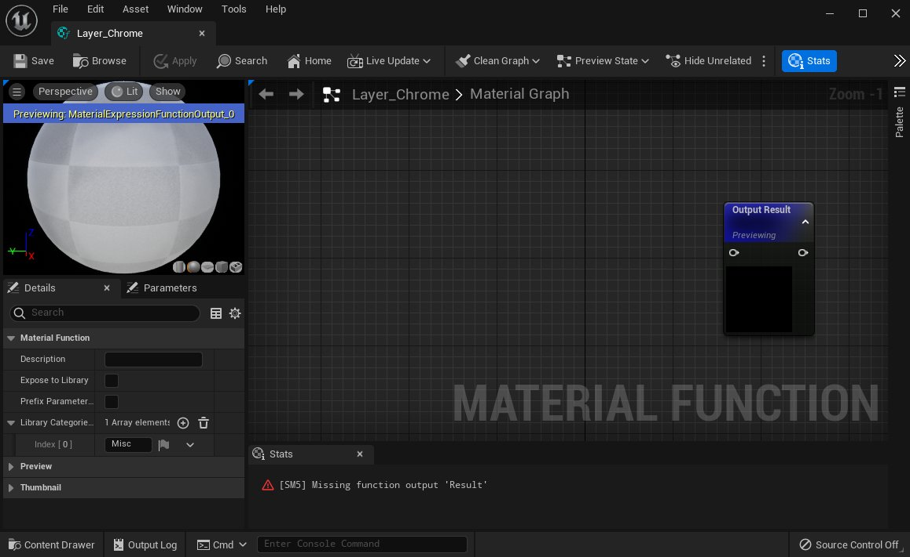
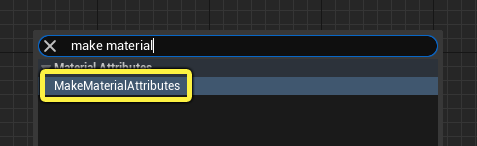
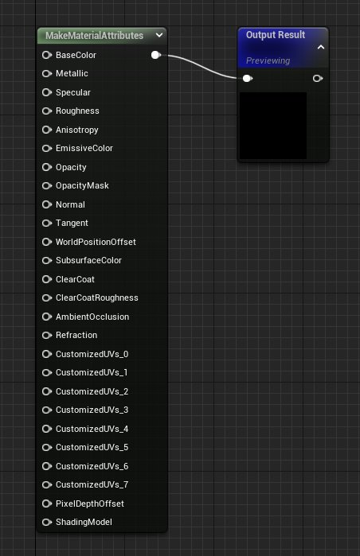
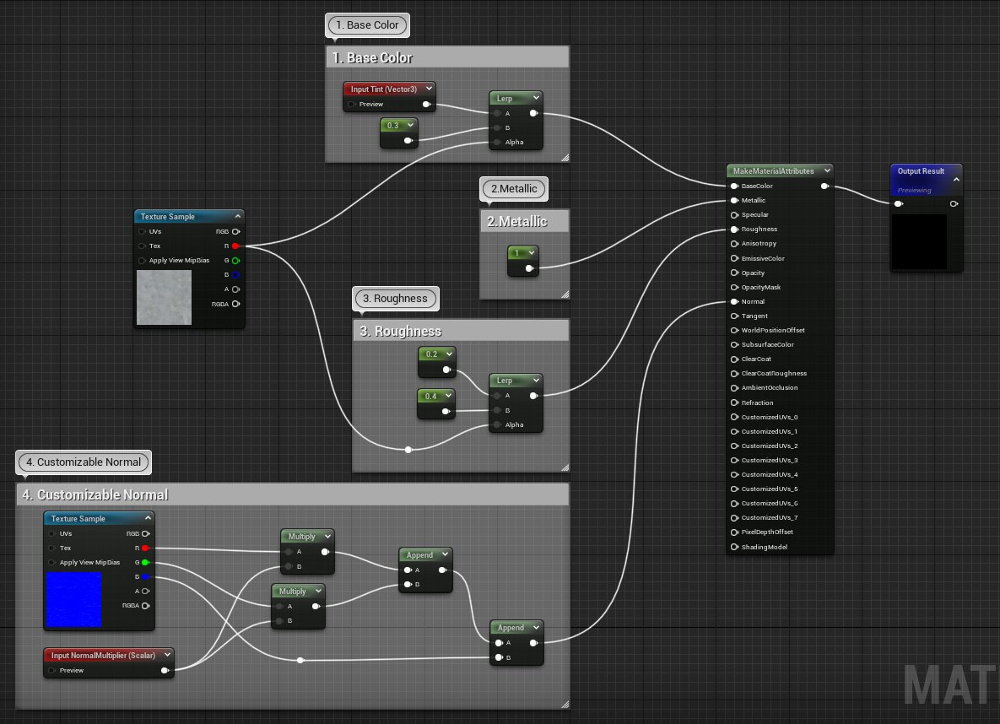
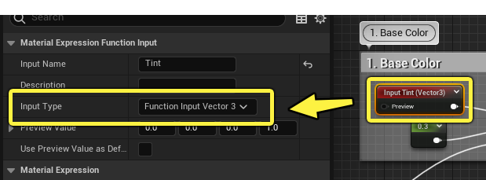

# 创建分层材质

> 路径：虚幻引擎5.7文档 / 设计视觉、渲染和图形效果 / 材质 / 分层材质 / 创建分层材质

> 原始页面：https://dev.epicgames.com/documentation/unreal-engine/creating-layered-materials-in-unreal-engine

本文介绍了一个简单 **分层材质（Layered Material）** 的过程，这个材质由两层材质构成：铬和雪。在最终实现的分层材质中，我们用了一个基于世界对齐的混合，自动将雪放置在网格体的朝上部分上，从而有效地在两种材质之间切换。混合函数始终会检查上表面，这意味着即使在你旋转对象时，雪材质仍会保持在上面，如下图所示：

> [!NOTE]
> 一般来说，在创建分层材质时，常见做法是先分别创建材质来表示每个材质层，然后将这些节点网络复制/粘贴到新的材质函数中。为了节省时间，本教程默认材质函数中已经有了材质层。

## 简单的铬

| 铬纹理 |  |
| --- | --- |
|  |  |
| T_ExampleLayers_Metal_1_BC.png | T_ExampleLayers_Metal01_N.png |
| （点击右键保存图片） | （点击右键保存图片） |

材质的底层是一种简单的铬材质，表面带有一些细微瑕疵，用来让材质更真实。为了展示编辑效果，该材质包含多个输入，以便微调总体外观。

1. 在 **内容浏览器（Content Browser）** 中点击右键，点击 **材质（Materials）** 并选择上下文菜单中的 **材质函数（Material Function）** 。

   
2. 将材质函数命名为 **Layer_Chrome** 。

   
3. **双击** 材质函数，在材质编辑器中打开。

   
4. **右键点击** 材质图表，然后搜索并选择上下文菜单中的 **创建材质属性（Make Material Attributes）** 。

   
5. 将 **Make Material Attributes** 节点连接到 **Output Result** 节点。

   

### 铬材质网络

下图是铬材质层的材质图表，图下方则是步骤的详细说明，便于你复制。其中用到了两张纹理：用来保存基础颜色和粗糙度的 **T_ExampleLayers_Metal_1_BC.png** ，以及保存法线的 **T_ExampleLayers_Metal01_N.png** ，两者都可在本文开始处下载。

点击查看大图。

请参阅以下备注，其中解释了材质图表中的四个注释块。

1. **基础颜色（Base Color）** - 对于基础颜色，线性插值(LERP)用于在基础铬颜色与非常深的灰色值(0.3)之间混合。 对于基础颜色，创建 **Function Input** 节点并将其命名为 **Tint** 。确保输入类型在"细节（Details）"面板中设置为 **Vector3** ，这样你可以向函数输入颜色来更改铬的色调。 **T_ExampleLayers_Metal_1_BC** 纹理的红色通道用于驱动两个值之间的插值。

   
2. 金属感（Metallic）

   - 由于这是金属材质，因此将值1传递到"金属感（Metallic）"输入。
3. 粗糙度（Roughness）

   - 一般来说，铬材质的粗糙度应该非常低，但一些细微的变化可以给材质的总体外观带来深度。在本例中，铬纹理的红色通道用于在值0.2和0.4之间执行LERP。 这意味着，纹理贴图上深色区域的粗糙度略高于浅色区域。
4. 可自定义法线（Customizable Normal）

   - 此网络将直接接收切线空间法线贴图，并分隔绿色和红色通道，它们控制贴图的大部分细节。每个通道会乘以从另一个函数输入提供的值。此输入设置为标量类型，名为

   法线乘数（Normal Multiplier）

   ，默认值为1.0。使用

   AppendVector节点

   ，结果会附加到一起，然后附加到法线贴图的蓝色通道。结果是，用户能够更改法线乘数值，从而调整法线高度。

确保在完成后编译并保存[材质函数](../../material-functions/unreal-engine-material-functions-overview/index.md)。

## 简单的雪

| 雪纹理 |  |
| --- | --- |
|  |  |
| T_Cave_Ice_Tiling_D.png | T_Cave_Ice_Noise_N.png |
| （点击右键保存图片） | （点击右键保存图片） |

下载上述两个纹理并将其导入虚幻引擎中。执行下面的步骤，为雪层创建第二个材质函数。

1. 在 **内容浏览器（Content Browser）** 中右键点击，点击 **材质（Materials）** 并选择上下文菜单中的 **材质函数（Material Function）** 。

   > 图片已省略：创建材质函数
2. 将材质函数命名为 **Layer_Snow** 。

   > 图片已省略：重命名函数
3. **双击** 材质函数，在材质编辑器中打开。

   > 图片已省略：新建材质函数
4. **右键点击** 材质图表，然后搜索并选择上下文菜单中的 **创建材质属性（Make Material Attributes）** ，接着将其添加到图表中。

   > 图片已省略：从上下文菜单添加
5. 将 **Make Material Attributes** 节点连接到 **Output Pose** 节点。

   > 图片已省略：连接

### 雪材质层的节点网络

下面是雪材质图表的详细说明。它用到了 **T_Cave_Ice_Tiling_D.png** 和 **T_Cave_Ice_Noise_N.png** 纹理，两者都可在本页面顶部下载。

> 图片已省略：undefined

1. **基础颜色（Base Color）** - 这是网络中唯一比较复杂的部分，因为它使用了 **FuzzyShading** 材质函数。该函数在材质接收光线时能防止纹理变得太暗。这类似于光线通过纤维状表面的情形。它非常适合丝绒、苔藓或者本例中的雪。对比度从基础颜色纹理(T_Cave_Ice_Tiling_D.png)中移除了一些，方法是对其进行0.3次方运算。

   接下来，将结果插入到FuzzyShading材质函数，该函数可以在材质编辑器控制板中的"函数（Functions）"选项卡中找到。将 **核心暗度（Core Darkness）** 设置为0，将 **幂（Power）** 设置为1，并将 **边缘亮度（EdgeBrightness）** 设置为0.5。最后，将整个事物乘以非常淡的蓝色(R=0.8, G=0.9, B=0.95)，使其呈现冰冷的色调。
2. 金属感（Metallic）

   - 这个材质是非金属表面，因此"金属感（Metallic）"设置为0。
3. **粗糙度（Roughness）** - 光线恰到好处地照到雪上时，雪应该有一点闪耀，因此T_Cave_Ice_Tiling_D.png纹理的红色通道用于驱动0.6到0.3之间的插值。
4. 法线（Normal）

   - 法线贴图的效果有点太强了。 有一种方式可以减轻切线空间法线贴图的效果，那就是将蓝色通道的强度加倍。将法线贴图乘以值为(1,1,2)的Constant3向量即可。

完成后请保存结果！

## 分层材质

现在你可以创建一种材质，然后将两个层函数混合在一起。 此示例的配置方式是，雪始终显示在表面上方。该材质还包含一些参数，以便可在材质实例中自定义。

1. 在 **内容浏览器（Content Browser）** 中，点击 **新增（Add New）** 按钮，并从上下文菜单选择材质。

   > 图片已省略：创建新材质
2. 将新材质命名为 **Mat_SnowyChrome** 。

   > 图片已省略：重命名材质
3. **双击** 材质，在材质编辑器中打开。

   > 图片已省略：在材质编辑器中打开材质
4. 将 **Layer_Chrome** 和 **Layer_Snow** 材质函数从 **内容浏览器（Content Browser）** 拖入材质图表中。

   > 图片已省略：将层拖入材质图表中
5. 点击材质图表的背景，在"细节（Details）"面板中显示基础材质属性。 选中 **使用材质属性（Use Material Attributes）** 框以将其启用。

   > 图片已省略：启用
6. 从控制板添加 **MatLayerBlend_Simple** 材质函数，以及 **WorldAlignedBlend** 函数。MatLayerBlend_Simple将执行从铬到雪的过渡，而World_Aligned_Blend将基于表面的朝向来驱动层混合。

### 分层材质网络

下面是Mat_SnowyChrome材质网络的细目，以及每个带注释区域的描述。

> 图片已省略：undefined

1. **铬设置（Chrome Setup）** - 有两个参数连接到Layer_Chrome材质函数。第一个是名为 **铬法线（Chrome Normal）** 的标量参数，用于驱动 **NormalMultiplier** 输入。第二个是名为 **铬色调（ChromeTint）** 的向量参数，用于驱动 **色调（Tint）** 输入。你可以使用这些参数改变法线贴图的强度，并在以后对材质实例化时更改铬的色调。
2. **雪设置（Snow Setup）** - 不需要更多节点。Layer_Snow材质函数将直接插入到混合节点。
3. **世界对齐的混合设置（World Aligned Blend Setup）** - WorldAlignedBlend节点将控制材质混合的位置和锐度。 将 **混合锐度（Blend Sharpness）** 值设置为10。 然后创建名为 **BlendBias** 的标量参数并将其连接到 **混合别名（Blend Bias）** 输入。这样一来，你可以在发生混合的网格体上调整垂直位置。
4. **MatLayerBlend** - 该节点包含用于驱动混合的逻辑。在本例中，基础材质是Layer_Chrome，顶层材质是Layer_Snow。WorldAlignedBlend将插入到Alpha输入以驱动过渡。

完成后请保存材质！

## 实例化分层材质

由于该材质包含两个参数，你现在可以创建一个材质实例，然后设置材质层的不同部分。

1. 如果你在项目中添加了初学者内容包，你会看到一套桌椅，并可以将新材质应用于这套桌椅。如果没有，可以用你自己的资产。
2. 右键点击 **Mat_SnowyChrome** 材质，然后选择上下文菜单中的 **创建材质实例（Create Material Instance）**。默认名称应该是可以的。

   > 图片已省略：创建材质实例
3. 将材质实例资产从 **内容浏览器（Content Browser）** 拖到场景中的某个对象上。

   > 图片已省略：从内容浏览器应用材质实例
4. **双击** 材质实例，在材质实例编辑器中打开。你可以覆盖铬的色调、铬的法线贴图的深度，以及其上方落了多少雪。
