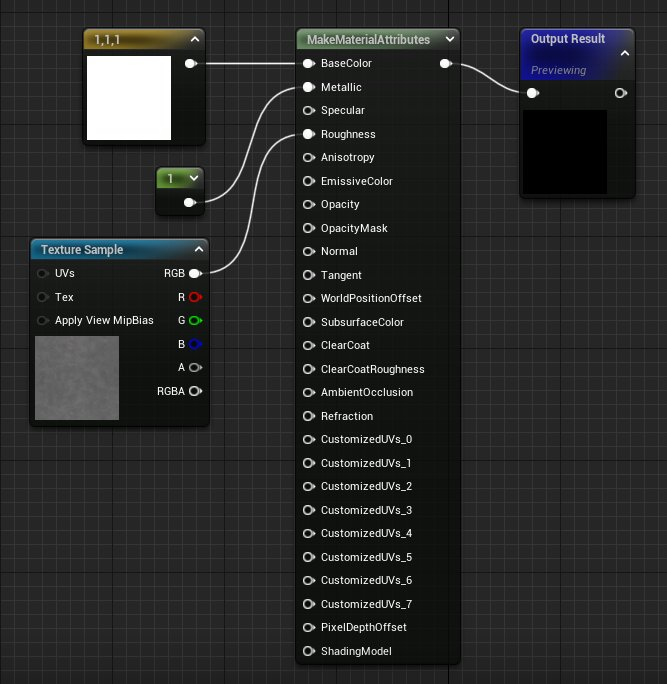
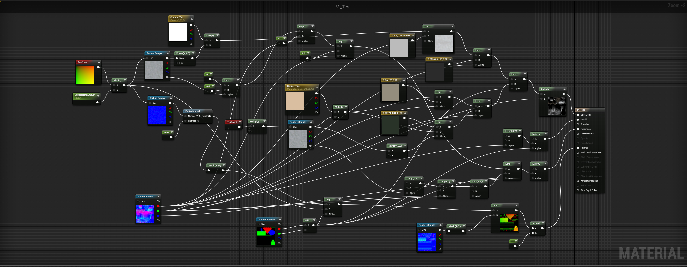
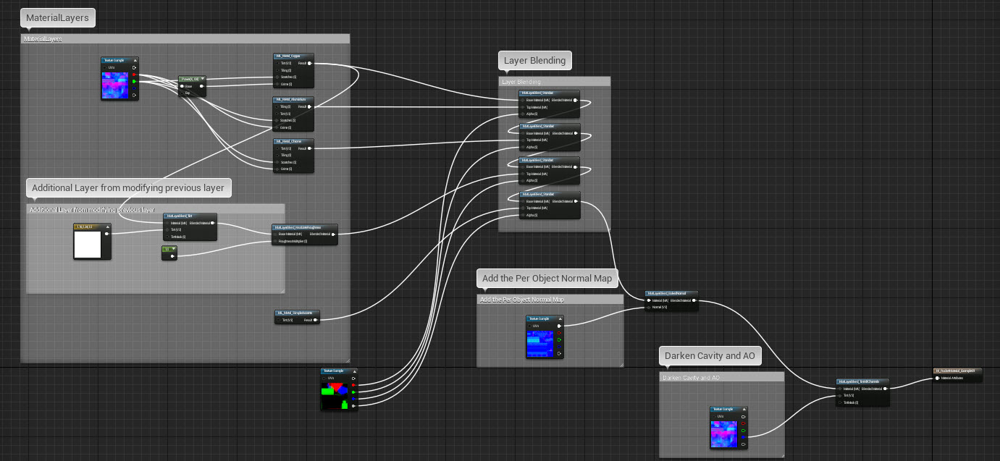
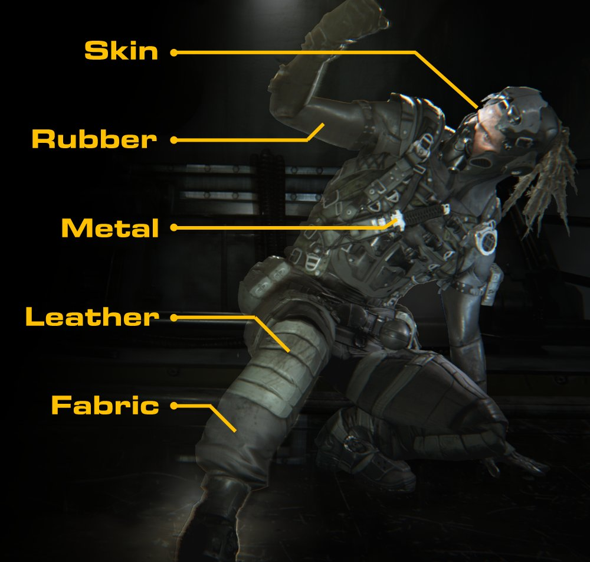
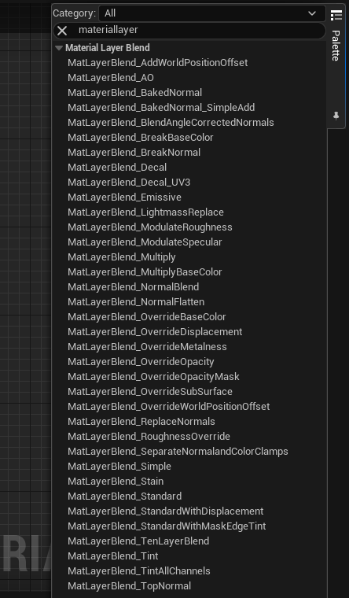

# 分层材质概述

> 路径：虚幻引擎5.7文档 / 设计视觉、渲染和图形效果 / 材质 / 分层材质 / 分层材质概述

> 原始页面：https://dev.epicgames.com/documentation/unreal-engine/layered-materials-in-unreal-engine

> [!NOTE]
> 本文档概括介绍了原始分层材质工作流程，它使用材质函数来创建复杂层混合。 如需了解材质实例编辑器中更新的 **材质层（Material Layers）** 功能，请[阅读本文](../using-material-layers/index.md)。

**分层材质（Layered Materials）** 可供你创建包含一系列子材质（或层）的单个材质，你可以使用遮罩等逐像素操作将其放在对象的表面上。它们非常适合用于处理唯一表面类型之间的复杂混合。在下面的火箭图中，最右侧的火箭将单独的层用于火箭的铬、铝和铜部分。 这些会逐像素在材质上混合。

分层材质这种功能作为[材质函数](../../material-functions/unreal-engine-material-functions-overview/index.md)的扩展提供。材质函数是完全独立的节点网络，用于执行特定运算，例如复杂的数学公式。你可以在任意数量的材质中随意复用这些函数。你可以使用 **[Make Material Attributes](../../unreal-engine-material-expressions-reference/material-attributes-expressions/index.md#makematerialattributes)** 和 **Break Material Attributes** 节点，完全在材质函数中定义完整的一组材质属性。接着，你可以在基础材质中调用这些材质函数，并使用材质层混合函数在它们之间混合。

上图显示了使用 **Make Material Attributes** 节点完全在材质函数中定义的简单铬材质。 你可以将此函数用作基础材质中的层，并将其与其他材质函数（层）混合。

务必要注意，由于材质函数无法直接应用于表面，你需要将每个材质函数层插入到标准基础材质，然后可以将后者应用于静态网格体。 你可以使用材质函数创建所需任意数量的层，按照你认为合适的方式随意将其混合在一起。

大致来说，工作流程如下所示：

- 创建新材质函数并编辑节点图表，直至完善。 当你在基础材质中调用此函数时，它将充当层。
- 将你的节点网络连接到新的

  Make Material Attributes

  节点，并将其连接到函数输出。
- 保存材质函数。
- 为你想创建的其他所有材质函数层重复上述过程。
- 创建新材质，并在材质编辑器中将其打开。
- 将材质函数从内容浏览器（Content Browser）拖入新材质中以用作层。
- 使用

  材质层混合

  函数将多个材质函数混合在一起。

现在，你的最终对象可以在其表面上混合多个不同的材质。

## 主要优点

你可以通过分层材质创建原本非常复杂的材质，从未来可编辑性的角度来看，管理起来将轻松得多。

例如，使用传统材质图表（不带层或函数）创建分层材质的效果是可以做到的。但是，这将需要复杂的网络，以在每个[材质输入](../../material-inputs/index.md)的不同纹理和值之间混合。由于大部分材质会使用多个输入，这种材质的复杂度会大幅提高。

考虑下面网络的复杂度，它不使用材质层，并混合了铬和铜效果，如上面火箭中所示。

**不带层的传统材质图表。**

点击查看大图。

使用分层材质时，每种不同的材质类型都包含在其自己的节点中。这样一来，混合就简单得多，美术师进行编辑和调试也容易得多。你可以使用 **Make Material Attributes** 和 **Break Material Attributes** 节点直接连接每种材质函数层，而不必担心如何将各个属性连接起来。

下面的网络实现了与上述相同的结果，但铬和铜材质模块化为其自己的材质函数。

**这就是将材质函数用作层的那个材质。**

点击查看大图。

分层材质方法的另一个优点是，由于这些层利用材质函数，因此每个层都是可复用的。这样一来，你就可以设置材质原型的库，或定义了基本现实世界表面类型的材质的库。例如，你可以创建层来表示通用表面，例如铝、钢铁、皮革、塑料、橡胶，等等。接着，你可以使用分层材质在材质之间混合。这非常适合用于创建细节丰富的对象，例如角色，而不必创建大量材质来单独应用于表面。

## 混合类型

在材质编辑器控制板中的材质函数列表中，列出了各种 **材质层混合** 函数。这些函数可以帮助你混合材质，而无需每次重新创建复杂的节点图表。不同的类型可实现专用的混合类型，例如可以覆盖特定材质功能。

| 材质层混合函数 |  |
| --- | --- |
| **MatLayerBlend_AO** | 在表面上混合环境光遮蔽（AO）贴图以删除反射。 |
| **MatLayerBlend_BaseColorOverride** | 允许替换基础颜色。 |
| **MatLayerBlend_BreakBaseColor** | 从传入材质层输出基础颜色。 |
| **MatLayerBlend_BreakNormal** | 从传入材质层输出法线。 |
| **MatLayerBlend_Decal** | 使用第2个UV信道在材质上混合贴花薄片。 |
| **MatLayerBlend_Decal_UV3** | 使用第3个UV信道在材质层上混合贴花薄片。 |
| **MatLayerBlend_Emissive** | 在材质层上混合自发光纹理。 |
| **MatLayerBlend_GlobalNormal** | 在材质层上混合法线纹理。 |
| **MatLayerBlend_LightmassReplace** | 替换Lightmass中的基础颜色，以允许更改间接光照效果。 |
| **MatLayerBlend_ModulateRoughness** | 将材质层的粗糙度乘以传入纹理。很适合用于实现"油性"的外观。 |
| **MatLayerBlend_NormalBlend** | 在表面混合法线纹理，但通过遮罩纹理来进行，从而控制法线的显示位置。 |
| **MatLayerBlend_NormalFlatten** | 减弱法线贴图的效果。 |
| **MatLayerBlend_RoughnessOverride** | 替换材质层的粗糙度纹理。 |
| **MatLayerBlend_Simple** | 为2个材质层提供简单的线性插值（Lerp）混合解决方案。不会混合法线，而是保留基础材质的法线。 |
| **MatLayerBlend_Stain** | 将基础材质上混合顶层材质作为污渍，意味着只会使用顶层材质的基础颜色和粗糙度值。 |
| **MatLayerBlend_Standard** | 混合两个材质层的所有属性。 |
| **MatLayerBlend_Tint** | 通过输入色调和遮罩来控制色调的位置，允许对材质层着色。很适合用于做出部分颜色更改。 |
| **MatLayerBlend_TintAllChannels** | 类似于色调，但还会影响高光度。这是一种在非常特殊的情况才会使用的函数，通常你不会用到它。 |
| **MatLayerBlend_TopNormal** | 混合两种材质的所有属性，但只使用顶层材质的法线。 |

## 实例化分层材质

由于分层材质本质上是材质函数，因此将其参数化以进行实例化时，需要一些额外的预先谋划。为了更好地利用 **标量** 和 **向量参数**，你可以创建 **函数输入** 表达式作为材质层的一部分。接着，你可以将参数连接到顶层材质中的此输入。请参阅[材质函数概述](../../material-functions/unreal-engine-material-functions-overview/index.md)，了解更多信息。

流程如下所示：

1. 材质参数（标量参数、向量参数，等等）
2. 材质层（函数）
3. 函数输入表达式
4. 用于定义材质层的某种网络
5. 函数输出
6. 最终材质

**一些实用提示：**

- 将材质表达式粘贴到函数中以创建层时，将所有参数替换为恰当命名的函数输入节点。
- 将新材质函数引入材质中时，将新参数节点连接到输入。
- 现在你可以将最终材质实例化，你的参数将驱动这些层的相应方面。
- 确保为函数输入提供默认值。这可针对不需要做出更改的情况加快工作流程。

## 注意事项

虽然分层材质很适合用于处理多材质设置，但你在使用时必须谨慎。分层材质可能会产生很高的性能开销，尤其是层函数中使用的材质本身很复杂的情况下。

请记住，你的所有层会同时渲染，然后混合。例如，如果某种材质有四层，引擎必须测试对象的每个像素，从而了解这四层中哪一层已混合，然后拒绝未使用的层。这会增加计算量，导致材质消耗更多性能。

每当你想在对象上采用多个表面类型时，你可能首先会想到使用分层材质。例如，你可能需要在一辆汽车上用独特的层表示车漆，再用其他层表示钢铁、橡胶、玻璃，等等。但改为在几何体层面将其中许多层分开，是更高效的做法。这会在对象上创建更多材质元素，虽然会增加绘制调用，但通常效率高得多。简而言之，可以应用多个材质的时候就不要使用分层材质。如果你必须逐像素控制材质的放置，则使用分层材质函数或[材质层](../using-material-layers/index.md)。

尽管将多个单独的材质压缩为一个材质会减少绘制调用，但产生的分层材质通常开销太大，无法在移动平台上使用。
