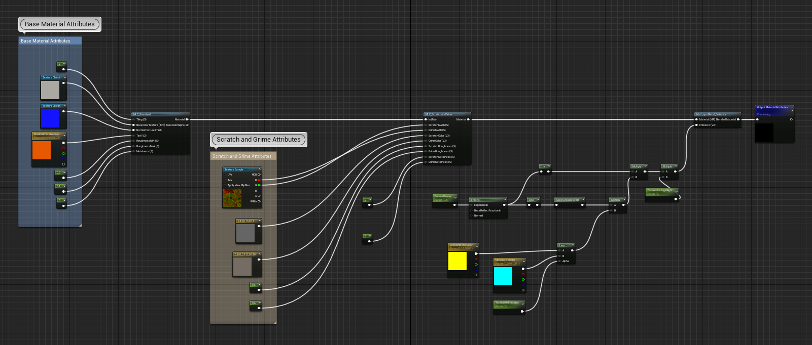
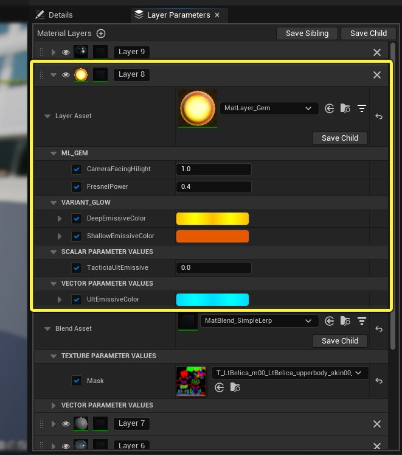
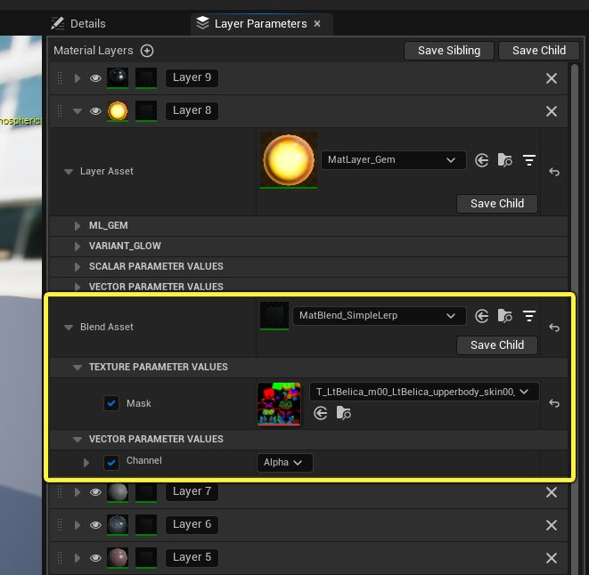
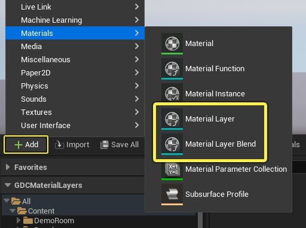
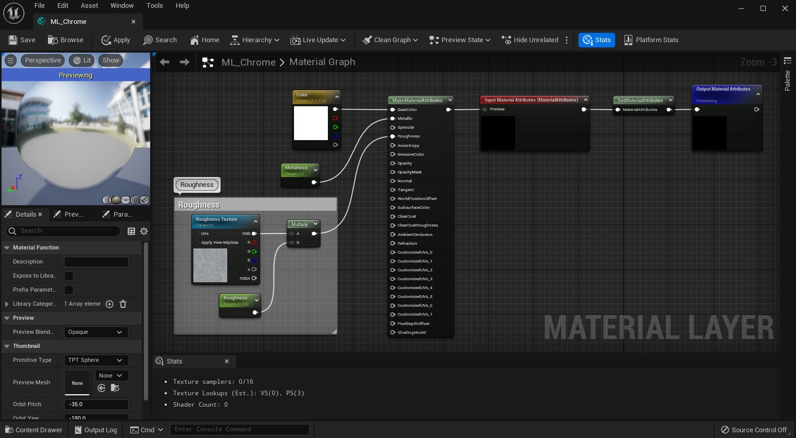
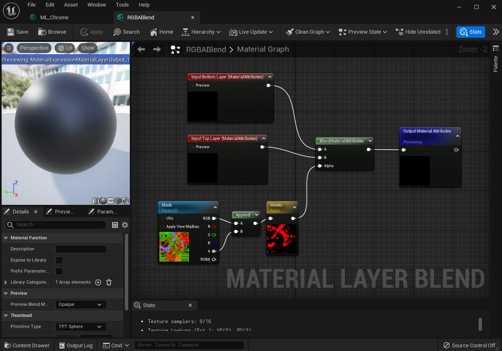
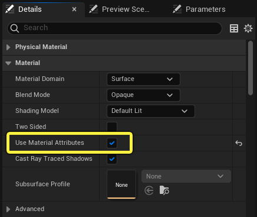
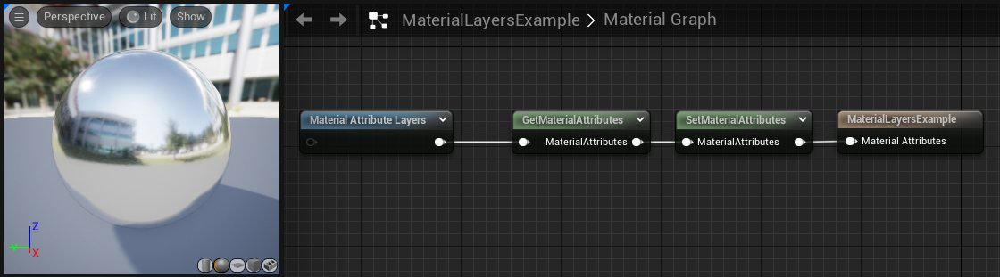

# 使用材质图层

> 路径：虚幻引擎5.7文档 / 设计视觉、渲染和图形效果 / 材质 / 分层材质 / 使用材质图层

> 原始页面：https://dev.epicgames.com/documentation/unreal-engine/using-material-layers-in-unreal-engine

**虚幻引擎** 中的 **材质图层** 是一套功能强大、灵活多变的解决方案，适合在项目中开发和构建材质。该系统允许你将不同纹理分层并混合在一起，为关卡中的对象创建独特的材质。**材质图层** 类似于 **[材质函数](https://dev.epicgames.com/documentation/404)** 的 **[分层材质](https://dev.epicgames.com/documentation/404)** 工作流，不过，材质图层能让流程更简单，为美术师提供更多灵活性。

与必须直接在材质节点图表中编辑的传统分层材质不同，材质图层系统在[材质实例编辑器](../../instanced-materials/unreal-engine-material-instance-editor-ui/index.md)中提供了一个用户界面选项卡。该界面允许美术师快速、方便地调换材质实例中的层。由于材质层暴露在实例编辑器中，这个工作流程大大减少了定制分层材质所需的技术和时间，从而带来了更多的迭代用户体验。

## 主要优点

使用材质图层的好处之一是能够创建非常复杂的材质，从未来可编辑的角度看也更易于管理。虽然可以使用[分层材质](../creating-layered-materials/index.md)工作流或在传统材质（无图层和材质函数）中创建相同类型的材质，但材质图层工作流能提供更好的掌控性和灵活性，还可以减少创建材质的复杂程度。

举例而言，下图显示了传统分层材质（使用图表）和材质图层（使用UI）的对比。你会很快发现，使用材质图层后，基础材质中所需的工作量减少了，工作和功能都能交给资产本身处理。

| Belica original layered material | Belica with Material Layers |
| --- | --- |
| 使用材质函数工作流的基础材质 | 使用材质图层工作流的基础材质 |

考虑到[材质函数](../../material-functions/index.md)在创建材质实例时存在一定局限性，除非事先已在基类材质中复制，否则在材质函数中创建的参数都无法在实例化材质中被引用。相反，在 **材质图层资产** 中设置的参数都可自行实例化，基础材质只需引用基础材质图层来获得其将影响的输入。

打开材质图层或 **材质图层混合资产（Material Layer Blend Asset）** 时，节点图表与其他材质编辑器的节点图表类似。你可以在此处设置并编写该材质的所有逻辑，包括属性的参数化。这里允许你控制纹理输入、向量、常量值等内容。在材质图层资产中完成逻辑的大部分设置意味着对材质做出或大或小的更改时能减少管理的复杂性。这也意味着可以在多个材质之间使用相似的材质图层而无需重复工作，这与材质函数的功能类似，但在应用和使用上更具灵活性。

材质图层资产的材质图表。

此处设置的所有参数将在 **图层** 中引用，而这些图层已添加到使用材质图层的材质的材质实例中的堆栈。这意味着创建材质实例时无需在基础材质中复制此类参数。当你打开材质实例时，**图层参数（Layer Parameters）** 选项卡会显示所有已添加到此实例的所有材质图层和参数。

点击查看大图。

**材质图层混合资产** 用于控制此材质实例中引用图层的遮罩。每个图层都可有自己的材质图层混合，堆栈中的所有图层并不仅限于单一混合资产。若未为图层指定混合资产，最上面无混合资产的图层将始终覆盖其下的所有图层。与材质图层资产一样，材质图层混合也有自己的节点图表，可在其中为默认值和参数化设置自己的混合和遮罩逻辑，也可在多个材质之间实例化和重复使用。

点击查看大图。

此工作流程允许你将材质的部分逻辑简化成单个资产，让你将它重复用于你创建的其他材质中，从而保证灵活性。

## 使用材质图层

下列步骤是在项目中为材质创建并使用材质图层的高级方法：

1. 创建材质图层资产。
2. 创建材质图层混合资产。
3. 创建传统材质资产，充当基础材质
4. 添加

   Material Attribute Layers

   表达式来计算活跃材质图层堆栈并输出合并属性。
5. 创建基础材质的材质实例。
6. 利用

   图层参数（Layer Parameters）

   选项卡添加、编辑和管理材质图层。

### 材质图层资产类型

材质图层系统由两种资产组成：

- 材质图层

  资产用于创建可被材质中的其他图层遮罩或可与这些材质混合的图层。
- 材质图层混合

  资产用于创建将两个图层混合在一起的遮罩。

你可在内容浏览器中点在项目中添加这两种资产。点击击 **新增（Add New）** 按钮，或者 **右键点击** 内容浏览器，然后在 或使用右键点击快捷菜单并从 **材质和纹理（Materials & Textures）** 类目选择资产，。

#### 材质图层资产

与[材质函数](../../material-functions/index.md)一样，材质图层资产也拥有自身的图表，用户可在图表中设置和预览材质的节点图表逻辑。对于要创建的每种材质，你可以使用创建或设置[材质属性表达式](../../unreal-engine-material-expressions-reference/material-attributes-expressions/index.md)来处理逻辑并输出结果。举例而言，若要创建铬或自发光材质，可像在普通基础材质图表中一样，在此图表中设置纹理和参数。

一个简单的铬材质的材质图表。

### 材质图层混合资产

与[材质函数](https://dev.epicgames.com/documentation/404)一样，材质图层混合资产也有自己的图表，可在图表中设置和预览材质的节点图表逻辑。材质图层混合材质资产会自动包含一个 **BlendMaterialAttributes** 表达式以及 **输入底层（Input Bottom Layer）** 和 **输入顶层（Input Top Layer）**。用户可为这些输入应用其他逻辑，也可简单使用 **Alpha** 输入来为材质实例图层堆栈中的图层驱动自己的遮罩和混合。

这是一个简单的材质图表范例，显示使用遮罩来驱动材质图层混合图表中BlendMaterialAttributes表达式的透明度。

点击查看大图。

### 基础材质图表

在使用材质图层系统时，大多数节点逻辑都在材质图层资产和材质图层混合资产中处理。基础材质图表通常包含较少的材质逻辑，这减少了基础材质中所需的管理量。

使用材质图层时，你必须选择主材质节点并在 **细节（Details）** 面板中进行设置，确保启用 **使用材质属性（Use Material Attributes）**。

**材质属性图层表达式（Material Attribute Layer expression）** 用于引用能与特定材质图层关联的众多材质属性。它们然后回用于你的基类材质的输出。举例而言，在使用材质属性图层表达式时，你可以让一个铬材质获取并设置材质属性。

#### 材质图层表达式

使用 **Material Attributes Layer** 表达式来计算活跃的材质图层堆栈。选择Material Attribute Layers表达式时，可用 **细节（Details）** 面板设置默认图层，以便与创建的材质实例（例如背景材质图层或其他图层）一同使用。在这个示例中，只有一个背景材质，它引用了铬材质层资产。你可以点击 **添加元素** 按钮（+）来添加额外的层。

> 图片已省略：Material Attributes Layer expression details panel

创建材质实例或将此材质直接应用于项目中的对象时将使用默认材质图层。

如果要设置的材质更复杂，**Get Material Attributes** 和 **Set Material Attributes** 表达式可用于添加和接收要在基础材质中设置的材质属性。你不必在材质图层中专门设置。在这个示例中，我们额外用了一张法线贴图来与材质层的法线贴图混合。Set Material Attributes节点接受了新的混合法线，并输出更新后的材质属性。请在此处了解更多关于[材质属性](https://dev.epicgames.com/documentation/404)表达式的信息。

> 图片已省略：undefined

点击查看大图。

### 材质、图层和混合实例化

正如材质可实例化、根据指定参数创建独特参数，材质图层和材质图层混合也可实例化。这样便能够访问图表中已参数化的任何节点。

你可以在内容浏览器中 **点击右键**，选择 **创建图层实例** 或 **创建混合实例** 来新建材质图层实例或材质图层混合。

> 图片已省略：undefined

点击查看大图。

在基础材质图层图表中将节点参数化时，创建的子实例能够访问这些参数，这些子实例类似于正常创建的[材质实例](../../instanced-materials/index.md)。对于图层和混合来说，你会发现材质实例的 **图层参数（Layer Parameters）** 选项卡中列出了参数。材质图层的所有参数都在这里。

> 图片已省略：Layer parameters tab

> [!TIP]
> 每个图层的参数皆是该图层所特有。因此，若堆栈中有多个图层使用相同的材质图层，在堆栈中的一个图层中设置一个覆盖参数值不会覆盖同一图层堆栈中同一图层的参数。

#### 传递参数

将参数从材质图层和材质图层混合传递到材质和材质实例中有多种方式。多数建议适用于图层和混合。

##### 材质图层中的参数与在现有材质和函数相似。

在材质图层和材质图层混合图表中添加的参数是该图层或混合所特有的。举例而言，下列材质图层使用了向量颜色、粗糙度贴图的纹理参数，以及金属度和颜色的两个标量参数。设置方式与标准材质或材质函数中的方式相同。

> 图片已省略：Material Layer parameters

当某个使用材质图层的标准材质被实例化时，且该图层已被添加到该材质实例的 **图层参数（Layer Parameters）** 选项卡时，你会发现所有参数都可以编辑。

> 图片已省略：Parameters in Instance Editor

##### 对基础材质中的材质属性图层（Material Attributes Layers）堆栈表达式使用输入引脚。

在标准材质图表中，这将把另一个材质属性视为使用 **Set Material Attributes** 表达式的输入，该输入将被输送到 **Material Attribute Layers** 表达式堆栈中添加的每个图层。

在此示例中，材质属性图层中传入了一张基础法线纹理。

> 图片已省略：Passing a parameter into Material Attribute Layers

之后在材质图层资产中可使用 **Set Material Attributes** 表达式设置输入和混合。此外，每个图层都可使用或忽略基础堆栈材质属性输入

> 图片已省略：Material Layer input

#### 图层堆栈

在材质实例编辑器的 **图层参数** 选项卡中，你可以切换材质图层的可视性，指定新的材质图层混合资产，或者在堆栈中拖放图层调整其上下依赖性。

> 图片已省略：undefined

点击查看大图。

在"图层参数（Layer Parameters）"选项卡中，可覆盖和编辑为材质图层或材质图层混合公开的参数。这些参数是该图层所特有的。因此即使多次将相同的材质图层添加到该图层堆栈中，也会在面板中为该图层设置独特的参数。

> 图片已省略：undefined

点击查看大图。

另外，用户可以切换堆栈中每个图层的可视性，而不会删除或丢失已创建的工作。点击 **眼睛** 图标来切换堆栈中图层的可视性。

> 图片已省略：Toggle layer visibility

切换图层的可视性，将禁用该图层并根据堆栈中其他图层使用的图层混合和参数设置来显示堆栈中的下个图层。下例禁用了一个材质图层，该图层有自己的专属属性、胸甲两侧有混合遮罩。禁用后，下个图层将显示胸甲其他部分所使用的铬材质。

> 图片已省略：图层可视性：已启用

> 图片已省略：图层可视性：已禁用

图层可视性：已启用

图层可视性：已禁用

你可以拖放图层来调整顺序，上面的图层优先于下面的图层。 最后，堆栈中的每个图层均可拖放，顶层图层优先于下方的图层。注意，你无法移动 **背景** 图层。在没有其他材质层时，背景层会作为父材质中的默认材质。

## 其他资源
