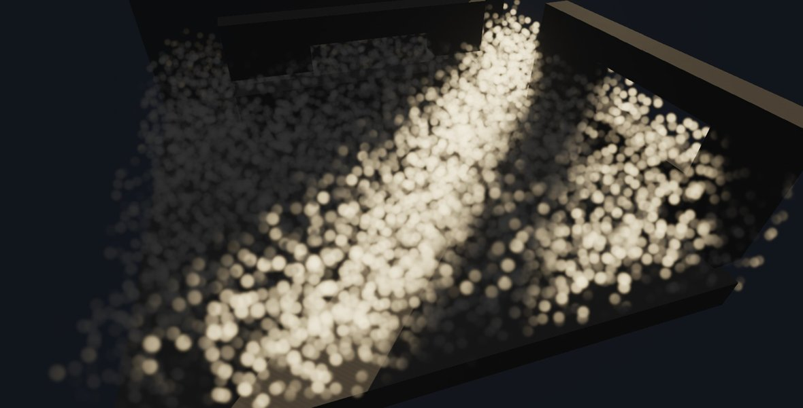
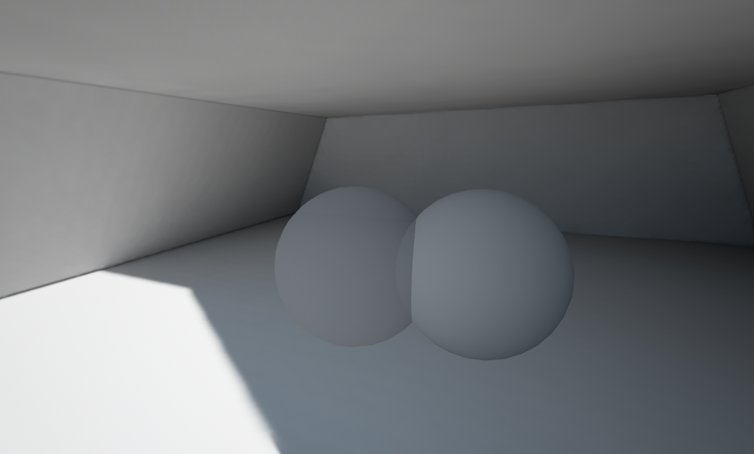
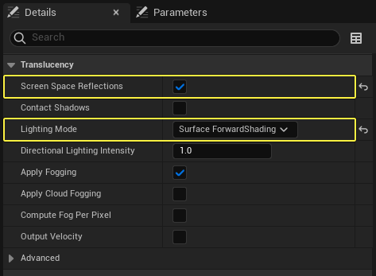
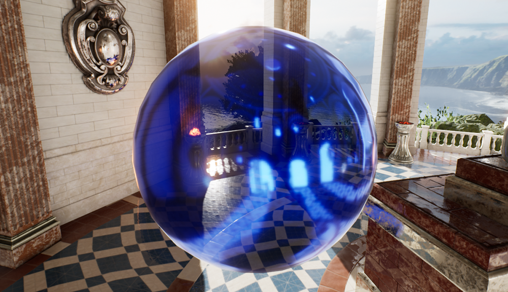
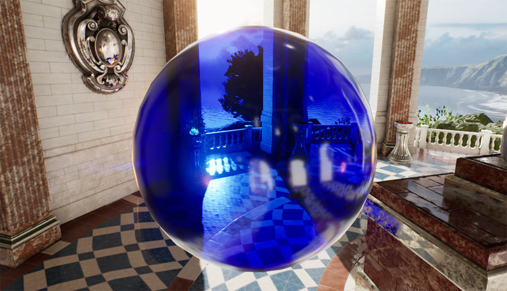
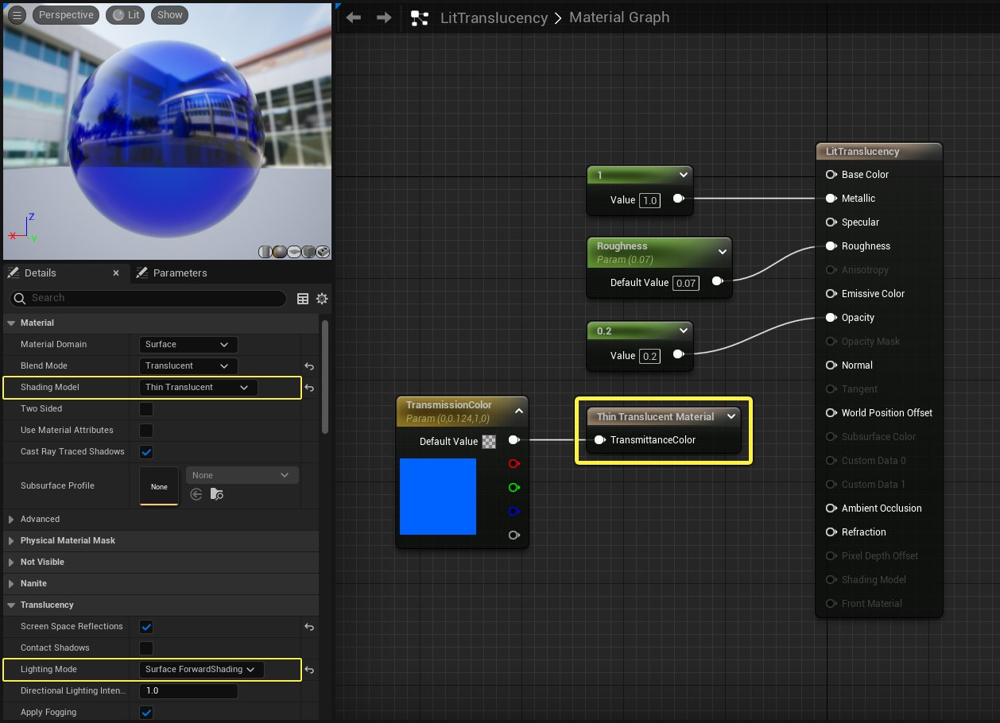

# 光照半透明

> 路径：虚幻引擎5.7文档 / 设计视觉、渲染和图形效果 / 材质 / 光照半透明

> 原始页面：https://dev.epicgames.com/documentation/unreal-engine/lit-translucency-in-unreal-engine

半透明效果通常可以归为几类：体积类、稠密到足以具备法线信息的体积类，以及表面类。每一类都需要不同的光照技术，因此材质必须指定应该使用的半透明光照模式。

光照半透明的大部分光照是通过一系列围绕视锥体定向的级联体积纹理获得的。因此对于体积内部的任何一个点，都可以通过一次正向传递了解光照信息，但缺点是体积纹理的分辨率相当低，而且只能覆盖以观察者为起点的有限景深范围。

体积是通过Cvar配置的，后者可以根据可延展性级别进行不同的设置：

- r.TranslucencyLightingVolumeDim，默认值为64。如果将此值提高到原来的2倍，会使体积光照成本提高到原来的8倍。
- r.TranslucencyLightingVolumeInnerDistance，默认值为1500。提高此值会增加光照体积覆盖范围，但会降低有效分辨率。
- r.TranslucencyLightingVolumeOuterDistance，默认值为5000。提高此值会增加光照体积覆盖范围，但会降低有效分辨率。

来自所有可移动光源类型的带阴影直接光照会射入半透明光照体积。还会考虑光源函数。

半透明材质从[间接光照缓存](../../../building-virtual-worlds/lighting-the-environment/global-illumination/indirect-lighting-cache/index.md)接收漫射GI。仅在Object边界的中心内插一个光照样本。对于整个Object仅采集一个样本，即使它是大型粒子系统也不例外。如果边界中心变化，则间接光照不同时间进行插值，使其不会爆出。

*左侧球体是使用间接光照缓存的光照半透明球体，右侧球体是使用来自Lightmass的烘焙光照的不透明球体。*

## 体积效果

### 投射阴影和自身阴影

半透明可以将阴影投射到不透明的场景以及自身和其他光照半透明Actor上。这是通过傅里叶不透明度贴图实现的，这种贴图在从满是斑点的体积投射阴影时效果出色，但在不透明度较高的透明表面上会产生严重的边缘瑕疵。半透明自身阴影要通过点光源和聚光源的光照体积，所以往往会由于分辨率太低而不可见，除非效果非常大且密集。但定向光源是逐像素产生半透明自身阴影的，可以得到高得多的光影效果。定向光源还会使用次表面着色模型进行光照材质的次表面着色。

半透明自身阴影使用逐Object的阴影，这意味着它需要用户指定的固定粒子系统边界，而且这些边界必须是正确的。设置这些边界的最简便方法是编写你的粒子运动，然后在"级联（Cascade）"工具栏上 **右键单击** "显示边界（show bounds）"按钮，此时将会弹出一个对话框，可以让你生成固定的边界。如果自身阴影粒子系统非常庞大，阴影贴图的分辨率将会下降，因为会拉伸阴影贴图来覆盖系统边界。要确认你的边界是否合理，请在"显示（Show）-> 高级（Advanced）->边界（Bounds）"下面启用 "显示边界"功能。然后在编辑器中选择发射器，它将绘制边界框和球体。

半透明粒子自身阴影 | 半透明粒子自身阴影 |

| 列 1 | 列 2 |
| --- | --- |
|  |  |

### 静态阴影

半透明可以通过由Lightmass在光照构建时生成的特殊静态阴影深度贴图，从[静止光源](../../../building-virtual-worlds/lighting-the-environment/light-types-and-their-mobility/stationary-light-mobility/index.md)获得静态阴影。

## 半透明表面

### 反射采集

TLM_Surface材质从关卡中放置的反射采集获得基于图像的反射（高光度GI）。和不透明材质不同的是，只应用了一个反射采集的立方体贴图（无混合），当前如果Object移动到离其他反射采集更近的地方，这会造成爆出。而且对立方体贴图的应用也好像它是处于无穷远点，而不是附近，这会在大片平坦表面上造成瑕疵。

*左侧球体是半透明的，右侧是不透明的，两者都设置为金属球体，也就是说100%的光照都来自高光度。*

### 逐像素半透明光照

在延迟渲染器中，现在可以将前向着色功能用于半透明表面，从而从多个光源获得高光，从校正视差的反射采集获得基于图像的反射。

要启用逐像素半透明光照，请将光照模式设置为 **表面正向着色（Surface ForwardShading）**，然后确保启用 **屏幕空间反射（Screen Space Reflections）**。

### 薄半透明

利用 **薄半透明（Thin Translucent）** 着色模型及其材质输出表达式能够准确根据物理原理呈现透明材质，例如能够准确响应光照和着色的有色或彩色透明材质。透明材质能够显示白色高光并在单通道中为背景正确上色。

Standard Translucent Shading Model

Thin Translucent Shading Model

在材质详细信息（Material Details）面板中进行以下设置，在材质中启用薄半透明（Thin Transparency）输出：

点击查看全图。

- 混合模式（Blend Mode）：

  半透明（Translucent）
- 着色模型（Shading Model）：

  薄半透明（Thin Translucent）
- 光照模式（Lighting Mode）：

  表面前向着色（Surface ForwardShading）

在材质图表中，需要使用 **薄半透明材质（Thin Translucent Material）** 输出表达式节点来控制透明度的颜色透射率。

## 限制

- 光照半透明表面缺少直接高光度。
- 光照半透明表面通过半透明体积光照纹理获取所有直接光照，这导致分辨率低于大多数表面材质（玻璃、水）所需的分辨率。
