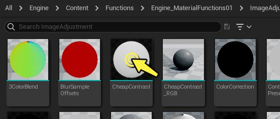
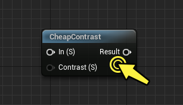
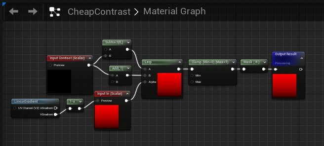
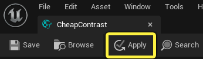
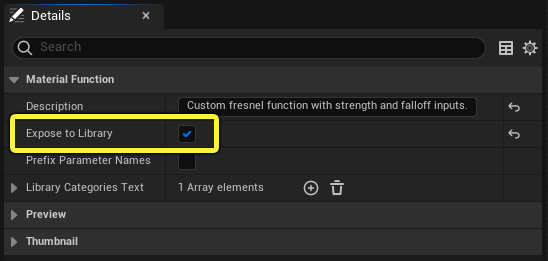
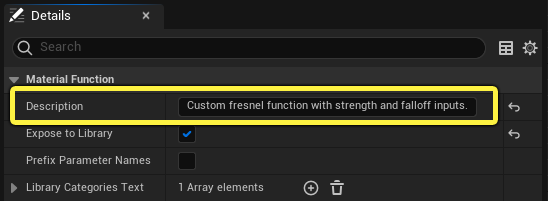
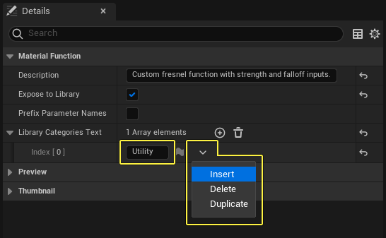
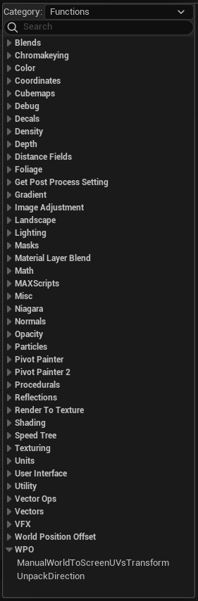

# 创建和使用材质函数

> 路径：虚幻引擎5.7文档 / 设计视觉、渲染和图形效果 / 材质 / 材质函数 / 创建和使用材质函数

> 原始页面：https://dev.epicgames.com/documentation/unreal-engine/creating-and-using-material-functions-in-unreal-engine

## 创建材质函数

请按照以下步骤创建新的材质函数：

1. 在 **内容浏览器（Content Browser）** 中右键单击。在上下文菜单中的"创建高级资产（Create Advanced Asset）"分段下，打开 **材质（Materials）** 子菜单，并从列表中选择 **材质函数（Material Function）**。
2. 等待材质函数出现在"内容浏览器（Content Browser）"中，然后重命名该函数。名称应尽可能准确清楚，以确保通过名称便能轻松了解材质函数的作用。 本例中使用名称 **Custom_Fresnel**。你可以通过在 **内容浏览器（Content Browser）** 中选择材质函数、按键盘上的 **F2** 并输入新名称来重命名材质函数。

## 编辑材质函数

创建新的材质函数后，你需要在"材质编辑器（Material Editor）"中打开它以开始构建材质表达式网络。如果你想更改现有材质函数的行为，也可以打开相应的材质函数。 有两种方法可以打开材质函数进行编辑：

1. 双击 **内容浏览器（Content Browser）** 中的材质函数资产，在单独的"材质编辑器（Material Editor）"选项卡中打开它。 然后就可以在材质函数中编辑材质表达式网络以修改其行为。

   
2. 双击现有材质中的某个材质函数节点，该材质函数随后将在新的"材质编辑器（Material Editor）"选项卡中打开。

   

双击材质函数后，材质函数会在"材质编辑器（Material Editor）"的新选项卡中打开，其中会显示函数中包含的材质表达式网络。然后，你可以根据自己的喜好编辑图表。

请务必注意，对材质函数所做的任何更改在保存后都将传播到该材质函数的所有后续实例。例如，如果你对"径向梯度材质函数（Radial Gradient Material Function）"的内部网络进行了更改，则该函数的所有现有实例以及所有后续新实例都将收到更新。

因此，除非你确定你的更改需要在函数的所有其他实例中传播，否则在"内容浏览器（Content Browser）"中 **复制现有函数** 可能才是明智之举（右键单击并从上下文菜单中选择"复制（Duplicate）"），而不是编辑原始材质函数。

对函数进行更改后，必须单击 **应用（Apply）** 按钮才能将更改传播到函数资产以及使用该函数的任何材质。完成后，请务必将资产保存在"内容浏览器（Content Browser）"中。

## 发布新函数

为了使用材质函数，需要确保它显示在"材质编辑器控制板（Material Editor Palette）"的 **材质函数库（Material Function Library）** 中。为此，必须将 **公开到库（Expose to Library）** 属性设置为true。

1. 通过单击材质图表的背景，取消选择函数中的所有节点。这样将在 **细节（Details）** 面板中显示函数的基本属性。

   
2. 添加一段描述。这很重要，因为在用户将鼠标悬停在"材质函数库（Material Function Library）"和"材质编辑器（Material Editor）"中的函数上时，此处添加的描述会作为提示文本显示给用户。向"输入（Input）"和"输出（Output）"节点添加描述当然是一个好习惯，但如果只能选择一个地方在表达式中添加注释，那么此处是目前最重要的一个。

   
3. **库类目文本（Library Categories Text）** 可让你选择材质函数将出现在哪个类目中。你可以添加额外的类目，方法是单击 **插入（Insert）**，然后键入新的类目名称。但是，明智的做法是尽可能简洁，不要添加超出绝对必要的类目。

   

## 使用材质函数

### 在材质控制板中

创建材质函数并将其发布到库后，可直接从"材质编辑器控制板（Material Editor Palette）"中拖动该材质函数，从而在现有材质中使用该材质函数。 除了用户创建的材质函数外，控制板还包含引擎自带的所有默认材质函数。

默认材质函数分为多种类目。用户创建的材质函数默认放置在 **杂项（Misc）** 类目中，但你可以在函数的"细节（Details）"面板属性中更改它们的类目。 将一个材质函数拖到你的材质图表中，随即将创建一个材质函数调用节点，其中包含由函数内的输入和输出节点定义的各种输入和输出。

> 图片已省略：Drag Material Function from Palette

你也可以通过在"材质编辑器（Material Editor）"中 **右键单击** 并在上下文菜单中搜索材质函数，将材质函数添加到你的材质中。

### "未指定函数"节点

第三种使用材质函数的方法是在材质图表中放置一个 **未指定函数（Unspecified Function）** 节点，然后在"细节（Details）"面板中为该节点指定一个材质函数。

1. 按住 **F键** 并在材质图表中 **左键单击** 以放置"未指定函数（Unspecified Function）"节点。

   > 图片已省略：Unspecified Function node
2. 在 **细节（Details）** 面板中为"未指定函数（Unspecified Function）"节点指定一个材质函数。你可以在"细节（Details）"面板的下拉菜单中搜索某个材质函数，也可以在 **内容浏览器（Content Browser）** 中选择某个材质函数资产，然后单击 **使用内容浏览器中的选定资产（Use Selected Asset from Content Browser）** 按钮。

   > 图片已省略：Use selected asset from Content Browser
3. 在本示例中，"未指定函数（Unspecified Function）"节点被替换为选定的材质函数："混合角度校正法线（Blend Angle Corrected Normals）"。

   > 图片已省略：Blend angle corrected normals node
