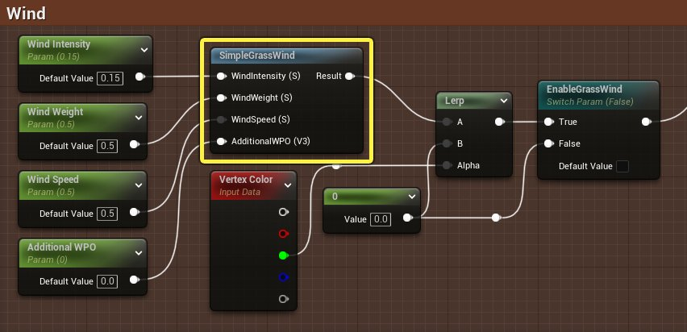
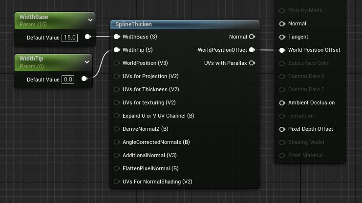
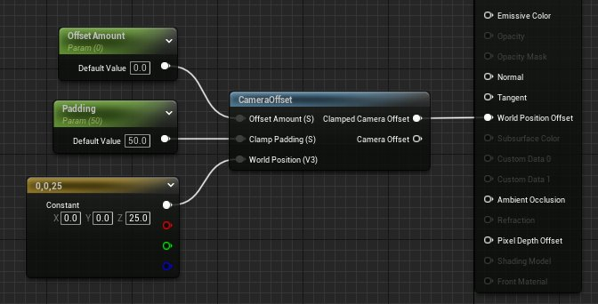
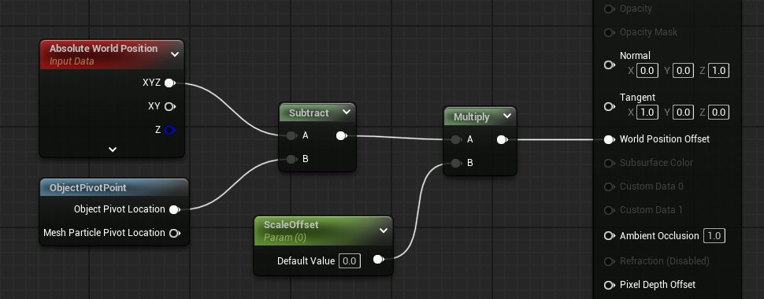
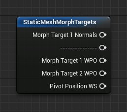
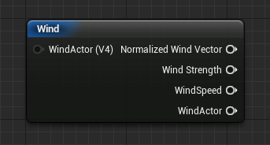

# 世界位置偏移函数

> 路径：虚幻引擎5.7文档 / 设计视觉、渲染和图形效果 / 材质 / 材质函数 / 材质函数参考 / 世界位置偏移函数

> 原始页面：https://dev.epicgames.com/documentation/unreal-engine/world-position-offset-material-functions-in-unreal-engine

WorldPositionOffset类别包含通过使用全局位置偏移输入来进行网格顶点操作的特殊函数。这些函数可以链接到一起，以产生递增效应。

## SimpleGrassWind

**SimpleGrassWind** 函数对植物叶子应用基本的风运算，并允许您指定权重贴图和风力。这是无方向的风，它只是使植物叶子产生非常普通的移动效果。这应该是您添加的最后一个WPO节点。

| 项目 | 说明 |
| --- | --- |
| **风力（标量）（WindIntensity (Scalar)）** | 控制风影响网格体的程度。 |
| **风权重（标量）（WindWeight (Scalar)）** | 这是一个灰阶贴图，用于控制网格体顶点对风产生反应的程度。 |
| **风速（标量）（WindSpeed (Scalar)）** | 控制风速。 |
| **其他WPO（矢量3）（AdditionalWPO (Vector3)）** | 接收任何其他全局位置偏移网络或函数。 |

这就是效果在运动中的样子。

## SplineThicken

**SplineThicken** 函数用来使非常薄的多边形在渲染时显示为略厚。对于线缆、头发、草和其他此类对象，这种效果非常理想。

> [!NOTE]
> 使用此函数的对象应该极薄，并使用规格化的UV布局。对象应该在禁用"移除退化三角形"（Remove Degenerate Triangles）的情况下导入。

| 输入 | 说明 |
| --- | --- |
| **基底宽度（标量）（WidthBase (Scalar)）** | 设置单个多边形对象在其基底处的宽度。 |
| **尖端宽度（标量）（WidthTip (Scalar)）** | 设置多边形对象在其尖端处的宽度。 |
| **全局位置（矢量3）（WorldPosition (Vector3)）** | WorldPosition接收任何现有的全局位置偏移函数，并将此函数与其相加。 |
| **投射UV（矢量2）（UVs for Projection (Vector2)）** | 这是扩展样条时要使用的纹理坐标。 |
| **厚度UV（矢量2）（UVs for Thickness (Vector2)）** | 这是从U投射时用于厚度贴图程序的纹理坐标，它将是用于厚度混合的指定UV索引的Y分量。 |
| **纹理处理UV（矢量2）（UVs for texturing (Vector2)）** | 这是用于纹理处理的UV通道。这必须是要进行3D视差校正的UV通道。 |
| **扩展U或V UV通道（静态布尔值）（Expand U or V UV Channel (StaticBool)）** | 设置是在U还是V方向上扩展网格。默认值为*true*，即采用U方向。 |
| **派生法线Z（布尔值）（DriveNormalZ (Boolean)）** | 使用DeriveNormalZ来建立完美圆形法线贴图。 |
| **角度校正法线（布尔值）（AngleCorrectedNormal (Boolean)）** | 使用DeriveNormalZ来建立完美圆形法线贴图。需要中心铺嵌顶点，否则整个表面的Z值均为0，这会产生粗糙的照明。 |
| **其他法线（矢量3）（AdditionalNormal (Vector3)）** | 这将添加纹理法线，以用于法线贴图转换。 |
| **平面化像素法线（布尔值）（FlattenPixelNormal (Boolean)）** |  |
| **法线明暗处理UV（矢量2）（UVs For NormalShading (Vector2)）** |  |
| 输出 |  |
| **法线（Normal）** | 调整后的几何体的传出法线。 |
| **全局位置偏移（WorldPositionOffset）** | 这是可以添加到其他全局位置偏移计算的输出。 |
| **具有视差的UV（UVs with Parallax）** |  |

## CameraOffset

**CameraOffset** 函数可帮助您进行深度排序，因为它允许您在摄像机空间中移动对象，使其靠近或远离摄像机。

| 输入 | 说明 |
| --- | --- |
| **偏移量（标量）（OffsetAmount (Scalar)）** | 请输入一个正数或负数，以使您的模型在摄像机方向上产生偏移。请注意，正数值将使模型更接近摄像机，并且会在网格大大超出模型边界框时导致渲染错误。 |
| **限制填补（标量）（Clampe Padding (Scalar)）** | 为了防止偏移值的受限版本滑入摄像机而使用的填补量。 |
| **全局位置（矢量3）（WorldPosition (Vector3)）** | 请输入模型的顶点全局位置。默认值=全局位置。 |
| 输出 |  |
| **受限摄像机偏移（Clamped Camera Offset）** | 对摄像机偏移进行限制，以提早避免摄像机相交。请调整填补，以更改为了避免摄像机相交而保留的空间量。 |
| **摄像机偏移（Camera Offset）** | 请将此值添加到其他全局位置偏移代码，或将其直接输入到全局位置偏移主材质，以使网格产生偏移。 |

在材质实例编辑中重载此图表中的偏移（Offset）参数时，球体会靠近或远离摄像机。

## ObjectPivotPoint

**ObjectPivotPoint** 函数返回全局空间中对象的枢轴点。此函数与像素着色器不兼容。

| 输出 | 说明 |
| --- | --- |
| **对象枢轴点位置（Object Pivot Location）** | 返回全局空间中对象的枢轴点。此输出只能与顶点着色器配合工作，而与像素着色器不兼容。 |

此图表使用 **对象枢轴点（Object Pivot Point）** 函数以及了少量逻辑，使用材质实例编辑器中的参数从对象枢轴点对其进行缩放。结果如下所示：

## ObjectScale

**ObjectScale** 函数一起或单独返回对象的XYZ比例。此函数与像素着色器不兼容。

| 输出 | 说明 |
| --- | --- |
| **比例XYZ（Scale XYZ）** | 返回与对象XYZ比例相等的"浮点3"（float3）值。此函数与像素着色器不兼容。 |
| **比例X（Scale X）** | 返回与对象的X比例相等的标量值。此函数与像素着色器不兼容。 |
| **比例Y（Scale Y）** | 返回与对象的Y比例相等的标量值。此函数与像素着色器不兼容。 |
| **比例Z（Scale Z）** | 返回与对象的Z比例相等的标量值。此函数与像素着色器不兼容。 |

在下面的视频中，使用 **ScaleXYZ** 输出作为自发光（Emissive）输入的乘数。当球体变大时，自发光值也会变大，使球体变得更亮。

## PivotAxis

**PivotAxis** 函数用于在任意的轴上创建公共枢轴点位置。此函数可以帮助创建旗帜运动。请不要使用接近旗帜顶端的单个枢轴点，而应改为使用共享的Z点以及唯一的X和Y位置数据，沿对象的宽度创建更加现实的连接。

> [!NOTE]
> 这个着色器节点只支持统一比例调整。并且，旋转轴与枢轴/位置不应重合。

| 输入 | 说明 |
| --- | --- |
| **枢轴/位置（矢量3）（Pivot Axis/Pos (Vector3)）** | 请输入一个数值，这个值将同时用作局部轴线轴和位置。如果您希望锁定模型，请输入(0,0,1)。如果您希望锁定模型顶端，请以(0,0,模型高度)形式输入模型的高度。 |
| 输出 |  |
| **枢轴点（Pivot）** | 此输出可用作旋转轴节点中的枢轴点。 |

## RotateAboutWorldAxis_cheap

**RotateAboutWorldAxis_cheap** 函数以低成本方式使对象绕全局轴旋转。请输入您希望使用的角度，并将输出连接到全局位置偏移。

| 输入 | 说明 |
| --- | --- |
| **旋转量（标量）（Rotation Amount (Scalar)）** | 值1表示旋转一周。 |
| **全局位置（矢量3）（WorldPosition (Vector3)）** | 作为旋转中心的枢轴点的全局空间位置。默认值是模型的枢轴点。 |
| **全局位置（矢量3）（WorldPosition (Vector3)）** | 单个顶点的全局空间位置。一般情况下，使用WorldPosition节点。 |
| 输出 |  |
| **X轴（X-Axis）** | 以低成本方式使对象绕全局X轴旋转。 |
| **Y轴（Y-Axis）** | 以低成本方式使对象绕全局Y轴旋转。 |
| **Z轴（Z-Axis）** | 以低成本方式使对象绕全局Z轴旋转。 |

下面的视频展示了一个围绕其本身枢轴点旋转的立方体材质。请注意在分别使用三个输出引脚时旋转轴的变化。

## StaticMeshMorphTargets

**StaticMeshMorphTargets** 函数将通过3ds Max的Morph Packer MAXScript添加的变形目标数据解包。

| 输出 | 说明 |
| --- | --- |
| **变形目标1法线（Morph Target 1 Normals）** | 与变形目标1相关联的表面法线。 |
| **变形目标1 WPO（Morph Target 1 WPO）** | 变形目标1的全局位置偏移。 |
| **变形目标2 WPO（Morph Target 2 WPO）** | 变形目标2的全局位置偏移。 |

## Wind

**Wind** 函数针对风力、速度乘以时间以及规范化风矢量提供了单独的输出。

| 输入 | 说明 |
| --- | --- |
| **风Actor（矢量4）（WindActor (Vector4)）** | 接收风Actor（开发中）。目前，您可使用一个"矢量4"（Vector4）来指定风向及风力。 |
| 输出 |  |
| **规范化风矢量（Normalized Wind Vector）** | 规范化到0-1空间的风矢量。 |
| **风力（WindStrength）** | 返回风力。风矢量的量级是通过计算从风矢量到0的距离来确定的。 |
| **风速（WindSpeed）** | 风速乘以时间。 |
| **风Actor（WindActor）** | 标准的WindActor节点。 |

