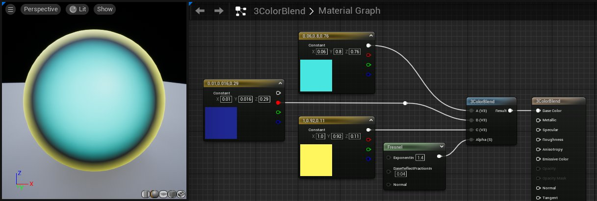
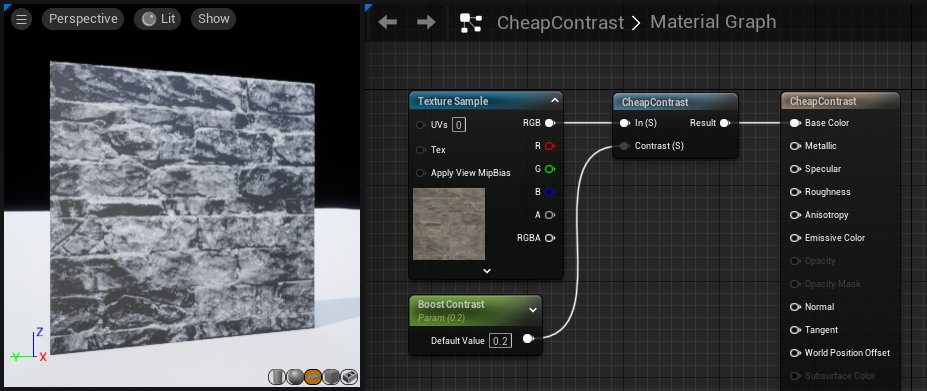
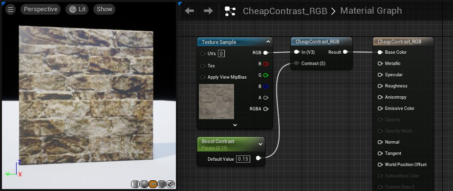
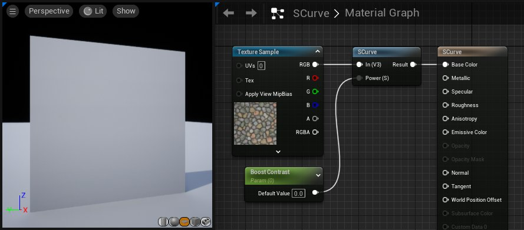
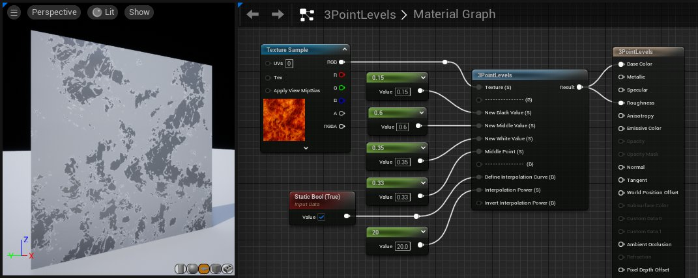
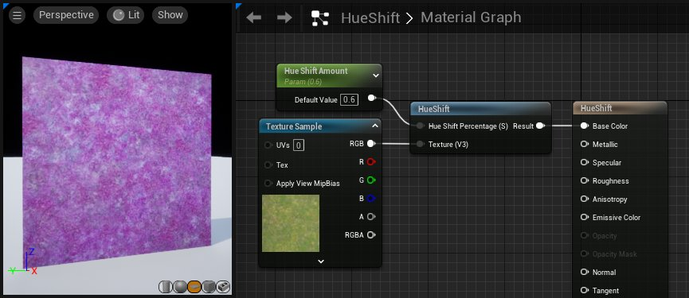
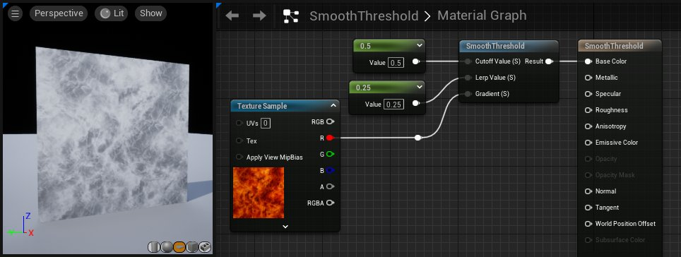

# 图像调整材质函数

> 路径：虚幻引擎5.7文档 / 设计视觉、渲染和图形效果 / 材质 / 材质函数 / 材质函数参考 / 图像调整材质函数

> 原始页面：https://dev.epicgames.com/documentation/unreal-engine/image-adjustment-material-functions-in-unreal-engine

图像调整函数用于对纹理执行基本的颜色校正操作。这些函数非常有用，它们允许您对纹理执行校正操作或改变，而不必担心因为要将单独的版本装入内存而产生开销。

## 3ColorBlend

**3ColorBlend（三色混合）**函数根据灰阶阿尔法，以如下方式对 3 种输入颜色进行混合：

| 阿尔法色调 | 颜色 |
| --- | --- |
| 暗色调 | 颜色 A |
| 中间调 | 颜色 B |
| 亮色调 | 颜色 C |

| 输入 | 说明 |
| --- | --- |
| **颜色 A（3 矢量）（Color A (3Vector)）** | 在阿尔法向黑色提供暗色调的所有位置，都将应用此颜色。 |
| **颜色 B（3 矢量）（Color B (3Vector)）** | 在阿尔法提供中间色调的所有位置，都将应用此颜色。 |
| **颜色 C（3 矢量）（Color C (3Vector)）** | 在阿尔法向白色提供亮色调的所有位置，都将应用此颜色。 |
| **阿尔法（标量）（Alpha (Scalar)）** | 此输入根据上述输入确定应用每种颜色的位置。 |

## CheapContrast

**CheapContrast（低成本对比度）**函数通过将直方图的高端重新映射到低端值，并将直方图的低端重新映射到高端值，提升输入的对比度。这类似于在 Photoshop 中应用[色阶调整](http://www.cambridgeincolour.com/tutorials/levels.htm)，以及将黑色和白色标志拉入到一个位中。用户可控制提升对比度的程度。

| 输入 | 说明 |
| --- | --- |
| **输入（标量）（In (Scalar)）** | 要提升对比度的通道或者黑白图像。 |
| **对比度（标量）（Contrast (Scalar)）** | 要提升对比度的程度。默认值为 0，这表示不更改。 |

> [!NOTE]
> 此函数接收标量值而非 RGB，这意味着它特别适合于黑白图像或单一通道。要提升全色图像的对比度，请使用 *CheapContrast_RGB（低成本对比度_RGB）*。

## CheapContrast_RGB

**CheapContrast_RGB（低成本对比度_RGB）**函数通过将直方图的高端重新映射到低端值，并将直方图的低端重新映射到高端值，提升输入的对比度。这类似于在 Photoshop 中应用[色阶调整](http://www.cambridgeincolour.com/tutorials/levels.htm)，以及将黑色和白色标志拉入到一个位中。用户可控制提升对比度的程度。

与普通的 *CheapContrast（低成本对比度）函数*不同，此函数可接收"矢量 3"作为输入，从而允许其对彩色图像执行对比度操作。

| 输入 | 说明 |
| --- | --- |
| **输入（标量）（In (Scalar)）** | 要提升对比度的基本图像。 |
| **对比度（标量）（Contrast (Scalar)）** | 要提升对比度的程度。默认值为 0，这表示不更改。 |

## SCurve

**SCurve（S 曲线）**函数通过沿 S 曲线插入图像的每个通道值，提升图像的对比度。这类似于在 Photoshop 中应用[曲线调整](http://www.cambridgeincolour.com/tutorials/photoshop-curves.htm)，以及对 S 曲线设置 RGB 曲线或使用预先设置的"提高对比度 (RGB)"。

| 输入 | 说明 |
| --- | --- |
| **输入（标量）（In (Scalar)）** | 要提升对比度的基本图像。 |
| **幂（标量）（Power (Scalar)）** | 要提升对比度的程度。默认值为 1，这表示不更改。 |

**Examples of the SCurve Function with different Power values.**

## 3PointLevels

**3PointLevels（3点色阶）**函数接收一个图像，并在 3 个点（白色、黑色、中间色）之间重新映射每个通道的值。这类似于在 Photoshop 中应用色阶调整。但是，与 CheapContrast（低成本对比度）函数不同，此函数提供了全面的控制，使用户能够调整光线及明暗的插值（伽玛）。默认情况下，将以线性方式内插 3 个重新映射点。但是，如果您愿意，可以输入自己的定制插值曲线。

| 输入 | 说明 |
| --- | --- |
| **纹理（标量）** | 输入纹理。 |
| **新黑色值（标量）（New Black Value (Scalar)）** | 为前一个 0 值设置新值。 |
| **新中间值（标量）（New Middle Value (Scalar)）** | 替换与"中间点"（Middle Point）输入值匹配的旧值。 |
| **新白色值（标量）（New White Value (Scalar)）** | 为前一个 1 值设置新值。 |
| **中间点（标量）（Middle Point (Scalar)）** | 从输入图像中选择一个值，此值将替换为"中间点"（Middle Point）的值。 |
| **定义插值曲线（静态布尔值）（Define Interpolation Curve (StaticBool)）** | 如果您想使用"插值幂"（Interpolation Power）输入来定义自己的插值曲线，请设置为 *true*。 |
| **插值幂（标量）"Interpolation Power (Scalar)"** | 这是应用于插值的幂节点。此节点用于控制三个点（黑色、白色和中间色）之间的插值。 |
| **反转插值幂（Invert Interpolation Power）** | 如果您想要反转幂曲线（这通常会降低对比度而非提高对比度），请设置为 *true*。 |

> [!NOTE]
> 此节点的 "-------------" 输入只是用作输入列表的分隔符，以使列表内容清晰明了。它们并非用于接收实际连接。

> [!NOTE]
> 与 CheapContrast（低成本对比度）函数相似，此节点在默认情况下接收一个标量，这意味着它适合于单通道或黑白图像。

## HueShift

**HueShift（色调改变）**函数使输入颜色的当前色调值偏移给定的百分比。此百分比基于 1，并以色环为中心。例如，变动 0.5% （50%） 将改变为互补色调，即色环上对面的色调。变动 1.0 (100%) 不会进行更改，因为这相当于正好绕色环旋转一周。

| 输入 | 说明 |
| --- | --- |
| **色调改变百分比（标量）（Hue Shift Percentage (Scalar)）** | 绕着色环改变传入色调的程度。 |
| **纹理（矢量 3）（Texture (Vector3)）** | 要改变色调的传入纹理。 |

## SmoothThreshold

**SmoothThreshold（平滑阈值）**函数接收渐变、插值率和阈值（分界值）。然后，它根据输入，将平滑对比度应用于渐变。以下是每个输入的作用明细：

| 输入 | 说明 |
| --- | --- |
| **分界值（Cutoff Value）** | 位于分界值以下的渐变输入值将受此操作影响。 |
| **线性插值（Lerp Value）** | 添加一个负数或正数，以从原始值平滑地斜升或斜降。斜升或斜降在小于分界值的值中发生。 |
| **渐变（Gradient）** | 此值用作对比度操作的基准。 |

