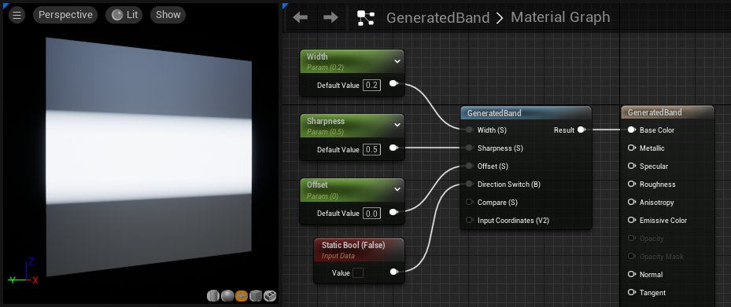
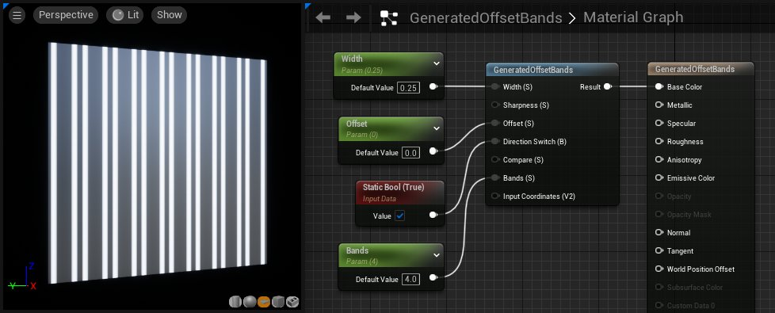
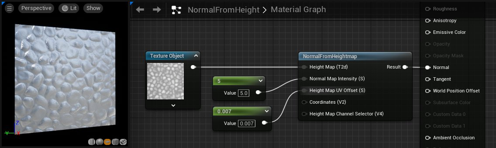
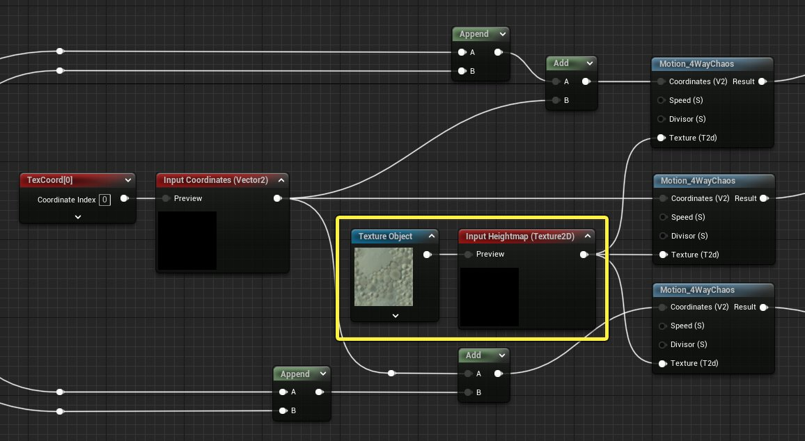

# 程序化材质函数

> 路径：虚幻引擎5.7文档 / 设计视觉、渲染和图形效果 / 材质 / 材质函数 / 材质函数参考 / 程序化材质函数

> 原始页面：https://dev.epicgames.com/documentation/unreal-engine/procedurals-material-functions-in-unreal-engine

**程序化** 材质函数提供一种快捷的方法来建立以程序方式产生的简单纹理和蒙版。与使用导入的纹理相比，这可以节省内存。

## GeneratedBand

**GeneratedBand**（生成的色带）函数根据默认的纹理坐标生成水平或垂直的色带。

| 输入 | 说明 |
| --- | --- |
| **宽度（标量）（Width (Scalar)）** | 这是介于 0 与 1 之间的值，用于计算程序化色带的宽度。默认值为 0.25。 |
| **清晰度（标量）** | 控制色带边缘的衰减。设置为 100 将生成非常清晰的带锯齿色带。 |
| **偏移（标量）（Offset (Scalar)）** | 此值将使色带在纹理空间中滑动。 |
| **方向开关（静态布尔值）（Direction Switch (StaticBool)）** | 将此值设置为 *true* 会导致色带呈垂直而非水平方向。默认值为 *false*，即水平方向。 |
| **比较（标量）（Compare (Scalar)）** | 这是要与纹理坐标进行比较以生成色带的值。默认值为 0.5。 |
| **输入坐标（矢量 2）（Input Coordinates (Vector2)）** | 接收一组定制 UV，而不是接收已内置到函数中的默认 UV。 |

## GeneratedOffsetBands

与 GeneratedBand（生成的色带）函数相似，**GeneratedOffsetBands（生成的偏移色带）**以程序方式在 UV 空间中创建生成的纹理色带。但是，此函数可以生成多个色带，而不是仅生成一个色带。

| 项目 | 说明 |
| --- | --- |
| **宽度（标量）（Width (Scalar)）** | 这是介于 0 与 1 之间的值，用于计算程序化色带的宽度。默认值为 0.25。 |
| **清晰度（标量）** | 控制色带边缘的衰减。设置为 100 将生成非常清晰的带锯齿色带。 |
| **偏移（标量）（Offset (Scalar)）** | 此值将使色带在纹理空间中滑动。 |
| **方向开关（静态布尔值）（Direction Switch (StaticBool)）** | 将此值设置为 *true* 会导致色带呈垂直而非水平方向。默认值为 *false*，即水平方向。 |
| **比较（标量）（Compare (Scalar)）** | 这是要与纹理坐标进行比较以生成色带的值。默认值为 0.5。 |
| **色带数（标量）（Bands (Scalar)）** | 修改色带总数。 |
| **输入坐标（矢量 2）（Input Coordinates (Vector2)）** | 接收一组定制 UV，而不是接收已内置到函数中的默认 UV。 |

## NormalFromHeightmap

此函数提供一种快捷的方法来根据现有的黑白高度贴图建立法线贴图，而不必将另一个纹理装入到内存中。

> [!NOTE]
> 此函数接收一个 TextureObject（纹理对象）(T2d) 表达式节点，而不是接收 TextureSample（纹理取样）。

| 输入 | 说明 |
| --- | --- |
| **坐标（矢量 2）（Coordinates (Vector2)）** | 接收坐标，以便正确地对高度贴图进行比例调整/平铺。 |
| **高度偏差（标量）（Height Bias (Scalar)）** | 这是一个差值，用于从高度贴图派生正确的高度。默认值为 0.005。 |
| **高度（标量）** | 控制法线贴图的最终强度。默认值为 8。 |
| **输入高度贴图（纹理对象）（Heightmap In (TextureObject)）** | 接收来自 TextureObject（纹理对象）表达式节点的高度贴图纹理。 |

## NormalFromHeightmapChaos

**NormalFromHeightMapChaos（根据高度贴图建立混乱法线贴图）**函数接收一个高度贴图，使其在 4 个方向上平移，然后将结果重新混合到一起，以建立混乱动画法线贴图。

> [!WARNING]
> 此函数的成本较高，使用时务必谨慎。

| 输入 | 说明 |
| --- | --- |
| **坐标（矢量 2）（Coordinates (Vector2)）** | 接收坐标，以便正确地对高度贴图进行比例调整/平铺。 |
| **高度偏差（标量）（Height Bias (Scalar)）** | 这是一个差值，用于从高度贴图派生正确的高度。默认值为 0.005。 |
| **高度（标量）** | 控制法线贴图的最终强度。默认值为 8。 |

> [!NOTE]
> 编写本文时，没有高度贴图的对应输入。您可使用下列步骤来添加此类输入。但是，如果您看到高度贴图输入，那么表示此问题已更正，您不必执行下列步骤。

1. **双击** NormalFromHeightmapChaos（根据高度贴图建立混乱法线贴图）函数节点，以便在新的材质编辑器选项卡中将其打开。
2. 找到 **Texture Object（纹理对象）**(T2d) 表达式节点。在此节点中，当前应该有默认的纹理。
3. 创建 **FunctionInput（函数输入）**表达式节点，并将其连接至 3 个 *Motion_4WayChaos（运动_4 向混乱）*函数节点上的 *纹理 (T2d)（Texture (T2d)）*输入。
4. 在新的 FunctionInput（函数输入）表达式的属性中，将 **输入类型（Input Type）**属性设置为 *函数输入_纹理 2D（FunctionInput_Texture2D）*。
5. 将 **输入名称（Input Name）**属性设置为 "Heightmap In"，以标注该输入。
6. 将原始的 *Texture Object (T2d)（纹理对象 (T2d)）*表达式节点连接至新的 FunctionInput（函数输入）表达式节点的 *预览（Preview）*输入。
