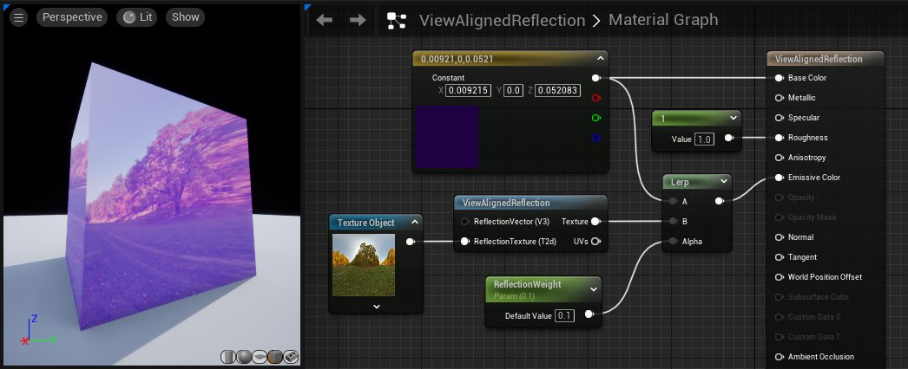
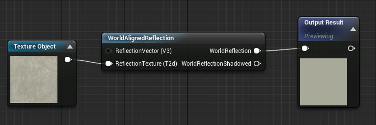
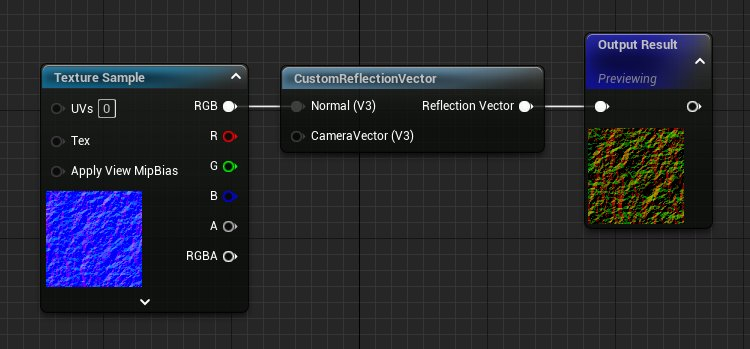

# 反射材质函数

> 路径：虚幻引擎5.7文档 / 设计视觉、渲染和图形效果 / 材质 / 材质函数 / 材质函数参考 / 反射材质函数

> 原始页面：https://dev.epicgames.com/documentation/unreal-engine/reflections-material-functions-in-unreal-engine

此示例展示了虚幻引擎的实时反射功能。该场景为一座地铁站，不但四处漏水，还有肮脏的瓷砖、损坏的管道以及其他陈旧的环境细节。在此文档中，我们将简单介绍用于处理此类反射的函数。

## ViewAlignedReflection

此函数接收球形反射纹理并使其与视图一致。通过输入定制反射矢量，可以按一定的偏移来执行计算。

| 输入 | 说明 |
| --- | --- |
| **反射矢量（矢量 3）（ReflectionVector (Vector 3)）** | 接收需要与视图一致的现有反射矢量。 |
| **反射纹理（纹理对象）（ReflectionTexture (TextureObject)）** | 接收现有的反射纹理，这必须是球形纹理。 |
| 输出 |  |
| **纹理（Texture）** | 输出所产生的基于视图的反射纹理。 |
| **UV（UVs）** | 输出反射纹理的 UV 坐标，以便可以在其他位置重新应用这些纹理。 |

## WorldAlignedReflection

此函数接收基于球体的传入反射纹理并使其与全局坐标一致。通过输入定制反射矢量，可以按一定的偏移来执行计算。

| 输入 | 说明 |
| --- | --- |
| **反射矢量（矢量 3）（ReflectionVector (Vector 3)）** | 接收需要与视图一致的现有反射矢量。 |
| **反射纹理（纹理对象）（ReflectionTexture (TextureObject)）** | 接收现有的反射纹理，这必须是球形纹理。 |
| 输出 |  |
| **全局反射（WorldReflection）** | 输出基于全局的反射纹理。 |
| **阴影全局反射（WorldReflectionShadowed）** | 输出对比度更高的纹理版本，此版本可在阴影区域中应用。 |

## CustomReflectionVector

此函数使用法线贴图来生成一个反射矢量，该反射矢量独立于默认反射矢量以及基本着色器上的法线输入。

| 输入 | 说明 |
| --- | --- |
| **法线（矢量 3）（Normal (Vector3)）** | 接收法线贴图，以用作定制反射矢量的基础。 |

