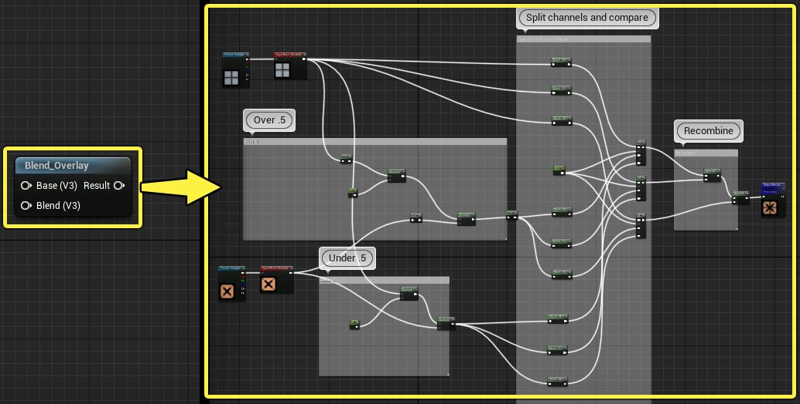
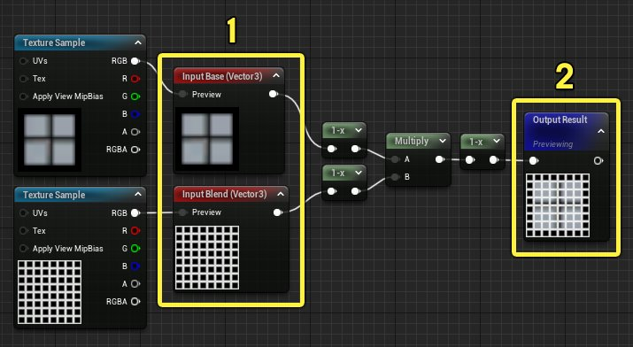
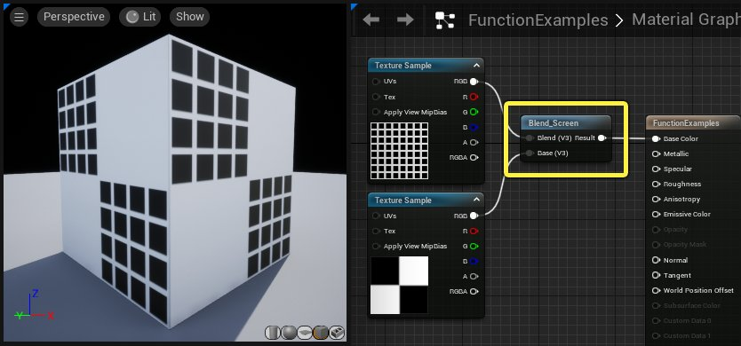
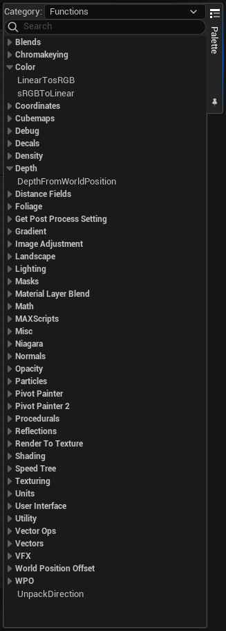
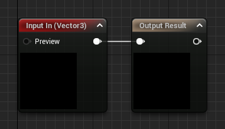
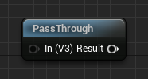
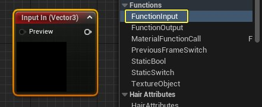
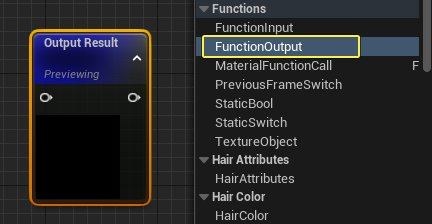

# 材质函数概述

> 路径：虚幻引擎5.7文档 / 设计视觉、渲染和图形效果 / 材质 / 材质函数 / 材质函数概述

> 原始页面：https://dev.epicgames.com/documentation/unreal-engine/unreal-engine-material-functions-overview

**材质函数（Material Functions）** 使你能够将部分材质图表打包成可复用的资产并分享到库中，还能轻松插入其他材质。它们的作用是帮助你立即获取常用的材质节点网络，从而简化材质的制作过程。

举个例子，下文展示的 **混合_覆盖** 函数包含了图片右侧所示的整个材质表达式网络。 你不再需要反复构建整个节点网络，而是可以将它从材质函数库中直接插入图表。

函数可以在材质编辑器中编辑，类似于普通材质，但可以使用的节点会有部分限制。 如果使用得当，它们可以降低材质重复度，从而减轻美术师的维护工作。材质函数可以使重复的表达式保持同步，以免在修改过程中遗漏某一重复部分而引发不可避免的错误。

在 **内容浏览器** 中，材质函数是一个单独的资产类。它们的图表和材质相似，但有一个重要区别。材质函数并没有主材质节点，而是使用函数输出节点。在材质中使用时，它会作为最后一个材质函数节点的输出引脚。

你可以将材质函数当做电子项目的收尾。 你可以根据需要，添加更多输入和输出。函数的核心是输入和输出之间的材质表达式网络。 这个示例就使用了两个图层，并将它们混合在一起，就像[Photoshop筛滤混合](https://helpx.adobe.com/photoshop/using/blending-modes.html)一样。 该函数会为美术师提取细节，使其不必掌握筛滤混合的原理，就能使用进行筛滤混合的操作。

材质函数输入（1）和输出（2）节点。

如前文所示，输入和输出节点之间的情况完全由你控制，并会由标准材质表达式节点网络决定。将材质函数插入材质之后，你只会看到材质函数调用节点及其输入和输出。 图表的其余部分会隐藏在函数之内。

## 材质函数库

完成材质函数之后，你可以将它发布到 **材质函数库** 中，以便在制作材质时轻松取用。材质函数库可以在材质编辑器右侧的控制板中找到。控制板包含了分门别类、可筛选的可用材质函数列表。 该列表包含了所有加载的函数，以及能够在 **内容浏览器数据库** 中找到的所有默认材质函数。

你可以将鼠标悬停在这些条目上，查看说明文字，也可以将其拖放到材质中。

> [!NOTE]
> 要让材质函数显示在材质函数库里，就必须勾选它的 **向库公开** 属性。在材质函数编辑器中，点击图表中的空白位置可以取消选中所有节点，以显示材质函数的基础属性。 向库公开选项就在细节面板中。

要查看材质函数库中默认的现有函数完整列表，请查看[材质函数参考](../unreal-engine-material-functions-reference/index.md)。

## 函数相关节点

以下是与材质函数相关的材质表达式节点，以及各自的用途：

- 材质函数调用

  ——允许使用来自其他材质或函数的外部函数。 外部函数的输入和输出节点会成为函数调用节点的输入和输出。
- 函数输入

  ——只能放置在材质函数中，用于定义该函数的一个输入引脚。
- 函数输出

  ——只能放置在材质函数中，用于定义该函数的一个输出引脚。
- 纹理对象

  ——用来为函数内的纹理函数输入提供默认纹理。 此节点不会对该纹理进行实际取样，因此必须与节点配合使用。
- 纹理对象参数

  ——定义一个纹理参数并输出纹理对象，以便在调用具有纹理输入的函数的材质中使用。 此节点不会对该纹理进行实际取样，因此必须与节点配合使用。
- 静态开关

  ——根据输入值在两个输入之间执行编译时选择。
- 静态布尔值

  ——用来为函数内的静态布尔函数输入提供默认布尔值。 此节点不会在任何内容之间切换，因此必须与静态开关节点配合使用。
- 静态布尔参数

  ——定义一个静态布尔参数并输出静态布尔值，以便在调用具有静态布尔输入的函数的材质中使用。 此节点不会在任何内容之间切换，因此必须与静态开关节点配合使用。

## 输入与输出

由于材质函数是封装的节点网络，用户需要确保数据的输入和输出。这是通过 *函数输入* 和 *函数输出* 节点进行控制的。了解这些节点便是使用材质函数的关键。

在材质函数中，函数输入和函数输出节点显示如下：

在材质中使用材质函数时，函数输入和函数输出节点会在材质函数节点上显示为输入和输出引脚：

### 函数输入节点

如此前所说，**函数输入** 节点是数据进入材质函数的门户。任意函数都可以有任意数量的输入节点，每个输入节点都对应着材质函数调用节点的一个输入引脚。

函数输入节点拥有以下属性和数据引脚：

| 项目 | 说明 |
| --- | --- |
| 属性 |  |
| **输入名称（Input Name）** | 输入的名称。在材质中使用时，会显示为材质函数的一个输出引脚。 |
| **说明（Description）** | 输入的说明，当你将鼠标悬停在材质函数节点的输入引脚上时会显示此说明。 |
| **输入类型（Input Type）** | 定义了输入可接受的数据类型。请参阅下文中的[输入类型](#%E8%BE%93%E5%85%A5%E7%B1%BB%E5%9E%8B)。 |
| **预览值（Preview Value）** | 用作一种测试方法，并作为一种在构造过程中帮助显示函数用途的方法。任何在此处输入的值都会被使用，就像通过输入从函数外部传递此值一样。 |
| **使用预览值作为默认值（Use Preview Value as Default）** | 此复选框允许将预览值中设置的数据用作默认值。当你不想强制用户为函数提供此值的输入时，此复选框非常有用。 |
| **排序优先顺序（Sort Priority）** | 此数值用于控制输入引脚在函数节点上列出时采用的顺序。顺序为最低到最高。 |
| 输入引脚 |  |
| **预览（Preview）** | 传入该输入的数据会取代预览值属性。与相关属性相同，此输入适合在构造期间测试函数，以及设置默认值。 |
| 输出引脚 |  |
| **（无标签）（Unlabled）** | 提供函数所要处理的传入数据的输出。 |

### 函数输出节点

函数输出节点提供了让材质函数中的数据退出函数，以便在材质中进一步使用的方法。 换言之，它会输出材质函数的最终结果。和函数输入节点相同，一个函数可具有任意数量的输出节点，因此可以有任意数量的潜在输出引脚。

选中 **函数输出** 节点时可在细节面板中查看以下属性。

| 项目 | 说明 |
| --- | --- |
| 材质表达式函数输出 |  |
| **输出名称（Output Name）** | 输出的名称。在材质中使用时，会显示为材质函数的一个输出引脚。 |
| **说明（Description）** | 输出的说明，当你将鼠标悬停在材质函数节点的输出引脚上时会显示此说明。 |
| 材质表达式 |  |
| **排序优先顺序（Sort Priority）** | 此数值用于控制输出引脚在函数节点上列出时采用的顺序。顺序为最低到最高。 |
| **说明（Description）** | 该说明栏定义了节点注释框中的文本。仅在材质函数编辑器 **中** 可见。 |
| 输出引脚 |  |
| **（无标签）（Unlabled）** | 提供函数所要处理的传入数据的输出。 |

### 输入类型

输入具有与其相连接的任何表达式所需的指定类型。在材质函数编辑器中选择 **函数输入** 节点，并使用 **输入类型** 下拉菜单中的选项，便可设置输入类型。

> 图片已省略：函数输入类型

在材质中调用时，输入类型会以缩写形式显示在输入接口旁。 在该示例中，两个输入都是"向量3"，故显示"V3"。 在材质中使用时，任何与输入连接的内容都 **必须** 可以转换为正确的输入类型，否则就会产生错误。

> 图片已省略：颜色加深输入类型

以下是可用的输入类型及其对应的缩写：

| 输入类型 | 缩写 |
| --- | --- |
| **标量** | S |
| **向量2（Vector2）** | V2 |
| **向量3（Vector3）** | V3 |
| **向量4（Vector4）** | V4 |
| **2D纹理（Texture2D）** | T2D |
| **立方体纹理（TextureCube）** | TCube |
| **2D纹理数组（Texture2DArray）** | T2dArr |
| **体积纹理（VolumeTexture）** | TVol |
| **静态布尔值（StaticBool）** | B |
| **材质属性（MaterialAttributes）** | MA |
| **外部纹理（TextureExternal）** | TExt |

## 公共属性

在编辑材质函数时，取消选中所有节点，或者点击材质图表的背景，就能在细节面板中显示函数的基础属性。

| 项目 | 说明 |
| --- | --- |
| 属性 |  |
| **说明（Description）** | 当用户将鼠标悬停在控制板的材质函数上，或者悬停在材质编辑器的函数调用节点上时，会显示此说明。 |
| **向库公开（Expose to Library）** | 如果勾选该框，材质函数就会显示在材质编辑器控制板的材质函数列表中，使你可以将其插入材质。你需要重启编辑器，才能显示新增的函数。 |
| **库类别（Library Categories）** | 此数组存放了所有材质函数选项卡的类别，函数将显示在这些类别下。 |

## 预览

编辑材质函数时，预览视口会显示正在预览的节点。你可以 **右键点击** 任意节点并选择 **开始预览节点**，预览材质网络至该点为止的结果。

> 图片已省略：开始预览节点

大部分时候，你可能想要预览函数的输出，或者材质函数的最终结果。默认预览的就是材质函数输出节点。

> 图片已省略：预览输出

### 函数输入预览

函数输入节点拥有指定预览值的选项，因为它们并不知道美术师将要在材质中使用的实际值。 每个输入都有内置的 **预览值**，可用于显示浮点输入类型的常量。 函数输入还有一个"预览"接口，使你能够用任意输入类型匹配的值覆盖内置值。 这个示例就使用了纹理取样，提供了两个向量3输入的预览值。

> 图片已省略：预览纹理取样输入

请注意，输入在细节面板中有一个 **使用预览值作为默认值** 选项。 启用该选项时，每当材质调用该函数，并且输入未连接任何内容时，就会使用预览值。 预览值等同于备选方案，以避免在输入未连接内容时产生编译错误。 因此输入为可选输入，并显示为灰色。

## 参数

你可以像通常材质一样，在材质函数中使用[参数](../../instanced-materials/index.md)。 这些参数会直接传递到使用的材质中。 纹理参数的使用过程稍有区别。

### 纹理参数

要在材质函数中使用纹理参数，创建一个 **函数输入* 节点，并将数据类型更改为**2D纹理**。 将它连接到**纹理取样** 节点的纹理对象覆盖引脚中。

> 图片已省略：函数中的纹理参数

在材质中使用该材质函数时，放置一个 **纹理对象参数** 节点，并将其连接到材质函数的 **2D纹理** 输入引脚中。

> 图片已省略：纹理对象参数

### 静态布尔参数

和静态开关参数类似，创建一个函数输入，将输入类型更改为 **静态布尔值**。 将其与 **静态开关** 节点连接：

> 图片已省略：静态开关函数

在使用该函数的材质中，放置一个 **静态布尔参数** 节点，并将其与接受静态布尔值的输入连接（本示例中为 **启用平铺（Enable Tiling）**）。

> 图片已省略：静态布尔参数

## 组织

在设计上，材质函数的使用者通常是美术师和其他团队成员，他们并没有参与到函数的创建过程中。我们必须提供维护良好的文档，记述函数的用途，以及需要的输入和输出值。因此，除了函数名称和输入/输出名称之外，函数还提供了多个文档说明栏位：

### 函数说明

材质函数拥有 **说明** 栏位，你可以在这里记录函数的功用。 要添加说明，在编辑材质时，点击材质图表的空白处。 细节面板会显示函数的属性，你可以在该栏位中输入说明。

> 图片已省略：材质函数说明

将鼠标悬停在材质图表的材质函数调用节点上时，就会显示此说明文本。

> 图片已省略：自定义菲涅尔说明

### 输入和输出说明

你可以为材质函数的输入和输出引脚添加名称和说明。 在编辑材质函数时，在材质图表中选择一个输入或输出节点。 在细节面板中，填写 **输入名称** 和 **说明** 栏位。

> 图片已省略：输入说明

在材质中使用该材质函数时，每个输入引脚都会显示你输入的名称，鼠标悬停在输入上时则会显示说明文字。

> 图片已省略：输入说明

> [!TIP]
> 编辑材质函数时，你可以使用所有用于组织整理和阐述材质图表的工具。 阅读此文了解[整理材质图表](../../unreal-engine-material-editor-user-guide/organizing-a-material-graph/index.md)。

## 传播

在编辑材质函数时，点击 **保存** 按钮重新编译并应用改动，新版本就会传播到任意引用了该材质函数的加载材质或函数。 引用该函数的未加载材质将在下一次加载时更新相关改动。

> [!NOTE]
> 从函数中删除输入或输出，并传播这些改动时，使用该函数的材质中与被删除接口相关的连接都会断开！ 由于传播无法撤销，在重新编译材质函数前务必考虑到这一点。 使用到某一函数的材质越多，缺损的可能性就越大，一定要慎之又慎。

传播函数改动后，所有使用该函数的加载材质都会被标记为"Dirty"，可用于查看重新保存哪些包能够避免延长加载时间。 你可在 **内容浏览器** 中 **点击右键** 并选择 **寻找使用该函数的材质（Find Materials Using This）**，找到所用该函数的加载材质。

> 图片已省略：寻找使用该函数的材质

## 嵌套函数

你可以随意将材质函数嵌套在其他函数中进行链接。唯一的限制是，材质函数不得因嵌套而产生循环依赖关系。

## 编译错误

如果材质函数中存在错误，尝试编译材质时就会产生编译错误对话。 未能成功编译的材质函数顶部也会出现红色报错信息。 你可以将鼠标选定在错误信息上，查看描述编译错误的说明文字。 在该示例中，材质函数未能从任意输入中接收到数据，从而导致编译失败。

> 图片已省略：编译错误信息

> [!TIP]
> 为输入提供预览值并激活各个输入的 **使用预览值作为默认值** 属性，便可避免上述问题。然而，该方法也有副作用。因为如果你遗漏了未连接的输入，也不会有非常明显的警告（例如报错信息）来提醒你。
>
> > 图片已省略：使用预览值

## 默认材质函数

虚幻引擎包含了几十个预制的默认材质函数。你可以通过[材质编辑器控制板](../../unreal-engine-material-editor-user-guide/unreal-engine-material-editor-ui/index.md#palettepanel)，或右键点击搜索菜单获取这些函数。

如果你想编辑某一默认材质函数，可以在 **Engine->Content->Functions** 文件夹的 **Content Browser** 中找到相关资产。

> [!WARNING]
> 如果更改默认材质函数并进行保存，这些改动就会存在于所有该函数的实例中。因此，如果你希望更改函数，强烈推荐你复制默认函数的副本。

要了解更多虚幻引擎默认材质函数的信息，请查看[材质函数参考](../unreal-engine-material-functions-reference/index.md)。
