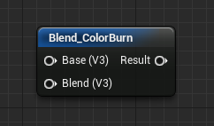
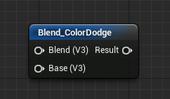
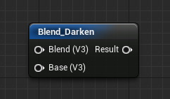
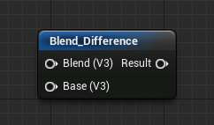
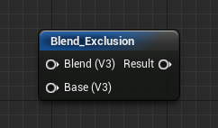
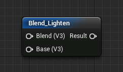
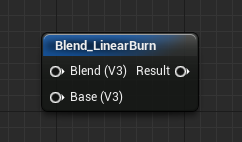

# 混合材质函数

> 路径：虚幻引擎5.7文档 / 设计视觉、渲染和图形效果 / 材质 / 材质函数 / 材质函数参考 / 混合材质函数

> 原始页面：https://dev.epicgames.com/documentation/unreal-engine/blend-material-functions-in-unreal-engine

**混合** 是一种函数类型，这类函数在纹理的颜色信息中执行数学运算，以使一个纹理可以特定方式混合到另一个纹理中。

混合始终具有"底色"（Base）和"混合"（Blend）输入，这两个输入都是"矢量 3"（Vector3）。这两个输入都接收纹理，并以某种方式混合到一起。混合方式取决于您所使用的混合函数类型。

## 混合函数

以下是所有混合材质函数的列表。

### Blend_ColorBurn（混合_颜色加深）

**Blend_ColorBurn（混合_颜色加深）**以"混合"（Blend）颜色越暗，在最终结果中使用该颜色越多的方式，对材质进行混合。如果"混合"（Blend）颜色为白色，则不进行任何更改。

| 项目 | 说明 |
| --- | --- |
| 输入 |  |
| **底色（矢量 3）（Base (Vector3)）** | 要以某种方式与"混合"（Blend）纹理进行混合的底色（原始纹理）。 |
| **混合（矢量 3）（Blend (Vector3)）** | 这是混合纹理，它根据所执行的混合操作类型，以某种方式与底色混合。 |

| 列 1 | 列 2 | 列 3 | 列 4 |
| --- | --- | --- | --- |
|  | 底色（Base） | 混合（Blend） | 颜色加深混合 |
|  | 底色（Base） | 混合（Blend） | 结果（Result） |

### Blend_ColorDodge（混合_颜色减淡）

**Blend_ColorDodge（混合_颜色减淡）**通过将"底色"（Base）颜色反转并将其除以"混合"（Blend）颜色，使结果变亮。

| 项目 | 说明 |
| --- | --- |
| 输入 |  |
| **底色（矢量 3）（Base (Vector3)）** | 要以某种方式与"混合"（Blend）纹理进行混合的底色（原始纹理）。 |
| **混合（矢量 3）（Blend (Vector3)）** | 这是混合纹理，它根据所执行的混合操作类型，以某种方式与底色混合。 |

| 列 1 | 列 2 | 列 3 | 列 4 |
| --- | --- | --- | --- |
|  | 底色（Base） | 混合（Blend） | 颜色减淡混合 |
|  | 底色（Base） | 混合（Blend） | 结果（Result） |

### Blend_Darken（混合_变暗）

**Blend_Darken（混合_变暗）**针对"底色"（Base）和"混合"（Blend）颜色的每个像素，选择较暗的值。如果"混合"（Blend）颜色为白色，则不会产生变化。

| 项目 | 说明 |
| --- | --- |
| 输入 |  |
| **底色（矢量 3）（Base (Vector3)）** | 要以某种方式与"混合"（Blend）纹理进行混合的底色（原始纹理）。 |
| **混合（矢量 3）（Blend (Vector3)）** | 这是混合纹理，它根据所执行的混合操作类型，以某种方式与底色混合。 |

| 列 1 | 列 2 | 列 3 | 列 4 |
| --- | --- | --- | --- |
|  | 底色（Base） | 混合（Blend） | 变暗混合 |
|  | 底色（Base） | 混合（Blend） | 结果（Result） |

### Blend_Difference（混合_差异）

**Blend_Difference（混合_差异）**通过从"混合"（Blend）中减去"底色"（Base），然后取结果的绝对值，创建反转样式的效果。

| 项目 | 说明 |
| --- | --- |
| 输入 |  |
| **底色（矢量 3）（Base (Vector3)）** | 要以某种方式与"混合"（Blend）纹理进行混合的底色（原始纹理）。 |
| **混合（矢量 3）（Blend (Vector3)）** | 这是混合纹理，它根据所执行的混合操作类型，以某种方式与底色混合。 |

| 列 1 | 列 2 | 列 3 | 列 4 |
| --- | --- | --- | --- |
|  | 底色（Base） | 混合（Blend） | 差异混合 |
|  | 底色（Base） | 混合（Blend） | 结果（Result） |

### Blend_Exclusion（混合_排除）

**Blend_Exclusion（混合_排除）**将"底色"（Base）和"混合"（Blend）纹理二等分，对其进行组合，然后对结果执行部分反转。

| 项目 | 说明 |
| --- | --- |
| 输入 |  |
| **底色（矢量 3）（Base (Vector3)）** | 要以某种方式与"混合"（Blend）纹理进行混合的底色（原始纹理）。 |
| **混合（矢量 3）（Blend (Vector3)）** | 这是混合纹理，它根据所执行的混合操作类型，以某种方式与底色混合。 |

| 列 1 | 列 2 | 列 3 | 列 4 |
| --- | --- | --- | --- |
|  | 底色（Base） | 混合（Blend） | 排除混合 |
|  | 底色（Base） | 混合（Blend） | 结果（Result） |

### Blend_HardLight（混合_强光）

**Blend_HardLight（混合_强光）**与 Blend_Overlay（混合_覆盖）的粗糙版本相似，它会对"底色"（Base）和"混合"（Blend）进行筛滤或相乘。此函数对"混合"（Blend）颜色执行比较，从而每当"混合"（Blend）比 50% 灰度亮时，就通过"筛滤"（Screen）操作对"底色"（Base）和"混合"（Blend）进行组合。如果"混合"（Blend）比 50% 灰度暗，那么将像"乘"功能一样，将"底色"（Base）与"混合"（Blend）相乘。然后，提高最终结果的对比度，以产生粗糙输出。

| 项目 | 说明 |
| --- | --- |
| 输入 |  |
| **底色（矢量 3）（Base (Vector3)）** | 要以某种方式与"混合"（Blend）纹理进行混合的底色（原始纹理）。 |
| **混合（矢量 3）（Blend (Vector3)）** | 这是混合纹理，它根据所执行的混合操作类型，以某种方式与底色混合。 |

| 列 1 | 列 2 | 列 3 | 列 4 |
| --- | --- | --- | --- |
|  | 底色（Base） | 混合（Blend） | 强光混合 |
|  | 底色（Base） | 混合（Blend） | 结果（Result） |

### Blend_Lighten（混合_变亮）

**Blend_Lighten（混合_变亮）**对"底色"（Base）和"混合"（Blend）颜色的每个像素进行比较，并返回较亮的结果。

| 项目 | 说明 |
| --- | --- |
| 输入 |  |
| **底色（矢量 3）（Base (Vector3)）** | 要以某种方式与"混合"（Blend）纹理进行混合的底色（原始纹理）。 |
| **混合（矢量 3）（Blend (Vector3)）** | 这是混合纹理，它根据所执行的混合操作类型，以某种方式与底色混合。 |

| 列 1 | 列 2 | 列 3 | 列 4 |
| --- | --- | --- | --- |
|  | 底色（Base） | 混合（Blend） | 变亮混合 |
|  | 底色（Base） | 混合（Blend） | 结果（Result） |

### Blend_LinearBurn（混合_线性加深）

**Blend_LinearBurn（混合_线性加深）**将"底色"（Base）颜色与"混合"（Blend）颜色相加，然后从结果中减去 1。

| 项目 | 说明 |
| --- | --- |
| 输入 |  |
| **底色（矢量 3）（Base (Vector3)）** | 要以某种方式与"混合"（Blend）纹理进行混合的底色（原始纹理）。 |
| **混合（矢量 3）（Blend (Vector3)）** | 这是混合纹理，它根据所执行的混合操作类型，以某种方式与底色混合。 |

| 列 1 | 列 2 | 列 3 | 列 4 |
| --- | --- | --- | --- |
|  | 底色（Base） | 混合（Blend） | 线性加深混合 |
|  | 底色（Base） | 混合（Blend） | 结果（Result） |

### Blend_LinearDodge（混合_线性减淡）

**Blend_LinearDodge（混合_线性减淡）**将"底色"（Base）颜色与"混合"（Blend）颜色相加。

| 项目 | 说明 |
| --- | --- |
| 输入 |  |
| **底色（矢量 3）（Base (Vector3)）** | 要以某种方式与"混合"（Blend）纹理进行混合的底色（原始纹理）。 |
| **混合（矢量 3）（Blend (Vector3)）** | 这是混合纹理，它根据所执行的混合操作类型，以某种方式与底色混合。 |

> 图片已省略：线性减淡

| 列 1 | 列 2 | 列 3 | 列 4 |
| --- | --- | --- | --- |
|  | 底色（Base） | 混合（Blend） | 线性减淡混合 |
|  | 底色（Base） | 混合（Blend） | 结果（Result） |

### Blend_LinearLight（混合_线性光）

**Blend_LinearLight（混合_线性光）**是 Blend_Overlay（混合_覆盖）的线性版本，用于提供更粗糙的结果。此函数对"混合"（Blend）颜色执行比较，从而每当"混合"（Blend）比 50% 灰度亮时，就通过"筛滤"（Screen）操作对"底色"（Base）和"混合"（Blend）进行组合。如果"混合"（Blend）比 50% 灰度暗，那么将像"乘"功能一样，将"底色"（Base）与"混合"（Blend）相乘。

| 项目 | 说明 |
| --- | --- |
| 输入 |  |
| **底色（矢量 3）（Base (Vector3)）** | 要以某种方式与"混合"（Blend）纹理进行混合的底色（原始纹理）。 |
| **混合（矢量 3）（Blend (Vector3)）** | 这是混合纹理，它根据所执行的混合操作类型，以某种方式与底色混合。 |

> 图片已省略：线性光

| 列 1 | 列 2 | 列 3 | 列 4 |
| --- | --- | --- | --- |
|  | 底色（Base） | 混合（Blend） | 线性光混合 |
|  | 底色（Base） | 混合（Blend） | 结果（Result） |

### Blend_Overlay（混合_覆盖）

**Blend_Overlay（混合_覆盖）**对"底色"（Base）和"混合"（Blend）进行筛滤或相乘。此函数对"混合"（Blend）颜色执行比较，从而每当"混合"（Blend）比 50% 灰度亮时，就通过"筛滤"（Screen）操作对"底色"（Base）和"混合"（Blend）进行组合。如果"混合"（Blend）比 50% 灰度暗，那么将像"乘"功能一样，将"底色"（Base）与"混合"（Blend）相乘。

| 项目 | 说明 |
| --- | --- |
| 输入 |  |
| **底色（矢量 3）（Base (Vector3)）** | 要以某种方式与"混合"（Blend）纹理进行混合的底色（原始纹理）。 |
| **混合（矢量 3）（Blend (Vector3)）** | 这是混合纹理，它根据所执行的混合操作类型，以某种方式与底色混合。 |

> 图片已省略：覆盖

| 列 1 | 列 2 | 列 3 | 列 4 |
| --- | --- | --- | --- |
|  | 底色（Base） | 混合（Blend） | 覆盖混合 |
|  | 底色（Base） | 混合（Blend） | 结果（Result） |

### Blend_PinLight（混合_点光）

**Blend_PinLight（混合_点光）**与 Blend_Overlay（混合_覆盖）相似，它使"底色"（Base）和"混合"（Blend）一起变亮或变暗。此函数对"混合"（Blend）颜色执行比较，从而每当"混合"（Blend）比 50% 灰度亮时，就通过"筛滤"（Screen）操作对"底色"（Base）和"混合"（Blend）进行组合。如果"混合"（Blend）比 50% 灰度暗，那么将像"乘"功能一样，将"底色"（Base）与"混合"（Blend）相乘。对比度会软化，这使此函数成为 Overlay（覆盖）的不太粗糙版本。

| 项目 | 说明 |
| --- | --- |
| 输入 |  |
| **底色（矢量 3）（Base (Vector3)）** | 要以某种方式与"混合"（Blend）纹理进行混合的底色（原始纹理）。 |
| **混合（矢量 3）（Blend (Vector3)）** | 这是混合纹理，它根据所执行的混合操作类型，以某种方式与底色混合。 |

> 图片已省略：点光

| 列 1 | 列 2 | 列 3 | 列 4 |
| --- | --- | --- | --- |
|  | 底色（Base） | 混合（Blend） | 点光混合 |
|  | 底色（Base） | 混合（Blend） | 结果（Result） |

### Blend_Screen（混合_筛滤）

**Blend_Screen（混合_筛滤）**按"混合"（Blend）颜色使"底色"（Base）变亮。其工作方式如下：对这两种颜色都执行"一减"，将它们相乘，然后对结果执行"一减"。

| 项目 | 说明 |
| --- | --- |
| 输入 |  |
| **底色（矢量 3）（Base (Vector3)）** | 要以某种方式与"混合"（Blend）纹理进行混合的底色（原始纹理）。 |
| **混合（矢量 3）（Blend (Vector3)）** | 这是混合纹理，它根据所执行的混合操作类型，以某种方式与底色混合。 |

> 图片已省略：筛滤

| 列 1 | 列 2 | 列 3 | 列 4 |
| --- | --- | --- | --- |
|  | 底色（Base） | 混合（Blend） | 筛滤混合 |
|  | 底色（Base） | 混合（Blend） | 结果（Result） |

### Blend_SoftLight（混合_柔光）

**Blend_SoftLight（混合_柔光）**是 Overlay（覆盖）的柔和版本。此函数对"混合"（Blend）颜色执行比较，从而每当"混合"（Blend）比 50% 灰度亮时，就通过"筛滤"（Screen）操作对"底色"（Base）和"混合"（Blend）进行组合。如果"混合"（Blend）比 50% 灰度暗，那么将像"乘"功能一样，将"底色"（Base）与"混合"（Blend）相乘。对比度会软化，这使此函数成为 Overlay（覆盖）的不太粗糙版本。

| 项目 | 说明 |
| --- | --- |
| 输入 |  |
| **底色（矢量 3）（Base (Vector3)）** | 要以某种方式与"混合"（Blend）纹理进行混合的底色（原始纹理）。 |
| **混合（矢量 3）（Blend (Vector3)）** | 这是混合纹理，它根据所执行的混合操作类型，以某种方式与底色混合。 |

> 图片已省略：柔光

| 列 1 | 列 2 | 列 3 | 列 4 |
| --- | --- | --- | --- |
|  | 底色（Base） | 混合（Blend） | 柔光混合 |
|  | 底色（Base） | 混合（Blend） | 结果（Result） |
