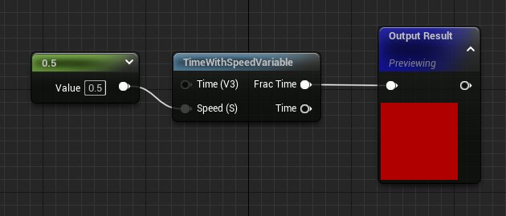
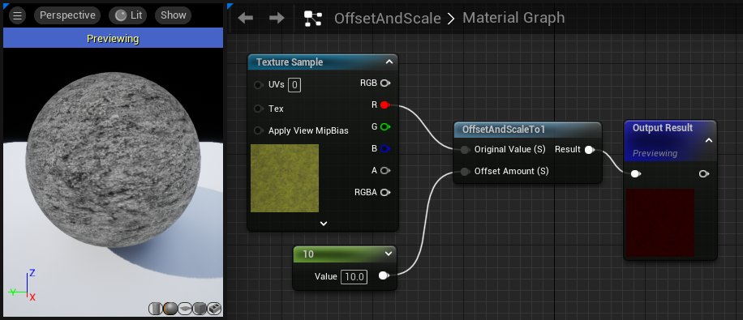
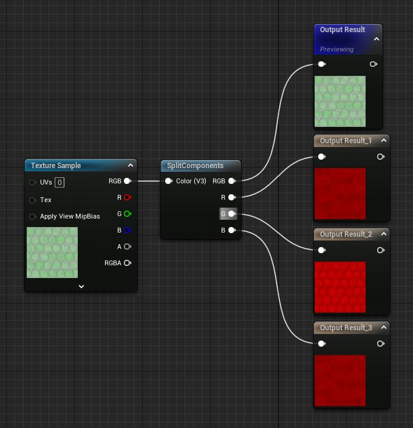
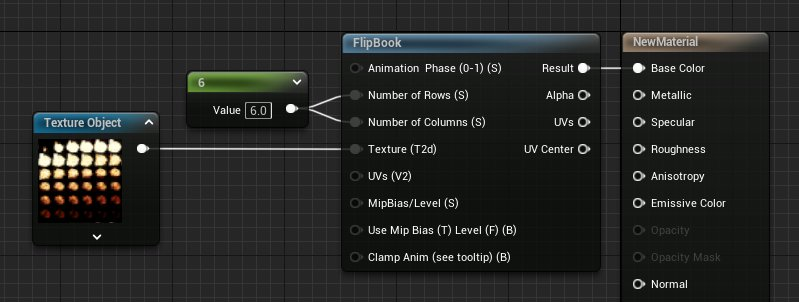

# 杂项材质函数

> 路径：虚幻引擎5.7文档 / 设计视觉、渲染和图形效果 / 材质 / 材质函数 / 材质函数参考 / 杂项材质函数

> 原始页面：https://dev.epicgames.com/documentation/unreal-engine/misc-material-functions-in-unreal-engine

杂项材质函数类别中包含各种不容易归入任何其他现有类别的一次性函数。将这些函数放在这里是为了避免产生太多只有一个函数的类别。

## TimeWithSpeedVariable

**TimeWithSpeedVariable（具有速度变量的时间）**函数与 Time（时间）节点相似，但具有可选的乘数输入。这个函数可以输出相乘结果，或使用可选的 **小数时间（Frac Time）** 输出从而仅输出乘法运算结果的小数位。

| 项目 | 说明 |
| --- | --- |
| 输入 |  |
| **速度（标量）（Speed (Scalar)）** | 接收一个乘数，用于调整时间流逝的速率。大于 1 的值将加快结果的速度。介于 1 与 0 之间的值将使速度减慢。 |
| 输出 |  |
| **小数时间（标量）（Frac Time (Scalar)）** | 在应用乘数之后，仅输出小数点之后的数字。结果是介于 0 与 1 之间的斜波行为。 |
| **时间（标量）（Time (Scalar)）** | 时间乘以 *速度（Speed）*输入的结果。 |

> [!NOTE]
> 默认情况下，"输出结果"（Output Result）将预览该节点。在本例中，该节点将闪烁。

## OffsetAndScaleTo1

**OffsetAndScaleTo1（偏移并调整比例到 1）**函数接收一个值，使其按给定的偏移量进行偏移，然后将结果比例重新调整到 0-1 范围。

| 输入 | 说明 |
| --- | --- |
| **原始值（标量）（Original Value (Scalar)）** | 要按"偏移量"（Offset Amount）进行偏移并接着将比例重新调整到 0-1 范围的值。 |
| **偏移量（标量）（Offset Amount (Scalar)）** | 控制将结果比例重新调整到 0-1 之前的偏移量。 |

## PassThrough

正如其名称所指，此节点的作用只是直接传递。无论将什么内容传递到此节点，都会通过输出毫无变化地返回该内容。此节点比所有其他节点更适合于组织用途，因为它允许您在比另一节点更接近的位置通过"说明"（Desc）属性对节点进行标注，这在所需节点位于图中较远的位置时特别有用。

## SplitComponents

**SplitComponents（拆分分量）**函数用于拆分传入颜色或图像的分量，从而使您能够单独访问红色、绿色或蓝色通道。

| 项目 | 说明 |
| --- | --- |
| 输入 |  |
| **颜色（Color）** | 接收给定的颜色或纹理。 |
| 输出 |  |
| **RGB** | 输出给定颜色的组合 RGB 分量。 |
| **R** | 仅输出输入颜色或纹理的红色分量。 |
| **G** | 仅输出输入颜色或纹理的绿色分量。 |
| **B** | 仅输出输入颜色或纹理的蓝色分量。 |

## Flipbook

**Flipbook（图像序列）**函数接收一个"2D 纹理"，例如精灵帧网格，并输出它们按顺序回放的动画。

| 项目 | 说明 |
| --- | --- |
| 输入 |  |
| **动画相位 (0-1)（标量）（Animation Phase (0-1) (Scalar)）** | 如果此输入接收到静态输入，那么结果将是图像序列中最接近的帧，就像这些帧的编号介于 0 与 1 之间一样。如果未提供输入，那么将自动使用时间。 |
| **行数（标量）（Number of Rows (Scalar)）** | 接收图像序列纹理的行数。 |
| **列数（标量）（Number of Columns (Scalar)）** | 接收图像序列纹理的列数。 |
| **纹理（2D 纹理）（Texture (Texture2D)）** | 接收一个"2D 纹理"，其中包含精灵表，即动画纹理的帧网格。 |
| **UV（矢量 2）（UVs (Vector2)）** | 接收一组 UV 坐标，以帮助进行平铺。 |
| 输出 |  |
| **结果（Result）** | 输出一个图像，作为图像序列的结果。 |
| **UV（UVs）** | 输出对应于纹理表的给定帧的 UV 坐标。 |

