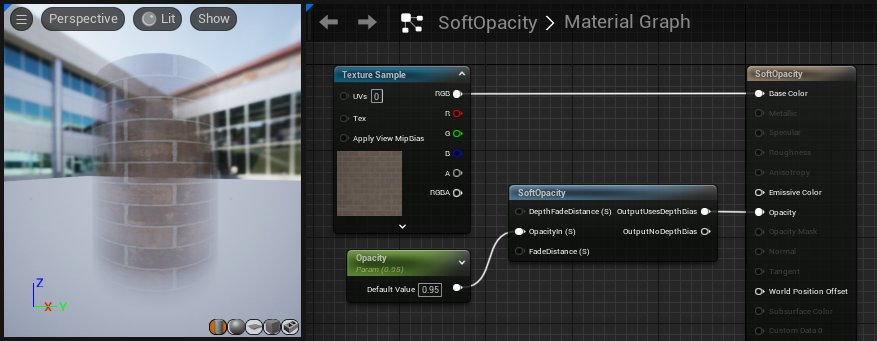

# 不透明度材质函数

> 路径：虚幻引擎5.7文档 / 设计视觉、渲染和图形效果 / 材质 / 材质函数 / 材质函数参考 / 不透明度材质函数

> 原始页面：https://dev.epicgames.com/documentation/unreal-engine/opacity-material-functions-in-unreal-engine

不透明度材质函数用于加速处理复杂的不透明度计算。

## SoftOpacity

**SoftOpacity（软不透明度）**函数接收一个不透明度值，然后对其运行各种计算，从而产生一种柔和的感觉。它应用菲涅耳效果、基于深度的阿尔法以及像素深度。最终的结果会导致对象随着摄像机接近而逐渐消失。

| 项目 | 说明 |
| --- | --- |
| 输入 |  |
| **消退距离深度（标量）（DepthFadeDistance (Scalar)）** | 对象完全消失时的深度。仅当使用了 *输出使用深度偏离（OutputUsesDepthBias）*输出时才有效。 |
| **输入不透明度（标量）（OpacityIn (Scalar)）** | 这是传入不透明度值。 |
| **消退距离（标量）（FadeDistance (Scalar)）** | 距离表面多近时开始淡出。 |
| 输出 |  |
| **输出使用深度偏离（OutputUsesDepthBias）** | 此输出会导致对象在其距离达到 *消退距离深度（DepthFadeDistance）*输入所设置的值时完全淡出，成为完全透明的状态。 |
| **输出无深度偏离（OutputNoDepthBias）** | 此输出会导致对象在其到达摄像机时完全淡出，这表示没有偏移。此输出比 *输出使用深度偏离（OutputUsesDepthBias）* 少 12 条指令。 |

在此示例中，圆柱体的边缘更加透明，因为这里的网格体曲线更远离摄像机。这是材质函数中的菲涅尔效果造成的。
