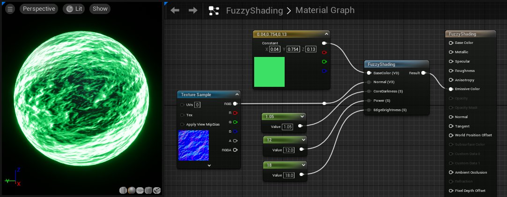
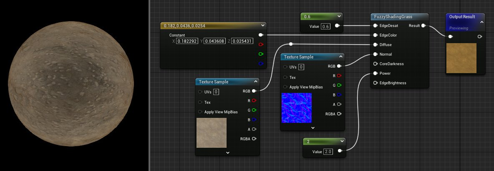

# 明暗处理材质

> 路径：虚幻引擎5.7文档 / 设计视觉、渲染和图形效果 / 材质 / 材质函数 / 材质函数参考 / 明暗处理材质

> 原始页面：https://dev.epicgames.com/documentation/unreal-engine/shading-material-functions-in-unreal-engine

明暗处理函数支持特殊的明暗处理操作，例如模糊明暗处理以及调整反射高光形状。

## FuzzyShading

此函数模仿类似于天鹅绒或苔藓的表面，并与菲涅耳计算类似。另外，此函数也适合于着色器效果，例如扫描电子显微镜。

| 输入 | 说明 |
| --- | --- |
| **漫射（矢量 3）（Diffuse (Vector3)）** | 接收要用作漫射颜色的纹理。 |
| **法线（矢量 3）（Normal (Vector3)）** | 接收一个法线贴图，用于扰乱模糊结果的表面。 |
| **核心暗度（标量）（CoreDarkness (Scalar)）** | 此值用于使对象在其法线与摄像机平行（通常朝向中心）的位置变暗。这个数值越大，意味着核心位置越暗。默认值为 0.8。 |
| **幂（标量）（Power (Scalar)）** | 控制从核心到边缘的衰减率。默认值为 6.0。 |
| **边缘亮度（标量）（EdgeBrightness (Scalar)）** | 控制表面的法线变为与摄像机垂直（通常朝向边缘）时表面的亮度。 |

## FuzzyShadingGrass

此函数用于提供草地明暗处理的漫射部分。与 FuzzyShading（模糊明暗处理）相似，此函数允许您在边缘处混入一种新颜色，方法如下：首先按给定的百分比去饱和度，然后对去饱和度后的区域应用定制颜色。

| 输入 | 说明 |
| --- | --- |
| **边缘去饱和度（标量）（EdgeDesat (Scalar)）** | 这是 0 到 1 的数值，用于控制应该将多少对象边缘去饱和度，以为边缘颜色腾出位置。 |
| **边缘颜色（矢量 3）（EdgeColor (Vector3)）** | 此颜色将应用于边缘区域。如果发生过多的颜色混合，请使用 *边缘去饱和度（EdgeDesat）*对该区域进行去饱和度。 |
| **漫射（矢量 3）（Diffuse (Vector3)）** | 接收要用作漫射颜色的纹理。 |
| **法线（矢量 3）（Normal (Vector3)）** | 接收一个法线贴图，用于扰乱模糊结果的表面。 |
| **核心暗度（标量）（CoreDarkness (Scalar)）** | 此值用于使对象在其法线与摄像机平行（通常朝向中心）的位置变暗。这个数值越大，意味着核心位置越暗。默认值为 0.8。 |
| **幂（标量）（Power (Scalar)）** | 控制从核心到边缘的衰减率。默认值为 6.0。 |
| **边缘亮度（标量）（EdgeBrightness (Scalar)）** | 控制表面的法线变为与摄像机垂直（通常朝向边缘）时表面的亮度。 |

