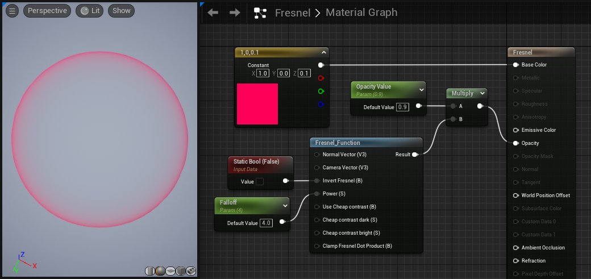

# 向量运算材质函数

> 路径：虚幻引擎5.7文档 / 设计视觉、渲染和图形效果 / 材质 / 材质函数 / 材质函数参考 / 向量运算材质函数

> 原始页面：https://dev.epicgames.com/documentation/unreal-engine/vector-ops-material-functions-in-unreal-engine

"向量操作"类别包含用于应用各种基于向量的数学方程式的特殊函数。

### Fresnel（菲涅尔）

与普通的 Fresnel（菲涅尔）材质表达式节点不同，Fresnel（菲涅尔）函数允许您指定自己的一组用于计算方程式的向量以及对混合进行其他调整。

| 项目 | 说明 |
| --- | --- |
| 输入 |  |
| **法线向量（向量 3）（Normal Vector (Vector3)）** | 菲涅尔运算中使用的第一个向量。这通常是表面向量。 |
| **摄像机向量（向量 3）（Camera Vector (Vector3)）** | 摄像机方向的向量。 |
| **反转菲涅尔（静态布尔值）（Invert Fresnel (StaticBool)）** | 此值用于反转运算，从而反转计算法线以产生结果的方式。 |
| **幂（标量）（Power (Scalar)）** | 此值控制颜色在核心与边缘之间衰减的速度。 |
| **使用低成本对比度（静态布尔值）（Use Cheap Contrast (StaticBool)）** | 此值激活内部的 CheapContrast（低成本对比度）函数，以提升菲涅耳效果的对比度。 |
| **低成本对比度 - 暗（标量）（Cheap contrast dark (Scalar)）** | 使用低成本对比度时，此值控制在结果中显示的暗值数量。不使用低成本对比度时，此值不起作用。 |
| **低成本对比度 - 亮（标量）（Cheap contrast bright (Scalar)）** | 使用低成本对比度时，此值控制在结果中显示的亮值数量。不使用低成本对比度时，此值不起作用。 |
| **限制菲涅尔点积（Clamp Fresnel Dot Product (B)）** | 将菲涅尔点积（Fresnel Dot Product）的结果限制在0到1之间。这项默认为True，但你可以使用一个被设置为False静态布尔值将其重载。 |

**Using a Static Bool to invert the Fresnel effect.**
