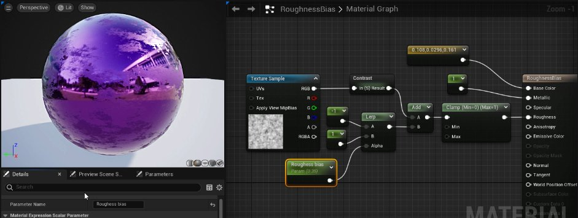
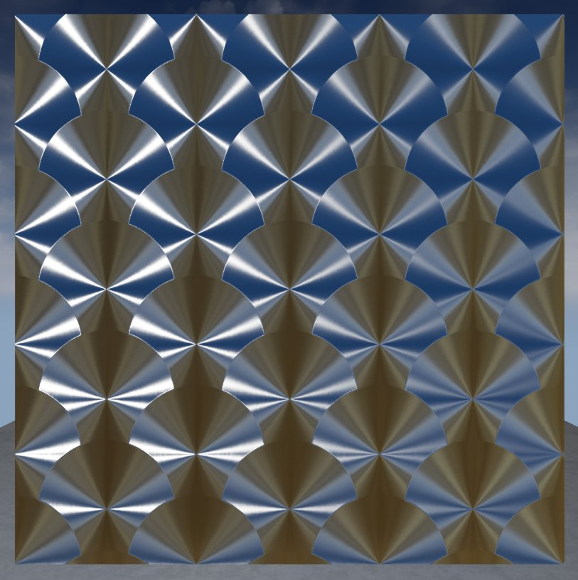
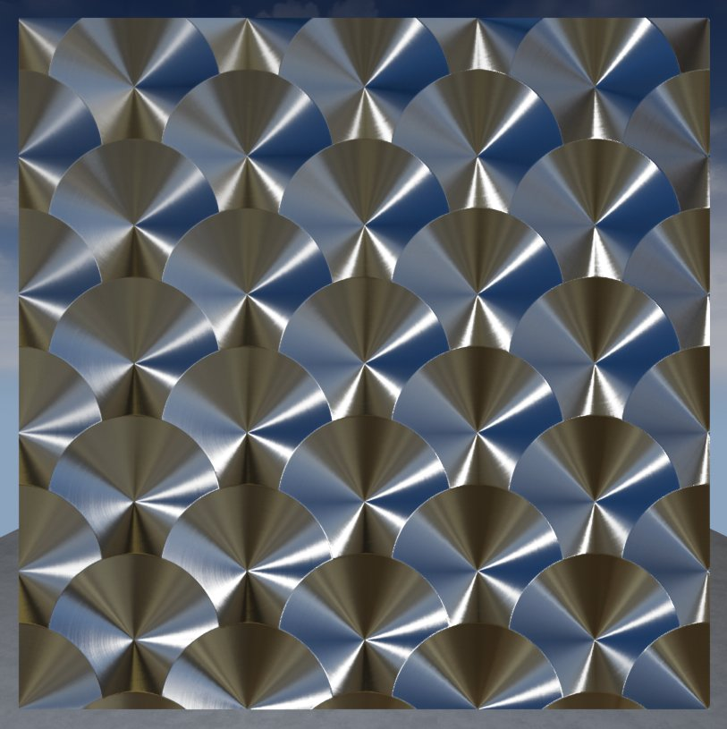
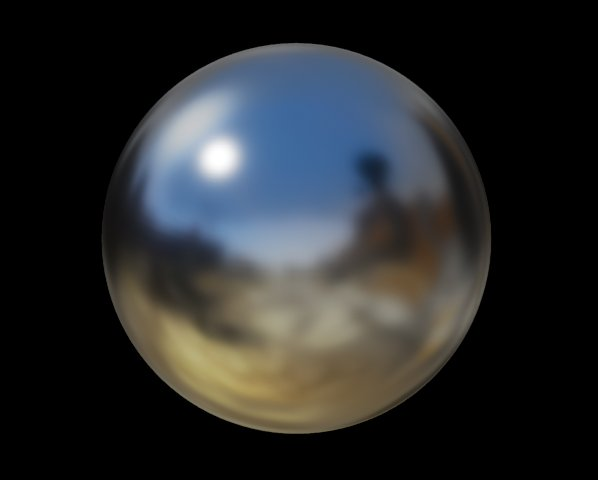

# 材质输入

> 路径：虚幻引擎5.7文档 / 设计视觉、渲染和图形效果 / 材质 / 材质输入

> 原始页面：https://dev.epicgames.com/documentation/unreal-engine/material-inputs-in-unreal-engine

本文介绍了主材质节点中的所有输入参数。通过向这些输入参数传入数据（例如常量、参数、纹理），你可以定义材质的表面属性，并创建近乎任意的物理表面。

> [!NOTE]
> 材质并非需要用到所有输入。有些材质类型所需的输入在默认情况下在主材质节点上是不可见的。

## 输入和材质设置

当你在细节面板中更改特定材质属性时，你会发现主材质节点中的一些输入会变成白色（表示它们已启用），而其他则是不可用状态。

以下三个属性控制材质中哪些输入可以启用：

- 混合模式（Blend Mode）

  — 控制材质如何与其背后（底下）的像素进行混合。
- 着色模型（Shading Model）

  — 控制如何计算材质表面的光照效果。
- 材质域（Material Domain）

  — 控制材质的用途，例如，是作为表面的一部分，是用作光照函数，还是用作后期处理材质。

如果你要用的某个材质输入被禁用了，那是因为以上属性设置得不对。例如，假如你想制作玻璃窗户材质，但是"不透明"输入被禁用了。方法就是将 **混合模式（Blend Mode）** 改为 **半透明（Translucent）**。

## 底色

底色定义了材质的整体颜色。原则上，底色表示的是表面反射的漫反射光，不包含任何镜面反射/高光效果。

假如你想拍一张照片来提取底色纹理，应使用偏振滤镜进行拍摄。在对准时，偏振滤镜可以消除非金属材质的高光效果。

## 金属感

金属感用于控制表面有多"像金属"。它能接受0到1之间的任何数值，但在大多数情况下，金属感非0即1。

- 非金属材质的金属感数值为0。
- 金属材质的金属感数值为1。

对于单一类型的表面来说，例如纯金属、纯岩石或纯塑料表面，这个数值非0即1，而非介于两者之间。在创建混合类型的表面时，例如腐蚀的、有灰尘的或生锈的金属时，你会发现需要一些介于0和1之间的值。

**金属感数值分别为 0、0.5 和 1。**

在使用金属遮罩时，纹理中的值应该是纯黑或者纯白。只有在创建混合效果时，才使用灰度值（例如腐蚀的金属）。

## 高光度

高光度衡量一个表面反射光线的强度。高光度输入值的范围在0到1，用于定义表面的反光程度。

- 0

  - 完全不反光
- 1

  - 完全反光
- 默认值是0.5，表示大约 4% 的反射程度。

**高光度数值分别为 0、0.5 和 1。**

## 粗糙度

粗糙度输入负责控制材质表面的粗糙或光滑程度。相比光滑材质，粗糙材质的表面会向更多方向散射反射光。该数值控制反射的模糊或锐利程度（或者高光区域的范围大小）。

- 粗糙度为0（光滑）时，结果是镜面反射。
- 粗糙度为1（粗糙）时，结果是漫反射或哑光表面。

**粗糙度数值分别为 0、0.5 和 1。**

大多数粗糙或光滑表面都是非均匀的。粗糙度是一种经常被映射到物体上的属性，用于丰富表面的物理变化效果。

金属上的划痕、木地板上的擦痕或塑料上的指纹，这些都是需要粗糙度贴图的例子。

## 各向异性与切线

**各向异性（Anisotropy）** 和 **切线（Tangent）** 用于控制材质的粗糙度的各向异性和光照方向。它们可用于实现材质的各向异性效果，例如金属拉丝效果。

假如不使用各向异性（Anisotropic）和切线（Tangent）输入，则材质表面为各向同性。各向异性输入值为0时也是如此。

各向同性材质响应

各向异性材质响应

各向异性的输入值介于-1.0到1.0之间，其中0表示没有各向异性效果。

> [!NOTE]
> 各向异性材质会默认启用，但可以通过控制台命令 `r.AnisotropicMaterials.` 禁用。启用后，只要是受支持的第五代（Gen5）平台，并且可扩展设置为高（High）、极高（Epic）或电影级别（Cinematic），则各向异性能正常运行。

**拖动滑块将显示各向异性响应从0.0正增加到1.0。**

**切线（Tangent）** 输入允许你通过纹理或向量表达式来定义光的方向性。

## 自发光颜色

**自发光颜色（Emissive Color）** 控制材质的哪些部分会发光以及其发光亮度。一般来说，它需要用到一个遮罩纹理（大部分黑色，除了需要发光的区域）。

由于支持HDR光照，所以允许大于1的值。

> 图片已省略：Emissive map

## 不透明度

使用"不透明度（Opacity）"输入需要先启用[半透明混合模式（Translucent Blend Mode）](../unreal-engine-material-properties/material-blend-modes/index.md#%E5%8D%8A%E9%80%8F%E6%98%8E) 。它通常用于半透明（Translucent）、叠加（Additive） 和 调制（Modulated） 材质。

- 0.0表示完全透明。
- 1.0表示完全不透明。
- 0和1之间的分数值会产生半透明材质效果。

在使用次表面着色模型时，不透明和遮罩混合模式也会用到不透明度（Opacity）。

> 图片已省略：Translucency Image

不透明度主要用于 **半透明材质（Translucent）**、**叠加材质（Additive）** 和 **调制材质（Modulated Materials）**。

## 不透明遮罩

**不透明遮罩（Opacity Mask）** 类似于不透明度（Opacity），但仅在使用遮罩（Masked）混合模式时可用。

与不透明度（Opacity）不同，不透明遮罩不允许部分不透明效果。使用不透明遮罩时，材质要么完全可见，要么完全不可见。当你需要可以定义复杂实心表面（如铁丝网、链环围栏等等）的材质时，它将成为一种理想的解决方案。

> 图片已省略：Opacity masked Material

你可以使用 **不透明度遮罩剪切值（Opacity Mask Clip Value）** 属性来控制何时产生不透明度，例如，如果它设置为0.5：

- 不透明度遮罩上的数值大于0.5的像素会变得完全不透明。
- 不透明度遮罩上的值低于0.5的像素变得完全透明。

请参阅[遮罩混合模式文档](../unreal-engine-material-properties/material-blend-modes/index.md#masked)。

## 法线

**法线（Normal）** 输入接收法线贴图，后者将打乱每个单独像素的"法线"或朝向方向，为表面提供重要的物理细节。

**在上图中**，两种武器都使用了相同的静态网格体。下图显示了一个非常详细的法线贴图，其提供了更多细节，带来一种表面包含的多边形比实际渲染多出许多的错觉。

法线贴图通常是在高分辨率建模软件中创建的。

## 世界位置偏移

**世界位置偏移（World Position Offset）** 允许材质在世界坐标系内操控网格体的顶点效果。可用于移动对象、改变形状、旋转对象和各种其他效果。世界位置偏移通常用于一些不太明显的环境动画。

上述节点使球体沿着顶点法线收缩，并且采用正弦周期（1秒）。

> [!WARNING]
> 使用世界位置偏移（World Position Offset）时，如果对象超出其原来的边框，渲染程序仍将基于原始边框进行计算。这意味着你可能会看到剔除和阴影错误。你可以在网格体的属性中，设置其 **缩放边界（Scale Bounds）** 属性，但这样会影响性能，并可能导致投影错误。

## 次表面颜色

只有在[着色模型](../unreal-engine-material-properties/shading-models/subsurface-shading-model/index.md)属性设为次表面（Subsurface）时，才会启用 **次表面颜色（Subsurface Color）**。 该输入允许你为材质添加一种颜色，以此模拟光线通过表面时的颜色变化。

举例而言，人类皮肤的着色器通常使用一种红色的次表面颜色，来模拟其表面之下的血液。皮肤的次表面效果在皮肤被强光照射时，最为明显，例如鼻尖、手指、耳垂等位置的皮肤。

> 图片已省略：undefined

## 自定义数据

自定义数据输入（Custom Data Material）是默认禁用的，只有在使用特定着色模型时才启用。自定义数据的插槽会根据上下文填充内容，以便支持某些着色模型的独特需求。

例如，如果你选择 **眼睛（Eye）** 着色模型， 自定义数据输入会变为 **虹膜遮罩（Iris Mask）** 和 **虹膜距离（Iris Distance）**。

使用自定义数据输入的着色模型包括：

- 透明涂层
- 次表面轮廓
- 毛发
- 布料
- 眼睛

## 毛发

**毛发（Hair）** 着色模型用于更好地模拟头发的半透明特性，并模拟光源穿过毛发的方式（毛发并不是完美的圆柱体）。

此外，由于每束毛发通常指向不同的方向，因此镜面高光并不统一，而是根据毛发指向的方向独立放置。

> 图片已省略：Hair Example

选中毛发着色模型后，主材质节点会激活三种输入：

- 散射（Scatter）：

  此输入控制允许穿过毛发的光线散射量。
- 切线（Tangent）：

  此输入可代替

  法线（Normal）

  输入，用于控制沿U和V纹理坐标的法线方向。
- 背光（Backlit）：

  此输入控制影响毛发材质的背光量。

> [!NOTE]
> 有关使用此着色模型设置毛发的示例，请参阅Epic Games启动程序中的 **学习（Learn）** 选项卡中的[数字人类](https://docs.unrealengine.com/4.27/en-US/samples-and-tutorials/)文档和示例项目。

## 布料

**布料（Cloth）** 着色模型可以用来很好地模拟布料材质，它们的表面通常有一层薄绒毛材质。

> 图片已省略：Cloth example

启用布料着色模型后，主材质节点会激活两种新的输入：

- 绒毛颜色（Fuzz Color）：

  你可以通过此输入将颜色添加到材质，以模拟光通过表面时颜色的变化。
- 布料（Cloth）：

  可以通过此输入控制

  绒毛颜色

  作为遮罩的强度。值为0表示绒毛颜色对底色没有影响，值为1则表示完全混合在底色上。

## 眼睛

这是一种更为复杂的着色模型，技术性很高，其着色器代码、材质、几何形状及其UV布局之间拥有非常强的互依赖性。Epic推荐你在开发自己的眼睛资产时以[数字人类](https://docs.unrealengine.com/4.27/en-US/samples-and-tutorials/)示例项目为起始点，或直接迁移此项目中的资产。

**眼睛（Eye）** 着色模型用于模拟眼睛的表面。

下图中的眼睛材质实例已经过设置，暴露了各种美术选项，可让你对[数字人类](https://docs.unrealengine.com/4.27/en-US/samples-and-tutorials/)示例项目中的眼睛的不同生理构造效果进行美术控制。

> 图片已省略：undefined

点击查看大图。

眼睛着色模型（Eye Shading Model）启用后会在主材质（Main Material）节点上激活两种额外输入。

- **虹膜遮罩（Iris Mask）：**这有助于控制虹膜的折射率和深度。

  > [!NOTE]
  > 在数字人类范例项目的材质 **M_EyeRefractive** 中，查看 **IOR** 和 **深度范围（Depth Scale）** 参数。
- **虹膜距离（Iris Distance）：**用于控制折射虹膜的凹度。

  > [!NOTE]
  > 在数字人类范例项目的材质 **M_EyeRefractive** 中，查看 **虹膜凹度比例（Iris Concavity Scale）** 和 **虹膜凹度幂（Iris Concavity Power）** 参数。

## 透明涂层

**透明涂层（Clear Coat）** 着色模型适合在表面模拟带有表面透明效果的多层材质。你可以在金属或非金属表面上使用透明涂层。

透明涂层的使用范例有：清漆（比如用于家具）、金属表面的彩色薄膜（如易拉罐或车漆）。

> 图片已省略：Clear coat example

启用透明涂层着色模型后会在主材质上激活两种新输入：

- 透明涂层（Clear Coat）

  ：透明涂层的数量，0表示标准着色模型，1为全透明涂层模型。适用于遮罩。
- 透明涂层粗糙度（Clear Coat Roughness）

  ：透明涂层的粗糙度。只有数值较小时，近似模拟才较为准确。如果粗糙度数值较大，虽然我们也支持，但与实际中的效果相比，可能会有误差。

## 环境光遮蔽

**环境光遮蔽（Ambient Occlusion）** 输入用来模拟在表面缝隙中的自阴影效果。 通常，这个输入是某种环境光遮蔽纹理贴图，而这种贴图通常在Maya、3ds Max或ZBrush等三维建模软件或Photoshop这类照片编辑软件中创建。

> [!NOTE]
> 注意，该输入只有在搭配 **静态（Static）** 或 **固定（Stationary）** 光源时才有效。如果与 **可移动（Movable）** 光源一起使用，则该材质效果会被默认忽略。

## 折射

**折射（Refraction）** 输入接受一个纹理或数值参数，用于模拟表面的折射率。它适用于玻璃、水这类材质，光在穿过这些物质时会发生折射。

在上图中，使用了一个菲涅尔材质（Fresnel Material）函数来混合两种不同的IOR值。

> 图片已省略：Refraction network

| 常见折射指数 |  |
| --- | --- |
| **空气** | 1.00 |
| **水** | 1.33 |
| **冰** | 1.31 |
| **玻璃** | 1.52 |
| **钻石** | 2.42 |

## 像素深度偏移

**像素深度偏移（Pixel Depth Offset）** 可通过你在着色器图表中设置的逻辑来控制像素深度。它允许你创建逻辑，根据对象的场景深度来混合或渐变对象。

> 图片已省略：Pixel depth offset

在此比较中，将像素深度偏移与DitherTemporalAA材质函数结合使用，我们能够设置"偏移"值，该值利用点画图案纹理将地面与相交的对象混合。

> 图片已省略：没有像素深度偏移

> 图片已省略：采用像素深度偏移

没有像素深度偏移

采用像素深度偏移

## 着色模型

> [!NOTE]
> 此输入要求在材质 **细节（Details）** 面板中将着色模型（Shading Model）设为 **基于材质表达式（From Material Expression）**。

借助 **着色模型（Shading Models）**，你可以在材质图表（Material Grpah）中设置逻辑，将不同的着色模型用于材质的不同部分。举例而言，当对象需要多个着色模型（例如透明涂层（Clear Coat）和默认光照（Default Lit））时，此输入十分实用。这样能减少所需的材质数量，从而改善性能，并减少绘制调用。你能通过在材质中设置着色模型表达式以及纹理遮罩来实现。

以下是用 **If** 表达式选择着色模型的简单示例。

使用此示例时，如A大于B，产生的着色模型为 **默认光照（Default Lit）**。当A小于或等于B时，纹理遮罩用于在网格体的各个部分显示 **默认光照（Default Lit）** 和 **透明涂层（Clear Coat）** 着色模型。

> 图片已省略：A > B:使用着色模型 | B = 0.0

> 图片已省略：A <= B:使用透明涂层 | B = 0.5

A > B:使用着色模型 | B = 0.0

A <= B:使用透明涂层 | B = 0.5

> [!NOTE]
> 欲知此输入用途的更多信息和示例，请参阅[基于材质表达式](../unreal-engine-material-properties/shading-models/from-material-expression-shading-model/index.md)页面。
