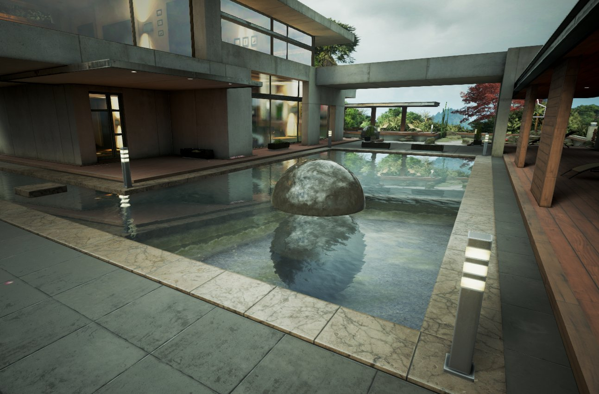
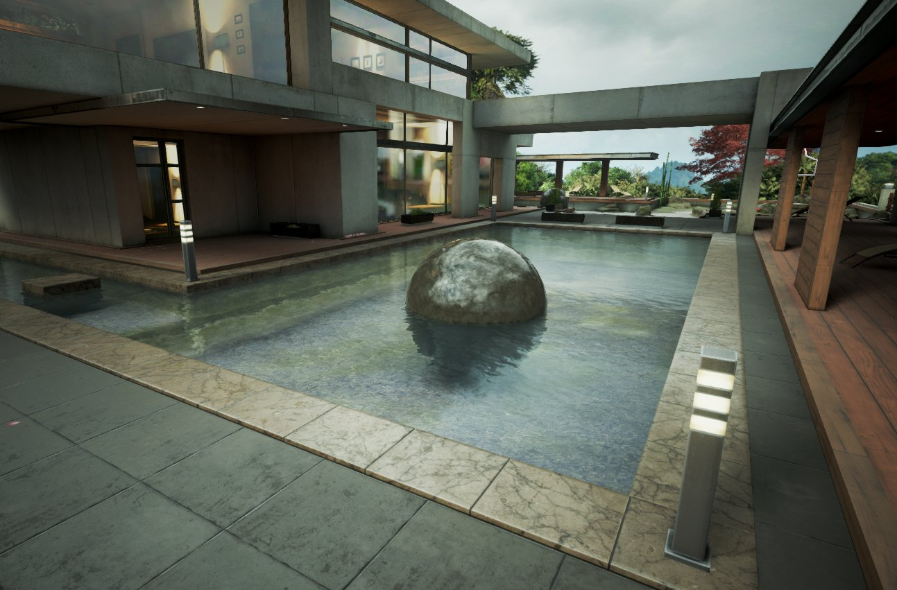
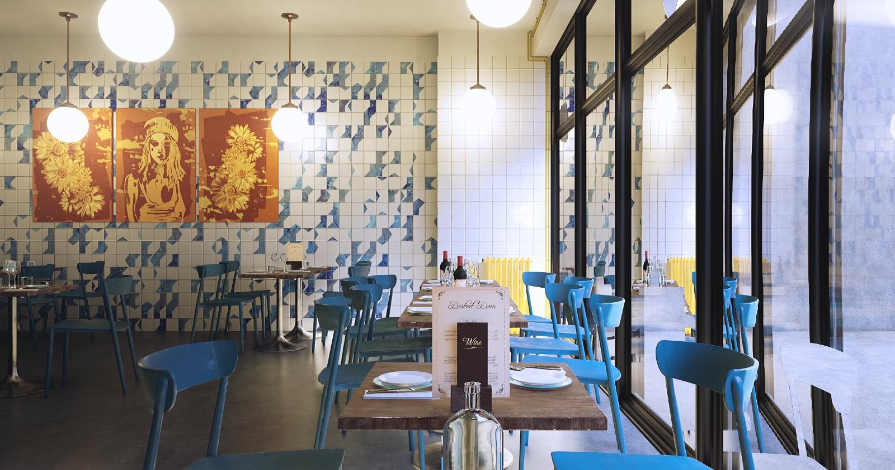
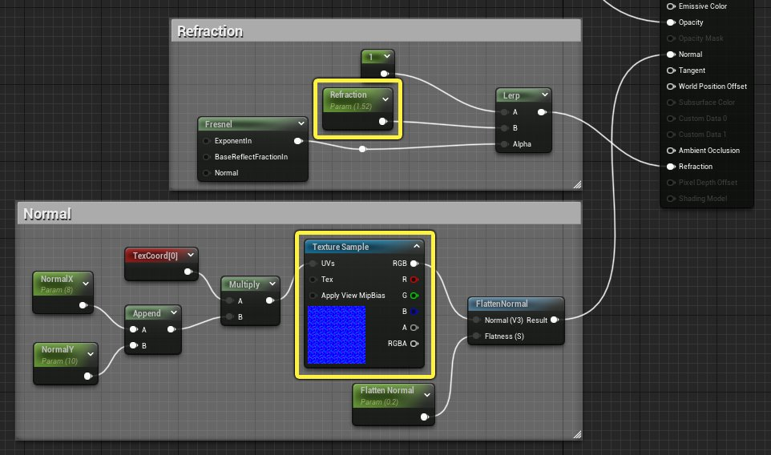
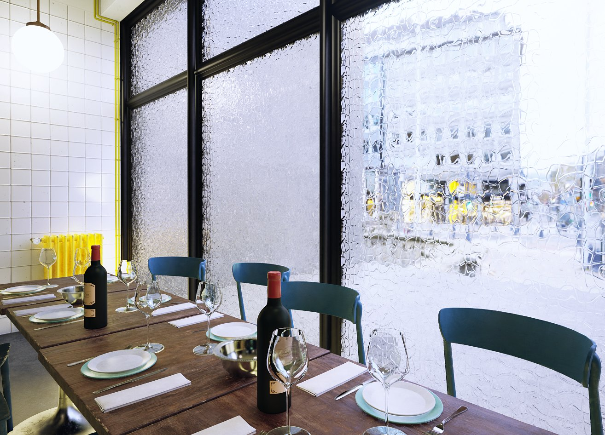

# 使用像素法线偏移实现折射

> 路径：虚幻引擎5.7文档 / 设计视觉、渲染和图形效果 / 材质 / 使用像素法线偏移实现折射

> 原始页面：https://dev.epicgames.com/documentation/unreal-engine/refraction-using-pixel-normal-offset-in-unreal-engine

默认情况下，虚幻引擎会使用基于物理的折射模型，此模型衍生自 **折射率（Index of Refraction）** 值。物理 **折射率（Index of Refraction）** 模型模拟了光线在介质之间传播时的折射方式。这非常适合小物体，例如罐子、玻璃杯和其他曲面。 但是，用于较大的平面时，可能会产生不可预测的结果和瑕疵，因为场景颜色是从屏幕之外读取的。

**像素法线偏移（Pixel Normal Offset）** 是[材质编辑器](../unreal-engine-material-editor-user-guide/index.md)中提供的另一种折射模式。它使用顶点法线作为参考，然后通过计算每个像素的法线与顶点法线的差异程度，从而算出折射偏移。这很适合较大的平面，比如水面，因为你不需要用常量偏移来从屏幕之外读取数据。

## 物理和非物理折射模型

你可以在细节（Details）面板中更改材质的 **折射模式（Refraction Mode）** 。 向下滚动并展开 **折射（Refraction）** 分段，然后从折射模式下拉菜单的两个选项中选择。 所有材质默认使用 **折射率（Index of Refraction）** 。

> [!NOTE]
> 你可以阅读[使用折射](../unreal-engine-materials-tutorials/using-refraction/index.md)页面，了解折射物理模型的更多内容，以及如何结合材质使用。

|  |  |
| --- | --- |
| 折射设置物理模型：折射率 | 折射设置的非物理模型：像素法线偏移 |

下面的比较演示了在折射模式从 **折射率（Index of Refraction）** 更改为 **像素法线偏移（Pixel Normal Offset）** 时材质中读取法线的方式有何不同。

折射模式：折射率，无法线贴图

折射模式：像素法线偏移，无法线贴图

在这里你会法线，与 **像素法线偏移（Pixel Normal Offset）** 模式相比，使用 **折射率（Index of Refraction）** 模式时，图像会发生偏移，因为你不会从屏幕外读取那么多内容。 *折射率（Index of Refraction）**模式在没有法线贴图插入材质的情况下也能工作，而在**像素法线偏移（Pixel Normal Offset）** 模式下，如果没有法线贴图，你将不会得到任何折射。

折射模式： 折射率带法线贴图

折射模式： 像素法线偏移带带法线贴图

为材质添加法线贴图时，如果折射参数的值大于 1，使用 **像素法线偏移（Pixel Normal Offset）** 后法线将沿表面平移。 然而，你会注意到，使用 **折射率（Index of Refraction）** 后，仍然会从屏幕外读取偏移，对使用折射的平面而言并非理想效果。

## 最终结果

在此示例中，折射量在值 1.0（完全无折射）到 2.0 之间调整， 使用 **像素法线偏移（Pixel Normal Offset）** 时沿表面形成一些折射而不使图像发生移位。

## 像素法线偏移和玻璃

像素法线偏移也很适合较大的扁平玻璃表面，例如下面的咖啡馆场景中的窗户。 幻灯片中的第一张图使用了默认的 **折射率（Index of Refraction）** 设置。 窗户折射很混乱，并且右下角有一个瑕疵。 折射率更改为 **像素法线偏移（Pixel Normal Offset）** 时，窗户看起来逼真得多，瑕疵也消失了。

**移动幻灯片，查看当折射模式从折射率（图1）更改为像素法线偏移（图2）时玻璃会发生怎样的变化。**

在 **像素法线偏移（Pixel Normal Offset）** 模式中，此示例的折射极其轻微，因为此玻璃的法线贴图仅包含微小的磨损和轻微的表面瑕疵。 这是干净的建筑玻璃的预期结果。

但是，如果你想要带纹理或图案的玻璃效果，可以使用更有代表性的法线贴图，并将 **折射（Refraction）** 值提高到 **1.52** 左右。

这就是法线贴图对玻璃窗户中光线折射的影响。

