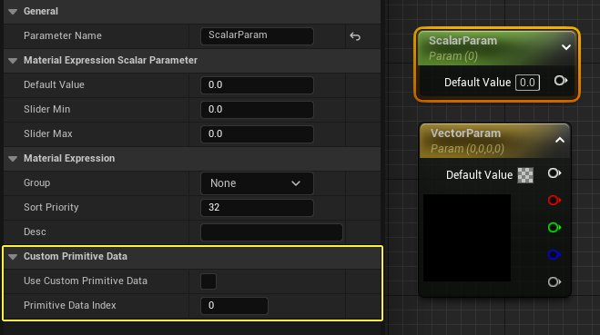
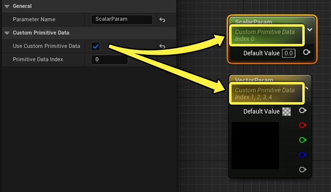
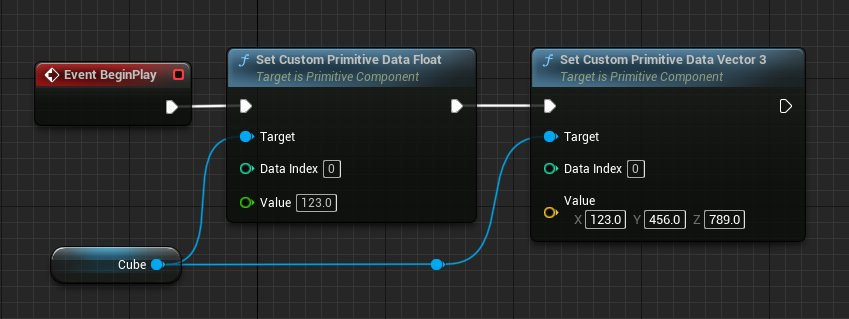
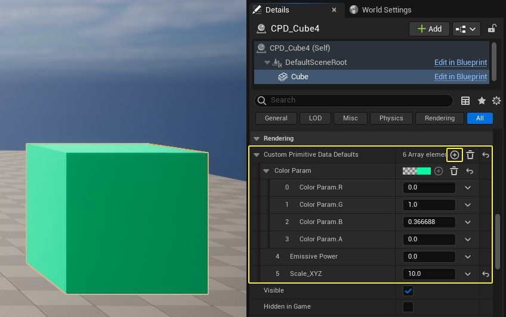
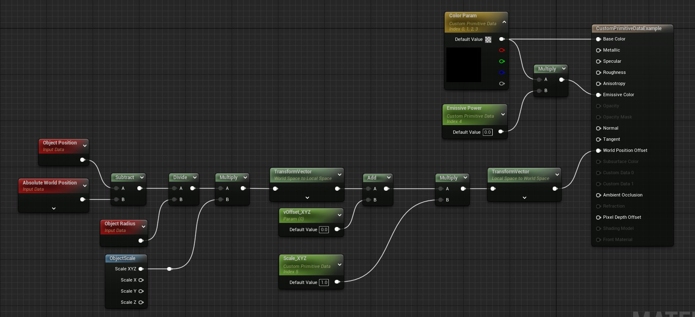
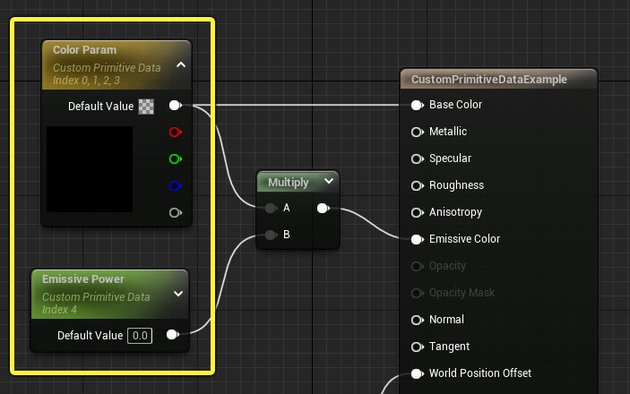
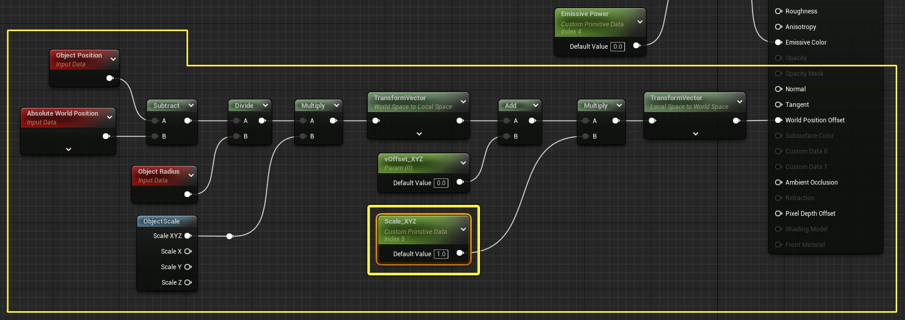
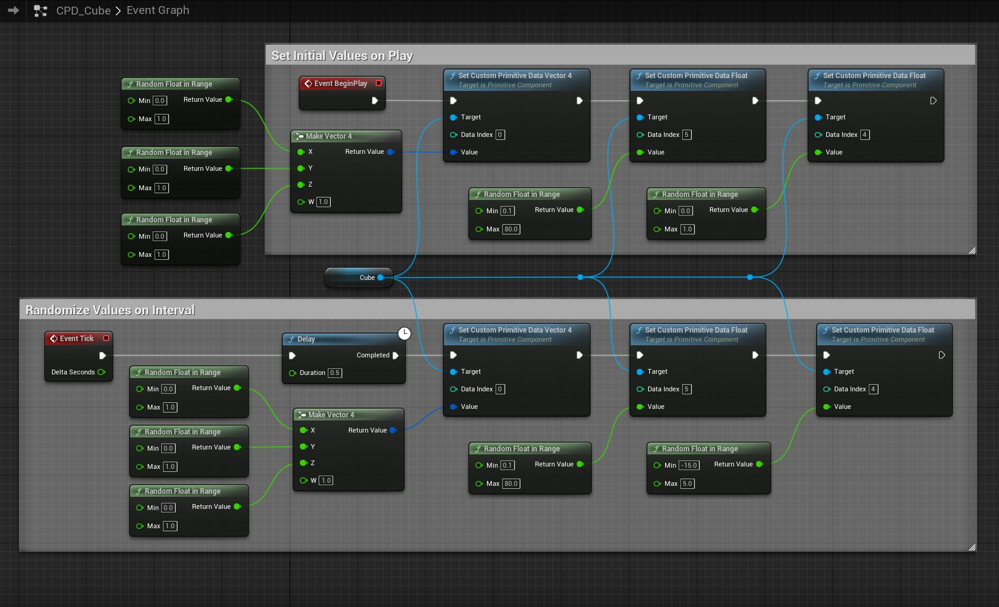

# 在材质中按图元存储自定义数据

> 路径：虚幻引擎5.7文档 / 设计视觉、渲染和图形效果 / 材质 / 在材质中按图元存储自定义数据

> 原始页面：https://dev.epicgames.com/documentation/unreal-engine/storing-custom-data-in-unreal-engine-materials-per-primitive

借助 **自定义图元数据**（CPD）流程，你可以在材质中将自定义数据保存在索引数组中，并允许蓝图和代码访问数据。通过这些数据，你可以在运行时调整场景图元。

它与[动态材质实例](../instanced-materials/index.md#materialinstancedynamic)(MID)的功能类似，可用于在运行时通过标量和向量参数，动态控制材质图表的各部分。区别在于，CPD的优势是将数据存储在图元自身而非材质实例上，减少了关卡中类似几何体（如墙壁、地板或其他重复几何体）的绘制调用次数。

## 使用和工作流

下列步骤总结了如何通过自定义图元数据来处理场景图元：

1. 创建标量和向量材质参数，以便控制材质逻辑的各部分。对要动态设置和控制的参数，启用

   使用自定义图元数据（Use Custom Primitive Data）

   。
2. 对于启用此选项的参数，在细节面板中为其设置一个唯一的

   图元数据索引（Primitive Data Index）

   。之后你将在蓝图或代码中引用该索引。
3. 使用蓝图中的

   Set Custom Primitive Data

   节点来设置和控制自定义数据数组中存储的值。

### 材质设置

在图表中添加 **标量（Scalar）** 和 **向量参数（Vector Parameter）** 表达式，以便控制材质属性。这点和[材质实例](../instanced-materials/index.md#%E6%9D%90%E8%B4%A8%E5%8F%82%E6%95%B0%E5%8C%96)类似。

选中参数后，在 **细节（Details）** 面板中勾选该表达式的 **使用自定义图元数据（Use Custom Primitive Data）**。



启用后，参数会在其给定命名下显示"自定义图元数据"，以及你在 **图元数据索引（Primitive Data Index）** 数组中赋值给它的数值。该数值在节点上也会显示。



**图元数据索引（Primitive Data Index）** 用来设置该参数保存在哪一个索引之下。该索引用于在蓝图和代码中引用参数。

对 **标量（浮点）** 参数设置索引时，索引只有一个值。对 **向量** 参数设置索引时，参数中的每一个通道都会在图元数据索引中被赋予一个单独的数值。在上图中，标量参数赋值给索引0，而向量参数赋值给索引1、2、3、4。每个RGBA输出分别对应一个索引值。

### 蓝图使用

你可以通过以下蓝图节点来访问使用了CPD的场景图元。

- Set Custom Primitive Data Float
- Set Custom Primitive Data Vector

此类节点无需与参数命名匹配。相反，它们使用赋值后的 **图元数据索引（Primitive Data Index）** 逐图元设置和获取数组中的数据。



在材质内访问该数组中的自定义数据，与使用材质实例中的材质参数类似。区别在于，在参数节点上的材质中，参数必须为匹配字符串的统一参数，而非匹配数字的索引。

### Actor默认值使用

你可以为Actor设置自定义图元数据的默认值，方法是在其默认面板中选中静态网格体组件，展开 **自定义图元数据默认值（Custom Primitive Data Defaults）** 分段。点击 **加号（+）** 图标添加数组元素。数字会自动填充对应的带名称自定义数据参数，以及对应的图元数据索引值。



各个编号数组元素都引用具有对应值的自定义图元数据索引。若数组元素不存在索引，则其将被忽略。若要手动调整某些值，但不附加蓝图或不创建材质实例来加以控制，则非常适合使用此方法设置默认值。

## 范例设置和比较

以下范例展示了使用多个（标量和向量）参数驱动的简单材质，在向量参数中随机选择颜色，并通过图表中的材质逻辑设置场景中网格体的发射率和对象范围。蓝图用于驱动已存储自定义数据的此类参数。

### 材质范例设置

对于材质设置，已在材质图表中的选定参数上启用 **使用自定义图元数据（Use Custom Primitive Data）**：



点击查看大图。

**底色（Base Color）** 和 **自发光（Emissive）** 强度由两个参数驱动：名为"颜色参数"的向量4参数和名为"自发光功率"的标量参数。



点击查看大图。

此图表的第二部分使用逻辑统一缩放其在关卡中指定的网格体。名为"Scale_XYZ"的标量参数控制指定对象的缩放量：



点击查看大图。

### 蓝图范例设置

参数中的自定义数据和Material Instance Dynamic类似，允许你通过蓝图或代码在运行时完成更改。下图展示了在此类材质参数中如何设置和更新数值，以便在游戏期间设置随机颜色、发射率以及初始缩放比例。



点击查看大图。

在Event BeginPlay上，**Set Custom Primitive Data** 节点用于初始化颜色、缩放、发射参数的初始值。**数据索引** 属性用来决定该节点的目标材质参数。

> 图片已省略：undefined

点击查看大图。

例如，**Emissive Power** 被赋值给Index 4。两个Set节点上的 **数据索引** 使用材质中的相同 **图元数据索引** 初始化材质参数。

> 图片已省略：Data Index Target

在 **Event Tick** 中，Set节点用于引用各个自定义图元数据参数所需的图元数据索引。按照Delay节点定义的间隔，我们每过一段时间分别设置一次新的颜色、发射强度和缩放。颜色是通过将三个随机浮点值合并成一个Vector 4来设置的。发射强度和缩放比例通过 **Random Float in Range** 节点随机设置。

> 图片已省略：undefined

点击查看大图。

> [!NOTE]
> 设置和使用Event Tick时需谨慎。出于本次演示目的，建议采用快速测试和调试，但运行时不适合持续使用。

### 示例结果

该示例的最终效果是，一个带有3个自定义图元数据参数的材质，可以通过蓝图来设置其网格体的颜色、发射强度和缩放效果。所有数值在运行时设置，然后每 **0.5** 秒更新一次（时间由蓝图定义）。

## Material Instance Dynamic对比

自定义图元数据（Custom Primitive Data）的设置和使用过程类似于[Material Instance Dynamics](../instanced-materials/index.md#materialinstancedynamic)。本小节对比了两种情况下的材质和蓝图设置，以便更好地说明它们的异同。

在创建Material Instance Dynamics时，只有参数名称会之后在蓝图中用到。在基于自定义图元数据的流程中， 你需要为每个参数启用 **使用自定义图元数据（Use Custom Primitive Data）** 选项，并指定一个唯一的 **图元数据索引（Primitive Data Index）** 值。该值之后会在蓝图中被引用。

| Regular Parameter Properties | Custom Primitive Properties |
| --- | --- |
| MID材质参数 | 自定义图元材质参数 |

下图对比了Material Instance Dynamics和Custom Primitive Data两种情况下的蓝图设置。

- **动态材质实例工作流：**

  > 图片已省略：undefined

  点击查看大图。

  > [!NOTE]
  > 欲了解实例化材质的更多信息，参阅[实例化材质](../instanced-materials/index.md)。
- **自定义图元数据工作流：**

  > 图片已省略：undefined

  点击查看大图。

除了需在蓝图中进行部分额外操作，该工作流较为类似。MID工作流需要 **Create Dynamic Material Instance** 节点和部分 **Set Parameter Value** 节点，此类节点将引用所需参数的匹配字符串 **参数命名**（位于材质中）。

若运行时在关卡中对比这两种设置，视觉上是相同的。但由于CPD使用网格体绘制重构，因此拥有节省性能的优势。将在下章中详细介绍。

视频左侧的四个球体使用了自定义图元数据。右侧四个球体则使用了Material Instance Dynamics。注意，画面效果上两者相同。

## 性能

在使用包含自定义数据的材质时，基于自定义图元数据（CPD）的流程可以显著减少关卡中类似几何体所产生的绘制调用。使用可自动动态实例化场景图元的[网格体绘制](../../graphics-programming/mesh-drawing-pipeline/index.md)重构，以减少绘制调用数。

要查看动态实例化在关卡中的效果，请打开控制台(`)并输入命令`stat scenerendering`。

此命令可显示当前场景视图的一般渲染统计数据，建议从此入手，查找渲染过程中的一般低性能区域，以及场景中网格体绘制调用和光源数量的计数器。

> 图片已省略：Stat Command scenerendering

默认关卡场景渲染统计数据

> [!TIP]
> 在关卡视口中，点击 **G** 键切换游戏视图模式，或选择在编辑器中运行(PIE)或模拟，获得更准确的结果。若不使用此类选项，可将其他绘制调用应用于纯编辑器几何体，如定向光源的图标。

此范例场景将以地板网格体、背景天空球体网格体、以及在材质中使用自定义数据的复制网格体开始。

> 图片已省略：Console command stat rendering

场景渲染统计数据会显示当前视图中注册的绘制调用数；共计14次。

> 图片已省略：Mesh draw calls with dynamic instancing

由于引擎会自动将绘制调用与网格体绘制规则动态结合，因此建议禁用动态实例化，观察其当前在此场景中的表现。可用以下命令禁用：

```
    r.MeshDrawCommand.DynamicInstancing 0
```

注意：仅使用少许图元增加了 `网格体绘制调用` 的数量：

> 图片已省略：Mesh draw calls without dynamic instancing

要体现出更显著的差异，先多复制一些使用自定义图元数据的网格体；此例中有25个不同大小的球体。

> 图片已省略：Spheres with custom primitive data

- 禁用动态实例化后，有 **94次网格体绘制调用**。使用Material Instance Dynamic后，你能得到一个类似的效果，因为它们不会像自定义图元数据那样被实例化。

  > 图片已省略：Mesh draw calls with dynamic instancing disabled
- 重新启用动态实例化，将显示 **46个网格体绘制调用**。

  > 图片已省略：Mesh draw calls with dynamic instancing enabled

在材质中存储自定义数据并在关卡中使用类似几何体时，即可发现绘制调用的数量差异，即便使用如动态材质实例等其他方法也是如此。

## 其他说明

- 浮点限制32

  - 在未来的版本中，我们会设法将此项目设置便为可配置设置。
- 支持自定义图元数据参数的用户定义默认值和覆盖值

  - 目前，在材质中设置自定义图元数据参数时，默认值固定为0。若要在使用编辑器时设置初始值，在蓝图中使用材质指定到的网格体构造脚本即可进行操作。
