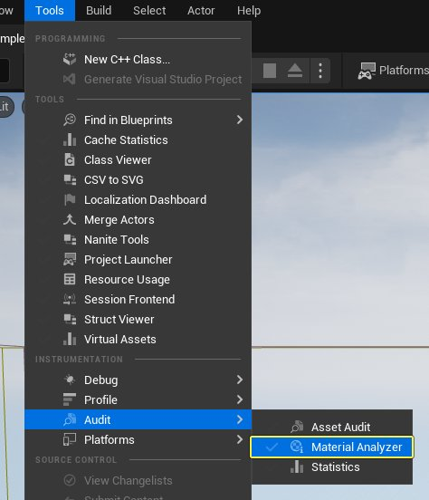
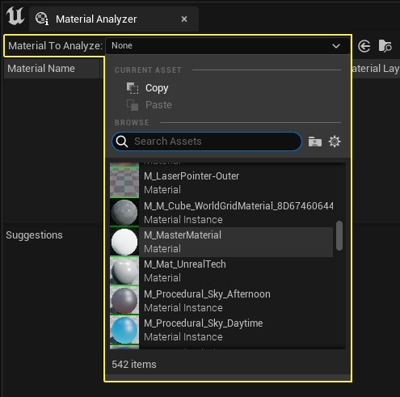
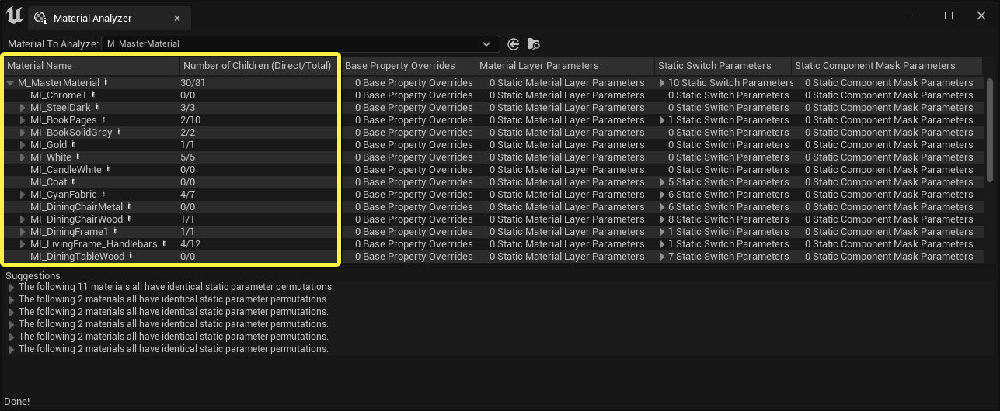
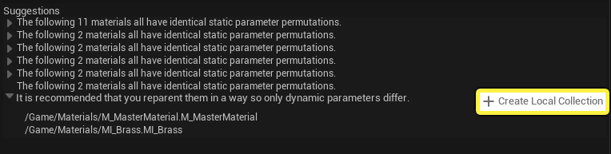
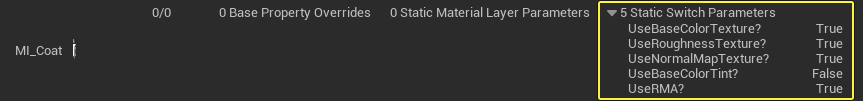

# 材质分析器

> 路径：虚幻引擎5.7文档 / 设计视觉、渲染和图形效果 / 材质 / 材质分析器

> 原始页面：https://dev.epicgames.com/documentation/unreal-engine/unreal-engine-material-analyzer-tool

**材质分析器** 是一个开发者工具，帮助你识别和分析项目中的所有材质或[材质实例](../instanced-materials/index.md)。这样使你能够进行一些更改，从而节约着色器Permutation和存储数据成本。当你选择要分析的材质或材质实例后，该工具将查找该材质的所有后代（或材质实例的父材质的所有后代）。该工具还能识别所有基础属性覆盖、静态切换和静态组件遮罩参数。

## 打开材质分析器

1. 在菜单栏中，单击 **工具（Tools）> 审核（Audit） > 材质分析器（Material Analyzer）**。**材质分析器（Material Analyzer）** 窗口将会打开。

   
2. 单击 **要分析的材质（Material to Analyze）** 旁边的下拉菜单。通过列表或搜索栏，选择想要分析的材质或材质实例。

   
3. 材质分析器工具显示你选择的材质的所有实例列表。

   

## 查看建议列表

材质实例层级下面是一个建议列表。建议列表将具有一组相同静态覆盖的所有材质实例分组到一起。你可以单击每一行旁边的箭头来查看标识的静态实例。 Suggestion list

## 创建本地集合

每个建议列表都有一个 **创建本地集合（Create Local Collection）** 按钮。单击该按钮来将所有相关实例放置在一个本地集合中，这样就可以轻松找到它们并进行更新，让它们拥有更高效的参数设置。

## 查看静态切换参数列表

要查看材质实例的静态切换参数，单击"静态切换参数"（Static Switch Parameter）列旁的箭头来显示完整列表。这些列的大小是可以调整的，因此如果文本被裁减掉，可以移动列。

## 重设材质实例父项

你可以将这些材质实例的父项重设为拥有相同静态覆盖的新实例，以便重设父项的材质实例只更改它们的唯一覆盖。这样就节省了着色器Permutation和存储数据方面的成本。确保从你重设了父项的材质实例移除所有静态参数覆盖，否则仍会存储多余数据。
