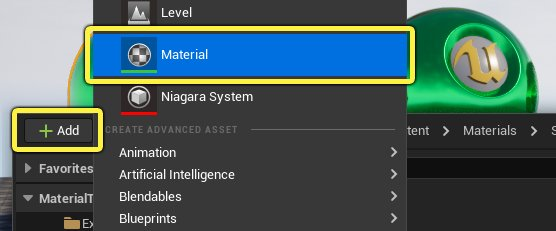
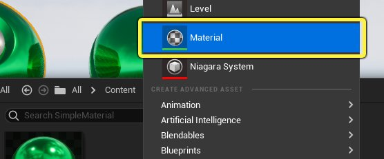
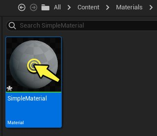
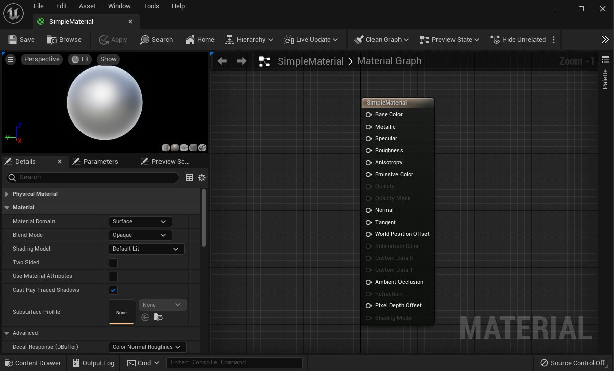
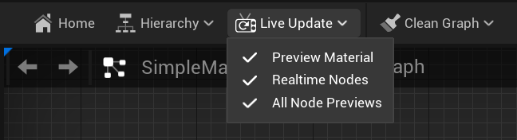

# 材质编辑器指南

> 路径：虚幻引擎5.7文档 / 设计视觉、渲染和图形效果 / 材质 / 材质编辑器指南

> 原始页面：https://dev.epicgames.com/documentation/unreal-engine/unreal-engine-material-editor-user-guide

**材质编辑器（Material Editor）** 是一个基于节点的图形界面，你可以用它创建 **材质**（又称着色器），而材质用于定义场景对象的表面属性和外观，比如静态、骨骼网格体、地形、UI和特效。

在本文中，你将了解材质编辑器的构成部分，以及虚幻引擎材质的大概创建过程。

> [!NOTE]
> 推荐你先阅读[材质基本概念](../essential-unreal-engine-material-concepts/index.md)一文。本文介绍了虚幻引擎材质的关键操作流程。

## 材质创建流程

下述动画展示了材质的基本创建过程。

如上所示，这些是创建一个简单材质的步骤。

1. 在内容浏览器中新建一个

   材质

   资产。
2. 打开

   材质编辑器

   。
3. 在材质图表中添加

   材质表达式和函数

   。
4. 将材质表达式连到

   主材质节点

   ，以便定义材质的属性。
5. 编译并保存材质。
6. 将材质添加到关卡对象上。

材质的主要创建步骤是第三和第四步，材质的表面属性和独有质感主要靠这两步完成。**材质表达式** 和 **函数** 是虚幻材质的基本构建单元，每一个表达式都在材质图表中实现一个特定操作。通过以独特的方式组合这些节点，你可以实现各式各样的物理表面。

## 新建材质

1. 有两种方法来新建材质资产。

   1. 点击内容浏览器左侧的 **添加（+）** 按钮，在列表中选择 **材质**。

      
   2. 你也可以在 **内容浏览器** 的空白处 **单击右键**，在从上下文菜单中选择 **材质**。

      
2. 在内容浏览器中创建一个材质。重命名该材质，然后双击缩略图，打开材质编辑器。

   
3. 打开的 **材质编辑器** 。

   

## 使用材质编辑器

下述五个页面介绍了如何使用材质编辑器的各个部分。它们详细说明了上方视频中的步骤，介绍了材质创建的实用方法。建议你按下述顺序阅读它们，了解如何使用材质编辑器中的各个工具。


- [材质编辑器UI](unreal-engine-material-editor-ui/index.md)

- [放置材质表达式和函数](placing-material-expressions-and-functions/index.md) - 在材质图表中放置材质表达式和函数的指南

- [使用主材质节点](using-the-main-material-node/index.md) - 设置和使用主材质节点的指南

- [预览和应用材质](previewing-and-applying-your-materials/index.md) - 关于预览材质并将其应用于Actor的指南。

- [整理材质图表](organizing-a-material-graph/index.md) - 如何使用注释、重路由和其他方法来整理材质图表，使其易于阅读和编辑。

## 实时更新选项



在修改材质网络时，如果能即时看到修改后的效果，必定会事半功倍。材质编辑器的 **实时更新（Live Update）** 菜单下提供了三个选项，来控制实时更新材质编辑器中的哪些元素，它们分别是 **预览材质（Preview Material）**、**实时节点（Realtime Nodes）** 和 **所有节点预览（All Node Previews）**。

这些选项分别允许你以不同模式实时预览材质编辑器中的内容。

**预览材质 -** 允许任何变化在材质预览视窗中实时自动更新，不需要你使用 **保存** 或 **应用** 按钮。 **实时节点 -** 基于时间的节点，例如平移（Panner），将实时更新。 **所有节点预览 -** 网络中的所有节点都会在更改后重新编译其着色器。这些变化包括新建节点、删除节点、节点的连接和断开，以及属性变化。这种重新编译是必要的，只有这样在该节点处绘制的材质预览效果才会是实时最新的。然而，重新编译这些中间着色器可能很耗时，特别是当你的材质的网络十分复杂时。如果你在每次调整后都需要漫长的等待时间，你可能需要停用 **所有节点预览** 选项。

考虑下面的例子，在这个例子中，一个平移的网格纹理被一个提供颜色的矢量表达式所乘。

- 在这个示例中，因为激活了

  实时节点

  ，所以纹理在节点的预览缩略图中会实时平移。如果没有激活

  实时节点

  ，即使平移节点告诉它要移动，纹理仍然会纹丝不动。不过，当你在图表区域内移动鼠标时，你可能会注意到细微的更新。 *如果你改变了向量表达式中的颜色，只有在

  所有节点预览

  启用的情况下，变化才会出现在下游的节点中。如果禁用该选项，即使向量表达式中的颜色确实发生了变化，也不会影响节点缩略图中的效果。

> [!TIP]
> 另外，当 **所有节点预览（All Node Previews）** 被停用时，你可以按 **空格键** 手动强制更新所有预览。通过禁用 **所有节点预览（All Node Previews）**，然后在你想查看更改时按下空格键， 可以实现快速迭代。

## 编译器错误

每次对材质网络进行更改时，都必须编译材质才能看到效果。如果表达式的某个必要输入没有连接上，或者传递了数据的类型错误，就会发生编译器错误。

这些类型的错误显示在两个地方。

- 抛出错误的节点将在其底部显示

  "错误！（ERROR!）"

  。
- 统计数据（Stats）

  窗口也会显示错误消息，提示你导致无法编译的原因。如果你的统计数据（Stats）窗口没有打开，你可以点击

  窗口（Window）

  >

  统计数据（Stats）

  来打开它。

编译器错误通过提供遇到的有关节点表达式类型的信息和对错误的描述，让你知道存在问题以及该问题是什么。

图中的正弦节点提示了一个错误，因为某个必要输入没有收到数据。这个错误也会显示在"统计数据"面板中。

## 材质图表搜索

材质编辑器中的搜索功能使你能够快速地在材质网络中找到任何节点（包括注释），这些节点的描述中包含特定的文本片段， 或者特定于不同类型的节点的某些其他属性。这样就很容易向节点添加标识关键字并在稍后跳转到它们， 而无需杂乱地在图表中的节点网络中进行筛选。

你可以通过转到 **窗口（Window）** > **查找结果（Find Results）** 来打开这个选项卡。

在搜索框中键入完整或部分关键字，将对在你的材质图表中呈现的节点的属性执行搜索。当前选中的结果将显示在视图中 并高亮显示。

根据以下属性值执行搜索：

| **搜索的属性（Searched Properties）** | **表达式类型（Expression Type）** |
| --- | --- |
| **描述（Desc）** | 所有节点（All Nodes） |
| **纹理（Texture）** | 纹理样本（Texture Sample） |
| **参数名（ParamName）** | 参数（Parameters） |
| **文本（Text）** | 注释（Comment） |
| **字体（Font）** | 字体样本（Font Sample） |
| **材质函数（Material Function）** | 材质函数调用（MaterialFunctionCall） |

你还可以通过在搜索中使用"NAME="开关对特定类型的表达式执行搜索。例如，要找到所有纹理样本， 可以使用以下搜索：

```
	NAME=texture
```

当在 **搜索（Search）** 面板中单击一个新的匹配项时，如果它原本不可见，则将在图表中显示出来。

要清除搜索，只需按下 **清除（Clear）**（X）按钮。
