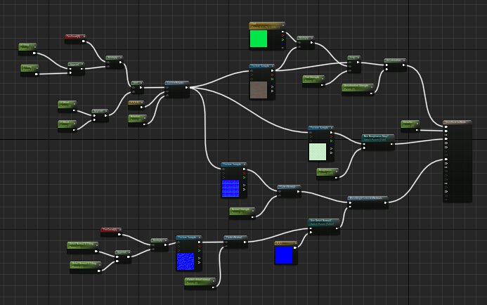
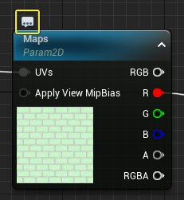
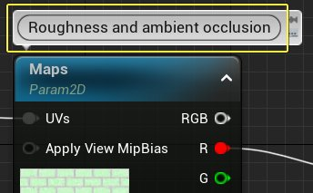
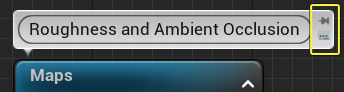
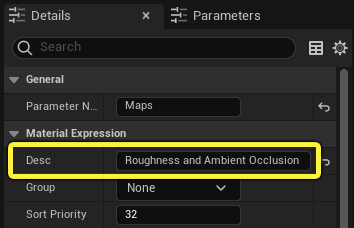
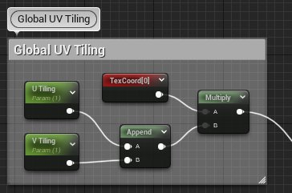
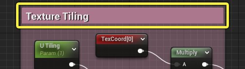
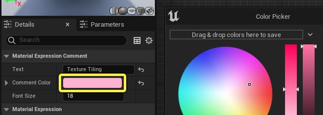

# 整理材质图表

> 路径：虚幻引擎5.7文档 / 设计视觉、渲染和图形效果 / 材质 / 材质编辑器指南 / 整理材质图表

> 原始页面：https://dev.epicgames.com/documentation/unreal-engine/organizing-a-material-graph-in-unreal-engine

随着材质的复杂度提高，节点图表会很快变得难以阅读和交互。当材质从主要作者移交给其他美术师或开发人员时，复杂、无序的图表编辑起来很慢，其他人员也很难理解这些图表。

## 材质编辑器整理工具

虚幻引擎包含了多个工具，用于整理材质图表。

1. 注释
2. 重路由节点
3. 可命名重路由节点
4. 对齐和分布
5. 折叠节点

## 注释

注释是改进材质图表可读性的最简易的方法。 此材质并未达到过分复杂的程度，但如果没有注解，交到另一个美术师手里之后，也需要费一些工夫来解读。

**带有和不带有注释的材质图表网络。**

拖动滑块以查看使用注释注解的相同材质。 每组节点在做什么，通过标签即可做到一目了然。

有两种方法可以为材质添加注释。

### 节点说明

你可以向节点图表中的单个材质表达式或函数添加注释或说明。

1. 将鼠标指针悬停在材质图表中的节点上。
2. **左键点击** **切换注释气泡** 图标。

   
3. 在字段中输入注释。

   
4. 如果你希望在放大和缩小材质图表时保持注释可见，请点击固定图标。这样一来，即使在缩小的情况下，注释仍能保持可辨识的大小。 你可以再次点击 **切换注释气泡** 图标以隐藏注释。

   

你在注释气泡中键入的所有内容也会显示在该节点的 **细节（Details）** 面板的 **说明（Desc）** 字段中。 即使隐藏注释气泡，此说明仍保持可见。

### 注释框

你可以使用注释框将一系列相关节点分组在一起。

1. 选择你想放入注释框中的所有节点。
2. 按

   C 键

   以在所选节点周围创建一个注释框。
3. 在标题字段中键入名称。

使用注释框，你可以将框中的所有节点作为单个组一起移动。**左键点击并拖动** 标题栏以移动注释框。

- 你可以将节点拖入或拖出注释框来添加和删除节点。
- 拖动边角或边缘来调整注释框大小。
- 你可以将注释框互相嵌套。

### 注释颜色

注释框在 **细节（Details）** 面板中有一个颜色属性。

1. 点击注释框的 **标题栏（header bar）** 以访问其"细节（Details）"属性。

   
2. 点击 **注释颜色（Comment Color）** 色条并在 **取色器（Color Picker）** 对话框中选择新颜色。

   

## 重路由节点

重路由节点允许你修改两个材质节点之间的路径。你还可以使用重路由节点来分割连线，以便连到多个输入引脚上。

在连线任意位置双击，添加一个重路由节点。

> 图片已省略：Add wire reroute pin

要修改连线的路径，请将鼠标悬停在重路由节点上，直到显示移动图标。

> 图片已省略：移动连线重路由引脚

左键点击并拖动引脚到新位置。 使用重路由，你可以重定向阻碍原始路径的节点周围的连线。

> 图片已省略：新连线路径

在者视频中，重路由节点用来分割连线，以便将其插入三个输入。

## 可命名重路由节点

使用 **可命名重路由节点**，你可以消除连线，并改为通过输入和输出节点路由信息，从而简化材质图表。 可命名重路由节点就像从材质图表的一个区域到另一个区域的隧道或门户。

例如，与"粗糙度（Roughness）"贴图相关节点的这个小群集会在材质图表中间创建相对较长的连线。 使用可命名重路由节点，你可以消除连线，而不更改信息流。

> 图片已省略：不必要的连线

### 创建可命名重路由节点

1. 沿连线双击，以添加重路由引脚。

   > 图片已省略：可命名重路由节点引脚
2. 右键点击节点，在上下文菜单中选择 **转换为可命名重路由节点（Convert to Named Reroute）**。

   > 图片已省略：转换为可命名重路由节点
3. 连线连接将消失，并将在连接的开头和结尾创建两个 **可命名重路由节点（Named Reroute）** 节点。它们并排显示，你可以看到可命名重路由节点很像一个隧道。 数据流入第一个节点，并通过第二个节点流出，后者称为 **可命名重路由节点用途节点（Named Reroute Usage node）** 。

   > 图片已省略：可命名重路由节点节点

重路由中的第一个节点称为 **可命名重路由节点声明（Named Reroute Declaration）** 。在 **细节（Details）** 面板中为此节点提供唯一的描述性名称极其重要。

> 图片已省略：重路由声明描述

选择"可命名重路由节点声明（Named Reroute Declaration）"节点，并在 **名称（Name）** 字段中输入说明。 如果你想对重路由进行颜色编码，还可以更改 **节点颜色（Node Color）** 属性。

可命名重路由节点 **输出节点** 可以传递到更下游的多个输入中，也可以进行复制并多次使用。

例如，之前我们使用了重路由引脚将全局UV功能按钮传递到三个下游输入内。

> 图片已省略：三元重路由引脚

如果此引脚转换为可命名重路由节点，将生成三个 **用途（Usage）** 节点，而不是一个。

> 图片已省略：三个用途节点

**全局UV功能按钮（Global UV Controls）** 注释框中的内容已脱离节点网络的其余部分。 你可以将其移至图表中的任意位置，数据仍将通过可命名重路由节点流入 **反射率（Albedo）**、**粗糙度（Roughness）** 和 **基础法线（Base Normal）** UV。

> 图片已省略：可命名重路由节点数据流

或者，你也可以根据需要使用单个可命名重路由节点输出节点，并将其馈送到所有三个UV输入中。

> 图片已省略：单用途三个输入

### 添加可命名重路由节点用途节点

你可以从 **右键点击** 菜单或 **控制板** 添加更多可命名重路由节点用途节点。

材质中的所有可命名重路由节点都显示在菜单最顶部。 你还可以选择现有重路由节点并按 **Ctrl+D** 来复制这些节点。

> 图片已省略：控制板中的可命名重路由节点

### 转换回传统重路由

如果你认为看到连线连接更有利，可以将可命名重路由节点转换回未可命名重路由节点引脚。

> 图片已省略：粗糙度可命名重路由节点将转换回传统重路由引脚。

粗糙度可命名重路由节点将转换回传统重路由引脚。

1. 右键点击

   可命名重路由节点声明或用途节点（两者均可）。
2. 从菜单选择 **转换为重路由（Convert to Reroute）**。

   > 图片已省略：转换回重路由
3. 连线将恢复，并将留下未可命名重路由节点引脚。如果不再需要该引脚，你可以将其选中并按 **Delete** 键。

   > 图片已省略：删除重路由引脚

### 重路由选择选项

可命名重路由节点节点有一些选择选项，可让你 **查找并选择** 材质图表中的对应重路由节点。

右键点击 **可命名重路由节点声明（Named Reroute Declaration）** 节点并点击 **选择可命名重路由节点用途（Select Named Reroute Usages）** 以选择该重路由的所有下游输出节点。

> 图片已省略：选择重路由用途

右键点击 **可命名重路由节点用途（Named Reroute Usage）** 节点并点击 **选择可命名重路由节点声明（Select Named Declaration）** 以选择该重路由的上游源节点。

> 图片已省略：选择重路由声明

## 对齐和分布

材质编辑器的右键点击菜单中有几个选项，用于在材质图表中对齐和分布节点。

1. 选择你想对齐的两个或更多节点。

   > 图片已省略：选择多个节点
2. **右键点击** 其中某个节点并打开 **对齐（Alignment）** 子菜单。

   > 图片已省略：对齐选项
3. 选择某个选项以对齐或分布所选节点。

   > 图片已省略：左对齐的节点

在此示例中，使用了 **左对齐（Align Left）** 来对齐所选节点的左边缘。 然后使用了 **垂直分布（Distribute Vertically）** 沿垂直轴在这些节点之间创建等距间隔。

### 对齐

使用"对齐（Align）"菜单中的选项，你可以沿六个不同的轴对齐节点。 你还可以拉直六个节点之间的连接连线。

| 选项 | 结果 | 快捷方式 |
| --- | --- | --- |
| 上对齐 | 对齐所选节点的上边缘。 | Shift+W |
| 居中对齐 | 对齐所选节点的垂直中间位置。 | Alt+Shift+W |
| 下对齐 | 对齐所选节点的下边缘。 | Shift+S |
| 左对齐 | 对齐所选节点的左边缘。 | Shift+A |
| 中心对齐 | 对齐所选节点的水平中心。 | Alt+Shift+S |
| 右对齐 | 对齐所选节点的右边缘。 | Shift+D |
| 拉直连接 | 拉直两个节点之间的连线，使其完全水平。 | Q |

### 分布

使用 **分布（Distribution）** 选项，你可以沿水平或垂直轴在所选节点之间创建等距间隔。

| 选项 | 结果 |
| --- | --- |
| 水平分布（Distribute Horizontally） | 在所选节点之间创建等距水平间隔。 |
| 垂直分布（Distribute Vertically） | 在所选节点之间创建等距垂直间隔。 |

## 折叠节点

你可以使用 **折叠节点（Collapse Nodes）** 选项将多个材质表达式或函数压缩为单个节点。

你可能出于几种原因而需要这样做。

- 如果一大组相关节点变得过于复杂，将其折叠可以释放图表中的空间，使材质更易于阅读。
- 第二种用例是，一组节点非常普遍或存在重复性，你不需要查看完整节点网络就能理解其用途。

例如，下面显示的 **细节法线平铺（Detail Normal Tiling）** 节点使用熟悉的方法来控制纹理的比例。

> 图片已省略：细节法线平铺

要简化图表，你可以折叠"细节法线平铺（Detail Normal Tiling）"框中的所有内容：

### 如何折叠节点

1. 选择你想折叠的所有材质节点。

   > 图片已省略：选择节点组
2. .**右键点击** 其中某个节点并从上下文菜单选择 **折叠节点（Collapse Nodes）**。

   > 图片已省略：折叠节点
3. 所选材质表达式将替换为带有默认名称 **折叠节点（Collapsed Nodes）** 的单个节点。

   > 图片已省略：折叠的节点
4. **左键点击** 节点顶部的名称，并在字段中输入描述性名称。

   > 图片已省略：重命名节点
5. 图表的"细节法线（Detail Normals）"分段得到极大简化。

   > 图片已省略：简化的细节法线

### 编辑折叠节点

材质图表并没有发生改变。 折叠节点只是充当了其中的节点网络容器。

如果你将鼠标悬停在某个折叠节点上，你会看到其中存储的材质图表预览。

> 图片已省略：悬停预览

**双击** 折叠节点以查看并编辑内容。这将在相同的材质编辑器窗口中打开子图表。

点击材质编辑器顶部浏览记录导航中的 **材质图表（Material Graph）** ，以停止查看折叠节点并返回主图表。

> 图片已省略：返回图表

### 展开折叠节点

你可以展开折叠节点，回到其在材质图表中的先前配置。

1. 右键点击折叠节点。
2. 点击上下文菜单中的 **展开节点（Expand Node）**。

   > 图片已省略：展开节点
3. 折叠节点将恢复其原始位置。

   > 图片已省略：恢复的节点
