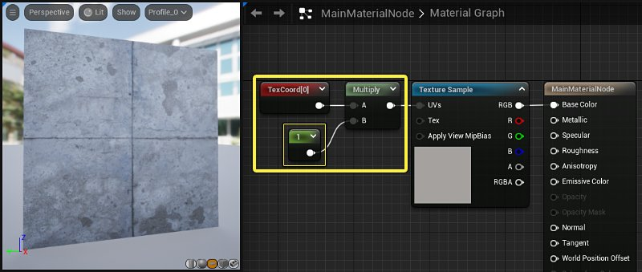
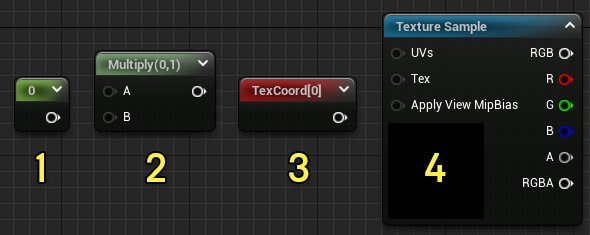
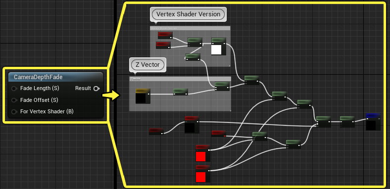
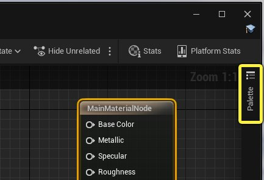
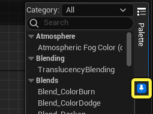
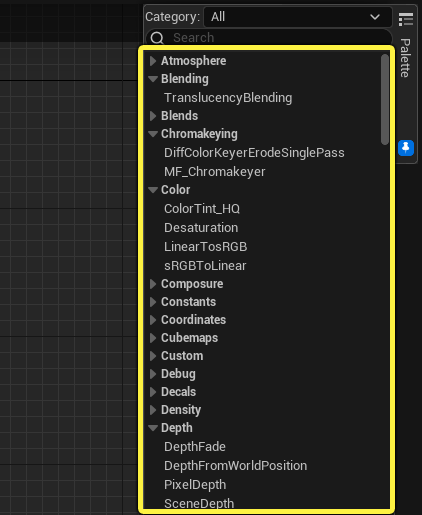
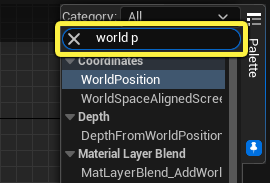
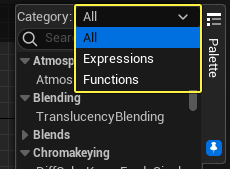

# 放置材质表达式和函数

> 路径：虚幻引擎5.7文档 / 设计视觉、渲染和图形效果 / 材质 / 材质编辑器指南 / 放置材质表达式和函数

> 原始页面：https://dev.epicgames.com/documentation/unreal-engine/placing-material-expressions-and-functions-in-unreal-engine

**材质表达式（Material Expressions）** 和 **材质函数（Material Functions）** 是在虚幻引擎中创建功能齐全材质的基本单位。每个表达式或函数都是材质图表中完全独立的节点。 这些节点对其输入运行HLSL代码的小片段，并输出结果。

此页面演示了将材质表达式和函数插入到材质图表中的各种方法。

## 材质表达式

每个 **材质表达式（Material Expressions）** 节点包含用于在材质中执行特殊具体任务的一小组HLSL指令。 材质通过组合表达式和函数来构建，以实现所需的视觉效果。

例如，如果你想更改网格体上纹理的比例，可以使用 **乘（Multiply）** 节点。 通过将 **常量（Constant）** 值乘以材质的 **纹理坐标（Texture Coordinates）** ，你可以操控纹理的比例。

乘法值从1更改为3时，纹理会在整个表面中平铺3次而不是1次。

这是一个简单而又用途广泛的 **材质逻辑** 片段。 当类似这样的小节点网络组合起来时，你最终可以创建非常复杂的表面效果。

## 表达式和函数之间的差异

材质表达式和函数之间的主要差异是，材质表达式直接在引擎的源代码中创建，而材质函数作为可编辑资产存在于内容浏览器中。

#### 材质表达式

材质表达式是只能执行程序规定操作的静态代码片段。**乘（Multiply）** 节点按程序规定将两个值乘起来。你可以改变其用途的唯一方式是在源代码中进行更改。 之前的示例中有四个材质表达式：

1. 常量（Constant）

   - 保存单个数字（浮点）值。
2. 乘（Multiply）

   - 将输入A和输入B相乘并输出结果。
3. 纹理坐标（Texture Coordinates）

   - 以两通道矢量值的形式输出材质的UV纹理坐标。
4. 纹理取样（Texture Sample）

   - 引用图像纹理并输出纹理的颜色值。

#### 材质函数

材质函数更加动态，因为你可以将其配置为执行所需任意类型的计算。你可以[创建和编辑材质函数](../../material-functions/creating-and-using-material-functions/index.md)，而无需更改源代码。

如果你双击"材质函数"节点，将打开 **材质函数编辑器（Material Function Editor）**。 在材质函数内，你将找到由材质表达式组成的完全独立的节点图表。

CameraDepthFade 材质函数包含图片右侧的材质图表。

使用材质函数，可以将复杂的材质逻辑压缩为可在多个材质中使用的单个易于阅读的节点。 函数非常适合用于打包重复性的材质图表，使其可以由其他团队成员共享和重复使用。

## 放入材质表达式

将材质表达式插入到材质图表中的方法有四种。

1. 从控制板拖放
2. 右键点击情境菜单
3. 拖动输入或输出引脚
4. 键盘快捷方式

### 从控制板拖放

控制板是材质编辑器窗口右侧的可折叠侧边栏面板。 点击 **控制板** 以展开面板（如果不可见）。

要使控制板随时保持可见，请点击 **固定图标**。

再次点击固定图标以将控制板取消固定。 取消固定后，控制板会在每个操作之后折叠。

#### 搜索控制板

控制板包含UE5中可用的所有材质表达式和材质函数的列表。 这些会根据其通用用途进行分类。

你可以通过在搜索栏中键入查询来搜索控制板。 搜索筛选器会在你键入内容时即时更新，并自动高亮显示最接近的匹配项。

使用 **类别菜单（Category menu）** ，你可以筛选控制板中可见的节点类型。

- 选择

  表达式（Expressions）

  以仅在控制板中显示材质表达式。
- 选择

  函数（Functions）

  以仅显示材质函数并隐藏表达式。
- 所有

  材质表达式和函数都默认可见。

#### 从控制板插入表达式和函数

你可以将材质表达式或函数从控制板直接拖入材质图表。

1. **左键点击** 控制板中材质表达式的名称，在按住 **鼠标左键** 的同时将其拖入材质图表中。

   > 图片已省略：拖放表达式
2. **释放鼠标左键**，材质表达式将在指针处插入。

   > 图片已省略：图表中的节点

### 右键点击情境菜单

你还可以从 **右键点击菜单** 将材质节点添加到图表中。与控制板一样，右键点击菜单包含所有材质表达式和函数的分类列表。 右键点击菜单有一个搜索栏，但没有提供筛选掉表达式或函数的方法。

1. **右键点击** 材质图表的背景中的任意位置。

   > 图片已省略：拖放表达式
2. 浏览类别，或将查询键入搜索栏，以查找表达式或函数。
3. **左键点击** 材质表达式或函数的名称，以将其放入图表中。

   > 图片已省略：混合覆层函数

> [!TIP]
> 你还可以按 **Enter** 键以插入当前以蓝色高亮显示的材质表达式。 使用向上和向下箭头从列表中选择，或优化你的搜索项。

### 从输入或输出引脚拖动

第二种显示菜单的方式是从图表中已有节点的输入或输出引脚上 **左键点击** 并拖出一根引线。在图表中任意一处释放鼠标左键，菜单便会显示出来。使用搜索栏或者直接浏览各个种类来找到并放入一个节点。使用该方法的优点是材质表达式或者函数在节点放置时就已经正确连接，节省了一个步骤。

### 键盘快捷方式

有几个键盘快捷方式可用于快速插入常用的材质表达式。要插入材质表达式，请 **按住键盘快捷方式** 并 **左键点击** 材质图表中的任意位置。

下表显示了默认的材质表达式键盘快捷方式。

| 键盘快捷方式键 | 材质表达式 |
| --- | --- |
| A | 添加材质表达式 |
| B | 凹凸贴图偏移材质表达式 |
| 1 | 常量材质表达式 |
| 2 | Constant2Vector材质表达式 |
| 3 | Constant3Vector材质表达式 |
| 4 | Constant4Vector材质表达式 |
| D | 分割材质表达式 |
| I | If材质表达式 |
| L | 线性内插材质表达式 |
| F | 材质函数材质表达式 |
| M | 乘表达式 |
| N | 规范化表达式 |
| O | 一减表达式 |
| P | 平移器表达式 |
| E | 幂表达式 |
| R | 反射矢量WS表达式 |
| S | 标量参数表达式 |
| S | 纹理取样表达式 |
| U | 纹理坐标表达式 |
| V | 矢量参数表达式 |

你可以通过转到 **编辑（Edit）> 编辑器偏好设置（Editor Preferences）> 键盘快捷方式（Keyboard Shortcuts ）> 材质编辑器生成节点（Material Editor Spawn Nodes）** 来更改材质表达式键盘快捷方式。

## 放入材质函数

在大多数情况下，你将使用上述方法来将材质函数放入图表中。 **控制板** 和 **右键点击菜单** 的工作方式对材质函数和表达式是一样的。

还有一种额外方法可将材质函数放入图表中。

### 从内容浏览器放入材质函数

材质函数特有的一点就是，你还可以从 **内容浏览器（Content Browser）** 将其拖放到材质中。

在内容浏览器中找到你想使用的材质函数，然后 **左键点击并拖动** 该资产到材质图表中。你还可以从材质编辑器底部的 **内容侧滑菜单（Content Drawer）** 或从UE5编辑器主窗口访问内容浏览器。

要查找内容浏览器中的材质函数，你需要在 **引擎（Engine）** 文件夹中查找，该文件夹默认不可见。

要显示 **引擎（Engine）** 文件夹，请点击内容浏览器右侧的 **设置（Settings）** 图标，然后选中 **显示引擎内容（Show Engine Content）**。

> 图片已省略：显示引擎内容

材质函数位于内容浏览器中的路径 **所有（All）> 引擎（Engine）> 内容（Content）> 函数（Functions）** 。

> 图片已省略：包含的材质函数

## 连接材质节点

执行以下步骤来连接材质图表中的任意两个节点。

1. 左键点击并从第一个节点的输入或者输出引脚拖出引线。

   > 图片已省略：连接材质表达式
2. 在第二个节点的引脚上释放鼠标左键。

要删除连接，按住 **Alt** 键并点击节点之间的引线。也可以左键点击引线然后按下 **Delete** 键。

你还可以将已有的引线从一个引脚移动至引脚。**Ctrl + 点击** 要移动的连线并将其拖至其它输入或输出引脚。

## 结论

材质表达式和函数是UE5材质的主要构建块。 引擎包含上百种材质节点，每个节点设计为保存特定类型的数据或执行一组HLSL指令。你很可能会发现自己非常频繁地使用某一小部分节点。例如，带有[上述键盘快捷方式](#%E9%94%AE%E7%9B%98%E5%BF%AB%E6%8D%B7%E6%96%B9%E5%BC%8F)的所有材质表达式对于UE5中的材质创建都至关重要。

材质表达式和函数通常有概括其用途的工具提示，大部分都在材质参考页面上记录。

- 材质表达式参考
- 材质函数参考

由于材质表达式通常是纯HLSL代码，因此你还可以阅读官方[Microsoft HLSL文档](https://docs.microsoft.com/en-us/windows/win32/direct3dhlsl/dx-graphics-hlsl)，了解技术背景信息。

### 延伸阅读阅读

- 使用主材质节点
- 预览和应用材质
