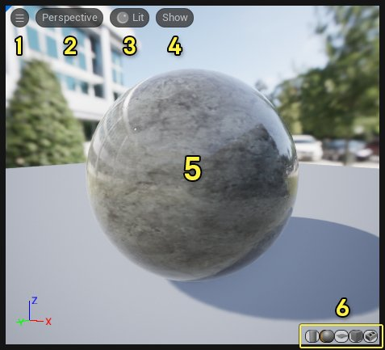
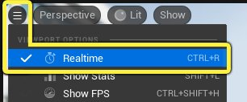
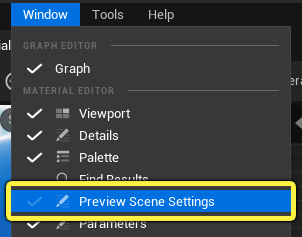
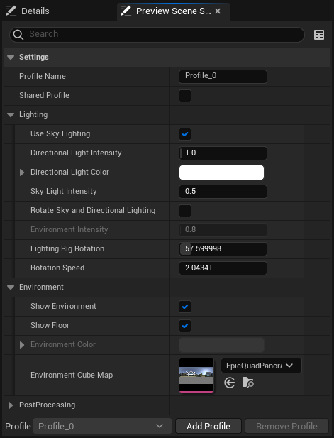
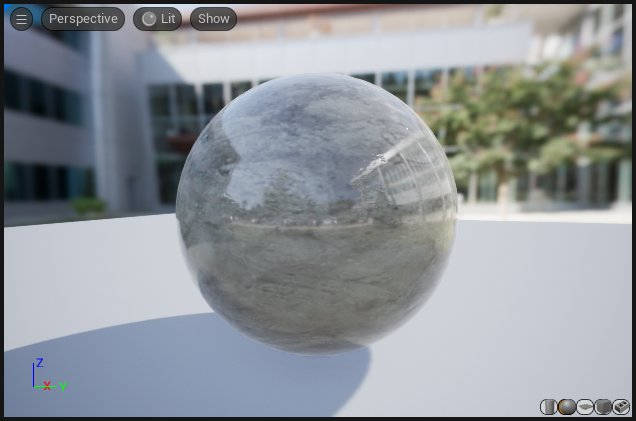
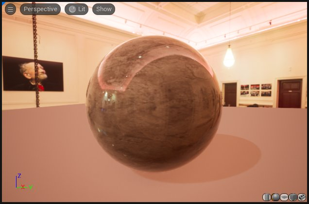
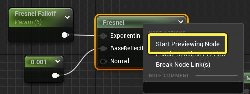
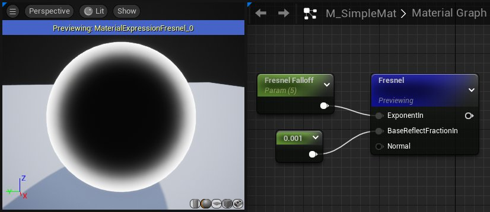

# 预览和应用材质

> 路径：虚幻引擎5.7文档 / 设计视觉、渲染和图形效果 / 材质 / 材质编辑器指南 / 预览和应用材质

> 原始页面：https://dev.epicgames.com/documentation/unreal-engine/previewing-and-applying-your-materials-in-unreal-engine

在材质创建流程中，预览和应用材质很重要，因为它允许你查看材质图表改动后的结果。只有经常预览和应用材质，你才能获得准确的材质效果。本指南将介绍如何在材质编辑器中预览你的材质，然后演示如何将材质添加到虚幻引擎的网格体中。

## 预览和应用材质

预览材质的最简单方法是使用材质编辑器的 **视口** 窗口。视口提供了许多选项来调整材质的预览效果。下图详细介绍了视口的构成部分。

| 编号 | 属性 | 描述 |
| --- | --- | --- |
| 1 | 视口选项 | 包含一个可以开启实时预览效果的开关。还包含视口统计数据、布局选项、以及FOV设置。 |
| 2 | 视口类型 | 在透视和正交模式中切换。 |
| 3 | 视图模式 | 从不同视图模式中选择并更改曝光设置。 |
| 4 | 视口显示标志 | 显示或隐藏背景、网格和视口统计数据。 |
| 5 | 预览网格体 | 这是一个预览网格体，你可以用它来查看材质在不同物体上的效果。 |
| 6 | 预览网格体选项 | 在五个不同的预览网格体中选择：圆柱体、球体、平面、立方体或自定义网格体。 |

> [!TIP]
> 在材质编辑器中，如果你忘记了属性的功能，可以将鼠标光标悬停在图标上，这样就能看到有关各属性的简短功能说明。

在材质编辑器中创建材质时，如果启用了 **实时功能**，那么视口会实时更新，以显示你的更改。实时功能默认启用，你可以在 **视口选项** 菜单中开关此选项。

试着调整[主材质节点](../using-the-main-material-node/index.md)相关的材质表达式的数值，观察视口中的变化。

> [!NOTE]
> 对材质网络进行任何更改后，可能要经过一小段时间才能正确渲染这些更改。材质越复杂，更新预览窗口就需要越多的时间。如果你觉得确实需要加快更新速度，那么应考虑将材质转换为[材质实例](../../instanced-materials/index.md)。

### 预览场景设置

**预览场景设置** 面板使你能够在各种不同环境和光照条件下快速预览材质。这能使你更好地了解材质在条件变化时将如何和光线互动。

在菜单栏中点击 **窗口>预览场景设置**，启用该面板。

**预览场景设置** 位于材质编辑器左下角，细节选项卡旁边。

预览场景设置包含用于改变视口光照的颜色、方向和强度选项。你还可以改变背景，添加基本的后期处理效果。

这让你能在截然不同的光照条件下查看材质，而无需改变关卡中的内容。

默认视口设置

修改后的预览场景设置

### 在材质图表中预览某个特定节点

有时，你可能希望查看材质图中特定节点的效果。例如，如果你创建了一个使用[菲涅尔材质表达式](../../unreal-engine-materials-tutorials/using-fresnel-in-your-unreal-engine-materials/index.md)的材质，你可能想预览这个节点，以便微调菲涅尔效果的衰减程度。

**右键单击** 材质表达式，在菜单中选择 **开始预览节点**，在视口中预览该节点。

菲涅尔节点会变成蓝色，表示它当前正在被预览。在预览视窗中，你可以清楚地看到菲涅尔效果的轮廓，并且不会受到其他效果（如纹理或反射）的视觉干扰。

要停止预览节点，**右键单击** 它并选择 **停止预览节点**。

> 图片已省略：Stop previewing Material node

### 在自定义网格体上预览材质

材质编辑器视口提供了四种内置的预览网格选项：圆柱体、球体、平面和立方体。你也可以用自定义网格体预览材质。

1. 在内容浏览器中选择一个 **静态网格体**。

   > 图片已省略：Select Static Mesh
2. 点击材质编辑器视口右下角的茶壶图标，用选定的静态网格体作为预览对象。

   > 图片已省略：Custom Material Editor preview mesh

## 如何应用你的材质

### 编译和保存

修改材质网络后，材质编辑器的视口预览效果会不断更新。不过，在将材质应用到物体上并在关卡中查看前，你需要 **编译** 材质。要编译材质，请点击材质编辑器工具栏左边的 **应用** 或 **保存** 按钮。

> 图片已省略：Material Editor Toolbar

这会更新材质，使之包含你刚才预览的改动效果。然后你可以把它添加到一个网格体上，并在关卡中查看效果。

在虚幻引擎中，有两种主要方法将材质添加到物体上：

### 拖放

在 **内容浏览器** 中选择一个材质，然后将其直接拖到关卡对象上。

1. 左键单击材质，在内容浏览器中将其拖到一个物体上。鼠标移到在一个对象上后释放鼠标左键，应用材质。

   > 图片已省略：Apply a material by drag-and-drop
2. 新的材质已经添加到对象上。

   > 图片已省略：New material applied to mesh

### 在细节面板中应用材质

你也可以点击 **使用内容浏览器中的选定资产（Use selected asset from Content Browser）** 按钮，在对象的 **细节** 面板中应用材质，如下所示：

1. 在内容浏览器中选择一个材质。

   > 图片已省略：Select Material in Content Browser
2. 在视口中选择一个Actor。

   > 图片已省略：Select Actor in viewport
3. 点击对象的 **细节** 面板的材质部分的 **使用内容浏览器中的选定资产（Use Selected Asset from Content Browser）** 按钮。

   > 图片已省略：Use Selected Asset from Content Browser
4. 新材质会被应用到该对象上。

   > 图片已省略：New Material on mesh

## 预览关卡中的材质参数

> [!WARNING]
> 下面的功能需要你使用Scalar或Vector参数，这些参数可以动态更新而不需要重新编译材质。阅读关于[材质实例](../../instanced-materials/index.md)的文档来了解参数化。

你可以在材质编辑器中调整材质的 **标量** 或 **矢量** 参数，然后立即在所有 3D 视口中看到结果。

这对于用于实现图层的[材质函数](../../material-functions/unreal-engine-material-functions-overview/index.md)特别有用，因为你可以即时查看针对场景中所有使用该函数的材质调整图层的结果，而不必等待材质重新编译。

要在关卡中预览参数，使用标量或矢量参数创建一个参数化材质，并将其应用于你的场景中的一个材质。

1. 首先，确保要预览的材质应用于关卡中的某个对象。
2. 在材质内部，请确保正在使用 **标量** 或 **矢量参数** 作为要更改的属性的输入。 此类预览不适用于 **常量** 材质表达式节点，你必须使用 **参数** 节点，或将你要调整的材质表达式节点转换为 **参数** 节点。 重要的是，要转换以进行预览的材质表达式输入必须具有唯一的名称，否则无法转换。
3. 要在关卡视口中实时查看发生的更改，请调整材质中标量或矢量参数的值。 然后，你所作的调整将在关卡视口中实时显示。

## 总结

如你所见，在虚幻引擎中，你可以通过许多不同方法来预览和应用材质。你可以根据工作流程，选择最合适的方法来预览和应用材质。 请记住，完成预览时，务必按 **应用（Apply）**和 **保存（Save）**按钮，否则有丢失/看不到你的工作成果的风险。注意，当你完成材质编辑后，你必须点击工具栏中的 **应用** 和 **保存** 来重新编译材质，否则可能会丢失当前内容。

> 图片已省略：Save and Apply Material
