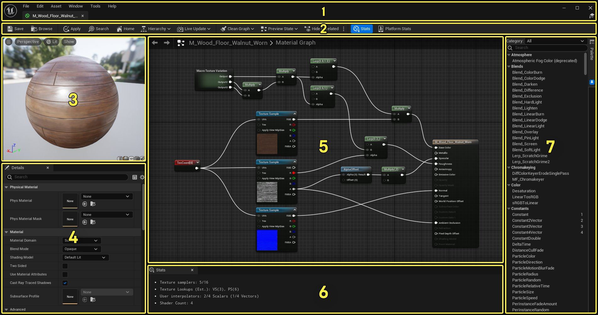
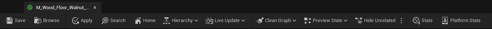
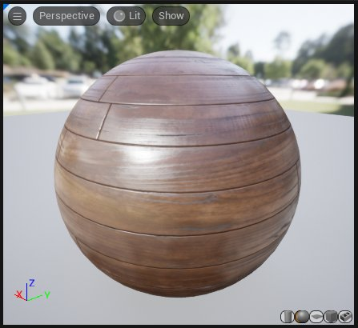
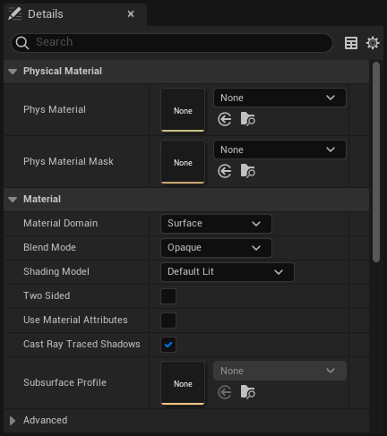
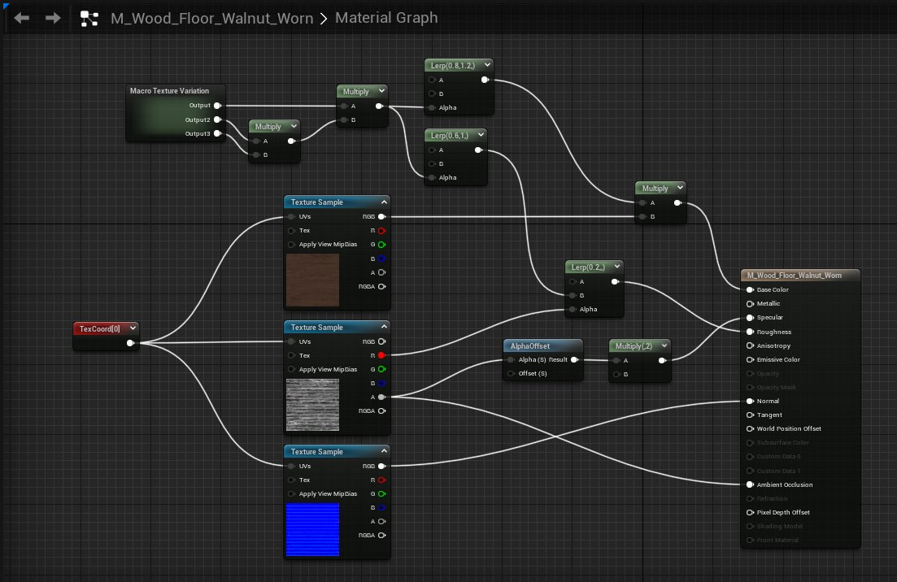
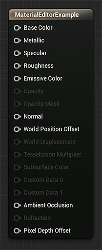
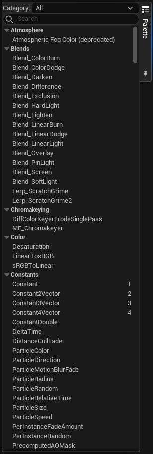

# 材质编辑器UI

> 路径：虚幻引擎5.7文档 / 设计视觉、渲染和图形效果 / 材质 / 材质编辑器指南 / 材质编辑器UI

> 原始页面：https://dev.epicgames.com/documentation/unreal-engine/unreal-engine-material-editor-ui

材质编辑器UI由菜单栏、工具栏以及下图所示的5个主要区域组成。

| **数字** | **描述** |
| --- | --- |
| 1 | 菜单栏 |
| 2 | 工具栏 |
| 3 | 视口面板 |
| 4 | 细节面板 |
| 5 | 材质图面板 |
| 6 | 统计信息面板 |
| 7 | 控制板面板 |

> [!TIP]
> - 点击选项卡右上角的小"X"即可关闭面板。在选项卡上点击右键也能隐藏面板，然后在出现的快捷菜单上点击
>
>   隐藏选项卡
>
>   。在
>
>   窗口
>
>   菜单中点击面板名即可再次显示已关闭的面板。
> - 按下
>
>   F1
>
>   键将显示虚幻引擎材质文档。

## 菜单栏

### 文件

- 打开资产

  - 打开全局资产选取器，以便迅速找到资产并打开正确的编辑器。
- 保存所有

  - 保存项目所有未保存的关卡的资产。
- 选择文件进行保存

  - 呼出一个对话框，以选择要为项目保存的关卡和资产。
- 保存（Save）

  - 保存当前使用的资产。
- 另存为（Save As）

  - 使用另一个名称保存该资产。

### 编辑

- 撤销

  - 撤销最近的操作。
- 重新执行

  - 如上次执行的操作为撤销，此选项将重新执行最近的撤销。
- 撤销历史

  - 显示撤销操作的历史。
- 编辑器偏好

  - 提供一个选项列表，其中选项将打开对应的

  编辑器偏好

  窗口，使用者可在其中修改虚幻编辑器偏好。
- 项目设置

  - 提供一个选项列表，其中选项将打开对应的

  项目设置

  窗口，使用者可在其中修改虚幻引擎项目的诸多设置。
- 插件

  - 打开插件浏览器选项卡。

### 资产

- 在内容浏览器中找到

  - 在

  内容浏览器

  中找到并选择当前资产。
- 引用查看器

  - 启动引用查看器，显示选中资产的引用。
- 大小图

  - 显示一个交互图，展示此资产与其引用所有内容的大概大小。
- 审计资产

  - 打开资产音频UI，显示关于选中资产的信息。
- 着色器编译统计数据（Shader Cook Statistics）

  - 打开着色器编译统计数据界面。

### 窗口

- 图表

  - 切换

  图表

  面板显示。
- 视口

  - 切换

  视口

  面板显示。
- 细节

  - 切换

  细节

  面板显示。
- 控制板

  - 切换

  控制板

  面板显示。
- 查找结果

  - 允许在材质图表中搜索项目。
- 预览场景设置

  - 打开一个可以更改

  材质预览

  视口选项的选项卡。
- 参数

  - 切换显示

  材质（Materials）

  全局参数。
- 自定义图元数据（Custom Primitive Data）

  - 打开一个显示当前材质所有参数的选项卡（启用了自定义图元数据）。
- 图层参数（Layer Parameters）

  - 显示当前材质中的所有材质图层。
- 平台统计数据（Platform Stats）

  - 切换显示各个平台的

  材质（Material）

  开销。
- 统计数据

  - 切换

  材质

  开销。
- 着色器代码

  - 切换显示所选平台的

  材质

  HLSL

  代码。

  - HLSL代码

    - 切换显示

    HLSL

    代码。

    - 桌面

      - 切换显示诸多桌面渲染的

      HLSL

      代码。

      - DirectX SM5

        - 切换显示

        Windows SM5

        的

        HLSL

        代码。
      - DirectX SM6

        - 切换显示

        Windows SM6

        的

        HLSL

        代码。
      - DirectX ES 3.1

        - 切换显示

        ES 3.1

        的

        HLSL

        代码。
      - Vulkan SM5

        - 切换显示

        Vulkan SM5

        的

        HLSL

        代码。
      - Metal SM5

        - 切换显示

        Metal SM5

        的

        HLSL

        代码。
      - OpenGL SM4

        - 切换显示

        OpenGL SM4

        的

        HLSL

        代码。
    - Android

      - 切换显示诸多

      Android

      渲染的

      HLSL

      代码。

      - Android GLES 3.1

        - 切换显示

        Android GLES 3.1

        的

        HLSL

        代码。
      - Android Vulkan

        - 切换显示

        Android

        Vulkan

        的

        HLSL

        代码。
      - Android Vulkan SM5

        - 切换显示

        Android Vulkan SM5

        的

        HLSL

        代码。
    - iOS

      - 切换显示诸多

      iOS

      渲染的

      HLSL

      代码。

      - Metal SM5

        - 切换显示

        Metal SM5

        的

        HLSL

        代码。
      - Metal MRT

        - 切换显示

        Metal MRT

        的

        HLSL

        代码。
- 过场动画（Cinematics）

  - 在新窗口中打开Cinematics Sequence Recorder、Takes Recorder 或者 Takes Browser。
- 内容浏览器

  - 在单独的窗口中呼出

  内容浏览器

  。
- 虚拟制片

  - 打开Live Link流送管理器选项卡。
- 重设布局

  - 将布局重设为默认。保存变更并创建设置备份后需要重新启动编辑器。
- 保存布局

  - 将面板的当前布局保存为新默认布局。
- 移除布局

  - 移除当前布局。
- 启用全屏

  - 启用应用程序的全屏模式，延展到整个显示器。

### 工具

- 新建C++类（New C++ Class）

  - 在项目中添加C++代码。此代码只能通过Visual Studio编译。
- 生成Visual Studio项目（Generate Visual Studio Project）

  - 在Visual Studio中生成你的C++代码。
- 在蓝图中搜索（Find in Blueprints）

  - 在全部蓝图中搜索函数引用、事件和变量。
- 缓存统计数据（Cache Statistics）

  - 显示关于派生数据缓存的统计数据。
- 类查看器（Class Viewer）

  - 显示项目中的所有类。
- CSV 转换为 SVG

  - 打开一个可以将CSV配置文件中的逗号分割数值生成为矢量图的工具。
- 本地化仪表板（Localization Dashboard）

  - 打开项目的本地化仪表板。
- 合并Actor（Merge Actors）

  - 打开"合并Actor"对话框。
- 项目启动程序（Project Launcher）

  - 打开项目启动程序选项卡。
- 资源使用（Resource Usage）

  - 显示派生数据的资源使用详情。
- 会话前端（Session Frontend）

  - 打开会话前端选项卡。
- 结构体查看器（Struct Viewer）

  - 显示项目中的所有结构。
- 虚拟资产（Virtual Assets）

  - 显示项目中任意虚拟资产的统计数据。
- 调试（Debug）

  - 用于蓝图、碰撞、Niagara及其他功能的调试工具。
- 分析（Profile）

  - 打开分析数据可视化器（Profile Data Visualizer）或者追踪数据过滤器（Trace Data Filtering）选项卡。
- 审计（Audit）

  - 打开资产审计窗口或材质分析器（Material Analyzer）。
- 平台（Platforms）

  - 打开设备管理器或设备分析UI。
- 源码控制（Source Control）

  - 连接到源码控制软件，查看变更列表或提交内容。
- 运行Unreal Insights（Run Unreal Insights）

  - 运行Unreal Insights独立程序。

### 帮助

- 浏览材质编辑器文档

  - 打开一个浏览器窗口并导航到此工具相关的文档。
- 文档主页（Documentation Home）

  - 打开浏览器窗口，导航至文档主页面。
- 在线学习（Online Learning）

  - 打开一个浏览器窗口并导航至

  虚幻在线学习

  主页。
- 论坛

  - 前往虚幻引擎论坛查看公告，并与其他开发者展开讨论。
- 答疑中心

  - 前往答疑中心提出问题、搜索已有答案，并和其他虚幻引擎开发者分享知识。
- 支持

  - 打开浏览器窗口访问Epic专业支持论坛页面，你可在此处询问关于虚幻引擎的问题。
- 报告错误（Report a Bug）

  - 打开一个浏览器窗口并导航至虚幻引擎错误提交表格。
- 问题跟踪器（Issue Tracker）

  - 打开一个浏览器窗口并导航至虚幻引擎的错误和修复查询数据库。
- 关于虚幻编辑器

  - 显示应用程序的制作人员列表、版权信息和版本信息。
- 制作人员列表

  - 显示应用程序的制作人员列表。
- 访问UnrealEngine.com

  - 导航到UnrealEngine.com，了解更多虚幻引擎技术。

## 工具栏

下表列出了工具栏中的选项以及它们的功能。

| **图标** | **描述** |
| --- | --- |
| Save icon | 保存当前资产。 |
| Browse icon | 在内容浏览器中寻找并选择当前资产。 |
| Apply Icon | 将在材质编辑器中进行的修改应用到原始材质，以及场景中应用此材质之处。 |
| 搜索图标 | 在当前材质中找到表达式和注释。 |
| Home Icon | 对齐到 **材质图表** 面板中的[主材质节点](../using-the-main-material-node/index.md)。 |
| Hierarchy icon | 显示所有从当前材质派生出的材质实例。 |
| Live Update options | 切换材质编辑器UI中需要实时更新的元素。 |
| Clean Graph icon | 删除所有未连接到主材质的材质节点。 |
| Preview State toggle | 预览指定性能级别、材质品质或静态开关值的图形状态。 |
| Hide unrelated nodes | 隐藏所有与当前选中节点无关的节点。 |
| Material stats toggle | 在 **图表** 面板中显示或隐藏材质统计数据。 |
| Platform Stats toggle | 切换窗口显示多个平台的材质统计数据和编译错误。 |

## 视口面板

**视口** 面板显示当前编辑的材质。

可使用下表中的选项在 **视口** 面板中导航。

| 操作 | 描述 |
| --- | --- |
| 鼠标左键拖动 | 旋转网格体 |
| 鼠标中键拖动 | 平移 |
| 鼠标右键拖动 | 缩放 |
| 长按 **L** 并按住鼠标左键拖动 | 旋转光源方向 |

你可以使用相关的工具栏控制选项（视口右下角的5个图形按钮）来更改视口预览网格体。如需使用自定义预览网格体，请在内容浏览器中选中一个 **静态网格体Actor**，然后点击视口中的 **砖块** 图标。视口网格体将随材质保存，因此材质下次在材质编辑器中打开时，会显示同一个网格体。

下表详细介绍了材质编辑器视口中的可用选项：

| **图标** | **描述** |
| --- | --- |
| Preview meshes | 在 **预览** 面板中相应的图元形状上显示当前材质的效果。 |
| Viewport options | 切换材质的 **视口选项**。 |
| Viewport type | 修改使用的 **视口** 类型。 |
| Viewport lighting | 修改 **视口** 使用的光源类型。 |
| Viewport show options | 启用材质视口的额外选项。 |

## 细节面板

此面板包含一个属性窗口，会显示所有当前选中的材质表达式和函数节点。如未选择节点，将显示正在编辑的材质的基本属性。

参见[材质属性](../../unreal-engine-material-properties/index.md)，了解所有材质属性的描述。

## 材质图表面板

在这个图表面板中，你可以看到此材质相关的所有材质表达式。每个材质默认包含一个基础材质节点。此节点拥有一系列输入，每个皆与材质的不同方面相关（其他材质节点可进行连接）。

参见[材质输入](../../material-inputs/index.md)，了解基础材质节点诸多输入的描述。

## 控制板面板

**控制板** 面板以分类形式显示所有材质节点，你可以直接将它们拖入材质。将新材质节点拖入 **材质图表** 面板，即可放置一个新的材质节点。

控制板默认隐藏。点击材质编辑器右上角的 **控制板（Palette）** 选项卡来显示控制板。点击 **固定** 图标将它保留显示。

> 图片已省略：Open Material Palette

> [!TIP]
> 可在 **类目（Category）** 下拉列表中选择 **表达式（Expressions）** 或 **函数（Functions）**，对 **控制板** 面板中列出的材质节点进行过滤。

欲知材质函数的更多信息，请参阅[材质函数](../../material-functions/unreal-engine-material-functions-overview/index.md)。

## 统计数据面板

> 图片已省略：Stats panel

材质使用的着色器指令数量以及编译器错误等信息都会显示在面板中。指令数量越少，材质的开销越低。未连接到基础材质节点的材质表达式节点不会记入材质的指定数（开销）。

### HLSL代码面板

> 图片已省略：HLSL Code panel

此面板显示了由当前材质生成的 **高级着色器语言（High Level Shader Language）** （HLSL）代码。注意这并非编辑器；使用者无法修改HLSL代码。这只是一个查看器，允许使用者显示由材质网络定义的代码。

> [!NOTE]
> **代码视图** 面板默认不可见。在 **窗口** 菜单上点击 **HLSL代码（HLSL Code）** 即可显示 **代码视图** 面板。

### 平台统计数据

点击 **平台统计数据** 图标即可查看你的材质在诸多平台上的开销。

> 图片已省略：Platform Stats

点击 **设置** 选项，然后选择需要查看数据的渲染，即可查看虚幻引擎支持的每个渲染API的统计数据。

如需查看 **Android** 的统计数据，首先需要执行以下步骤来安装 **Mali离线编译器**：

1. 下载并安装[Mali离线编译器](https://developer.arm.com/products/software-development-tools/graphics-development-tools/mali-offline-compiler/downloads)。
2. 下载并安装Mali离线编译器后，点击菜单栏中的 **编辑** \> **编辑器偏好设置**。
3. 在 **内容编辑器（Content Editors）** 下选择 **材质编辑器（Material Editor）**

   > 图片已省略：Material Editor preferences
4. 点击 **Mali离线编译器** 选项右边的 **3个点**，然后找到Mali离线编译器安装时安装的 **malisc.exe** 文件。下图显示的是默认文件路径。
5. 上述步骤完成后，你便能看到虚幻引擎支持的诸多Android渲染器的统计数据。

> [!NOTE]
> 不借助离线编译器将无法看到Android平台数据。

## 图表功能键

材质编辑器中的功能键通常与虚幻编辑器中其他工具的功能键相类似。例如，你能像操控其他基于节点的编辑器一样（比如蓝图），在材质表达式中导航。你可以像其他网格体工具那样，旋转材质预览网格体。

### 鼠标功能键

| **功能键** | **操作** |
| --- | --- |
| **在背景上拖动鼠标右键** | 平移材质表达式图表 |
| **在背景上拖动鼠标左键** | 框选 |
| **旋转鼠标滚轮** | 放大缩小 |
| **同时按下鼠标左键和右键并拖动** | 放大缩小 |
| **鼠标左键点击对象** | 选择表达式/注释 |
| **在对象上按下Ctrl+鼠标左键** | 切换选择表达式/注释 |
| **点击鼠标左键并拖动** | 移动当前选中项/注释 |
| **Ctrl+鼠标左键点击对象** | 切换表达式/注释的选中状态 |
| **在连接器上按下鼠标左键并拖动** | 创建连接（在连接器上松开） |
| **从连接处按下Ctrl+拖动鼠标左键** | 移动连接（在同类连接器上松开） |
| **Shift+在连接器上点击鼠标左键** | 标记连接器。在一个已标记的连接器上再次进行操作将在两个连接器之间创建连接。这是一种快速建立长距离连接的方法。 |
| **在背景上按下鼠标右键** | 呼出 **新建表达式（New Expression）** 菜单 |
| **在对象上按下鼠标右键** | 呼出 **对象（Object）** 菜单 |
| **在连接器上按下鼠标右键** | 呼出 **对象（Object）** 菜单 |
| **在连接器上按下Alt+鼠标左键** | 断开到连接器的所有连接 |
| **Ctrl + 鼠标左键按下连接器** | 沿着连接器添加一个新的节点 |

### 键盘功能键

| **功能键** | **操作** |
| --- | --- |
| **Ctrl + B** | 在内容浏览器中查找 |
| **Ctrl + C** | 复制选中的表达式 |
| **Ctrl + S** | 保存材质 |
| **Ctrl + V** | 粘贴 |
| **Ctrl + D** | 复制选中对象 |
| **Ctrl + Y** | 重做 |
| **Ctrl + Z** | 撤销 |
| **Delete** | 删除选中的对象 |
| **空格键** | 强制更新所有材质表达式预览 |
| **回车** | （和点击应用相同） |

### 热键

可以使用热键来放置常用的材质表达式类型。按住热键并 **点击左键** 放置到节点中。热键如下：

| **热键** | **表达式** |
| --- | --- |
| **A** | Add |
| **B** | BumpOffset |
| **C** | Comment |
| **D** | Divide |
| **E** | Power |
| **F** | MaterialFunctionCall |
| **I** | If |
| **L** | LinearInterpolate |
| **M** | Multiply |
| **N** | Normalize |
| **O** | OneMinus |
| **P** | Panner |
| **R** | ReflectionVector |
| **S** | ScalarParameter |
| **T** | TextureSample |
| **U** | TexCoord |
| **V** | VectorParameter |
| **1** | Constant |
| **2** | Constant2Vector |
| **3** | Constant3Vector |
| **4** | Constant4Vector |
| **Shift + C** | ComponentMask |
