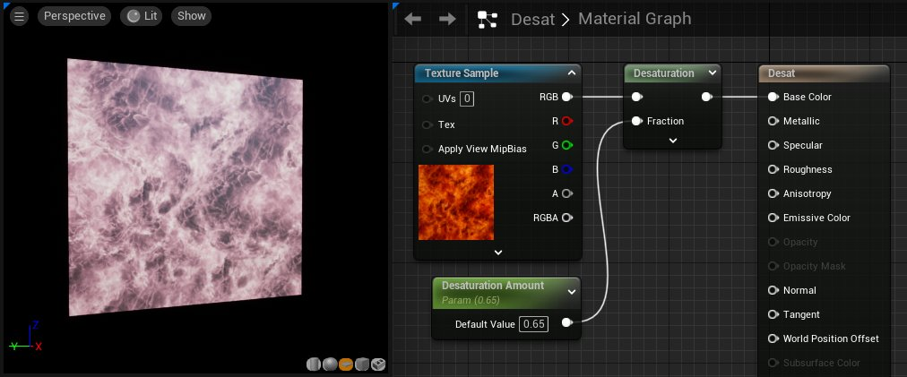

# 颜色材质表达式

> 路径：虚幻引擎5.7文档 / 设计视觉、渲染和图形效果 / 材质 / 材质表达式参考 / 颜色材质表达式

> 原始页面：https://dev.epicgames.com/documentation/unreal-engine/color-material-expressions-in-unreal-engine

## 去饱和度

**去饱和度（Desaturation）** 表达式对其输入进行去饱和，即根据特定百分比将其输入的颜色转换为灰色阴影。

| 项目 | 说明 |
| --- | --- |
| 属性 |  |
| **亮度系数（Luminance Factors）** | 指定每个通道对去饱和颜色的影响量。此属性用于控制，在去饱和之后，绿色比红色亮，而红色比蓝色亮。 |
| 输入 |  |
| **小数（Fraction）** | 指定要应用于输入的去饱和量。此百分比的范围为0.0（完全原始颜色，不去饱和）到1.0（完全去饱和）。 |

> [!NOTE]
> **程序员需知：**定义去饱和颜色 `D`、输入颜色 `I` 和亮度系数 `L`。输出将为 `O = (1 - 百分比)*( D.dot( I )) + 百分比 * I`
