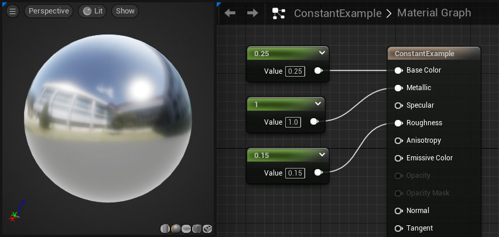
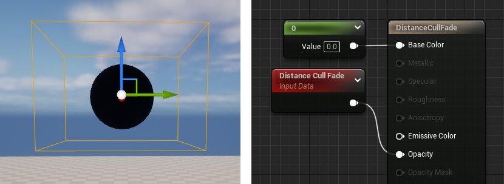
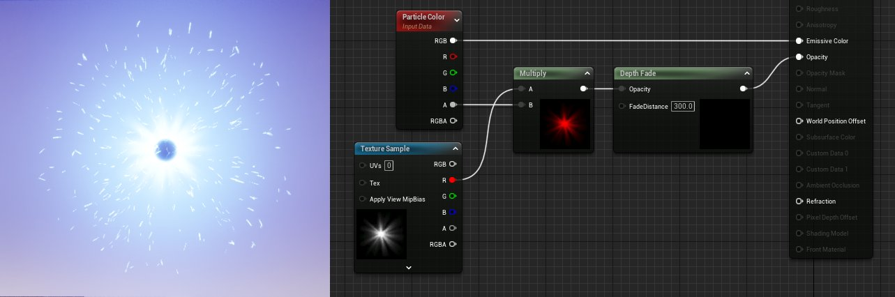
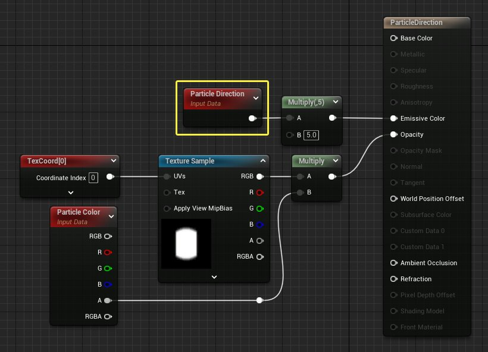
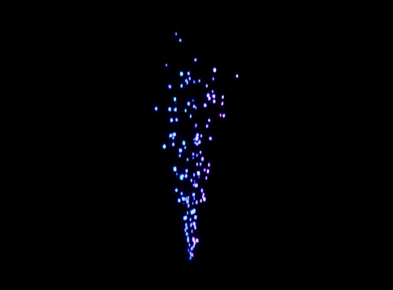

# 常量材质表达式

> 路径：虚幻引擎5.7文档 / 设计视觉、渲染和图形效果 / 材质 / 材质表达式参考 / 常量材质表达式

> 原始页面：https://dev.epicgames.com/documentation/unreal-engine/constant-material-expressions-in-unreal-engine

%Description%

## Constant

**Constant（常量）** 材质表达式输出单个浮点值。这是最常用的表达式之一，且兼容任何输入，而不必考虑该输入所需的通道数。

例如，如果你将一个常量连接到一个3通道矢量的输入，那么该常量值将被用于全部3个元素。提供单个数值时，使用说明区域中的小三角形图标来折叠节点可能非常有用。

| 属性 | 说明 |
| --- | --- |
| **R** | 指定表达式所输出的浮点值。 |

**示例：**0.7、-0.24 和 1.1

> [!TIP]
> 通过在材质编辑器的材质图表的背景中按住 **1** 键并 **单击鼠标左键**，可快速创建 Constant（常量）表达式。

## Constant2Vector

**Constant2Vector（常量 2 矢量）**表达式输出双通道矢量值，即输出两个常量数值。

| 属性 | 说明 |
| --- | --- |
| **R** | 指定表达式所输出的矢量的红色（第一个）通道的浮点值。 |
| **G** | 指定表达式所输出的矢量的绿色（第二个）通道的浮点值。 |

**示例：**(0.4, 0.6) 和 (1.05, -0.3)

**用法示例：**Constant2Vector（常量2矢量）对于修改纹理缩放或偏移非常有用，因为UV坐标需要双通道值。

> [!TIP]
> 按住 **2** 键并在材质图表背景的任意位置 **单击鼠标左键**，即可快速创建 Constant2Vector（常量2矢量）节点。

## Constant3Vector

**Constant3Vector（常量3矢量）**表达式输出三通道矢量值，即输出三个常量数值。Constant3Vector常被用于定义实心的RGB，其中每个通道都被赋予一种颜色（红色、绿色、蓝色）。你可以双击材质图表中的Constant3Vector节点，唤起取色器对话框。

| 属性 | 说明 |
| --- | --- |
| **R** | 指定表达式所输出的矢量的红色（第一个）通道的浮点值。 |
| **G** | 指定表达式所输出的矢量的绿色（第二个）通道的浮点值。 |
| **B** | 指定表达式所输出的矢量的蓝色（第三个）通道的浮点值。 |

**示例：**(0.4, 0.6, 0.0) 和 (1.05, -0.3, 0.3)

在本示例中，Constant3Vector与一个纹理样本（Texture Sample）相乘，改变了纹理的颜色。

> [!TIP]
> 按住 **3** 键并在材质图表背景的任意位置 **单击鼠标左键**，即可快速创建 Constant3Vector（常量3矢量）节点。

## Constant4Vector

**Constant4Vector（常量 4 矢量）**表达式输出四通道矢量值，即输出四个常量数值。你可以用Constant4Vector来定义RGBA颜色，其中每个通道都被赋予一种颜色（红色、绿色、蓝色、alpha）。

| 属性 | 说明 |
| --- | --- |
| **R** | 指定表达式所输出的矢量的红色（第一个）通道的浮点值。 |
| **G** | 指定表达式所输出的矢量的绿色（第二个）通道的浮点值。 |
| **B** | 指定表达式所输出的矢量的蓝色（第三个）通道的浮点值。 |
| **A** | 指定表达式所输出的矢量的alpha（第四个）通道的浮点值。 |

**示例：**(0.4, 0.6, 0.0, 1.0) 和 (1.05, -0.3, 0.3, 0.5)

在下面的示例中，使用Constant4Vector表达式定义材质的 **底色（Base Color）** 和 **不透明度（Opacity）**。最上面的引脚输出RGB颜色，最下面的引脚输出alpha通道的值。alpha值为0.5时就能形成半透明材质。

> [!TIP]
> 按住 **4** 键并在材质图表背景的任意位置 **单击鼠标左键**，即可快速创建 Constant4Vector（常量4矢量）节点。

## Distance Cull Fade

**DistanceCullFade（距离剔除消退）** 表达式输出一个从黑色逐渐消退到白色的标量值，并可用于使对象进入剔除距离后平滑地消退。此节点主要用于防止静态网格体在超出提出距离后再此示例中，突然出现和消失在视野中。

在此示例中，有一个位于 **CullDistanceVolume** 中的球体，而提出距离为3000个单位。右边的材质被应用到了球体。

在编辑器中播放关卡时，球体会随着摄像机进入和超出剔除距离而平滑地出现和消失。

## 粒子颜色

基于在 **级联（Cascade）** 中定义的任何每粒子颜色数据，**粒子颜色（ParticleColor）** 表达式绑定到给定粒子的当前颜色。这必须插入到适当的信道（自发光颜色）。

| 项目 | 说明 |
| --- | --- |
| 输出 |  |
| **RGB** | 输出组合的RGB矢量数据。 |
| **R** | 输出红色信道数据。 |
| **G** | 输出绿色信道数据。 |
| **B** | 输出蓝色信道数据。 |
| **A** | 输出alpha信道数据。 |

在这个例子中，您可以看到粒子颜色（ParticleColor）表达式为粒子提供了粒子系统中定义的颜色。

## 粒子方向

**粒子方向（ParticleDirection）** 表达式逐个粒子输出Vector3(RGB)数据，表示给定粒子当前运动的方向。

在下面的比较中可以看到粒子的颜色如何根据每个粒子的当前行进方向而变化。

**请注意颜色如何随着粒子改变方向而变化。**

## 粒子动态模糊淡出

**粒子动态模糊淡出（ParticleMotionBlurFade）** 表达式输出一个值，该值表示由于动态模糊导致的粒子上的淡出量。值为1表示无模糊，黑色代表完全模糊。

> 图片已省略：Particle Motion Blur Fade

## 粒子半径

**粒子半径（ParticleRadius）** 表达式单独输出每个粒子的半径（采用虚幻单位）。例如，一旦半径达到某个点，就可以对材质进行更改。

> 图片已省略：Particle Radius Example

在这幅图中，当粒子半径超过7个单位时，它们从绿色变成红色。

## 粒子相对时间

**粒子相对时间（ParticleRelativeTime）** 表达式输出0到1之间的数字，表示粒子的年龄，0表示出生时刻，1表示死亡时刻。

> 图片已省略：Particle Relative Time Example

在本例中，您可以看到粒子的相对时间被馈送到自发光颜色中，导致粒子从出生时的黑色逐渐变淡到死亡时的白色。

## 粒子大小

**粒子大小（Particle Size）** 表达式输出粒子sprite的X和Y大小。这可以用来驱动材质的某些方面。

> 图片已省略：Particle Size Example

> 图片已省略：undefined

*点击查看大图。*

在上面的例子中，粒子大小（Particle Size）被增加并扩展为粒子颜色（Particle Color）。注意我们屏蔽了输出，所以我们只使用绿色信道，它对应于Y轴，或者粒子的长度。这意味着随着粒子的伸展，它们的颜色会变得更亮。当它们收缩时，它们会变暗。

## 粒子速度

**粒子速度（ParticleSpeed）** 输出正在运动的每个粒子的当前速度，单位为每秒虚幻单位。

> 图片已省略：Particle Speed Graph

在本例中，粒子速度馈送粒子颜色，再除以10得到更有意义的结果。粒子减速时变黑。

## PerInstanceFadeAmount

**PerInstanceFadeAmount（按实例消退量）** 表达式输出一个0-1之间浮点值，该值与应用于实例化静态网格（如植被）的消退量相关联。它是常量，但对于网格的每个实例，可以是不同的数值。该节点常被用于植被的渐入和渐出，而不是在 **InstancedFoliageActor** 达到剔除距离时突然出现或消失在场景中。

该岩石材质使用了 **Translucent** 混合模式，并将 **PerInstanceFadeAmount** 表达式接入不透明度输入。InstancedFoliageActor上的 **剔除距离** 为1000和2500。

> 图片已省略：Rock Distance Fade

请注意到摄像机飞跃场景时，岩石示例如何随着距离弹出。这可以提升拥有大量植被的关卡的性能。

> [!NOTE]
> 仅当应用于 InstancedStaticMesh（实例化静态网格）Actor 或其他利用 InstancedStaticMeshComponent（实例化静态网格组件）的 Actor 时，此表达式才有效。

## PerInstanceRandom

**PerInstanceRandom（按实例随机）**表达式按材质所应用于的静态网格实例输出不同的随机浮点值。InstancedStaticMeshComponent（实例化静态网格组件）用于为实例设置随机浮点值，这个值将公开，以便可用于任何期望的内容（例如，窗外的随机光源强度）。它是常量，但对于网格的每个实例有所不同。

输出值将是介于0与目标平台的RAND_MAX之间的整数。此材质使用PerInstanceRandom表达式来为每个实例提供随机的自发光值。

> 图片已省略：Random Emissive value per instance

当该材质被应用到球体，并受植被系统实例化时，该球体的每个实例都有不同的自发光值。

> [!NOTE]
> 仅当应用于 InstancedStaticMesh（实例化静态网格）Actor 或其他利用 InstancedStaticMeshComponent（实例化静态网格组件）的 Actor 时，此表达式才有效。

## Time

**Time（时间）**节点用来向材质添加经理时间。它与会随时间变化的材质表达式配合使用，如[Panner（平移）](../coordinates-material-expressions/index.md#panner)、[Cosine（余弦）](../math-material-expressions/index.md#cosine) 或其他时间相关操作。

| 属性 | 说明 |
| --- | --- |
| **忽略暂停（Ignore Pause）** | 如果为 **true**，那么时间将一直推进，即使游戏暂停也是这样。 |
| **周期（Period）** | 如果为 **true**，那么这将是时间回绕前经过的时间量。针对移动材质，这将以全精度在 CPU 上执行周期计算，而在 GPU 上，将以半精度运行（处理长度超过一分钟的周期时，可能会产生问题）。 |

> 图片已省略：Time Expression

上图中说明的材质网络将创建一个随时间推移而变化的材质，从而连贯地展现白色与黑色之间的正弦曲线过渡。在启用了 **时间段** 时，将时间段设置为0会有效地停止过渡，值为1时相当于时间段为 false。设置接近于0的数值将使材质更迅速地变化。图表的结果如下方视频所示：

## TwoSidedSign

**TwoSidedSign（双面符号）**表达式适合在双面定制照明材质的背面翻转法线，以便与[冯氏着色 （Phong Shading）](https://en.wikipedia.org/wiki/Phong_shading)的作用相同。+1表示双面材质的正面，-1表示背面。

在此图表中，法线贴图与一个 **TwoSidedSign** 表达式相乘。

> 图片已省略：Two Sided Sign example graph

下方的对比图展示了材质分辨使用和不使用TwoSidedSign表达式的两面。

> 图片已省略：Two Sided Sign Comparison

1. 最上面的行

   - 没有TwoSidedSign节点，背面的法线被反转，砖块的选软不正确。高光部分位于砖块的右下角，而非左上角。
2. 最下面的行

   - 法线贴图与TwoSidedSign表达式相乘（如上面的图表所示），背面的法线正确，砖块背面渲染正确，与正面完全一致。

## VertexColor

**VertexColor（顶点颜色）** 材质表达式允许材质使用来自应用了材质的静态网格体的矢量颜色（Vertex Color）数据。

| 输出 | 说明 |
| --- | --- |
| **RGB** | 输出顶点颜色的三通道RGB矢量值。 |
| **R** | 输出网格体顶点颜色的红色通道。 |
| **G** | 输出网格体顶点颜色的绿色通道。 |
| **B** | 输出网格体顶点颜色的蓝色通道。 |
| **A** | 输出网格体顶点颜色的alpha通道。 |

在网格体绘制模式（Mesh Paint Mode）中，VertexColor节点常被用于alpha遮罩，以混合2个或更多纹理。

> 图片已省略：Vertex Color LERP Graph

此网络使用顶点颜色的红色通道在两个纹理样本间插值。在 **网格体绘制模式** 中，当你在红色通道上绘制时，碎石纹理就会显露出来。

## ViewProperty

**ViewProperty（视图属性）** 表达式输出依赖于视图的常量属性，例如视野或渲染目标大小。你可以选中该节点，并使用细节面板中下拉菜单来配置要访问哪个视图属性（View Property）。

> 图片已省略：ViewProperty Details Panel properties

输出的数据类型取决于在细节面板中选择的数据。比如，在选中 **视图大小（View Size）** 时，节点会输出一个双通道矢量来表示视口的宽度和高度，以像素为单位。下面通过将输出传递给 **DebugFloat2Values** 材质函数来演示。视口的宽度和高度显示在预览视口中。

> 图片已省略：View Property example

## PrecomputedAOMask

**PrecomputedAOMask（预先计算的 AO 蒙版）**节点用来访问材质中光照系统计算的环境光遮蔽 (AO)，这可能很适合于过程式纹理贴图，或者在老化效果及尘埃随时间推移而缓慢积累的区域加入老化效果及尘埃。

> [!NOTE]
> 预先计算的AO蒙版（Precomputed AO Mask）只对烘焙光照有效。你需要先使用Lightmass来构建关卡光照，然后才能看到预先计算的AO蒙版的结果。

> 图片已省略：Ambient Occlusion Example

以上截屏使用 AO 蒙版让尘埃层自动混合到环境的角落。 要使用 AO 蒙版，你需要同时启用 **全局设置（World Settings） -> 光照系统设置（Lightmass settings）**下的 **使用环境光遮蔽（Use Ambient Occlusion）**和 **生成环境光遮蔽材质蒙版（Generate Ambient Occlusion Material Mask）**，然后建立照明。 **最大遮蔽距离（Max Occlusion Distance）**等其他AO控制对于调整AO外观来说可能非常有用。 并且，请确保将 **直接遮蔽小数（Direct Occlusion Fraction）**和 **间接遮蔽小数（Indirect Occlusion Fraction）**都设置为 **0**，以使此AO不会应用于实际关卡照明。

> 图片已省略：Ambient Occlusion Lightmass World Settings

你可使用 **PrecomputedAOMask（预先计算的 AO 蒙版）**材质表达式节点来访问任何材质中的 AO。 PrecomputedAOMask（预先计算的 AO 蒙版）作为0到1蒙版工作，其中1表示受AO影响的区域，而0表示不受影响的区域。

在下图中，你可以了解如何设置材质以利用PrecomputedAOMask（预先计算的AO蒙版）。

> 图片已省略：undefined

Click image to enlarge.
