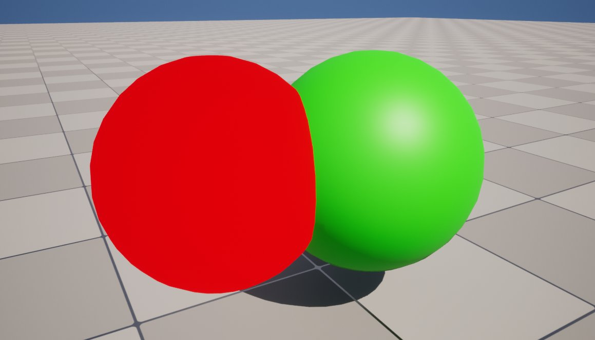
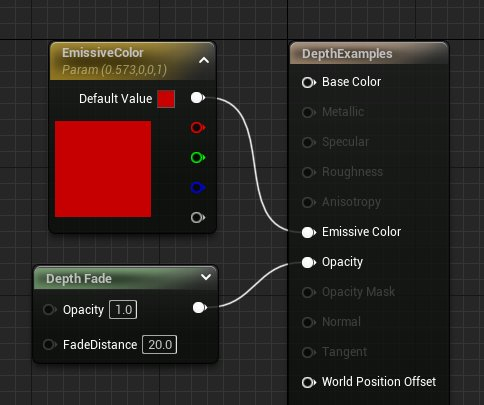

# 深度材质表达式

> 路径：虚幻引擎5.7文档 / 设计视觉、渲染和图形效果 / 材质 / 材质表达式参考 / 深度材质表达式

> 原始页面：https://dev.epicgames.com/documentation/unreal-engine/depth-material-expressions-in-unreal-engine

## DepthFade

**DepthFade（深度消退）** 材质表达式用来隐藏半透明对象与不透明对象相交时出现的不美观接缝。

| 属性 | 说明 |
| --- | --- |
| **消退距离（Fade Distance）** | 这是应该发生消退的全局空间距离。未连接 FadeDistance（FadeDistance）输入时，将使用此距离。 |
| 输入 |  |
| **不透明（Opacity）** | 接收深度消退前对象的现有不透明度。 |
| **FadeDistance（消退距离）** | 这是应该发生消退的全局空间距离。 |

在下面的对比图中，一个半透明球体与一个不透明球体（绿色）相交。请注意在使用了DepthFade时，过渡会变得更平滑。

深度消退前

深度消退后

本示例的材质网络如下图所示。

## PixelDepth

**PixelDepth（像素深度）**材质表达式输出当前所渲染像素的深度，即该像素与摄像机之间的距离。

| 列 1 | 列 2 |
| --- | --- |
| Pixel Depth Example | [undefined](https://d1iv7db44yhgxn.cloudfront.net/documentation/images/b6d76694-1236-4735-ae50-5d3fe8eccf72/pixel-depth-graph.png) |
| 结果 | 节点图表（点击可查看大图） |

在此示例中，已将材质网络应用于地板。请注意当地板后退 2048 个以上单位时，线性插值在两种颜色之间是如何进行混合的。使用了 Power（幂）表达式来加强这两种颜色之间的对比，并产生更有意义的视觉效果。

## SceneDepth

**SceneDepth（场景深度）**材质表达式输出现有的场景深度。这类似于 [PixelDepth（像素深度）](#pixeldepth)，但是 PixelDepth（像素深度）只能在当前所绘制像素处进行深度取样，而 SceneDepth（场景深度）可以在 **任何位置** 进行深度取样。

> [!NOTE]
> 只有半透明材质可以利用 SceneDepth（场景深度）。

| 输入 | 说明 |
| --- | --- |
| **UVs** | 接收 UV 纹理坐标，用来确定对"纹理"进行取样的深度。 |

| 列 1 | 列 2 |
| --- | --- |
| Scene Depth Example | [undefined](https://d1iv7db44yhgxn.cloudfront.net/documentation/images/1231a1b2-4104-4439-8c98-a7ead3e88a6e/scene-depth-graph.png) |
| 结果 | 节点网络（点击可查看大图） |

在本示例中，我们已将材质网络应用于一个半透明球体。请注意，SceneDepth（场景深度）节点将读取该球体背后的像素，而不是读取球体表面的像素。

产生的规范化深度是 0.0 到 1.0 范围内的线性深度。
