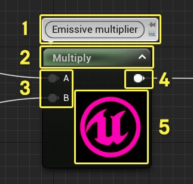

# 材质表达式参考

> 路径：虚幻引擎5.7文档 / 设计视觉、渲染和图形效果 / 材质 / 材质表达式参考

> 原始页面：https://dev.epicgames.com/documentation/unreal-engine/unreal-engine-material-expressions-reference

本文列出了[材质编辑器](../unreal-engine-material-editor-user-guide/index.md)中所有可用 **材质表达式** 节点的参考页面。材质表达式是材质编辑器的基本构建单元，用于在虚幻引擎中构建完整功能的材质。

每个材质表达式都是一个自含式黑盒，输出一套一个或多个特定值；或是在一个或多个输入上执行单个运算，然后输出运算的结果。

## 参数

部分材质表达式是参数类表达式，意味你可以在[材质实例](../instanced-materials/index.md)中修改数值（这些实例的父材质包含这些参数）。

你应通过 **参数命名** 属性，为所有参数指定一个唯一名称。 当你在[材质实例编辑器](https://dev.epicgames.com/documentation/404)中编辑实例时，这个名称会被用来识别每个特定参数。

如果在一个材质中，两个相同类型的参数有相同的名称，它们就被当作同一个参数。改变材质实例中的一个参数的值将改变材质中两个参数表达的值。你可以在细节面板中为你的参数设置一个默认值。这个默认值会在材质实例中使用，除非它被覆盖和修改。

## 材质表达式属性

所有材质表达式节点都包含提供不同类型信息的同一种属性。在下文中，将使用Texture Sample节点来重点解释这些 常用属性。

| 编号 | 属性名称 | 描述 |
| --- | --- | --- |
| 1 | 描述 | 所有材质表达式均拥有一个通用的 **Desc**（描述）属性，可通过细节面板访问。在此属性中输入的文本将显示在材质编辑器中工作区表达式的上方。其用途广泛，主要作用是简单介绍表达式的作用或函数。 |
| 2 | 标题栏 | 显示材质表达式的命名和/或相关信息。 |
| 3 | 输入 | 材质表达式所用值的链接。 |
| 4 | 输出 | 输出材质表达式运算结果。 |
| 5 | 预览 | 显示材质表达式所输出值的预览。实时更新启用时自动进行更新。可使用空格键手动更新。 |

### 材质表达式类型

这些参考页面根据材质编辑器参数面板中的类别来组织。

- [大气表达式](atmosphere-material-expressions/index.md) - 影响雾和其他大气级效果的表达式。

- [颜色材质表达式](color-material-expressions/index.md) - 对颜色输入执行操作的表达式。

- [常量材质表达式](constant-material-expressions/index.md) - 一旦在编辑器中设置后，或在游戏开始时设置后，输出值通常保持不变的表达式。

- [坐标材质表达式](coordinates-material-expressions/index.md) - 坐标表达式可用于对纹理坐标执行操作，或用于输出特定数值（用作纹理坐标或修改纹理坐标）。

- [自定义材质表达式](custom-material-expressions/index.md) - 允许使用自定义着色器代码的表达式。

- [深度材质表达式](depth-material-expressions/index.md) - 处理所渲染像素的深度的材质表达式。

- [字体材质表达式](https://dev.epicgames.com/documentation/unreal-engine/font-material-expressions-in-unreal-engine) - 对字体资产进行取样和输出的表达式。

- [材质函数表达式](material-function-expressions/index.md) - 用来创建或执行材质函数的表达式。

- [材质属性表达式](material-attributes-expressions/index.md) - 这些表达式节点使您能够分隔或组合各种材质属性，这在创建分层材质时特别有用。

- [粒子材质表达式](https://dev.epicgames.com/documentation/unreal-engine/particle-material-expressions-in-unreal-engine) - 用于创建要应用于粒子系统中的发射器的材质表达式。

- [纹理材质表达式](https://dev.epicgames.com/documentation/unreal-engine/texture-material-expressions-in-unreal-engine) - 对纹理进行取样和输出的表达式。

- [向量类材质表达式](vector-material-expressions/index.md) - 用于输出位置、法线等向量值的材质表达式。

- [向量操作类材质表达式](vector-operation-material-expressions/index.md) - 对向量输入值执行操作的材质表达式。

- [地形材质表达式](landscape-material-expressions/index.md) - 可创建应用于地形地貌的材质的表达式。

- [材质参数表达式](material-parameter-expressions/index.md) - 这类表达式向材质实例公开属性，以便在子实例中重载或在运行时修改。

- [工具类材质表达式](utility-material-expressions/index.md) - 对一个或多个输入执行各种运算的表达式。

## 表达式索引

下面列出了大量材质表达式，但并不完整。此处显示的所有链接也可以通过下方的表达类页面来访问。 此外，也可以使用 **Ctrl+F** 查找所需的表达式节点，并跟随链接到其描述。

[**大气**](atmosphere-material-expressions/index.md)

- AtmosphericFogColor（大气雾颜色）

[**Color（颜色）**](utility-material-expressions/index.md)

- Desaturation（去饱和度）

[**常量**](constant-material-expressions/index.md)

- Constant
- Constant2Vector
- Constant3Vector
- Constant4Vector
- DistanceCullFade
- PerInstanceFadeAmount
- PerInstanceRandom
- Time
- TwoSidedSign
- VertexColor

[**坐标**](coordinates-material-expressions/index.md)

- ActorPositionWS
- CameraPositionWS
- LightmapUVs
- ObjectOrientation
- ObjectPositionWS
- ObjectRadius
- Panner
- ParticlePositionWS
- PixelNormalWS
- Rotator
- SceneTexelSize
- ScreenPosition
- TextureCoordinate
- VertexNormalWS
- ViewSize
- WorldPosition

[**自定义**](custom-material-expressions/index.md)

- 自定义

[**深度**](depth-material-expressions/index.md)

- DepthFade（深度消退）
- PixelDepth（像素深度）
- SceneDepth（场景深度）

[**字体**](https://dev.epicgames.com/documentation/unreal-engine/font-material-expressions-in-unreal-engine)

- FontSample（字体取样）
- FontSampleParameter（字体取样参数）

[**函数**](material-function-expressions/index.md)

- FunctionInput
- FunctionOutput
- MaterialFunctionCall
- StaticBool
- StaticSwitch
- TextureObject

[**MaterialAttributes（材质属性）**](material-attributes-expressions/index.md)

- BreakMaterialAttributes（拆分材质属性）
- MakeMaterialAttributes（创建材质属性）

[**数学**](math-material-expressions/index.md)

- Abs（绝对值）
- Add（加）
- AppendVector（追加向量）
- Ceil（加一取整）
- Clamp（限制）
- ComponentMask（分量蒙版）
- Cosine（余弦）
- CrossProduct（向量积）
- Divide（除）
- DotProduct（标量积）
- Floor（减一取整）
- Fmod（浮点余数）
- Frac（小数）
- If
- LinearInterpolate（线性插值）
- Multiply（乘）
- Normalize（规范化）
- OneMinus（一减）
- Power（幂）
- Sine（正弦）
- SquareRoot（平方根）
- Subtract（减）

[**参数**](material-parameter-expressions/index.md)

- CollectionParameters（集合参数）
- DynamicParameter（动态参数）
- FontSampleParameter（字体取样参数）
- ScalarParameter（标量参数）
- StaticBoolParameter（静态布尔参数）
- StaticSwitchParameter（静态开关参数）
- StaticComponentMaskParameter（静态分量蒙版参数）
- VectorParameter（向量参数）
- TextureObjectParameter（纹理对象参数）
- TextureSampleParameter2D（纹理取样参数2D）
- TextureSampleParameterSubUV（纹理取样参数子UV）
- TextureSampleParameterCube（纹理取样参数立方体）
- TextureSampleParameterMovie（纹理取样参数影片）

[**粒子**](https://dev.epicgames.com/documentation/unreal-engine/particle-material-expressions-in-unreal-engine)

- DynamicParameter（动态参数）
- ParticleColor（粒子颜色）
- ParticleDirection（粒子方向）
- ParticleMacroUV（粒子宏UV）
- ParticleMotionBlurFade（粒子运动模糊消退）
- ParticlePositionWS（粒子全局空间位置）
- ParticleRadius（粒子半径）
- ParticleRelativeTime（粒子相对时间）
- ParticleSize（粒子大小）
- ParticleSpeed（粒子速度）
- SphericalParticleOpacity（球形粒子不透明度）
- ParticleSubUV（粒子子 UV）
- TextureSampleParameterSubUV（纹理取样参数子UV）

[**地形**](landscape-material-expressions/index.md)

- LandscapeLayerBlend（地形层混合）
- LandscapeLayerCoords（地形层坐标）
- LandscapeLayerSwitch（地形层开关）

[**纹理**](https://dev.epicgames.com/documentation/unreal-engine/texture-material-expressions-in-unreal-engine)

- FontSample（字体取样）
- FontSampleParameter（字体取样参数）
- SceneColor（场景颜色）
- TextureObject（纹理对象）
- TextureSample（纹理取样）

[**实用程序**](utility-material-expressions/index.md)

- BlackBody（黑体）
- BumpOffset（凹凸贴图偏移）
- ConstantBiasScale（常量偏差比例）
- DDX
- DDY
- DepthFade（深度消退）
- DepthOfFieldFunction（视野深度函数）
- Desaturation（去饱和度）
- Distance（距离）
- Fresnel（菲涅尔）
- LightmassReplace（Lightmass替换）
- LinearInterpolate（线性插值）
- Noise（噪点）
- QualitySwitch（质量开关）
- RotateAboutAxis（绕轴旋转）
- SphereMask（球体蒙版）

  *

  薄半透明（Thin Translucent）
- AntialiasedTextureMask（抗锯齿纹理蒙版）

[**VectorOps**](vector-operation-material-expressions/index.md)

- AppendVector
- ComponentMask
- CrossProduct
- DeriveNormalZ
- DotProduct
- Normalize
- Transform
- TransformPosition

[**向量**](vector-material-expressions/index.md)

- ActorPositionWS（Actor全局空间位置）
- CameraPositionWS（摄像机全局空间位置）
- CameraVectorWS（摄像机全局空间向量）
- Constant2Vector（常量2向量）
- Constant3Vector（常量3向量）
- Constant4Vector（常量4向量）
- LightVector（光照向量）
- ObjectBounds（对象绑定）
- ObjectOrientation（对象朝向）
- ObjectPositionWS（对象全局空间位置）
- ParticlePositionWS（粒子全局空间位置）
- PixelNormalWS（像素全局空间法线）
- ReflectionVectorWS（反射全局空间向量）
- VertexNormalWS（顶点全局空间法线）
