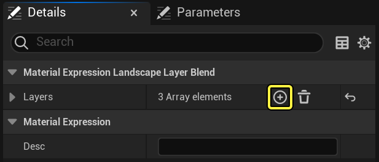
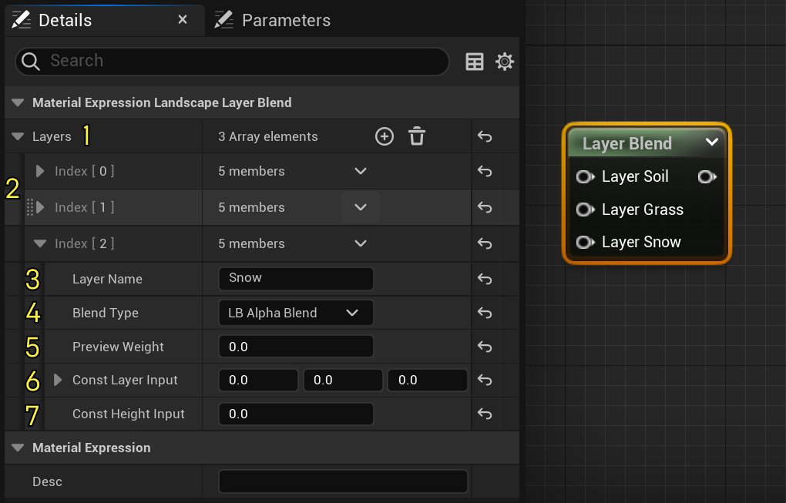
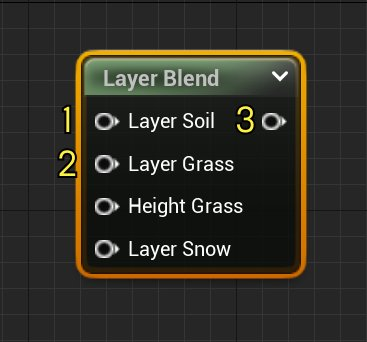
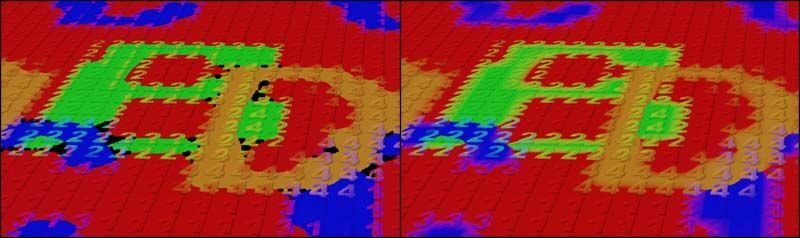
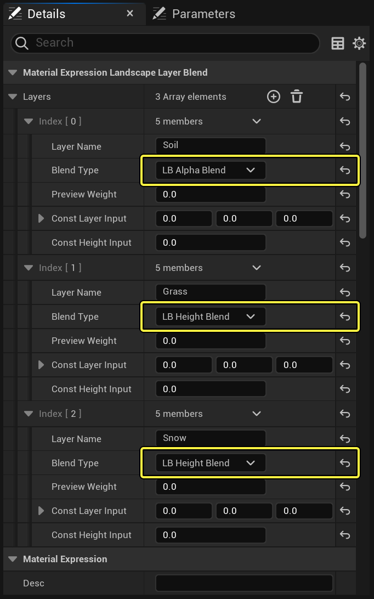
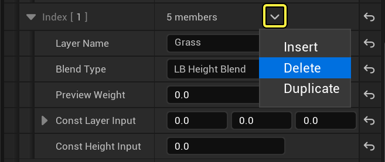
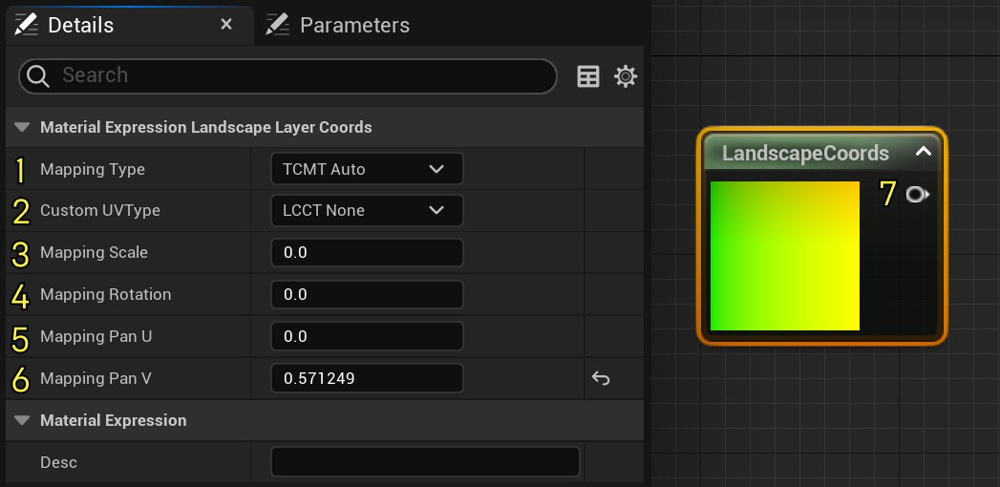
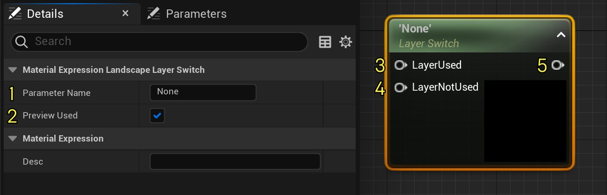

# 地形材质表达式

> 路径：虚幻引擎5.7文档 / 设计视觉、渲染和图形效果 / 材质 / 材质表达式参考 / 地形材质表达式

> 原始页面：https://dev.epicgames.com/documentation/unreal-engine/landscape-material-expressions-in-unreal-engine

## LandscapeLayerBlend

**Landscape Layer Blend**节点将混合多个逐层数值，例如纹理样本或材质。 图层的混合权重越高，对混合结果的影响就越大。

要添加新图层，请点击加号（**+**）图标。

点击查看大图。

将图层添加到节点中后，LandscapeLayerBlend节点会显示图层的名称。 此节点的输入如下：

点击查看大图。

| 编号 | 属性 | 说明 |
| --- | --- | --- |
| **1** | **图层（Layers）** | 列出数组中包含的图层。 点击加号图标 () 即可添加新图层。 |
| **2** | **更多图层（Additional Layers）** | 显示被折叠的额外图层。 |
| **3** | **图层名称（Layer Name）** | 显示图层的唯一名称。 **图层名称**对应在地形工具窗口的[绘制模式](../../../../building-virtual-worlds/landscape-outdoor-terrain/editing-landscapes/landscape-paint-mode/index.md)中使用的图层名称。 |
| **4** | **混合类型（Blend Type）** | 定义此图层使用的混合模式。 选项如下：**LB Alpha混合（LB Alpha Blend）**、**LB高度混合（LB Height Blend）**或**LB权重混合（LB Weight Blend）**。如需更多信息，请参阅[地形图层混合类型](../../../../building-virtual-worlds/landscape-outdoor-terrain/landscape-materials/index.md#landscape-layer-blend-types)。 |
| **5** | **预览权重（Preview Weight）** | 显示在材质编辑器中预览混合时要使用的权重值。 |
| **6** | **常量图层输入（Const Layer Input）** | 定义在不想使用纹理时要使用的RGB值。 适用于图层的调试。 |
| **7** | **常量高度输入（Const Height Input）** | 定义在不想使用纹理时要使用的高度值。 |

**Landscape Layer Blend**节点所用的输入和输出如下：

点击查看大图。

| 编号 | 项目 | 说明 |
| --- | --- | --- |
| **1** | **图层*图层名称***（Layer Layer Name） | 显示图层的唯一名称。 此输入仅在你为**细节（Details）**面板添加并命名图层后才可用。 |
| **2** | **高度*图层名称***（Height Layer Name） | 定义混合被命名图层所用的高度图。 此输入尽在**混合类型（Blend Type）**属性为**LB高度混合（LB Height Blend）**的图层上可见。 |
| **3** | **输出（Output）** | 输出混合后的结果。 |

> [!NOTE]
> 所有图层的名称必须唯一。 建议使用能够表明图层内容的描述性名称来命名图层。

当你对多个地形图层使用LB高度混合模式时，你可能会在地形的不同图层交汇的地方发现黑斑。 LB高度混合的工作原理是，使用指定的高度值管理图层的混合因子或权重。 如果一个区域上绘制了多个图层，且图层混合模式均为LB高度混合，那么在某些区域中绘制的所有图层的高度值都可能同时为0，从而让所有图层的所需混合因子都变为`0`。

由于不存在特定的顺序，因此你可能会在所有层都无贡献的区域发现黑斑。 你甚至可能在混合法线贴图时发现更多的黑斑，因为这种混合会导致法线值为（0,0,0），即无效值，同时该值还会导致各种光照问题。 如果出现这种情况，请用权重不为零的材质绘制该区域。

在左图中，所有图层均使用LB高度混合，这导致某些区域呈现黑色。 而在右图中，红色的图层"1"被改为使用LB Alpha混合。

点击查看大图。

下面是**Landscape Layer Blend**节点的属性示例，所有图层都被混合在一起。 **土壤（Soil）**层的混合模式为LB Alpha混合，而其他层的混合模式为LB高度混合。 这是为了防止发生之前提到的问题。

点击查看大图。

要删除某个图层，请点击该图层元素编号右侧的下拉菜单箭头，然后选择**删除（Delete）**。

点击查看大图。

## LandscapeLayerCoords

**Landscape Layer Coords**节点将生成UV坐标，用于将地形材质映射到地形。

点击查看大图。

此节点具有以下选项：

| 编号 | 属性 | 说明 |
| --- | --- | --- |
| 1 | **映射类型（Mapping Type）** | 指定将材质或网络映射到地形时要使用的方向。 它包含以下选项：**TCMT Auto**：使用地形顶点坐标，范围为[0, OverallLandscapeResolution]**TCMT XY**：使用对象空间XY映射。 等同于TCMT Auto。**TCMT XZ**：使用对象空间XZ映射。 推荐用于侧面投影的纹理。**TCMT YZ**：使用对象空间YZ映射。 推荐用于侧面投影的纹理。 |
| 2 | **自定义UV类型（Custom UVType）** | 输出UV坐标以根据类型将材质映射到地形。 它包含以下选项：**LCCT None**：不使用自定义UV。**LCCT Custom UV0**：使用通道0中的自定义UV。**LCCT Custom UV1**：使用通道1中的自定义UV。**LCCT Custom UV2**：使用通道2中的自定义UV。**LCCT Weight Map UV**：使用原始权重图UV。 |
| 3 | **映射缩放（Mapping Scale）** | 将等分缩放应用于UV坐标。 |
| 4 | **映射旋转（Mapping Rotation）** | 将旋转（以度为单位）应用于UV坐标。 |
| 5 | **映射平移[U]（Mapping Pan [U]）** | 将[U]方向的偏移应用于UV坐标。 |
| 6 | **映射平移[V]（Mapping Pan [V]）** | 将[V]方向的偏移应用于UV坐标。 |
| 7 | **无标记输出（Unlabeled Output）** | 输出UV坐标以根据给定属性值将材质映射到地形。 |

## LandscapeLayerSwitch

你可以使用**Landscape Layer Switch**节点，在特定图层对地形的某个区域无作用时排除某些材质运算。 这样你就可以在图层的权重为零时删除不必要的计算，从而优化材质。

点击查看大图。

此节点具有以下选项：

| 编号 | 属性 | 说明 |
| --- | --- | --- |
| 1 | **参数名称（Parameter Name）** | 显示参数的唯一名称。 |
| 2 | **已使用预览（Preview Used）** | 如果选中，则使用预览。 |
| 3 | **已使用层（Layer Used）** | 如果当前地形区域使用了特定层，则表示应使用的材质网络。 |
| 4 | **未使用层（Layer Not Used）** | 如果当前地形区域未使用特定层，则表示应使用的材质网络。 |
| 5 | **输出（Output）** | 使用**已使用层（Layer Used）**输入或**未使用层（Layer Not Used）**输入，具体取决于该层是否对特定的地形区域有所贡献。 |

## LandscapeLayerWeight

你可以使用**Landscape Layer Weight**节点访问图层权重，并在材质图表中实现你自己的混合解决方法。 输出会返回（基础 + 图层 * 图层权重）。 你可以将多个Landscape Layer Weight节点串联在一起，从而得到权重和，凭其在指定图层之间进行混合。

你可以将基础（Base）值设为0，将图层（Layer）值设置为`1.0`，从而直接访问未经修改的图层权重值。

> 图片已省略：Landscape Layer Weight节点

点击查看大图。

此节点具有以下选项：

| 编号 | 属性 | 说明 |
| --- | --- | --- |
| 1 | **参数名称（Parameter Name）** | 显示要读取权重的图层的名称。 |
| 2 | **预览权重（Preview Weight）** | 定义要在材质编辑器中进行预览时所用的权重。 |
| 3 | **常量基础（Const Base）** | 定义在基础未被连接时，要使用的指定RGB常量值。 |
| 4 | **基础（Base）** | 要与此图层混合的节点网络。 这包括之前图层的值和所有其他的底层数据。 这会提供与绘制图层权重相乘后的图层数值。 |
| 5 | **图层（Layer）** | 指定图层的值。 输入值会与图层权重相乘，然后与基础相加，最终得出输出值。 |
| 6 | **输出（Output）** | 根据输入的图层权重，输出**基础（Base）**和**图层（Layer）**输入之间的混合结果。 |

## LandscapeVisibilityMask

**Landscape Visibility Mask**节点将输出地形可视性的值。

> 图片已省略：Landscape Visibility Mask节点

点击查看大图。

此节点具有以下选项：

| 编号 | 属性 | 说明 |
| --- | --- | --- |
| 1 | **输出（Output）** | 输出可视性遮罩的值。 地形透明时，数值为`0.0`；地形可见时，数值为`1.0`。 |

> 图片已省略：图层可见性遮罩不透明遮罩

点击查看大图。
