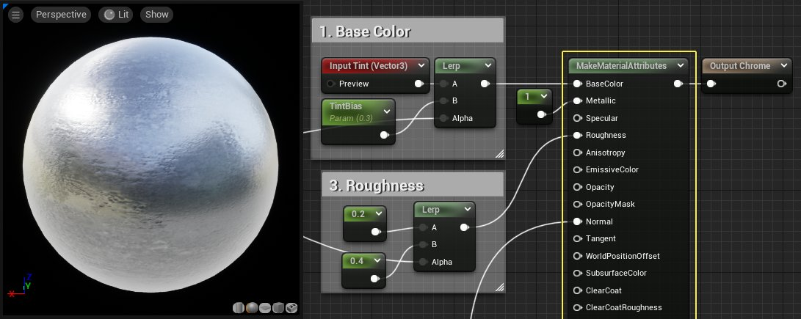
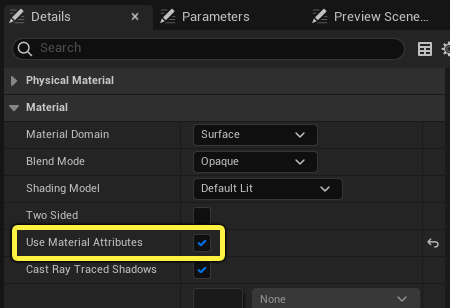
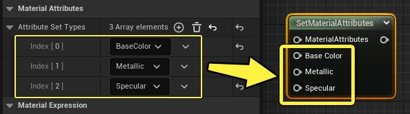
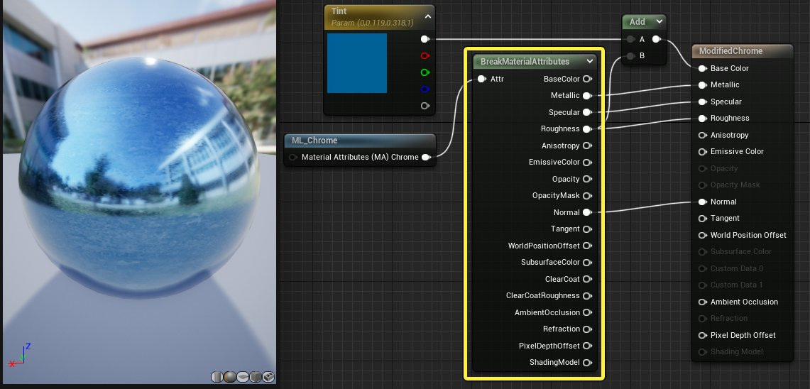
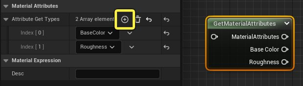
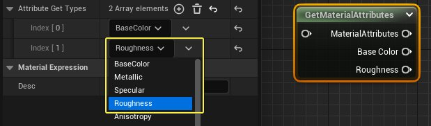
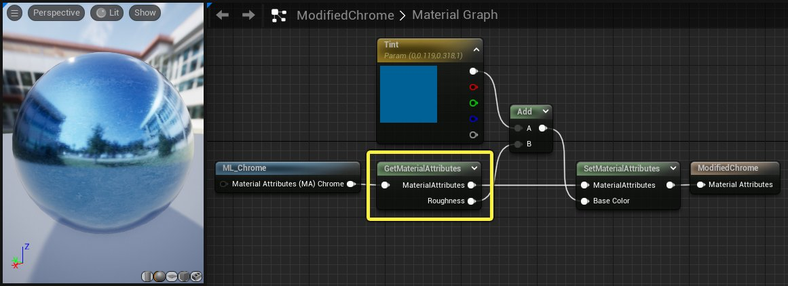
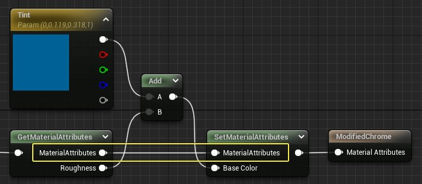

# 材质属性表达式

> 路径：虚幻引擎5.7文档 / 设计视觉、渲染和图形效果 / 材质 / 材质表达式参考 / 材质属性表达式

> 原始页面：https://dev.epicgames.com/documentation/unreal-engine/material-attributes-expressions-in-unreal-engine

## 建立材质属性

**建立材质属性（Make Material Attributes）** 节点用于定义[主材质节点](../../unreal-engine-material-editor-user-guide/using-the-main-material-node/index.md)上的标准材质属性，将其集合，然后在一个输出进行传送。这对于创建[分层材质](../../layering-materials/creating-layered-materials/index.md)非常有用，因为它允许你在材质函数中定义一整个材质并在父级材质中使用该数据。你还可以将其用于复杂的材质设置，定义多个材质类型并将其混合，全部在一个材质资产中进行。

将建立材质属性节点连接到材质时，必须确保材质属性中的使用材质属性选项设为true（勾选）。这会将主材质节点折叠为一个输入，可以接收来自建立材质属性节点的输入数据。

> [!NOTE]
> 建立材质属性会被[设置材质属性](#setmaterialattributes)节点覆盖，大部分情况下应该使用后者。

## 设置材质属性

**设置材质属性（Set Material Attributes）** 表达式和建立材质属性的功能一样。它用于定义一组材质属性，并将其打包后在单根引线中传输。

建立材质属性节点默认显示所有标准材质属性，而设置材质属性节点上显示的输入由用户在 **细节面板（Details panel）** 中定义。这意味着你可以仅使用需要的材质属性。

举个例子，下面展示的材质函数仅需要四个属性 — **基础颜色（Base Color）、金属感（Metallic）、粗糙度（Roughness）以及法线（Normal）**。用设置材质属性表达式替代建立材质属性可以节约空间，让材质图表更加简洁。

大部分情况下，会优先使用设置材质属性而不是建立材质属性。

> [!NOTE]
> 该节点唯一的缺点在于它不会随场景而变化，这意味着用户必须知道他们需要向数组中添加哪些属性，以此来创建各种不同的混合模式和阴影模型。如果你不确定，可以使用建立材质属性节点，它包含所有需要的输入。

## 中断材质属性

**中断材质属性（Break Material Attributes）** 表达式可以切分输入的一组材质属性，并将每个属性在单独的引脚输出。

这对于创建[分层材质](../../layering-materials/index.md)非常有用，因为它允许你在材质分层函数中访问每个单独的属性。这样你可以选择要插入主材质节点的属性，并且可以用材质图表中的逻辑选择性地编辑属性。

在上图的示例中，中断材质属性用于分割来自普通的镀铬材质分层函数的属性。金属感、高光度、粗糙度和法线属性没有改变直接输入了主材质节点，但是基础颜色属性没有被使用。取而代之的是，一个Vector 3参数添加到了粗糙度材质，该结果被传送至基础颜色输入。

## 获取材质属性

**获取材质属性（Get Material Attributes）** 与中断材质属性作用相同，但是有很多工作流程上的好处。它不会像中断材质属性那样分割所有的输入材质属性，而是可以选择要提取的属性。选中该节点然后在 **细节面板（Details Panel）** 中点击 **添加元素（Add Element）** 图标来添加输出节点。

你可以使用下拉菜单来定义每个数组元素对应哪个材质属性。

下图展示的材质复原了[中断材质属性](#breakmaterialattributes)小节中的染色镀铬示例，但是使用了获取和设置材质属性表达式。注意图表看起来更简洁，引线更少。

在该示例中，只有粗糙度数据从材质属性中分割出来。一个染色参数添加到了粗糙度映射，以此来造成表面的变化，其结果由一个[设置材质属性](#setmaterialattributes)节点传送进基础颜色。其余的材质属性不经过修改直接传送。

## 混合材质属性

**混合材质属性（Blend Material Attributes）** 表达式使用两组材质属性，并且用Alpha输入中定义的像素级别操作来将其混合在一起。

举个例子，该材质分层混合将上下两组材质属性用一个遮罩纹理进行混合。

> 图片已省略：undefined

点击查看大图。
