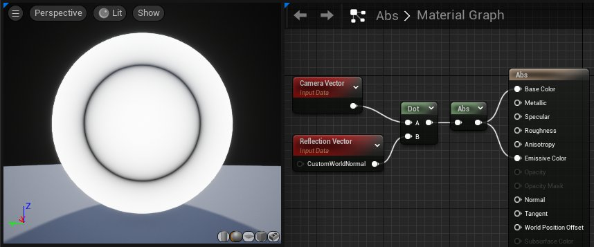
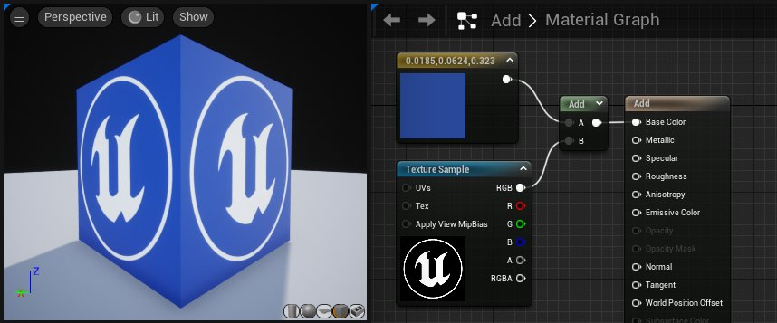
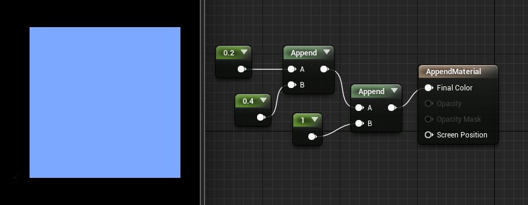
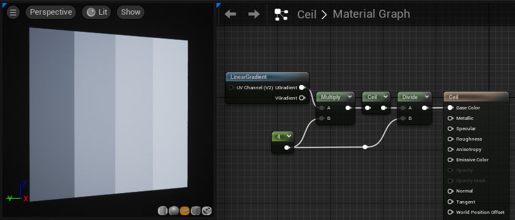
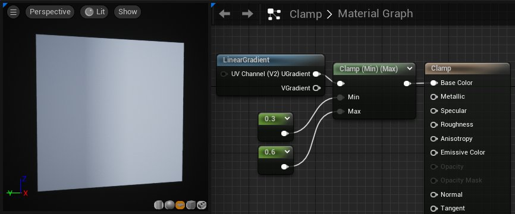
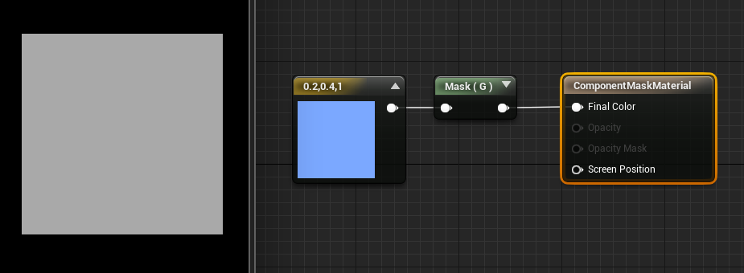
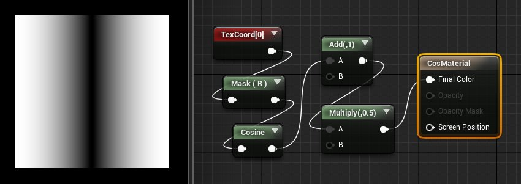

# 数学类材质表达式

> 路径：虚幻引擎5.7文档 / 设计视觉、渲染和图形效果 / 材质 / 材质表达式参考 / 数学类材质表达式

> 原始页面：https://dev.epicgames.com/documentation/unreal-engine/math-material-expressions-in-unreal-engine

## Abs

**Abs** 是数学术语"绝对值（absolute value）"的缩写。Abs表达式输出它接收到的输入的绝对值或无符号值。本质上，这意味着它通过去掉负号把负数变成正数，而正数和零保持不变。

**示例：**-0.7的绝对值为0.7；-1.0的绝对值为1.0；1.0的绝对值也是1.0

**使用示例：**Abs一般与点积配合使用，以确定两个向量之间的角度关系：它们是平行，垂直，还是介于两者之间。通常，当您得到两个向量的点积时，该值在1.0（对于两个平行向量）与-1.0（对于两个完全相反的向量）之间进行插值，中间点0表示这两个向量是垂直的。当您取这个点积的绝对值时，正值保持不变，而负值通过去掉负号变成正数。因此，结果在0（对于垂直向量）和1.0（对于平行向量，无论向量指向相同还是相反的方向）之间进行插值。这只是告诉您这两个向量距离正交有多远。

## Add

**Add** 表达式接受两个输入，将它们相加并输出结果。

如果使用多个通道传递值，每个通道将分别添加。例如，如果将RGB颜色值传递给每个输入，则将第一个输入的R通道添加到第二个输入的R通道中，结果存储在输出的R通道中；将第一个输入的G通道添加到第二个输入的G通道中，结果存储在输出的G通道中，以此类推。

两个输入必须有相同数量的值，但其中一个值是单个常量值时例外。在这种情况下，将多通道输入的每个通道添加到单个浮点值，并将结果存储在输出值的单独通道中。

| 属性 | 说明 |
| --- | --- |
| **常量A（Const A）** | 接受要添加到的值。仅在未使用A输入时使用。 |
| **常量B（Const B）** | 接受要添加的值。仅在未使用B输入时使用。 |
| 输入 |  |
| **A** | 接受要添加到的值。 |
| **B** | 接受要添加的值。 |

**示例：**0.2与0.4相加得0.6；(0.2,-0.4,0.6)与(0.1,0.5,1.0)相加得(0.3,0.1,1.6)；(0.2,-0.4,0.6)与1.0相加得(1.2,0.6,1.6)

**使用示例：**Add常用于使颜色变亮/变暗或偏移UV纹理坐标。

## AppendVector

**AppendVector** 表达式允许你组合通道，创建一个比原始通道更多的向量。例如，你可以获取两个单独的 **常量** 值，并将它们添加到一个双通道的 **Constant2向量** 值中。这种操作适合用于重新排列单个纹理中的通道，或将多个灰度纹理合并为一个RGB颜色纹理。

| 输入 | 说明 |
| --- | --- |
| **A** | 需要附加的值。 |
| **B** | 被附加的值。 |

**示例：** 附加0.2 和 0.4 就是 (0.2,0.4)；附加 (0.2,0.4) 和 (1.0) 就是 (0.2,0.4,1.0)。

## Arccosine

**Arccosine** 表达式输出反余弦函数。

> [!NOTE]
> 这是一种成本高昂的运算，且不会被指令数所反映。使用[ArccosineFast](#arccosinefast)作为更快但不太精确的替代方案。

上图显示了应用该表达式所获结果的两种不同可视化效果：

- 顶部的条形图以输出颜色显示结果。条形图的左端显示在输入值为-1时使用该表达式得到的颜色，而条形图的右端显示输入值为1时得到的结果。
- 图表中，X轴表示输入值，范围从-1到1。Y轴显示在这些输入值上使用该表达式的结果，范围也是从-1到1。

## ArccosineFast

**ArccosineFast** 表达式输出反余弦函数的近似值，计算起来比更精确的[Arccosine](#arccosine)表达式更快。输入必须介于-1与1之间。

请参阅上文的 **Arccosine** 表达式，查看输出值的可视化。

## Arcsine

**Arcsine** 表达式输出反正弦函数。

> [!NOTE]
> 这是一种成本高昂的运算，且不会被指令数所反映。使用[ArcsineFast](#arcsinefast)作为更快但不太精确的替代方案。

上图显示了应用该表达式所获结果的两种不同可视化效果：

- 顶部的条形图以输出颜色显示结果。条形图的左端显示在输入值为-1时使用该表达式得到的颜色，而条形图的右端显示输入值为1时得到的结果。
- 图表中，X轴表示输入值，范围从-1到1。Y轴显示在这些输入值上使用该表达式的结果，范围也是从-1到1。

## ArcsineFast

**ArcsineFast** 表达式输出反正弦函数的近似值，计算起来比更精确的[Arcsine](#arcsine)表达式更快。输入必须介于-1与1之间。

请参阅上文的 **Arcsine** 表达式，查看输出值的可视化。

## Arctangent

**Arctangent** 表达式输出反正切函数。

> [!NOTE]
> 这是一种成本高昂的运算，且不会被指令数所反映。使用[ArctangentFast](#arctangentfast)作为更快但不太精确的替代方案。

上图显示了应用该表达式所获结果的两种不同可视化效果：

- 顶部的条形图以输出颜色显示结果。条形图的左端显示在输入值为-1时使用该表达式得到的颜色，而条形图的右端显示输入值为1时得到的结果。
- 图表中，X轴表示输入值，范围从-1到1。Y轴显示在这些输入值上使用该表达式的结果，范围也是从-1到1。

## Arctangent2

**Arctangent2** 表达式输出x/y的反正切，其中输入符号用于确定象限。

> [!NOTE]
> 这是一种成本高昂的运算，且不会被指令数所反映。使用Arctangent2Fast作为更快但不太精确的替代方案。

上图显示了应用该表达式所获结果的两种不同可视化效果：

- 顶部的条形图以输出颜色显示结果。条形图的左端显示在输入值为-1时使用该表达式得到的颜色，而条形图的右端显示输入值为1时得到的结果。
- 图表中，X轴表示输入值，范围从-1到1。Y轴显示在这些输入值上使用该表达式的结果，范围也是从-1到1。

## Arctangent2Fast

**Arctangent2Fast** 表达式输出X/Y的反正切的近似值，其中输入符号用于确定象限。比起[Arctangent2](#arctangent2)表达式，它计算得更快，但精确度较低。

请参阅上文的 **Arctangent2** 表达式，查看输出值的可视化。

## ArctangentFast

**ArctangentFast** 表达式输出反正切函数的近似值，计算起来比更精确的[Arctangent](#arctangent)表达式更快。

请参阅上文的 **Arctangent** 表达式，查看输出值的可视化。

## Ceil

**Ceil** 表达式接受值，将它们向 **上** 舍入到下一个整数，并输出结果。另请参阅下文中的[Floor](#floor) 和 [Frac](#frac)小节。

**示例：**0.2向上舍入到1.0；(0.2,1.6)向上舍入到(1.0,2.0)。

## Clamp

**Clamp** 表达式接受一个或多个值，并将它们约束到由最小值和最大值定义的指定范围内。如果最小值为0.0，最大值为0.5，则意味着结果值永远不会小于0.0，且永远不会大于0.5。

| 属性 | 说明 |
| --- | --- |
| **限制模式（Clamp Mode）** | 选择要使用的限制类型。CMODE_Clamp将限制范围的两端。CMODE_ClampMin和CMODE_ClampMax将仅限制范围与其相应的一端。 |
| **默认最小值（Min Default）** | 接受限制时要用作最小值的值。仅在未使用最小值（Min）输入时使用。 |
| **默认最大值（Max Default）** | 接受限制时要用作最大值的值。仅在未使用最大值（Min）输入时使用。 |
| 输入 |  |
| **最小值（Min）** | 接受限制时要用作最小值的值。 |
| **最大值（Max）** | 接受限制时要用作最大值的值。 |

**示例：**在最小值为0.0且最大值为1.0的情况下对0.3（(0.0)到(1.0)）的输入范围进行限制将得到结果0.3；在最小值为0.0且最大值为1.0的情况下对1.3进行限制将得到结果1.0。

## ComponentMask

**ComponentMask** 表达式允许你从输入中挑选某个通道子集（R、G、B和/或A）并输出。试图通过输入中不存在的通道将导致错误，除非输入是一个单一的常量值。在这种情况下，单值将被传递到每个通道。当前选择要通过的通道显示在表达式的标题栏中。

| 属性 | 说明 |
| --- | --- |
| **R** | 如勾选，输入中的红色通道（第一个）将被输出。 |
| **G** | 如勾选，输入中的绿色通道（第二个）将被输出。 |
| **B** | 如勾选，输入中的蓝色通道（第三个）将被输出。 |
| **A** | 如勾选，输入中的alpha通道（第四个）将被输出。 |

**示例：** 如果ComponentMask的输入是(0.2,0.4,1.0)和G通道，输出将是(0.4)。如果是颜色向量，最终效果就是一个40%的明亮灰度值。

## Cosine

**Cosine** 表达式在[0, 1]的输入范围和[-1, 1]的输出范围上反复输出余弦波的值。此表达式最常用于通过将一个 **时间** 表达式与其输入连接来输出连续的振荡波形，但它也可以用于在世界场景空间或屏幕空间或任何其他需要连续、平滑循环的应用中创建波纹。波形的可视化表示如下图所示，缩放到[0, 1]输出范围：

| 属性 | 说明 |
| --- | --- |
| **周期（Period）** | 指定合成波的周期。换句话说，这是发生一个完整的振荡所需要的时间，或者波形中每个连续波峰或连续波谷之间的间隔时间。例如，上图中，周期为一秒。 |

**使用示例：**在任何需要振荡效应的时候，此表达式都非常有用。振荡的速度和振幅很容易通过乘以时间输入（速度）或输出（振幅）来动态地控制。

在上例中，颜色会以余弦频率振荡。

## CrossProduct

**CrossProduct** 表达式计算两个三通道向量值输入的交叉乘积，并输出产生的三通道向量值。假定空间中有两个向量，则交叉乘积是一个同时垂直于两个输入的向量。

| 输入 | 说明 |
| --- | --- |
| **A** | 接受一个三通道向量值。 |
| **B** | 接受一个三通道向量值。 |

**使用示例：**CrossProduct常用于计算垂直于另外两个方向的方向。

## Divide

**Divide** 表达式取两个输入，将第一个输入除以第二个输入，并输出值。

如果使用多个通道传递值，每个通道将单独相除。例如，如果将RGB颜色值传递给每个输入，则将第一个输入的R通道除以第二个输入的R通道中，结果存储在输出的R通道中；将第一个输入的G通道除以第二个输入的G通道中，结果存储在输出的G通道中，以此类推。

两个输入必须有相同数量的值，但其中一个值是单个浮点值时例外。在这种情况下，将多通道输入的每个通道除以单个浮点值，并将结果存储在输出值的单独通道中。

> [!NOTE]
> 如果除数在任何通道内都介于0和0.00001之间，则将其提升至0.00001。如果除数在任何通道内都介于0和-0.00001之间，则将其降低至-0.00001。这避免了出现除以零的错误可能性。但是，这也意味着通道的输出值可能非常大。

| 属性 | 说明 |
| --- | --- |
| **常量A（Const A）** | 接受要被除的值，即被除数。仅在未使用A输出时使用。 |
| **常量B（Const B）** | 接受要除以的值，即除数。仅在未使用B输出时使用。 |
| 输入 |  |
| **A** | 接受要被除的值，即被除数。 |
| **B** | 接受要除以的值，即除数。 |

**示例：**A=(1.0)且B=(5.0)，相除得(0.2)，显示为深灰色。

> 图片已省略：Divide Material Expression example

## DotProduct

**DotProduct** 表达式计算点积，点积可以描述为一个向量投影到另一个向量上的长度，也可以描述为两个向量之间的余弦乘以它们的幅值。许多技术使用这种算法来计算衰减。DotProduct要求两个向量输入具有相同数量的通道。

| 输入 | 说明 |
| --- | --- |
| **A** | 接受一个值或任意长度的向量。 |
| **B** | 接受一个值或具有与 **A** 相同长度的向量。 |

> 图片已省略：Dot product Material Expression

## Floor

**Floor** 表达式接受值，将它们向 **下** 舍入到上一个整数，并输出结果。另请参阅[Ceil](#ceil)和[Frac](#frac)小节。

**示例：**0.2向下舍入到0.0；(0.2,1.6)向下舍入到(0.0, 1.0)。

> 图片已省略：Floor Material Expression

## Fmod

**Fmod** 表达式返回两个输入的除法运算的浮点余数。被除数（输入"A"）可以是任何值，但负被除数将导致负结果。除数（第二个输入）不应为零，因为这意味着要除以零，但是除数是负数还是正数并不会影响结果。它的常见的用例是制作一种材质，使其亮度上升到最大值，然后在下一帧中立即下降到最小值，然后再次开始向最大值攀升。

> 图片已省略：undefined

在本例中，FMod采用0到1的UV级数，并将其转换为绿色通道中X轴上每0.2个UV单元一次的重复循环。

## Frac

**Frac** 表达式接受值并输出这些值的小数部分。换句话说，对于输入值"X"，结果是"X - X的整数部分"。输出值将从0到1不等，包括下限值，但不包括上限值。另请参阅[Ceil](#ceil)和[Floor](#floor)小节。

**示例：**(0.2)的小数部分是(0.2)。(-0.2)的小数部分是(0.8)。(0.0,1.6,1.0)的小数部分是(0.0,0.6,0.0)。

> 图片已省略：Frac Material Expression

在本例中，Frac节点将时间转换为一系列重复的0 - 1级数序列，导致颜色（通过Lerp）从绿色变为红色，然后返回绿色，无限重复。

## If

**If** 表达式比较两个输入，然后根据比较的结果传递其他三个输入值中的一个。两个比较的输入都必须是单一浮点值。

| 输入 | 说明 |
| --- | --- |
| **A** | 接受单个浮点值。 |
| **B** | 接受单个浮点值。 |
| **A > B** | 接受如果A的值大于B的值时要输出的值。 |
| **A = B** | 接受如果A的值等于B的值时要输出的值。 |
| **A < B** | 接受如果A的值小于B的值时要输出的值。 |

> 图片已省略：If Material Expression

在本例中，If表达式接受一个高度图，并根据高度是低于还是高于0.2的值来输出红色或绿色。

## LinearInterpolate

**LinearInterpolate** 表达式会以第三个输入值为遮罩参数，然后在两个输入值之间进行插值。可以想象成两张纹理根据一张遮罩进行过渡，类似Photoshop中的图层遮罩。遮罩Alpha的强度决定了两个输入值贡献的权重。如果Alpha是0.0，就使用第一个输入值。如果Alpha是1.0，就使用第二个输入值。如果Alpha在0.0和1.0之间，输出是两个输入之间的插值。注意，混合是按通道进行的。 所以，如果Alpha是一个RGB颜色，则Alpha的红色通道会定义A和B的红色通道之间的插值，它 **独立** 于Alpha的绿色通道，后者定义了A和B的绿色通道之间的插值。

| 属性 | 说明 |
| --- | --- |
| **Const A** | 该值会被映射成 0.0。仅当A输入未连接时使用。 |
| **Const B** | 该值会被映射成1.0。仅当B输入未连接时使用。 |
| **Const Alpha** | 用作遮罩Alpha值。仅当Alpha输入未连接时使用。 |
| 输入 |  |
| **A** | 该输入值会被映射成0.0。 |
| **B** | 该输入值会被映射成1.0。 |
| **Alpha** | 该输入值会被用作遮罩Alpha值。 |

**程序员：** LinearInterpolate会根据参数值Alpha在A和B之间进行逐通道的插值。

> 图片已省略：Linear Interpolate example

## Logarithm10

**Logarithm10** 节点返回输入值的以10为底的对数，也称为公共对数。也就是说，如果取一个基数为10的值，并将其提高到该表达式返回的数字的幂，就会得到输入值。

> [!NOTE]
> 仅对该表达式使用正的输入值。

> 图片已省略：log10.png

## Logarithm2

Logarithm2节点返回输入值的以2为底的对数。也就是说，如果取一个基数为2的值，并将其提高到该表达式返回的数字的幂，就会得到输入值。

> [!NOTE]
> 仅对该表达式使用正的输入值。

> 图片已省略：log2.png

## Max

**Max** 表达式接受两个输入，并输出其中较高的一个。

当您使用该节点和颜色输入时，结果类似于Photoshop中的 **变亮** 图层混合模式。

> 图片已省略：Max Material Expression

在上例中，A为"0"，B为"1"；因此，"1"（白色）是最终的底色。

| 属性 | 说明 |
| --- | --- |
| **常量A（Const A）** | 接受第一个值。仅在未使用A输入时使用。 |
| **常量B（Const B）** | 接受第二个值。仅在未使用B输入时使用。 |
| 输入 |  |
| **A** | 接受要比较的第一个值。 |
| **B** | 接受要比较的第二个值。 |

## Min

**Min** 表达式接受两个输入，输出两个输入中较小的一个。

当您使用该节点和颜色输入时，结果类似于使用Photoshop中的 **变暗** 图层混合模式。

> 图片已省略：Min Material Expression

在上例中，A为"0"，B为"1"；因此，"0"（黑色）是最终的底色。

| 属性 | 说明 |
| --- | --- |
| **常量A（Const A）** | 接受第一个值。仅在未使用A输入时使用。 |
| **常量B（Const B）** | 接受第二个值。仅在未使用B输入时使用。 |
| 输入 |  |
| **A** | 接受要比较的第一个值。 |
| **B** | 接受要比较的第二个值。 |

## Multiply

**Multiply** 表达式接受两个输入，将它们相乘，然后输出结果。当您将颜色值作为输入传递时，结果类似于Photoshop中的 **正片叠底** 图层混合模式的结果。

如果使用多个通道传递值，每个通道将分别相乘。例如，如果将RGB颜色值传递给每个输入，则将第一个输入的R通道乘以第二个输入的R通道中，结果存储在输出的R通道中；将第一个输入的G通道乘以第二个输入的G通道中，结果存储在输出的G通道中，以此类推。

两个输入必须有相同数量的值，但其中一个值是单个浮点值时例外。在这种情况下，将多通道输入的每个通道乘以单个浮点值，并将结果存储在输出值的单独通道中。

| 属性 | 说明 |
| --- | --- |
| **常量A（Const A）** | 接受要相乘的第一个值。仅在未使用A输入时使用。 |
| **常量B（Const B）** | 接受要相乘的第二个值。仅在未使用B输入时使用。 |
| 输入 |  |
| **A** | 接受要相乘的第一个值。 |
| **B** | 接受要相乘的第二个值。 |

请注意，UE4中的材质不限于[0,1]。如果颜色/值大于1，Multiply会使颜色变亮。

**示例：**0.4与0.5相乘得0.2；(0.2,-0.4,0.6)与(0.0,2.0,1.0)相乘得(0.0,-0.8,0.6)；(0.2,-0.4,0.6)与0.5相乘得(0.1,-0.2,0.3)。

**使用示例：**Multiply常用于使颜色/纹理变亮或变暗，或用于操作纹理UV。

> 图片已省略：注意UV乘以1和2时，纹理的缩放比例变化。

**注意UV乘以1和2时，纹理的缩放比例变化。**

## Normalize

**Normalize** 表达式计算并输出其输入的归一化值。归一化向量（也称"单位向量"）的整体长度为1.0。这意味着输入的每个分量都除以向量的总大小（长度）。

**示例：**通过Normalize传递(0,2,0)或(0,0.2,0)都将输出(0,1,0)。通过Normalize传递(0,1,-1)将输出(0, 0.707, -0.707)。全零向量是唯一的例外，它不会改变。

> 图片已省略：Normalized Input Vector

> 图片已省略：Non-Normalized Input Vector

Normalized Input Vector

Non-Normalized Input Vector

> [!NOTE]
> 没有必要对插入到法线材质输出中的表达式进行归一化。

## OneMinus

**OneMinus** 表达式接受输入值"X"并输出"1 - X"。此操作逐通道执行。

**示例：**0.4的OneMinus值为0.6；(0.2,0.5,1.0)的OneMinus值为(0.8,0.5,0.0)；(0.0,-0.4,1.6)的OneMinus值为(1.0,1.4,-0.6)。

**使用示例：**当输入的颜色在[0,1]范围内时，OneMinus的效果与我们通常所说的"反色"是一样的，也就是说，OneMinus返回的是添加到输入时会产生白色的互补色。

> 图片已省略：添加一个 OneMinus 节点能够反转纹理采样中的数值。

**添加一个 OneMinus 节点能够反转纹理采样中的数值。**

## Power

**Power** 表达式接收两个输入：基值(**Base**)和指数(**Exp**)。它将基值提高到指数的幂，并输出结果。换句话说，它返回 **Base** 乘以自身 **Exp** 次。

| 属性 | 说明 |
| --- | --- |
| **常量指数（Const Exponent）** | 接受指数值。仅在未使用指数输入时使用。 |
| 输入 |  |
| **基数（Base）** | 接受底数值。 |
| **Exp** | 接受指数值。 |

**示例：**当底数为0.5且指数为2.0时，幂为0.25。

**使用示例：**如果您传递给Power的颜色在[0,1]范围内，Power可以作为一种对比度调整，其中非常亮的值会略微降低，但是较暗的值会急剧下降。

> 图片已省略：添加一个 Power 节点可以增加纹理取样中的对比度。

**添加一个 Power 节点可以增加纹理取样中的对比度。**

## Round

**Round** 表达式将输入值舍入为最接近的整数。如果输入值的小数部分为0.5或更大，则将输出值向上舍入。否则将输出值向下舍入。

> 图片已省略：Before Round

> 图片已省略：After Round

Before Round

After Round

**示例：**

- 值1.1向下舍入到1。
- 值1.4向下舍入到1。
- 值1.5将向上舍入为2。
- 值1.85将向上舍入为2。

## Saturate

**Saturate** 节点将值限定在0与1之间。小于0的值被提升到0；大于1的值降低为1；0到1之间（包括0和1在内）的值保持不变。在大多数现代图形硬件上，Saturate的指令成本几乎是免费的，所以您可以在任何时候使用该节点来将输入或输出值限制在0到1之间，而不影响您的材质的性能。

> 图片已省略：Saturate Material Expression

**使用示例：** 该节点可用于将输出或输入值限制在0和1之间。

## Step

Step材质表达式会为每个X值返回一个0或1，依据是其究竟大于还是小于Y的参考值。

下图中，一个线性梯度值（0到1）连接到 X 输入。Y（0.25）值相当于引用值。梯度中所有低于0.25的值返回0（黑色）；所有等于大于0.25的值返回1（白色）。

> 图片已省略：注意当Y值增加时，黑色和白色之间的阈值会调整。

**注意当Y值增加时，黑色和白色之间的阈值会调整。**

Step表达式可用于实现某种突然的切换效果。例如，你还可以使用Step表达式将灰度纹理简化成黑白遮罩。

## SmoothStep

SmoothStep允许你在0和1之间进行插值，并且可以设置最小和最大阈值。SmoothStep接收三个参数：

- 最小（Min）

  定义了插值的下边界。对于小于等于最小值的值，SmoothStep返回0（黑色）。
- 最大（Max）

  定义了插值的上边界。对于大于等于最大值的值，SmoothStep返回1（白色）。
- 值（Value）

  定义了插值的源，例如梯度图或灰度纹理贴图。

如果你想让边缘有一定的光滑度，该表达式对于过渡来说十分有用。

下图中，Value传入的是一个LinearGradient，Min和Max值被设置为0.1和0.9。结果是一个相对平滑的梯度，其中0.1为黑色，0.9为白色。

> 图片已省略：最小值和最大值控制插值的开始和结束位置。

**最小值和最大值控制插值的开始和结束位置。**

在第二幅对比图中，最小和最大值被设置为0.6和0.8，其效果是更加突然的过渡。低于0.6的部分是黑色的，高于0.8的部分是白色的，中间则是平滑的梯度。

## Sign

**Sign** 节点指示数字输入是负数、正数还是恰好为0。

- 如果输入为负数，该节点输出-1。
- 如果输入恰好为0，该节点输出0。
- 如果输入为正数，该节点输出1。

> 图片已省略：sign.png

## Sine

**Sine** 表达式在[0, 1]的输入范围和[-1, 1]的输出范围上反复输出正弦波的值。它与[Cosine](#cosine)表达式的输出之间的区别是输出波形被四分之一的周期所抵消，这意味着"Cos(X)"等于"Sin(X + 0.25)"。此表达式最常用于通过将一个 **时间（Time）** 表达式与其输入连接来输出连续的振荡波形，但它也可以用于在世界场景空间或屏幕空间或任何其他需要连续、平滑循环的应用中创建波纹。波形的可视化表示如下图所示，缩放到[0, 1]输出范围：

| 属性 | 说明 |
| --- | --- |
| **周期（Period）** | 指定合成波的周期。换句话说，这是发生一个完整的振荡所需要的时间，或者波形中每个连续波峰或连续波谷之间的间隔时间。例如，上图中，周期为一秒。 |

**使用示例：**在任何需要振荡效应的时候，此表达式都非常有用。振荡的速度和振幅很容易通过乘以时间输入（速度）或输出（振幅）来动态地控制。

> 图片已省略：undefined

## SquareRoot

**SquareRoot** 表达式输出输入值的平方根。如果应用于向量，则每个分量将分别处理。

对于0到1范围内的纹理，这会降低图像的对比度。例如，在下面的校准纹理中，深色值会变得更亮，白色值会向灰色转变。

> 图片已省略：Square Root Material Expression

## Subtract

**Subtract** 节点接受两个输入，将第一个输入减去第二个输入，然后输出差值。

如果使用多个通道传递值，每个通道将分别相减。例如，如果将RGB颜色值传递给每个输入，则将第一个输入的R通道减去第二个输入的R通道，结果存储在输出的R通道中；将第一个输入的G通道减去第二个输入的G通道，结果存储在输出的G通道中，以此类推。

两个输入必须有相同数量的值，但其中一个值是单个常量值时例外。在这种情况下，将多通道输入的每个通道减去常量值，并将结果存储在输出值的单独通道中。

| 属性 | 说明 |
| --- | --- |
| **常量A（Const A）** | 接受被减数的值。仅在未使用A输入时使用。 |
| **常量B（Const B）** | 接受减数的值。仅在未使用B输入时使用。 |
| 输入 |  |
| **A** | 接受被减数的值。 |
| **B** | 接受减数的值。 |

**示例：**0.5与0.2相减得0.3；(0.2,-0.4,0.6)与(0.1,0.1,1.0)相减得(0.1,-0.5,-0.4)；(0.2,0.4,1.0)与0.2相减得(0.0,0.2,0.8)。

**使用示例：**Subtract可以用来加深颜色和偏移UV。

> 图片已省略：Subtract Material Expression

## Tangent

**Tangent** 节点输出指定值的正切值。

上图显示了应用该表达式所获结果的两种不同可视化效果：

- 顶部的条形图以输出颜色显示结果。条形图的左端显示在输入值为-1时使用该表达式得到的颜色，而条形图的右端显示输入值为1时得到的结果。
- 图表中，X轴表示输入值，范围从-1到1。Y轴显示在这些输入值上使用该表达式的结果，范围也是从-1到1。

## Truncate

> 图片已省略：Truncate前

> 图片已省略：Truncate后

Truncate前

Truncate后

**Truncate** 节点通过丢弃小数部分而保留整数部分来截断值。

**示例：**

- 输入值1.1将截断为1。
- 输入值1.4将截断为1。
- 输入值2.5将截断为2。
- 输入值3.1将截断为3。
