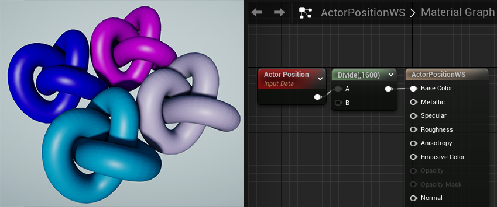
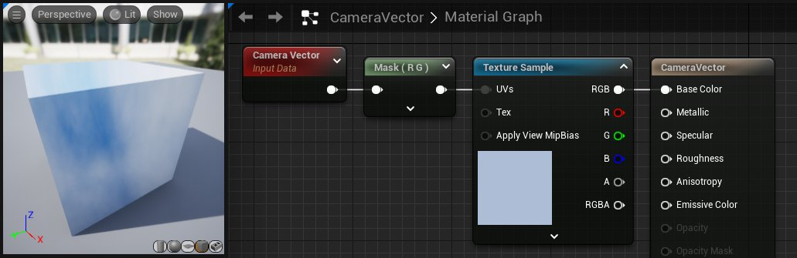
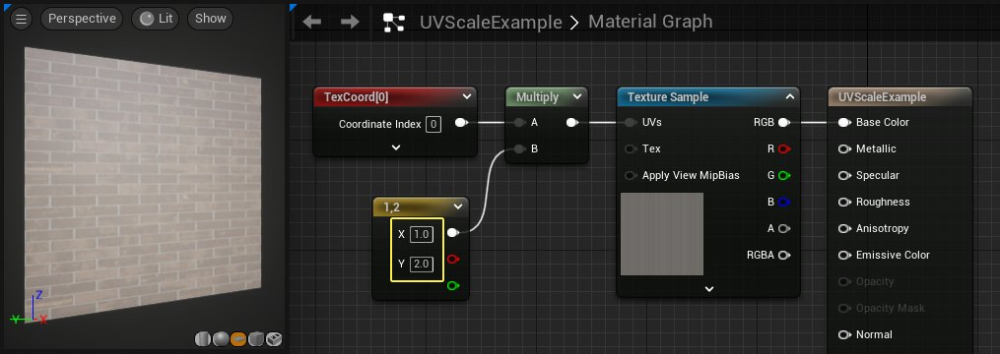
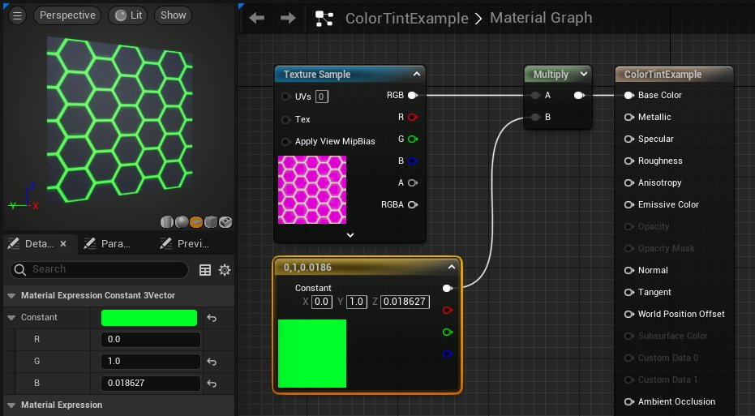
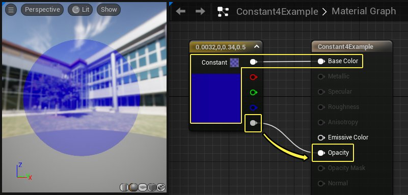
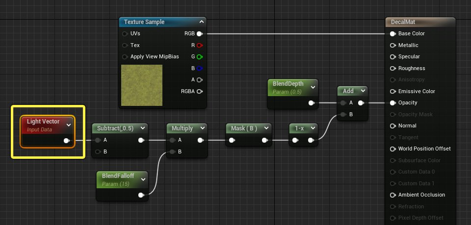
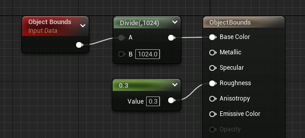
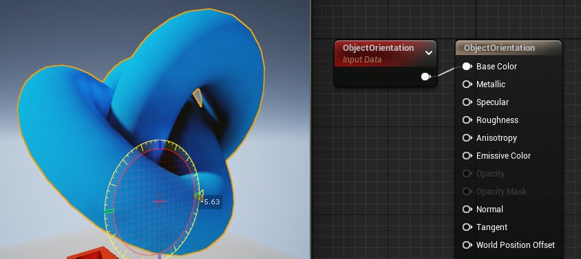

# 向量类材质表达式

> 路径：虚幻引擎5.7文档 / 设计视觉、渲染和图形效果 / 材质 / 材质表达式参考 / 向量类材质表达式

> 原始页面：https://dev.epicgames.com/documentation/unreal-engine/vector-material-expressions-in-unreal-engine

本文档介绍了所有可用的向量材质表达式，这些表达式可输出映射至RGBA的向量。这些表达式可用于多种不同的空间材质效果，包括获取对象在世界场景空间中的位置以便材质可以做出响应，或者当进入特定区域时变换字符的颜色。此外，还有许多其他表达式允许你控制本地材质效果，你可以查看下面的示例了解更多信息。

## ActorPositionWS

**ActorPositionWS** 输出向量3(RGB)数据，该数据表示对象在世界场景空间中的位置以及其上的材质。

在此示例中，ActorPositionWS被直接输入到材质的底色（Base Color）中。因此，当每个对象被移至三维空间中的不同位置时，每个球体以及应用于它们的材质将显示不同的颜色。请注意，ActorPositionWS节点的结果将除以1600，以创建一个漂亮的颜色过渡效果，而不是让颜色突然切换。

## CameraPositionWS

**CameraWorldPosition** 表达式会输出一个三通道向量值，该值表示摄像机在世界场景空间中的位置。

在下面的示例中，摄像机位置（Camera Position）被输入材质的底色。请注意当摄像机位置改变时，预览球体如何改变颜色。

## CameraVectorWS

**CameraVector** 表达式输出一个三通道向量值，该值表示摄像机相对于表面的方向，即像素到摄像机的方向。

**使用示例：** CameraVector通常通过将CameraVector连接到ComponentMask并使用CameraVector的x和y通道作为纹理坐标，来用于虚设环境贴图。

## Constant2Vector

**Constant2Vector（常量 2 矢量）**表达式输出双通道矢量值，即输出两个常量数值。

| 属性 | 说明 |
| --- | --- |
| **R** | 指定表达式所输出的矢量的红色（第一个）通道的浮点值。 |
| **G** | 指定表达式所输出的矢量的绿色（第二个）通道的浮点值。 |

**示例：**(0.4, 0.6) 和 (1.05, -0.3)

**用法示例：**Constant2Vector（常量2矢量）对于修改纹理缩放或偏移非常有用，因为UV坐标需要双通道值。

> [!TIP]
> 按住 **2** 键并在材质图表背景的任意位置 **单击鼠标左键**，即可快速创建 Constant2Vector（常量2矢量）节点。

## Constant3Vector

**Constant3Vector（常量3矢量）**表达式输出三通道矢量值，即输出三个常量数值。Constant3Vector常被用于定义实心的RGB，其中每个通道都被赋予一种颜色（红色、绿色、蓝色）。你可以双击材质图表中的Constant3Vector节点，唤起取色器对话框。

| 属性 | 说明 |
| --- | --- |
| **R** | 指定表达式所输出的矢量的红色（第一个）通道的浮点值。 |
| **G** | 指定表达式所输出的矢量的绿色（第二个）通道的浮点值。 |
| **B** | 指定表达式所输出的矢量的蓝色（第三个）通道的浮点值。 |

**示例：**(0.4, 0.6, 0.0) 和 (1.05, -0.3, 0.3)

在本示例中，Constant3Vector与一个纹理样本（Texture Sample）相乘，改变了纹理的颜色。

> [!TIP]
> 按住 **3** 键并在材质图表背景的任意位置 **单击鼠标左键**，即可快速创建 Constant3Vector（常量3矢量）节点。

## Constant4Vector

**Constant4Vector（常量 4 矢量）**表达式输出四通道矢量值，即输出四个常量数值。你可以用Constant4Vector来定义RGBA颜色，其中每个通道都被赋予一种颜色（红色、绿色、蓝色、alpha）。

| 属性 | 说明 |
| --- | --- |
| **R** | 指定表达式所输出的矢量的红色（第一个）通道的浮点值。 |
| **G** | 指定表达式所输出的矢量的绿色（第二个）通道的浮点值。 |
| **B** | 指定表达式所输出的矢量的蓝色（第三个）通道的浮点值。 |
| **A** | 指定表达式所输出的矢量的alpha（第四个）通道的浮点值。 |

**示例：**(0.4, 0.6, 0.0, 1.0) 和 (1.05, -0.3, 0.3, 0.5)

在下面的示例中，使用Constant4Vector表达式定义材质的 **底色（Base Color）** 和 **不透明度（Opacity）**。最上面的引脚输出RGB颜色，最下面的引脚输出alpha通道的值。alpha值为0.5时就能形成半透明材质。

> [!TIP]
> 按住 **4** 键并在材质图表背景的任意位置 **单击鼠标左键**，即可快速创建 Constant4Vector（常量4矢量）节点。

## LightVector

LightVector材质表达式与 **延迟贴花（Deferred Decal）** 材质和贴花Actor一起使用时会输出向量（RGB）数据，这些数据表示当前像素在贴花的坐标空间中相对于贴花投影框的位置，并以归一化单位表示（0到1的区间内）。

如果与 **LightFunction** 材质一起使用，LightVector材质表达式会输出向量（RGB）数据，表示光源的坐标空间中从光源到像素的向量。

在其他材质域中，未使用LightVector表达式。

> [!WARNING]
> LightVector材质表达式应该仅用于 **延迟贴花（Deferred Decal）** 或 **LightFunction** 材质域。

### 示例

你可以使用LightVector材质表达式为延迟贴花创建线性衰减效果。 在下面的图表中，有两个参数用于控制贴花与接收表面之间的混合的深度和衰减。

结果如下所示。

## 对象边界

**对象边界（Object Bounds）** 表达式输出应用材质的对象在每个轴上的大小。表达式会输出一个float3值，分别表示X轴、Y轴、Z轴。如果将此几点链接到底色（Base Color），轴将分别对应于R、G、B。

在上面的视频中，注意当对象延各个轴缩放时，材质如何改变颜色。

## ObjectOrientation

**ObjectOrientation** 表达式输出应用材质的对象的向上空间向量。换言之，对象的局部正z轴正指向此方向。

## ObjectPositionWS

**ObjectPositionWS** 表达式输出对象边界的世界场景空间中心位置。下图中的每个球体都呈现出不同的颜色，因为它们被移动到了空间中的不同位置。在关卡中，RGB颜色通道分别对应X、Y和Z轴。此节点在为植物创建球形照明时很有用。

> 图片已省略：Object Position表达式

## 粒子位置WS

**粒子位置WS（ParticlePositionWS）** 表达式输出代表世界场景空间中每个单独粒子位置的Vector3(RGB)数据。

> 图片已省略：Particle Position WS example

在这幅图像中，粒子位置WS（ParticlePositionWS）被馈送到自发光颜色中来显示数据。粒子系统被放大以显示颜色是如何根据位置变化的。

## PixelNormalWS

**PixelNormalWS** 表达式根据当前法线输出向量数据，该数据表示像素所面对的方向。

> 图片已省略：Pixel Normal WS示例

在此示例中，PixelNormalWS被输入到底色（Base Color）中。请注意，法线贴图用于给出逐像素结果。

## 预蒙皮局部法线

**预蒙皮局部法线（Pre-Skinned Local Normal）** 向量表达式输出一个三通道向量值，该值表示骨架网格体和静态网格体的局部表面法线。这让你能够实现局部对齐的三平面材质以及在材质中实现网格体对齐效果。

在此示例中，材质使用与网格体局部表面法线对齐的三平面纹理。

> 图片已省略：undefined

点击查看大图。

|  |  |
| --- | --- |
| 三平面预蒙皮局部法线（Tri-Planar Pre-Skinned Local Normal）向量表达式 | 三平面材质 |

## 预蒙皮局部位置

**预蒙皮局部位置（Pre-Skinned Local Position）** 向量表达式输出一个三通道向量值，该值允许访问骨架网格体的默认姿势位置以便在每个顶点 输出中使用。这使你能够在动画角色上获得局部化效果。该向量表达式也可用于静态网格体，它将返回 标准局部位置。

> 图片已省略：undefined

点击查看大图。

在此示例中，骨架网格体的默认姿势用于对比贴图与右侧的默认UV贴图。

|  |  |
| --- | --- |
| 预蒙皮局部位置（Pre-Skinned Local Position）向量表达式 | 骨架网格体的默认UV布局 |

## ReflectionVectorWS

**ReflectionVectorWS** 表达式在本质上类似于[CameraVectorWS](#cameravectorws)，但它输出一个三通道向量值，该值表示通过表面法线反射的摄像机方向。

**使用示例：**ReflectionVector通常用于环境贴图，其中的反射向量会被输入立方体贴图纹理的UV坐标。这可以让你在材质上创建任意反射，不必存寻物理环境的规则。你也可以使用反射向量在未启用 *Surface TranslucencyVolume**或**Surface ForwardShading** 的半透明材质上创建低开销的伪反射。

> 图片已省略：Fake translucent reflections

## VertexNormalWS

**VertexNormalWS** 表达式输出世界场景空间顶点法线。它只能用于在顶点着色器中执行的材质输入，例如WorldPositionOffset。该表达式对于设置网格体增大或缩小很有用。请注意，沿法线偏移位置会导致几何图形沿UV缝隙拆分。

在上面的示例中，由于每个顶点在各自的法线方向上移动，预览球体似乎会随着正弦运动按比例放大和缩小。

## 向量噪点

向量噪点材质（Vector Noise Material）表达式添加了更多的三维或四维向量噪点结果以在材质中使用。由于这些函数会产生运行时间开销，建议在使用它们开发外观之后，使用渲染目标功能，将所有或部分计算烘焙到纹理中。

这些材质表达式允许在最终资源的引擎中开发程序外观，从而提供了一种使用外部工具创建程序生成纹理的替代方法。在向量噪点材质表达式（Vector Noise Material Expression）中，你将看到以下向量噪点类型。

| 图像 | 选项 | 说明 |
| --- | --- | --- |
| Cellnoise | **单元格噪点（Cellnoise）** | 为三维网格中的每个对象返回随机颜色（即从应用于节点输入的数学下限运算）。对于给定位置，结果始终保持一致，因此可以提供一种可靠的方法来将随机性添加到材质中。该向量噪点（Vector Noise）函数的计算非常便宜，因此没有必要为了性能而将它烘焙到纹理中。 |
| Perlin 3D noise | **Perlin三维噪点（Perlin 3D Noise）** | 为三维网格中的每个对象返回随机颜色（即从应用于节点输入的数学下限运算）。对于给定位置，结果始终保持一致，因此可以提供一种可靠的方法来将随机性添加到材质中。该向量噪点（Vector Noise）函数的计算非常便宜，因此没有必要为了性能而将它烘焙到纹理中。 |
| Perlin Gradient | **Perlin梯度（Perlin Gradient）** | 计算标量Perlin Simplex噪点的分析三维梯度。输出为四个通道，其中前三个(RGB)为梯度噪点，第四个(A)为标量噪点。该噪点类型对于表面上的凹凸或者流动贴图很有用。 |
| Perlin Curl | **Perlin旋度（Perlin Curl）** | 计算向量Perlin Simplex噪点（又名旋度噪点）的分析三维旋度。输出为一个三维有向旋度向量，它对流体或粒子流动很有用。 |
| Voronoi Noise | **Voronoi** | 计算与标量噪点材质节点相同的Voronoi噪点。标量Voronoi噪点在三维空间中散射种子点，并返回与相隔最近的一个种子点的距离。向量噪点（Vector Noise）变体返回RGB中最近的种子点的位置，以及在A中与它相隔的距离。特别是与单元格噪点（Cellnoise）结合使用时，这可以允许每个Voronoi单元格执行一些随机行为。 |

下面是一个简单的石床材质，使用Voronoi向量噪点（Voronoi Vector Noise）的距离分量，并结合向量噪点（Vector Noise） > 单元格噪点（Cellnoise），来调整一些表面凹凸并在缝隙和种子位置中混合苔藓，以更改每块岩石的颜色和凹凸高度。

> 图片已省略：Stone blend example

正如普通的Perlin噪点一样，基于导数的 **Perlin旋度** 和 **Perlin梯度** 运算也可以按倍频添加在一起。对于更复杂表达式的导数，有必要计算表达式结果的梯度。为了帮助实现这一点，可以将要计算的表达式放入一个材质函数中，并将其与以下辅助节点一起使用。

| 选项 | 说明 |
| --- | --- |
| **Prepare3DDeriv** | 利用四面体图形中的位置偏移计算三维导数。在该函数产生的每个偏移位置计算同一个三维函数，然后将结果值输入Compute3DDeriv。 |
| **Compute3DDeriv** | 利用四面体图形中的位置偏移计算三维导数。与Prepare3DDeriv一起使用。 |
| **GradFrom3DDeriv** | 根据Prepare3DDeriv/Compute3DDeriv的结果计算三维梯度向量。 |
| **CurlFrom3DDeriv** | 根据Prepare3DDeriv/Compute3DDeriv的结果计算三维向量场的旋度。 |

> [!NOTE]
> 这些辅助材质函数使用四面体图形中间隔的基本表达式的四个求值来近似计算这些基于导数的运算。

你将在下面看到各种噪点函数的相关说明，这些函数可以在向量噪点材质表达式（Vector Noise Material Expression）中找到。

| 项目 | 说明 |  |
| --- | --- | --- |
| 属性 |  |  |
| **函数** | **单元格噪点（Cellnoise）**：为三维空间中的每个整数网格单元格提供随机颜色。大约有10条指令。 **Perlin三维噪点（Perlin 3D Noise）**：计算性Perlin噪点，带三维输出，每个通道输出的范围为-1到1。如果只使用红色通道，则有大约83条指令；如果使用所有三个通道，则有125条指令。 **Perlin梯度（Perlin Gradient）**：计算Perlin噪点函数的梯度。RGB输出包含梯度向量，A为标量噪点。大约有106条指令。 **Perlin旋度（Perlin Curl）**：计算三维旋度噪点。输出为Perlin三维噪点的数学旋度。大约有162条指令。 **Voronoi**：与 *噪点（Noise）* 表达式中的Voronoi函数的算法和指令数相同，但RGB为每个Voronoi单元格中最近的种子点的位置，A为与该种子点相隔的距离。 |  |
| **质量（Quality）** | 外观/性能设置。值越小，速度越快，但可能外观越差；值越大，速度越慢，但可能外观越好。 |  |
| **平铺（Tiling）** | 对于支持它的噪点函数，它允许平铺噪点。此函数使用成本较高，但在将噪点烘焙到无缝缠绕纹理时很有用。 |  |
| **平铺大小（Tile Size）** | 平铺时噪点应多久重复一次。对于Perlin噪点变体，平铺大小（Tile Size）必须是三的倍数。 |  |
|  | 输入 |  |
| **位置（Position）** | 允许通过三维向量来调整纹理大小。 |  |

- **单元格噪点（Cell Noise）** 材质示例：

  > 图片已省略：undefined

  点击查看大图。
- **Perlin梯度（Perlin Gradient）** 材质示例：

  > 图片已省略：undefined

  点击查看大图。
- **Voronoi** 材质示例：

  > 图片已省略：undefined

  点击查看大图。
