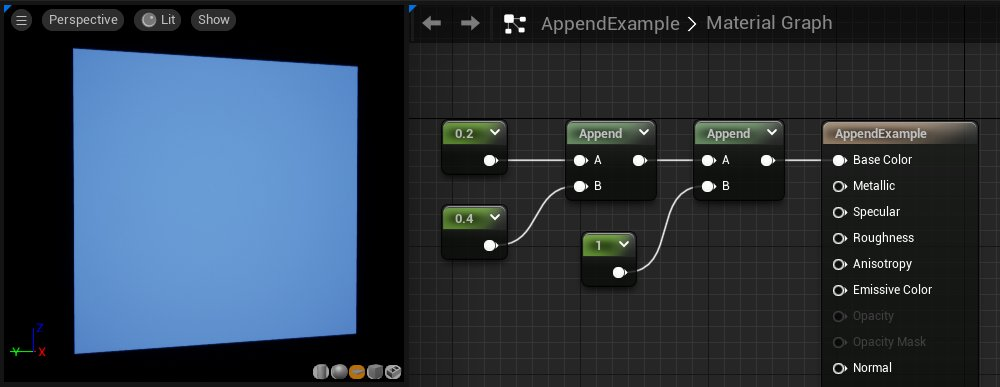
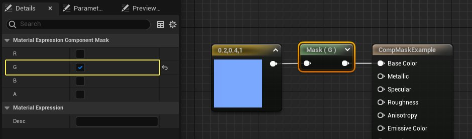
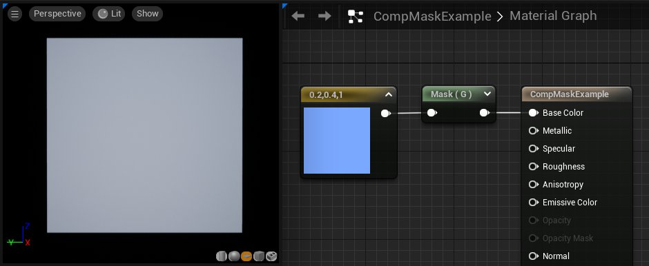
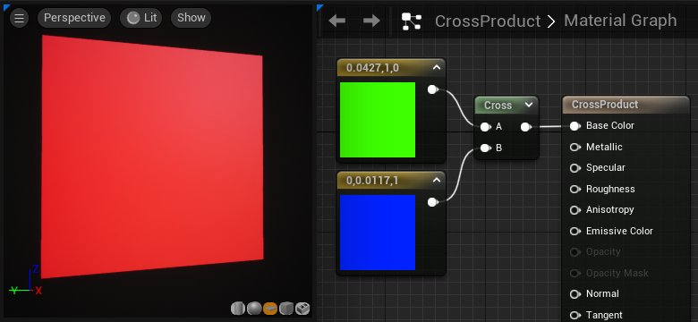
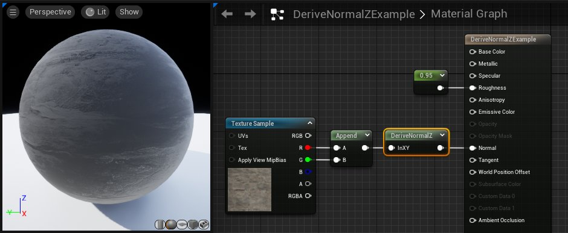
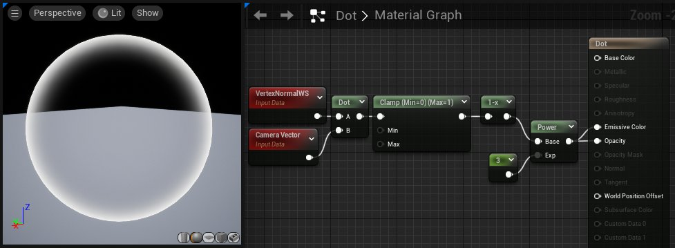
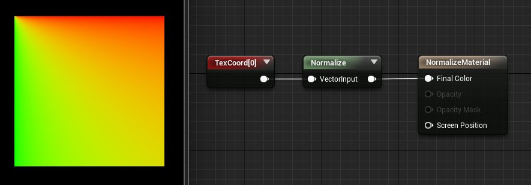
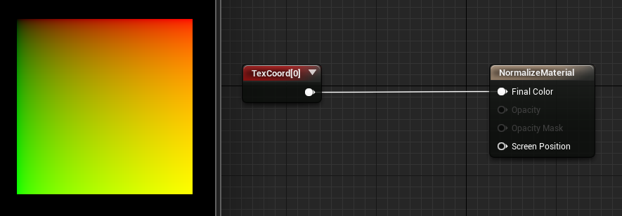

# 向量操作类材质表达式

> 路径：虚幻引擎5.7文档 / 设计视觉、渲染和图形效果 / 材质 / 材质表达式参考 / 向量操作类材质表达式

> 原始页面：https://dev.epicgames.com/documentation/unreal-engine/vector-operation-material-expressions-in-unreal-engine

## AppendVector

**AppendVector（追加向量）** 表达式允许您将数据通道组合在一起，以创建通道数比原始向量更多的向量。例如，您可以使用两个 [常量](../constant-material-expressions/index.md#constant) 值并进行追加，以建立双通道 [Constant2Vector（常量 2 向量）](../constant-material-expressions/index.md#constant2vector) 值。AppendVector有助于将单个纹理中的通道重新排序，或者将多个灰阶纹理组合成一个 RGB 彩色纹理。

| 输入 | 说明 |
| --- | --- |
| **A** | 接收要向其追加额外数据的数值。 |
| **B** | 接收数值并将其追加到A。 |

### 示例

AppendVector按照输入顺序运作，这意味着输入的B会追加到输入A中数据的末尾。以下示例中有分别两个追加操作。在第一个中，**0.2** 和 **0.4** 一起追加，形成了一个双通道的矢量 (0.2, 0.4)。在第二个追加节点中，一个常数值1被追加到 (0.2, 0.4) 的末尾。这样最终形成了一个三通道矢量 (0.2, 0.4, 1)。在该示例中它被用作一个RGB数值来定义材质的底色。

## ComponentMask

**ComponentMask（分量蒙版）**表达式允许从输入中选择通道（R、G、B 和/或 A）的特定子集以传递到输出。尝试传递输入中不存在的通道将导致错误，除非输入是单个常量值。在这种情况下，会将单个值传递到每个通道。选择传递的当前通道将显示在表达式的标题栏中。

在材质节点中选择ComponentMask表达式，然后使用 **细节面板（Details Panel）** 属性中的复选框来选择哪些通道允许通过输出。

| 属性 | 说明 |
| --- | --- |
| **R** | 如果选中此项目，那么会将输入值的红色通道（第一个通道）传递到输出。 |
| **G** | 如果选中此项目，那么会将输入值的绿色通道（第二个通道）传递到输出。 |
| **B** | 如果选中此项目，那么会将输入值的蓝色通道（第三个通道）传递到输出。 |
| **A** | 如果选中此项目，那么会将输入值的阿尔法通道（第四个通道）传递到输出。 |

以下示例中的ComponentMask有一个输入 (0.2,0.4,1.0)。细节面板中仅启用了 **G通道**，所以节点只输出一个数值 **0.4**。这会在输入材质的底色输入时导致40%亮度灰阶数值。

## CrossProduct

**CrossProduct** 表达式计算两个三通道向量值输入的交叉乘积，并输出产生的三通道向量值。假定空间中有两个向量，则交叉乘积是一个同时垂直于两个输入的向量。

| 输入 | 说明 |
| --- | --- |
| **A** | 接受一个三通道向量值。 |
| **B** | 接受一个三通道向量值。 |

**使用示例：**CrossProduct常用于计算垂直于另外两个方向的方向。

## DeriveNormalZ

**DeriveNormalZ（派生法线 Z）**表达式在给定 X 和 Y 分量的情况下派生切线空间法线的 Z 分量，并输出所产生的三通道切线空间法线。Z 计算方法为：Z = sqrt(1 - (x * x + y * y))；

| 输入 | 说明 |
| --- | --- |
| **输入 XY（InXY）** | 以双通道向量值形式接收切线空间法线的 X 和 Y 分量。 |

## DotProduct

**DotProduct** 表达式计算点积，点积可以描述为一个向量投影到另一个向量上的长度，也可以描述为两个向量之间的余弦乘以它们的幅值。许多技术使用这种算法来计算衰减。DotProduct要求两个向量输入具有相同数量的通道。

| 输入 | 说明 |
| --- | --- |
| **A** | 接受一个值或任意长度的向量。 |
| **B** | 接受一个值或具有与 **A** 相同长度的向量。 |

## Normalize

**Normalize** 表达式计算并输出其输入的归一化值。归一化向量（也称"单位向量"）的整体长度为1.0。这意味着输入的每个分量都除以向量的总大小（长度）。

**示例：**通过Normalize传递(0,2,0)或(0,0.2,0)都将输出(0,1,0)。通过Normalize传递(0,1,-1)将输出(0, 0.707, -0.707)。全零向量是唯一的例外，它不会改变。

Normalized Input Vector

Non-Normalized Input Vector

> [!NOTE]
> 没有必要对插入到法线材质输出中的表达式进行归一化。

## Transform

**Transform（变换）** 材质表达式将三通道向量值从一种参考坐标系转换到另一种参考坐标系。

默认情况下，材质的所有着色器计算都在切线空间中完成。向量常量、摄像机向量和光线向量等在材质中使用之前，都会转换到切线空间。Transform表达式允许将这些向量从切线空间转换到全局空间、局部空间或视图空间坐标系。另外，它允许将全局空间和局部空间向量转换到任何其他参考坐标系。

当材质图表中选中了Transform节点时，细节面板中会显示以下属性：

| 属性 | 说明 |
| --- | --- |
| **源（Source）** | 指定要转换的向量的当前坐标系。这可以是以下其中一项：全局（World）、局部（Local）或切线（Tangent）。 |
| **目标（Destination）** | 指定要将向量转换到的目标坐标系。这可以是以下其中一项：全局（World）、视图（View）、局部（Local）或切线（Tangent）。 |

Transform节点会对镜像 UV 加以考虑，例如，以使凸显仅影响人物的右侧边缘。

对于生成全局空间法线以便对立方体贴图进行取样，Transform节点非常有用。法线贴图可转换到全局空间。以下示例将法线从 **切线空间** 转换到 **全局空间**，以便对立方体贴图进行取样。

> 图片已省略：undefined

点击查看大图。

将法线转换到视图空间可用于创建边缘效果。这可通过使用网格法线生成纹理坐标（通常称为"球面映射"）来实现。使用这种方法，正对着摄像机的法线将映射到纹理坐标的中心，而垂直于摄像机的法线将映射到纹理坐标的边缘。例如，你可以使用Transform表达式来映射一张准星纹理，让它始终面对摄像机。

> 图片已省略：Bullseye Texture

值为 (0,0,1) 的 Constant3Vector（常量 3 向量）输送到设置了 TRANSFORM_View 的 Transform，接着将结果传递到 ComponentMask（分量蒙版）（仅传递 R 和 G）。因为 Transform将输出 -1 到 1 范围内的值，我们必须使这些值偏离以使其处于 0-1 范围内。实现方法是乘以 0.5 再加上 0.5。然后，直接将结果连接到纹理的"坐标"（Coordinates）。

> 图片已省略：Transform edge-on effect

围绕静态网格体旋转时，准星会一直对准屏幕。但如果把变幻节点中的 **目标** 改为 **世界空间（World Space）** 而非视图空间，则准星会朝上。

> [!WARNING]
> **由于插值器受限制，VertexColor（顶点颜色）与 Transform节点互斥。**如果您同时使用 Transform节点和 VertexColor（顶点颜色），那么 VertexColor（顶点颜色）的结果为全白色。

> [!WARNING]
> **目前，Transform节点无法正确处理不一致的比例缩放。**

## TransformPosition

**TransformPosition（转换位置）**表达式可将屏幕空间中的任何位置转换到表达式的 TransformType 变量所指定的目标空间。目前只支持转换到全局空间。此表达式可用来获取材质中的全局空间坐标。要显现全局位置，您可以将它直接连接到"自发光"（Emissive）：
