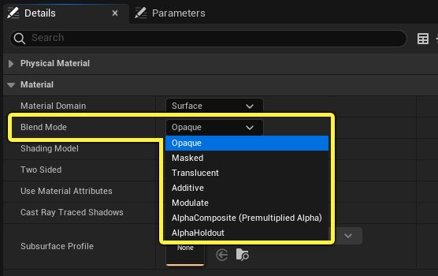
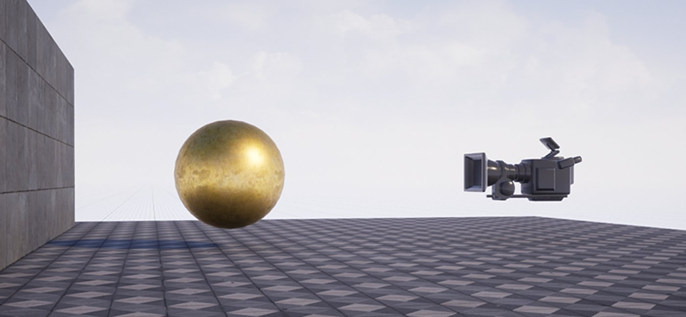
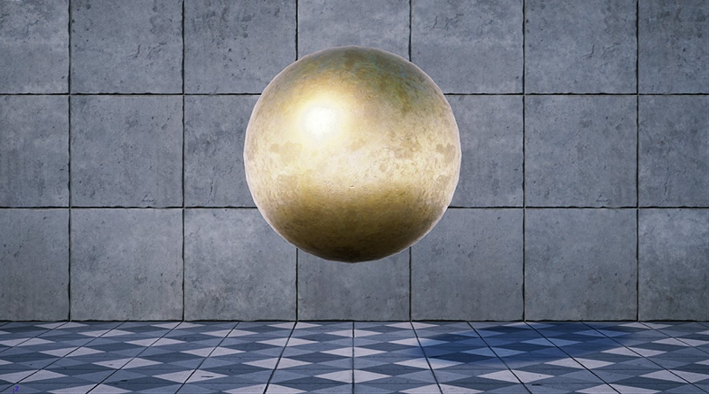
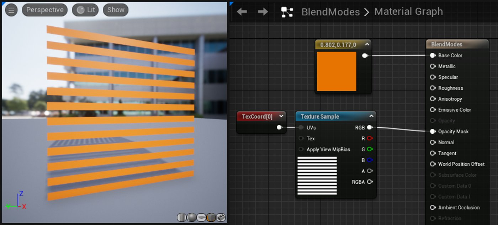
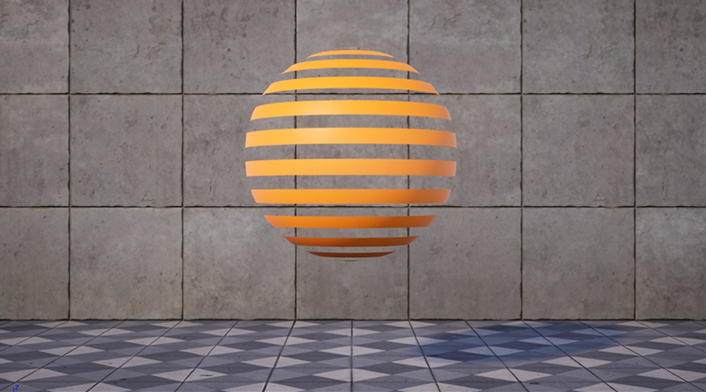
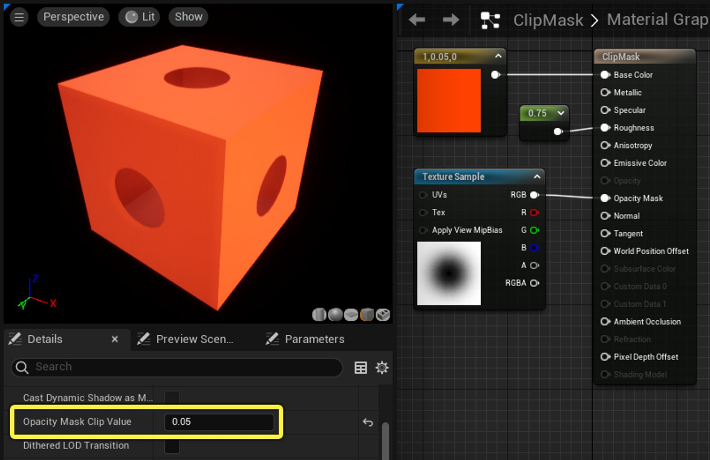
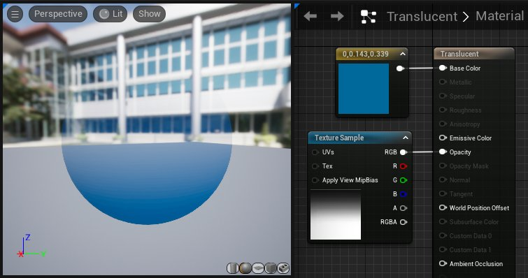
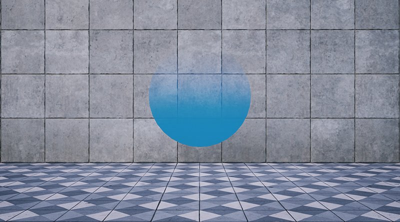

# 材质混合模式

> 路径：虚幻引擎5.7文档 / 设计视觉、渲染和图形效果 / 材质 / 材质属性 / 材质混合模式

> 原始页面：https://dev.epicgames.com/documentation/unreal-engine/material-blend-modes-in-unreal-engine

混合模式说明当前材质的输出如何与背景中已经绘制的内容混合。 从专业角度来说，当某个材质需要叠加在其他像素上进行绘制时，混合模式允许你控制引擎如何将材质（**来源颜色**）与帧缓冲区中的内容（**目标颜色**）相混合。

混合模式选项与其他基础[材质属性](../index.md)都位于"细节（Details）"面板中：

本文将在一台摄像机和墙壁之间放置一个球体，以此演示各种混合模式的效果。 更改球体材质上的混合模式，可以看到球体如何与墙面上的像素混合。

## 不透明

不透明（Opaque）混合模式是最简单的模式，大概也是最常用的模式。 它表示表面既不能被光线通过、也不能被穿透。 此模式适合大部分塑料、金属、岩石等表面，以及其他表面类型的大部分区域。 在摄像机画面中，金色球体完全遮挡了它后面的墙壁。

|  |  |
| --- | --- |
|  |  |
| 场景设置 | 摄像机视图 |

## 遮罩

遮罩混合模式（Masked Blend Mode）用于一些需要以二元（开/关）方式控制可视性的对象。 例如，假定一个材质要模拟铁丝围栏或格栅。 某些区域看起来像固体，而其他区域不可见。 此类材质适合于遮罩混合模式。

下面显示了一个遮罩材质的图表，其中，一张黑白条带纹理是**不透明遮罩（Opacity Mask）**的输入参数。 遮罩的白色部分表示该区域可见，而黑色则不可见。 使用遮罩材质时，不存在中间区域的不透明度。

下面是该材质在摄像机中的样子：

请记住，**透明**和**不渲染**是不同的概念。 透明表面（例如玻璃）仍会参与光线的交互，例如反射（镜面反射）。 而在遮罩模式下，被剔除的像素将完全不被绘制；这些区域看不到任何反射。 如果你想保留反射或高光度功能，最好使用半透明混合模式，或考虑创建[分层材质](../../layering-materials/index.md)。

此外，由于被剔除的区域中不会渲染特定效果（例如反射），因此系统不会计算它们，从而节省GPU的性能开销。

### 不透明裁剪遮罩

使用遮罩混合模式时，你需要特别注意**不透明遮罩裁剪值（Opacity Mask Clip Value）**这个属性。 该属性是一个0-1的标量值，决定了不透明遮罩纹理中的像素在低于多少值后将被剔除（分界点）；比这个分界点**更暗**的像素将一律不渲染。

**不透明遮罩裁剪值（拖动滑块可预览。）**

> [!NOTE]
> 在以上示例中，材质的**双面（Two Sided）**属性为**True**（勾选状态），这就是你能看到盒子内部的原因。
>
> 此外，尽管此处是一个交互式示例，但**不透明遮罩裁剪值（Opacity Mask Clip Value）**属性本身无法在运行时更改。

## 半透明（Translucent）

半透明混合模式（Translucent Blend Mode）用于需要某种形式的透明度的对象。 它不同于遮罩混合模式，因为它允许透明度的级别发生变化。

这种混合模式的工作方式如下：接收一个**不透明度（Opacity）**值或纹理，并将其应用于表面，使得黑色区域完全透明，白色区域完全不透明，而不同深浅的中间渐变色将产生对应的透明度水平。 在示例中，不透明参数接受了一张黑白色梯度纹理，这样，球体在网格体顶部完全透明，中间逐渐变色，在底部变得完全不透明。

重点来了！注意，半透明材质目前不支持镜面反射。 这意味着，你在表面上看不到任何反射。 但是，你可以使用使用立方体贴图，通过类似如下的节点网络来模拟反射。 立方体贴图（Cubemap）纹理会直接添加到基础颜色之上。

> 图片已省略：球体上的伪高光度

## 叠加

叠加混合模式（Additive Blend Mode）中，引擎直接获取材质的像素，将其与背景像素相加。 这很像Photoshop中的*线性减淡（添加）（Linear Dodge (Add)）*混合模式。 这表示不会变暗；因为所有像素值都添加在一起，黑色直接渲染为透明。 这种混合方式适合于各种特殊效果，例如火焰、蒸汽或全息图。

> 图片已省略：叠加材质图表

与半透明混合模式一样，此混合模式不支持高光度（即 反射）。 这种叠加性质可能意味着，你也无法使用反射效果；不过你可以参考上文中半透明（Translucent）小节中的立方体贴图，模拟类反射的效果。

在下图中，场景中添加了两个球体。 请注意，在两个球体重叠之处，像素被叠加到一起，因此更加明亮。

> 图片已省略：叠加材质示例

叠加型材质的一个缺陷是，在浅色背景上常常很难辨识。 侧视图说明了这点。

> 图片已省略：叠加材质侧视图

一种解决方案是改用[AlphaComposite](index.md)混合模式，它可以优化明亮场景中的饱和度和可视性。

## 调制

调制混合模式（Modulate Blend Mode）将材质的值乘以背景的像素。 它的效果类似于Photoshop中的正片叠底混合模式（ Multiply Blend Mode），能产生变暗的效果。

> 图片已省略：调制材质图表

在上图中，材质着色模型为**无光照（Unlit）**，混合模式为**调制（Modulate）**。 "自发光"采用了一个Constant3向量作为参数，用于定义表面的颜色。

> 图片已省略：调制材质示例

请注意，多个球体重叠时，其像素会相乘，导致颜色变深。

> [!WARNING]
> 调制混合模式最适合某些粒子效果，但请注意，此模式不支持光照或单独半透明。

## Alpha复合

**AlphaComposite**混合模式可以让你控制材质部分的混合方式。 通过一些材质设置或逻辑，你可以控制材质的哪些部分以叠加方式混合，哪些部分使用材质的不透明输入以半透明方式混合。 AlphaComposite的原理是将底层场景颜色乘以材质不透明度的反转值。因此当材质被添加到场景颜色时，较不透明的部分会比那些更不透明的部分显得更加鲜艳饱和。

> 图片已省略：Alpha复合图表

使用具有实际效果的AlphaComposite的材质设置示例。

## Alpha维持

**AlphaHoldout**混合模式可让你"维持"材质的Alpha，在视图空间中直接在材质后方的对象上打孔。 下图显示了AlphaHoldout实现的摄像机和场景布局。

1. 摄像机。
2. 前景中的静态网格体充当"打孔"对象。 **AlphaHoldout材质**被应用于该网格体。 该材质必须使用**无光照**着色模型。
3. 接收表面（你打算穿过其中打孔）放置在AlphaHoldout对象后面；在本例中是一堵砖墙。 接收表面上的材质**必须**使用半透明、叠加、调制或AlphaComposite混合模式。 AlphaHoldout材质不能作用于不透明材质。
4. 场景的背景，透过孔可见。

从摄像机的视角，你将通过接收表面看到透明的孔，使其后面的对象可见。

> 图片已省略：AlphaHoldout示例

由于AlphaHoldOut材质位于单独的静态网格体资产上，你可以在编辑器中轻松移动它，或在游戏中对其制作动画。

## 混合模式方案

| 模式 | 说明 |
| --- | --- |
| **不透明（Opaque）** | 最终颜色 = 来源颜色。 这意味着材质将在背景上绘制。 此混合模式与光照兼容。 |
| **遮罩（Masked）** | 如果不透明遮罩（OpacityMask） > 不透明遮罩裁剪值（OpacityMaskClipValue），最终颜色 = 来源颜色，否则废弃像素。 此混合模式与光照兼容。 |
| **半透明（Translucent）** | 最终颜色 = 源颜色 * 不透明度 + 目标颜色 * (1 - 不透明度)。 此混合模式与动态光照**不**兼容。 |
| **叠加（Additive）** | 最终颜色 = 来源颜色 + 目标颜色。 此混合模式与动态光照**不**兼容。 |
| **调制（Modulate）** | 最终颜色 = 来源颜色 x 目标颜色。 此混合模式与动态光照或雾**不**兼容，除非该材质为贴花材质。 |
| **AlphaComposite（预乘的Alpha）** | 最终颜色 = 来源颜色 + 目标颜色 *（1 - 来源不透明度）。 |
| **AlphaHoldout** | 最终颜色 = 目标颜色 *（1 - 来源不透明度）。 此混合模式与动态光照**不**兼容。 |
