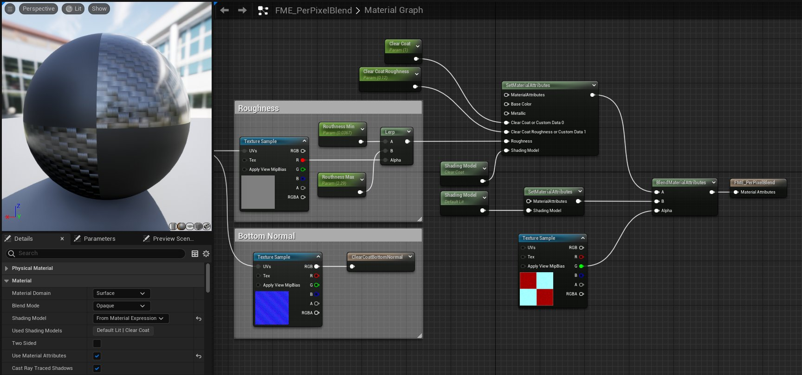
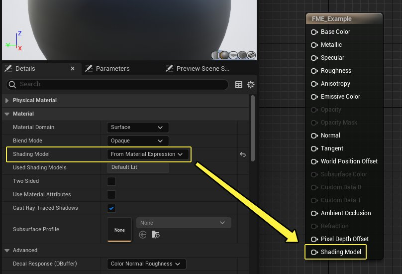
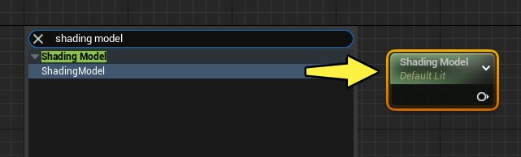
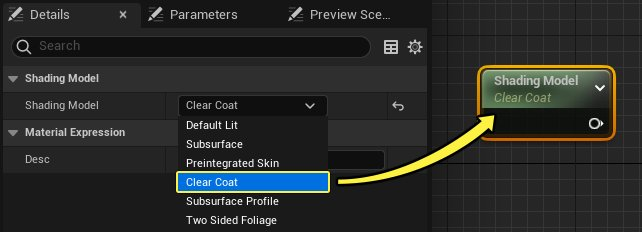
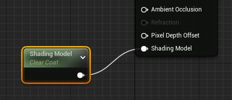
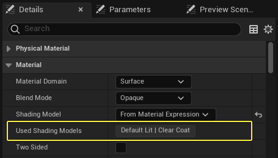
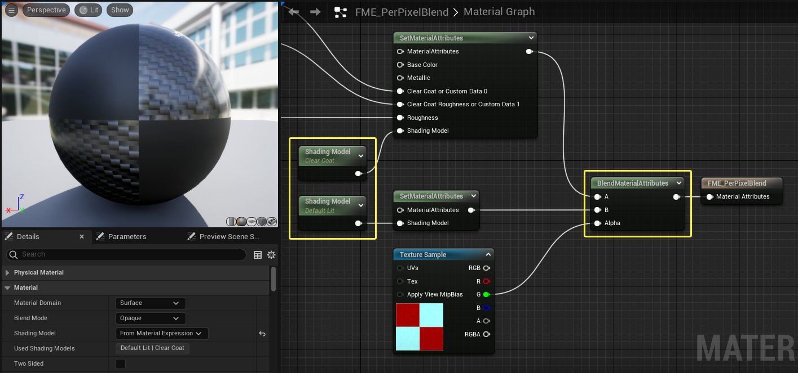
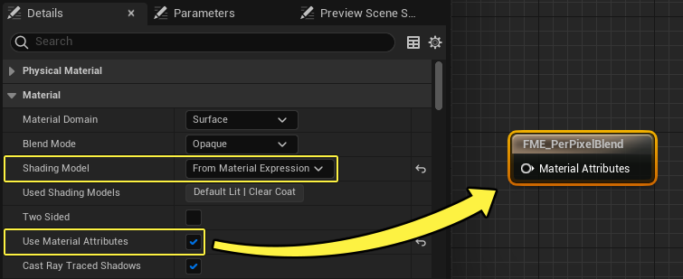

# 基于材质表达式

> 路径：虚幻引擎5.7文档 / 设计视觉、渲染和图形效果 / 材质 / 材质属性 / 着色模型 / 基于材质表达式

> 原始页面：https://dev.epicgames.com/documentation/unreal-engine/from-material-expression-shading-model-in-unreal-engine

**基于材质表达式（From Material Expression）** 着色模型是一项高级功能，允许你通过材质图表中的逻辑，将多个着色模型合并到单个材质（或材质实例）中。

启用 **基于材质表达式（From Material Expression）** 着色模型后，你可以使用alpha蒙版或者条件逻辑（比如 **开关表达式（Switch Expressions）** 和 **If** 语句），在着色模型之间进行逐像素混合。

## 使用

要在单个材质中使用多个着色模型，你必须首先在细节面板中将着色模型属性设置为 **基于材质表达式（From Material Expression）**。

1. 点击材质图表中的空白处，或者选择[主材质节点](../../../unreal-engine-material-editor-user-guide/using-the-main-material-node/index.md)来在细节面板中显示材质属性。
2. 在 **细节面板（Details Panel）** 中，使用 **着色模型（Shading Model）** 下拉菜单来选择 **基于材质表达式（From Material Expression）**。选中基于材质表达式后，主材质节点上的 **着色模型（Shading Model）** 引脚会变为白色，表示其已启用。

   
3. 在材质图表中 **右键点击** 并且在弹出的菜单中找到 "着色模型"。在图表中添加一个 **着色模型（Shading Model）** 材质表达式。

   
4. 选中图表中的 **着色模型（Shading Model）** 节点。在细节面板中，使用下拉菜单来选用想要的着色模型。

   
5. 将 **着色模型（Shading Model）** 节点连接到主材质节点的 **着色模型（Shading Model）** 输入引脚。该材质现在使用的是 **透明涂层（Clear Coat）** 着色模型，由 **着色模型材质表达式（Shading Model Material Expression）** 衍生而来。

   

这种工作流程的主要优势在于能够在一个材质中混合多个着色模型。下文的小节中有具体的使用示例。

### 在材质中使用着色模型

当材质图表中使用了多个着色模型时，它们会在 **细节（Details）** 面板中 **使用的着色模型（Used Shading Models）** 属性旁边罗列出来，非常便利。

该示例中的材质使用了 默认光照（Default Lit） 和 透明涂层（Clear Coat） 着色模型。

> [!NOTE]
> 请注意，该列表仅显示材质图表中设置的着色模型，与实际编译的并不总是一致。**切换（Switch）** 节点可以用于移除图表中的整个部分，包括着色模型。要参考示例，请见下文的[材质切换节点](#switchnodes)小节。

## 混合多个着色模型

以下小节会展示在材质中混合着色模型的三种不同方式。

### 混合材质属性

要为两个不同的着色模型创建一个基于每个像素的混合，最直接的方式是使用一个 **设置材质属性（Set Material Attributes）** 表达式来定义每个表面，然后使用 **BlendMaterialAttriutes** 节点将其混合。

> [!NOTE]
> 该示例要求你了解如何使用 **材质属性（Material Attributes）** 工作流程来定义材质的物理属性。如果你不熟悉该流程，请阅读关于[材质属性表达式](../../../unreal-engine-material-expressions-reference/material-attributes-expressions/index.md)的文档。

在下面的示例种，**BlendMaterialAttriubtes** 的 **Alpha** 输入中插入了一个棋盘格纹理，以此来在每组材质属性中的 **默认光照（Default Lit）** 和 **透明涂层（Clear Coat）** 着色模型之间添加遮罩。

点击查看大图。

#### 材质设置

执行以下步骤来创建和上图中一样的材质。

1. 在细节面板中，将 **着色模型（Shading Model）** 设置为 **基于材质表达式（From Material Expression）**。在同一部分中，启用 **使用材质属性（Use Material Attributes）** 选项。勾选该选项时，主材质节点会消失并且被一个 **材质属性（Material Attributes）** 输出节点所替代。

   
2. 使用 **SetMaterialAttributes** 表达式来各自定义两个表面类型。在材质图表中选中 **SetMaterialAttributes** 节点，然后点击细节面板中的 **添加元素（Add Element）** 图标。给两个SetMaterialAttributes节点各自添加一个 **着色模型（Shading Model）** 输入引脚。定义好两个才之后，添加一个 **BlendMaterialAttributes** 节点来混合这两组属性。将 **BlendMaterialAttributes** 表达式连接到 **Material Attributes** 输出节点。该流程如下所示。

该示例中使用的整个材质图表如下所示。图表中 **透明涂层（Clear Coat）** 里使用的碳纤维法线贴图可以在[Clear Coat with Dual Normals](../../../unreal-engine-materials-tutorials/using-dual-normals-with-clear-coat/index.md)页面中下载。

> 图片已省略：undefined

点击查看大图。

当材质应用到静态网格体上时，它仅使用一个绘制调用来渲染两个着色模型，而不是进行两次调用。应用了Alpha蒙版后，你可以清晰的看到这两个着色模型映射到了球体的不同部分上。

### If语句

你还可以使用一个 **If** 材质表达式来在同一组材质属性中混合多个着色模型。**If** 表达式会对比 **A和B** 输入中的浮点值，并且根据两者的大小对比输出不同的结果。在下面的示例中，该逻辑用于从两个着色模型中进行选择。

> 图片已省略：使用If表达式每个像素的混合

> [!TIP]
> 默认情况下，若未设置 **B** 值，默认值为 **0**。可在 **细节（Details）** 面板中设置硬编码值，使用从纹理或常量派生的另一个浮点值；或者为 **B** 输入设置参数，以便在材质实例中对其进行控制。This example uses a Constant value of 0.5 for the **B** value.

在下面的比较中，If表达式根据 **A** 求 **B** 的值，以将阴影模型设置为 **默认光照** 或 **透明涂层**。如果 **A** 的浮点值大于 **B**，使用 **默认光照（Default Lit）**，如果 **A** 小于 **B**，使用 **透明涂层（Clear Coat）**。

> 图片已省略：A > B:使用默认光照 | B = 0.0

> 图片已省略：A <= B:使用透明涂层 | B = 0.5

A > B:使用默认光照 | B = 0.0

A <= B:使用透明涂层 | B = 0.5

### Switch节点

使用下述可用 **Switch** 节点控制材质的功能和质量。

- 着色路径切换（Shading Path Switch）

  可指定用于渲染路径的材质逻辑部分。
- 在使用引擎质量水平控制材质逻辑时，

  质量切换（Quality Switch）

  十分适用。
- 在设置材质用于不同设备时，

  特征等级切换（Feature Level Switch）

  十分适用。
- 静态切换（Static Switch）

  或

  静态切换参数（Static Switch Parameter）

  可在基本材质中排除材质的整个分支，或通过材质实例进行控制。

在下面的图表和对比中，若设为 `True`，**静态切换（Static Switch）** 表达式将着色模型设为 **默认光照（Default Lit）**，若设为 `False`，则设置为 **透明涂层（Clear Coat）**。

> 图片已省略：undefined

点击查看大图。

> 图片已省略：Static Switch = True | 默认光照着色模型

> 图片已省略：Static Switch = False | 透明涂层着色模型

Static Switch = True | 默认光照着色模型

Static Switch = False | 透明涂层着色模型

### 材质实例化

完全支持材质实例化，以便在材质图表中设置和使用逻辑，以驱动参数和变量来设置要使用的材质模型。

> [!NOTE]
> 切记，材质实例着色模型显示为 **基于材质表达式（From Material Expression）**，并可被覆盖为静态着色模型。但不可将材质实例着色模型覆盖为 **基于材质表达式（From Material Expression）**，此覆盖将无征兆地失败且不产生任何作用。

## 其他信息

- 着色模型输入始终显示为启用（Shading Model Input Always Shown Enabled）

  - 启用

    使用材质属性（Use Material Attributes）

    并使用Set、Get、Make或Break Material Attributes节点时，即使

    基于材质表达式（From Material Expression）

    未设为所选着色模型，

    着色模型

    输入仍始终显示为启用（不显示为灰色）。除非

    基于材质表达式（From Material Expression）

    设为材质的着色模型，否则引脚不执行任何操作。这不影响默认的主材质输入节点。
- 材质实例覆盖（Material Instance Overrides）

  - 可正常覆盖材质实例的

    着色模型

    ，但将着色模型设置为

    基于材质表达式（From Material Expression）

    会无征兆地失败且不产生任何影响，除非父材质使用着色模型。
- 无光照着色模型

  - 里面有许多编译好的信息，这意味着不引入回归，就无法正确支持着色路径。
