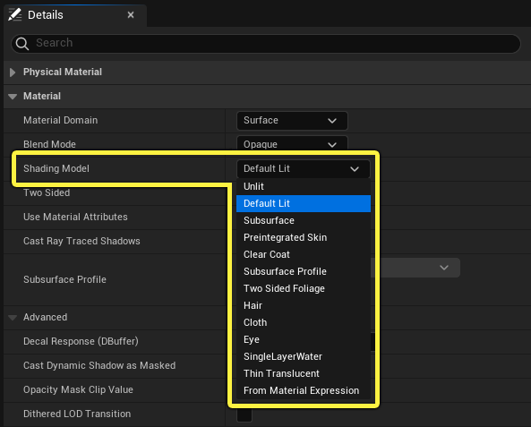
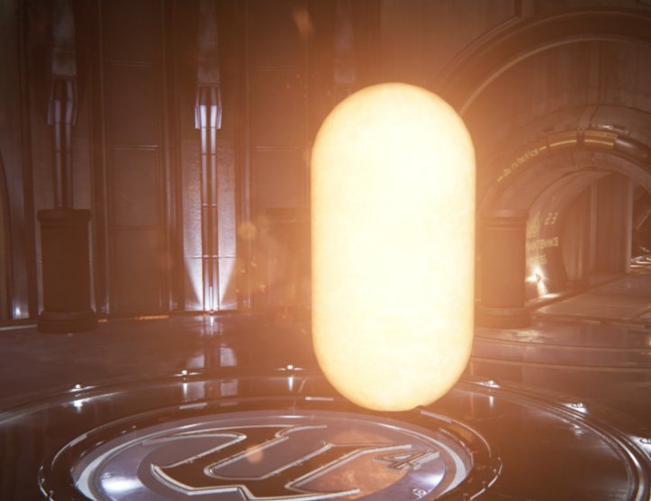
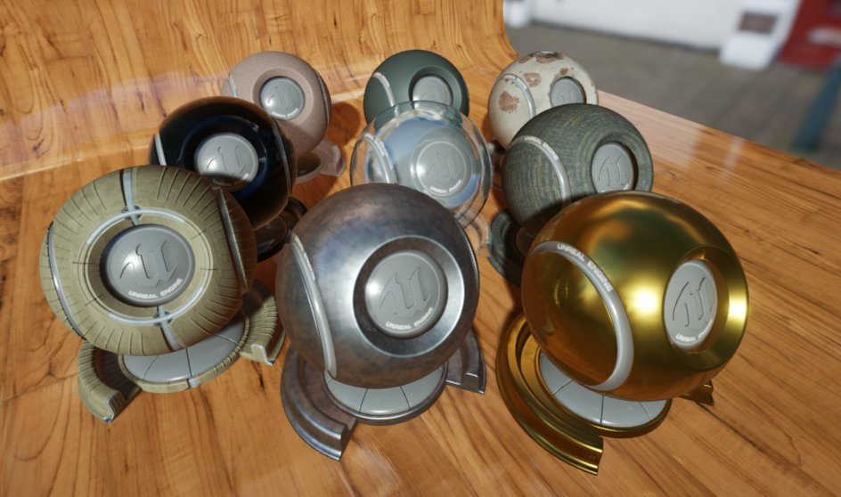
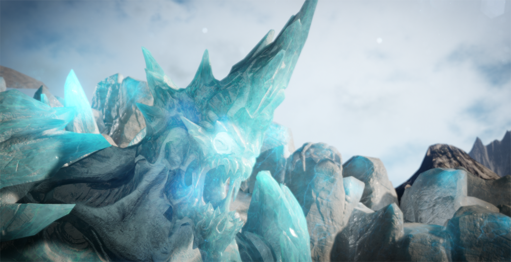
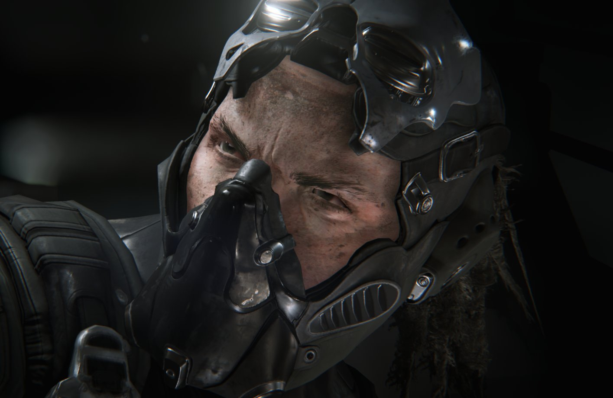
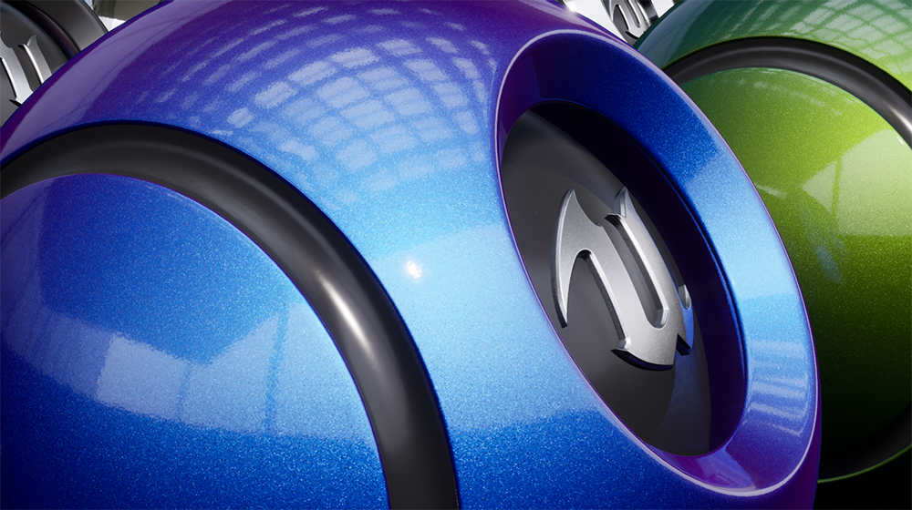

# 着色模型

> 路径：虚幻引擎5.7文档 / 设计视觉、渲染和图形效果 / 材质 / 材质属性 / 着色模型

> 原始页面：https://dev.epicgames.com/documentation/unreal-engine/shading-models-in-unreal-engine

着色模型可以控制材质反射入射光线的方式。换句话说，着色模型能够控制构成材质的输入数据，打造出最终外观。

虚幻引擎具有多种 **着色模型（Shading Models）** ，旨在为你设置的材质打造特定的外观。例如，**默认光照（Default Lit）** 着色模型是一个通用模型，可用于大多数表面。虚幻还提供了为特定类型表面而设计的着色模型。例如， **透明涂层（Clear Coat）**、**毛发（Hair）** 和 **布料（Cloth）** 着色模型用于其他特定类型的表面，可以打造出自然的外观。

## 无光照

**无光照（Unlit）** 着色模型仅输出颜色自发光，非常适用于火焰和发光对象等这类特殊效果。请注意，在此示例中，材质并不会将光线投射到场景中。其较高的自发光值会产生发光效果，且应用到摄像机的尘土遮罩也能获得该效果。它看起来会发光，但是此对象不会投射光线或阴影。如果启用了Lumen，或者当开启了[使用静态光照自发光（Use Emissive for Static Lighting）](../../unreal-engine-materials-tutorials/using-the-emissive-material-input/index.md#emissivematerialswithstaticlighting)时使用Lightmass，自发光材质便可以向场景中投射光线。

使用无光照着色模型（Unlit Shading Model）时可以访问以下输入：

- 自发光颜色（Emissive Color）
- 世界位置偏移（World Position Offset）
- 像素深度偏移（Pixel Depth Offset）

## 默认光照

**默认光照（Default Lit）** 是默认着色模型，而且很可能是最常用的模型。此着色模型使用直接和间接光照，以及反射高光。

使用默认光照着色模型（Default Lit Shading Model）时可以访问以下输入：

- 底色（Base Color）
- 金属感（Metallic）
- 高光度（Specular）
- 粗糙度（Roughness）
- 自发光颜色（Emissive Color）
- 法线（Normal）
- 世界位置偏移（World Position Offset）
- 环境光遮蔽（Ambient Occlusion）
- 像素深度偏移（Pixel Depth Offset）

## 次表面

**次表面（Subsurface）** 着色模型能够模拟次表面散射效果。这是一种真实世界中的现象，光线会穿透表面，然后在整个物体中弥散。这种现象常出现在冰、蜡烛、皮肤等物体上。

次表面（Subsurface）模型以及下面讲述的预整合皮肤（Preintegrated Skin）模型都依赖于 **次表面颜色（Subsurface Color）** 输入。该输入定义物体表面下物质的颜色。光线在表面散射时，便能够看见次表面颜色。

对人类皮肤而言，深红色效果通常不错，可以模拟皮肤下的血液循环。在下面的冰元素中，深蓝绿色（根据光照进行多种计算）会为表面营造出一种半透明深度感。

如需了解更多信息，请参见[次表面着色模型文档](subsurface-shading-model/index.md)。

使用次表面着色模型（Subsurface Shading Model）时可以访问以下输入：

- 底色（Base Color）
- 金属感（Metallic）
- 高光度（Specular）
- 粗糙度（Roughness）
- 自发光颜色（Emissive Color）
- 不透明度（Opacity）
- 法线（Normal）
- 世界位置偏移（World Position Offset）
- 次表面颜色（Subsurface Color）
- 环境光遮蔽（Ambient Occlusion）
- 像素深度偏移（Pixel Depth Offset）

## 预整合皮肤

**预整合皮肤（Pre-integrated Skin）** 着色模型的性质与次表面模型非常相似，但牺牲了部分精确度以换取较低的性能开销。尽管在物理效果上并不完美，但此着色模型较次表面法而言性能表现更好，而且通常能实现不错的角色效果。在下方图像中，角色的肉体设为使用预整合皮肤着色模型（Preintegrated Skin Shading Model）。

使用预整合皮肤着色模型（Preintegrated Skin Shading Model）时可以访问以下输入：

- 底色（Base Color）
- 金属感（Metallic）
- 高光度（Specular）
- 粗糙度（Roughness）
- 自发光颜色（Emissive Color）
- 不透明度（Opacity）
- 法线（Normal）
- 世界位置偏移（World Position Offset）
- 次表面颜色（Subsurface Color）
- 环境光遮蔽（Ambient Occlusion）
- 像素深度偏移（Pixel Depth Offset）

## 透明涂层

**透明涂层（Clear Coat）** 着色模型可用来更好地模拟标准材质表面有一层半透明薄膜的多层材质。此着色模型经专门设计，用于将光滑彩色薄膜贴在无颜色的金属上。不过，它也可用于金属或非金属表面。

例如丙烯酸或喷漆透明涂层，以及苏打罐和汽车漆等金属表面的彩色薄膜。

注意：斑点是在材质编辑器（Material Editor）中完成的，并非着色模型的一部分

### 双法线透明涂层

透明涂层着色模型（Clear Coat Shading Model）还可以为透明涂层下的表面添加第二个法线贴图。这样材质能够更精确地为复杂材质建模，例如碳纤维和车漆，这些材质的几何或反射表面与透明涂层有所不同。

| 带底部法线的透明涂层 | 真实世界透明涂层材质的照片 |
| --- | --- |
| 带底部法线的透明涂层 | 实际照片 |

使用透明涂层着色模型（Clear Coat Shading Model）时可以访问以下输入：

- 底色（Base Color）
- 金属感（Metallic）
- 高光度（Specular）
- 粗糙度（Roughness）
- 自发光颜色（Emissive Color）
- 法线（Normal）
- 世界位置偏移（World Position Offset）
- 透明涂层（Clear Coat）
- 透明涂层粗糙度（Clear Coat Roughness）
- 环境光遮蔽（Ambient Occlusion）
- 像素深度偏移（Pixel Depth Offset）

## 次表面轮廓

[次表面轮廓着色模型](subsurface-profile-shading-model/index.md)的性质与次表面（Subsurface）和预整合皮肤（Preintegrated Skin）着色模型非常相似，但该模型只适用于高端皮肤渲染。如果希望模拟皮肤，尤其是人类皮肤，该模型是着色模型的最佳选择。

标准着色

次表面轮廓着色

使用次表面轮廓着色模型（Subsurface Profile Shading Model）时可以访问以下输入：

- 底色（Base Color）
- 金属感（Metallic）
- 高光度（Specular）
- 粗糙度（Roughness）
- 自发光颜色（Emissive Color）
- 不透明度（Opacity）
- 法线（Normal）
- 世界位置偏移（World Position Offset）
- 环境光遮蔽（Ambient Occlusion）
- 像素深度偏移（Pixel Depth Offset）

## 双面植被

**双面植被** 着色模型允许光线穿透材质表面，形成自然、统一的外观效果，比如光线穿透树叶。次表面颜色用于定义光线穿透量，同时用于为叶片茎脉等部分创建遮罩。

双面植被着色模型还有助于消除[次表面](#%E6%AC%A1%E8%A1%A8%E9%9D%A2)散射模型中存在的问题，该模型对皮肤或较厚的表面非常有效，但对于叶片等较薄的表面则无法保证精确。使用植被的 **默认光照（Default Lit）** 着色模型还会导致错误的外观结果。在下面的示例中，由于默认光照没有模拟任何形式的光透射，而这是形成逼真的植物效果的关键，因此会导致下表面看上去一片漆黑。

> 图片已省略：默认光照

> 图片已省略：双面植被

默认光照

双面植被

使用双面植被着色模型（Two Sided Foliage Shading Model）时，你可以访问以下输入：

- 底色（Base Color）
- 金属感（Metallic）
- 高光度（Specular）
- 粗糙度（Roughness）
- 自发光颜色（Emissive Color）
- 法线（Normal）
- 世界位置偏移（World Position Offset）
- 次表面颜色（Subsurface Color）
- 环境光遮蔽（Ambient Occlusion）
- 像素深度偏移（Pixel Depth Offset）

## 毛发

可以通过 **毛发（Hair）** 着色模型创建效果自然的毛发，模拟多种高光：一种代表光线的颜色，另一种代表毛发和光线的混合色。

> 图片已省略：Hair shading model example

使用毛发着色模型（Hair Shading Model）时可以访问以下输入：

- 底色（Base Color）
- 散射（Scatter）
- 高光度（Specular）
- 粗糙度（Roughness）
- 自发光颜色（Emissive Color）
- 切线（Tangent）
- 世界位置偏移（World Position Offset）
- 背光（Backlit）
- 环境光遮蔽（Ambient Occlusion）
- 像素深度偏移（Pixel Depth Offset）

## 布料

可以通过 **布料（Cloth）** 着色模型创建模仿布料效果最佳的材质。其中包括布料表面的"绒毛"薄层，模拟光线与这类材质的交互方式。

> 图片已省略：Cloth shading model

使用布料着色模型（Cloth Shading Model）时可以访问以下输入：

- 底色（Base Color）
- 金属感（Metallic）
- 高光度（Specular）
- 粗糙度（Roughness）
- 自发光颜色（Emissive Color）
- 不透明度（Opacity）
- 法线（Normal）
- 世界位置偏移（World Position Offset）
- 绒毛颜色（Fuzz Color）
- 布料（Cloth）
- 环境光遮蔽（Ambient Occlusion）
- 像素深度偏移（Pixel Depth Offset）

## 眼睛

**眼睛（Eye）** 着色模型用于模拟眼睛的表面，从而把控眼睛每处生理结构的美术效果。这是一种技术性很高的着色模型，在着色器代码、材质、几何体形状及其UV布局之间存在非常强的依赖性。

> [!TIP]
> 如果没有丰富的着色器开发经验，不建议自行构建眼睛材质。如果你有兴趣创建逼真的类人生物眼睛，建议你从Epic Games启动程序中 **学习（Learn）** 选项卡提供的[数字人类](https://docs.unrealengine.com/4.27/Resources/Showcases/DigitalHumans)示例项目中提取眼睛几何体。你可以 **按原样** 使用该项目为眼睛几何体指定材质，并按需替换必要的纹理。

> 图片已省略：Eye shading model example

使用眼睛着色模型（Eye Shading Model）时可以访问以下输入：

- 底色（Base Color）
- 金属感（Metallic）
- 高光度（Specular）
- 粗糙度（Roughness）
- 自发光颜色（Emissive Color）
- 不透明度（Opacity）
- 法线（Normal）
- 世界位置偏移（World Position Offset）
- 虹膜遮罩（Iris Mask）
- 虹膜距离（Iris Distance）
- 环境光遮蔽（Ambient Occlusion）
- 像素深度偏移（Pixel Depth Offset）

## 单层水

可以通过 **单层水（Single Layer Water）** 着色模型在使用 **不透明（Opaque）** 混合模式时实现透明水面的效果。这样可以降低需要使用 **透明（Transparent）** 混合模式的材质的使用开销和复杂度。

> 图片已省略：着色模型：默认光照

> 图片已省略：着色模型：单层水

着色模型：默认光照

着色模型：单层水

使用单层水着色模型（Single Layer Water Shading Model）时可以访问以下输入：

- 底色（Base Color）
- 金属感（Metallic）
- 高光度（Specular）
- 粗糙度（Roughness）
- 自发光颜色（Emissive Color）
- 不透明度（Opacity）
- 法线（Normal）
- 世界位置偏移（World Position Offset）
- 环境光遮蔽（Ambient Occlusion）
- 折射（Refraction）
- 像素深度偏移（Pixel Depth Offset）

> [!NOTE]
> 如需了解更多信息，请参见[单层水体着色模型](single-layer-water-shading-model/index.md)。

## 薄半透明

**薄半透明（Thin Translucent）** 着色模型支持基于物理原理的半透明材质类型，可以通过该模型创建能准确处理高光度和背景对象的真实有色或彩色玻璃。

举例而言，创建有色玻璃材质时需要白色高光和着色背景。此着色模型使用基于物理原理的着色器在单通道中渲染，着色器会负责处理光线从空气反射到玻璃以及从玻璃反射到空气中的情况。

> 图片已省略：着色模型：透明度

> 图片已省略：着色模型：薄透明

着色模型：透明度

着色模型：薄透明

使用薄半透明着色模型（Thin Translucent Shading Model）时可以访问以下输入：

- 底色（Base Color）
- 金属感（Metallic）
- 高光度（Specular）
- 粗糙度（Roughness）
- 自发光颜色（Emissive Color）
- 不透明度（Opacity）
- 法线（Normal）
- 世界位置偏移（World Position Offset）
- 环境光遮蔽（Ambient Occlusion）
- 像素深度偏移（Pixel Depth Offset）

## 基于材质表达式

**基于材质表达式（From Material Expression）** （或逐像素）着色模型是一项高级功能，允许通过材质图表中的逻辑，将多个着色模型合并到单个材质（或材质实例）中。

当 **着色模型（Shading Model）** 设置为 **基于材质表达式（From Material Expression）** 时，**着色模型** 输入将变为可用，可以使用材质图表（Material Graph）中的 **阴影模型（Shading Model）** 节点进行设置。

> 图片已省略：From Material Expression example

> 图片已省略：Blend Material attributes example

使用基于材质表达式着色模型（From Material Expression Shading Model）时可以访问以下输入：

- 底色（Base Color）
- 金属感（Metallic）
- 高光度（Specular）
- 粗糙度（Roughness）
- 自发光颜色（Emissive Color）
- 法线（Normal）
- 世界位置偏移（World Position Offset）
- 环境光遮蔽（Ambient Occlusion）
- 像素深度偏移（Pixel Depth Offset）
- 着色模型（Shading Model）

如需了解更多信息与使用示例，请参见[基于材质表达式](from-material-expression-shading-model/index.md)着色模型。
