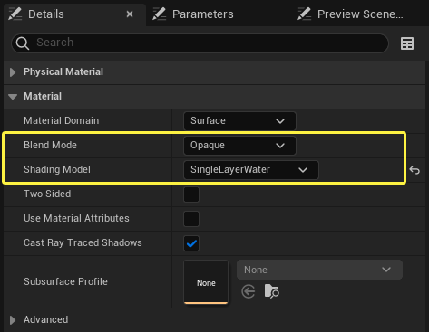
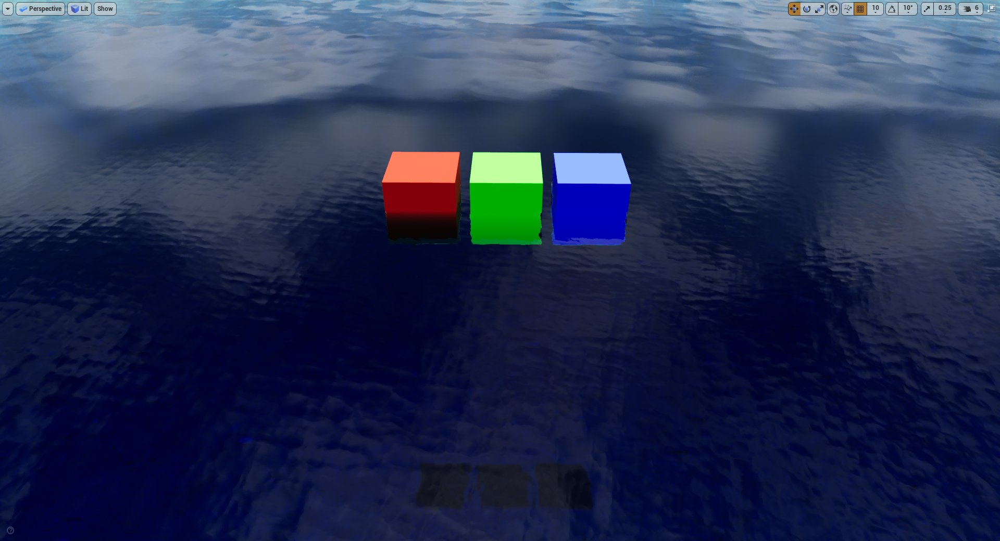
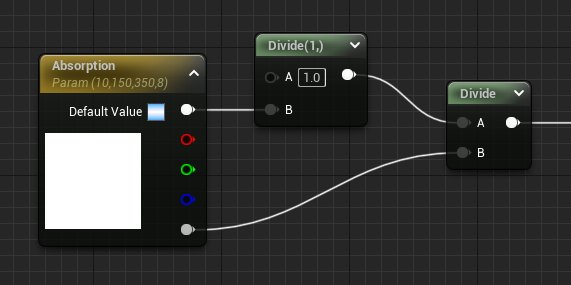
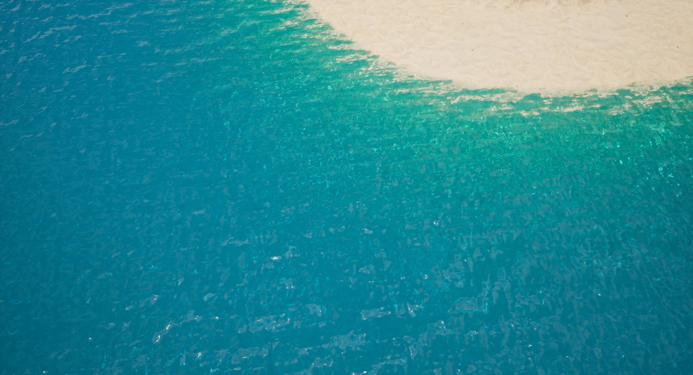

# 单层水着色模型

> 路径：虚幻引擎5.7文档 / 设计视觉、渲染和图形效果 / 材质 / 材质属性 / 着色模型 / 单层水着色模型

> 原始页面：https://dev.epicgames.com/documentation/unreal-engine/single-layer-water-shading-model-in-unreal-engine

**单层水（Single Layer Water）** 材质着色模型是一种借助单深度层来提供高效半透明方法的材质。这是一种基于物理的着色模型，支持适当的光散射、吸收、反射和折射以及水面阴影。

## 单层水的实现

单层水着色模型使用自定义渲染通道来实现透明效果，可以在使用 **不透明（Opaque）** 或 **遮罩（Masked）** 等混合模式时实现。材质的半透明在基础通道和延迟光照之后运行，但先于常规半透明渲染、后期处理以及渲染管道中的其他所有内容。

单层水着色是一种包含参与介质的均匀体积，使用了散射和Schlick相函数，并受不透明或遮罩水表面的影响。表面的透明度隐含在体积着色模型中。折射也由体积函数处理，它在扭曲示例之前会读取表面下方的深度和颜色。

在材质编辑器中，**Single Layer Water Material** 节点有四个输入：**散射系数**、**吸收系数**、**PhaseG** 和 **水后色度**。这些输入将定义水的外观。主材质节点的 **不透明度（Opacity）** 输入将处理水的半透明度，从而控制体积的双向散射分布函数（BSDF）和表面的双向反射分布函数（BRDF）之间的比率。

你可以使用[RenderDoc](../../../../optimizing-and-debugging-projects-for-realtime-rendering/using-renderdoc/index.md)执行帧捕获，以便你查看GPU捕获中单层水通的发生位置。当使用单层水通道时，BasePass已经渲染和点亮。完全点亮的场景和深度将用作单层水通道的输入，读取缓冲区，即如何为不透明或遮照材质实现折射和半透明。

> [!TIP]
> 在进行列表中的第一项之前，你可以使用可选步骤下采样折射读取的场景颜色和深度缓冲区。这样可以加快渲染速度，但会使渲染在水面以下的对象外观略微模糊（或分辨率低）。

1. 所有带有SingleLayerWater的对象都使用用户定义的材质渲染到GBuffer（包括深度）中。
2. 运行计算着色器，根据GBuffer中的MaterialID对所有SingleLayerWater进行平铺分类。
3. 生成的屏幕图块用于间接绘制屏幕空间反射（SSR）通道，该通道运行并输出到单独的缓冲区。
4. 生成的屏幕图块再次用于运行间接绘制全屏通道，以便合成反射捕获、天空和水面上新计算的屏幕空间反射。

### 单层水低端系统和移动支持

对于低端系统和平台（例如移动设备和低端桌面），会使用替代渲染路径，跳过单层水的某些功能，以便提高性能。最简单的替代方法是，将材质还原为简单的半透明材质，没有体积积分或屏幕空间反射。

## 使用单层水材质输出

创建材质时，在 **细节（Details）** 面板中设置以下内容：

- 混合模式：

  不透明（Opaque）

  或

  遮照（Masked）
- 着色模型：

  SingleLayerWater

将 **Single Layer Water Material** 输出节点添加到材质图表。此输出表达式就光散射和吸收、各向异性或各向同性方向性（PhaseG）以及水面下表面上的颜色效果（例如焦散和阴影）定义了水的外观。

### 散射系数

**散射系数** 输入表示光在介质中的粒子（在本例中为水）上散射的速率。介质中发生的光散射量决定了介质中对象的光和颜色的情况。当穿过介质（如玻璃或一瓶水）的散射量较小时，介质看起来透明。光不会在介质中散射那么多，从而使光更容易穿过。在大量散射的情况下，光散射更多，从而阻止其穿过介质。这会导致介质看起来更浑浊或更不透明，如橙汁或牛奶。

散射量会影响光在介质中的传播方式，并直接影响对象在其体积内时物体的外观。例如，介质中有三个立方体（红色、绿色和蓝色），并且材质设置为仅散射蓝光，请注意与没有散射的材料（右）相比，散射的蓝光如何影响所有立方体的颜色（左）。

|  |  |
| --- | --- |
| 介质中的蓝光散射 | 没有光散射 |

将此概念应用于默认的水材质，请注意与完全没有散射相比，应用一定散射量时的外观。当没有散射时，光不会以相同的方式反射或分散，因此立方体的可见位置比光散射时更深。

散射量越高，水看起来就越浑浊。光在介质中散射得更多，对象就下沉得越深，就越难看到它们。下面的示例演示了具有不同数量的光散射的效果，从较低的数量到非常高的数量渐进，然后到完全无法看到表面之下的立方体。

拖动滑块，查看不断增加的散射值如何增加散射效果：0.5、1、2、4、8、16、32

### 吸收系数

**吸收系数** 输入定义了光穿透水（或参与介质）体积的难易程度。每个颜色通道（RGB）或光的波长以不同的方式穿透水，有些穿透性会更好。当光被它所穿过的介质吸收时，就会消光，这意味着失去颜色。对象越是深度进入吸收系数高的介质，其颜色消散的可能性就越大。

吸收系数将控制哪些颜色的光在介质中可能被更快地吸收。小系数允许光轻松穿过介质，使外观更透明。当光源穿过介质时，大系数会更快地衰减光，使其看起来不那么透明。

下面的示例显示了三个立方体（红色、绿色和蓝色）移动到介质中更深的地方。当对这些原色（红色 = 0.0033、绿色 = 0.0016、蓝色 = 0.0011）使用中等吸收系数时，结果显示了每种颜色在深入介质中时如何消散。首先红色消失，然后是绿色，最后是蓝色。

使用与上述相同的值和设置以及默认水材质，三个原色立方体在浸入水中并向下深入时都会失去颜色。它们的颜色以相同的顺序消失。

> [!TIP]
> 使用默认水材质时，吸收系数值反向。值越大，颜色消失得越快。光穿过体积的距离用米的倒数表示，即1除以材质中的吸收距离。
>
> 采用的距离设置如下所示：
>
> 

### PhaseG函数

**PhaseG** 参数将控制光在水中散射的整体向前或向后方向。更具体地说，该参数将控制散射光相对于太阳方向的各向异性方向性。

PhaseG可以为正值或负值，其中正值会增加向（向前）太阳散射的光量，负值会增加从太阳（向后）散射的光量。根据当前视图和太阳在天空中的位置，这可以使水看起来更亮或更暗。

|  |  |
| --- | --- |
| PhaseG：-0.75 | PhaseG：0.5 |

当PhaseG值为0时，它的光方向性是各向同性的，这意味着光在所有方向上的散射都相同。

该相位函数使水的形状更明确，尤其是存在波浪时。这是因为在发生折射后，传播会改变方向，从而增加了通过水散射的光量变化。

### 水下的色度

**水下的色度** 输入将增加水下表面的亮度。这种类型的效果可用于你的材质中，能驱动焦散或阴影的明暗程度。

下图的对比展示了水下表面的可见焦散。

材质焦散：禁用

材质焦散：启用

> [!NOTE]
> 这就是材质的视觉效果，在水材质上方可见。在水面下方移动不会改变水下表面的亮度，也不会在这些表面上实际投射焦散或阴影。

### 水不透明度

当通过材质设置使用单层水时，主材质节点上的 **不透明度（Opacity）** 输入将控制水的可见参数。不透明度的量将控制允许进入体积和散射的光量。它还将控制你可以通过体积看到多远。不透明度值越大越不透明，不允许光线穿透表面。较低的值允许所有光线穿过表面，因此你可以看到水中更远的距离。

如果不透明度低或没有不透明度，还允许单层水材质输出表达式的其他属性不受阻碍地运行。在下表中，水材质的不透明度值为没有、部分或最大允许有全部、部分光或没有光通过体积。完全不透明材质（不透明度 = 1）看起来是黑色，因为不允许光线通过表面散射到水中。

|  |  |  |
| --- | --- | --- |
| 水不透明度：0 | 水不透明度：0.5 | 水不透明度：1 |
