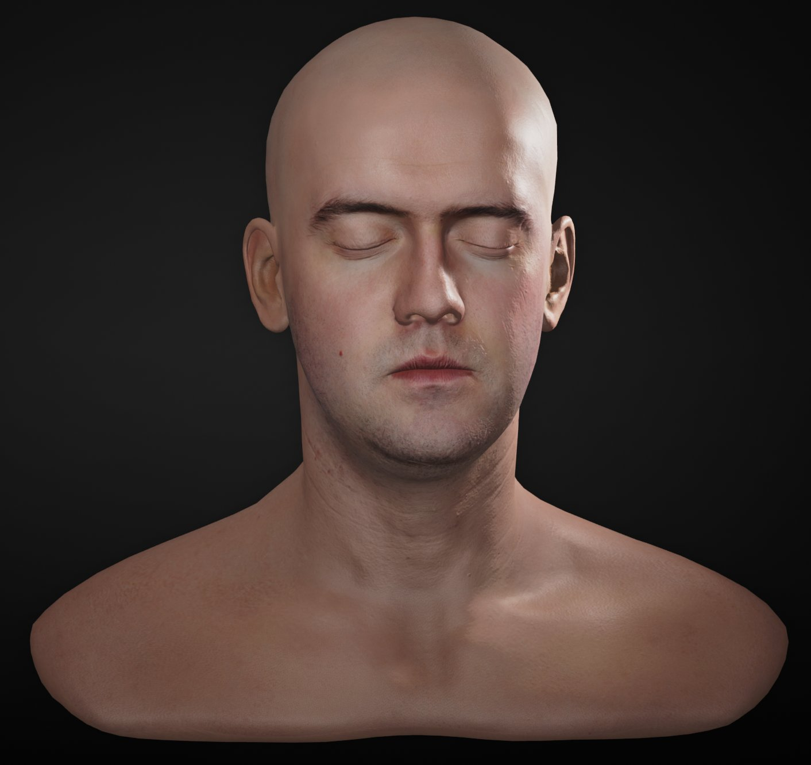
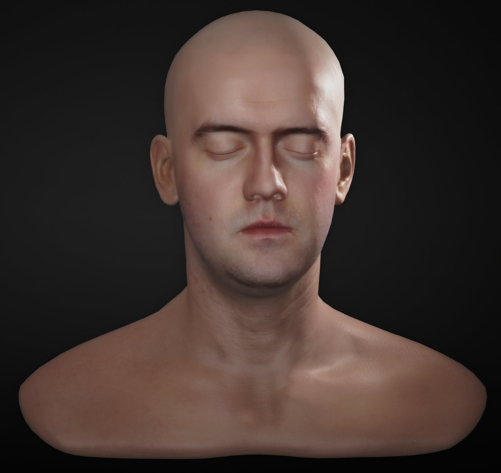
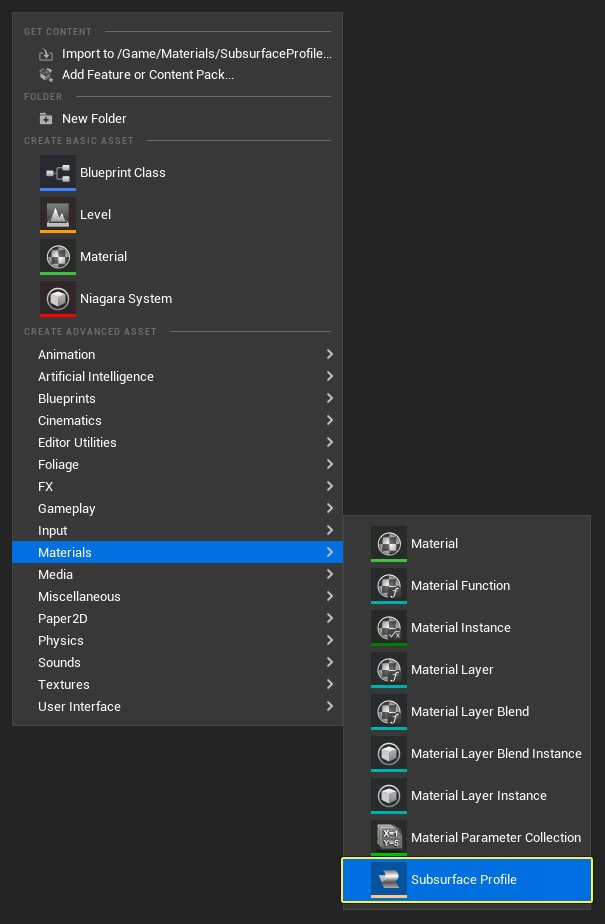
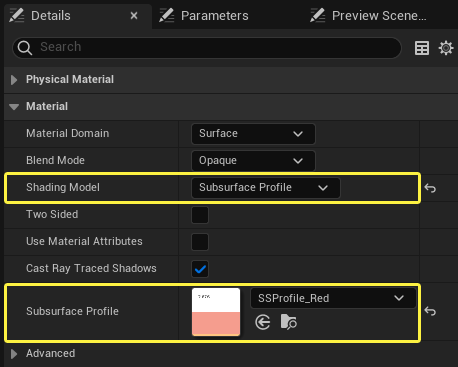
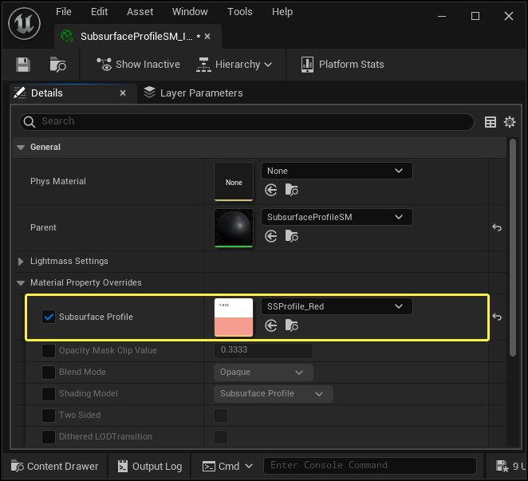
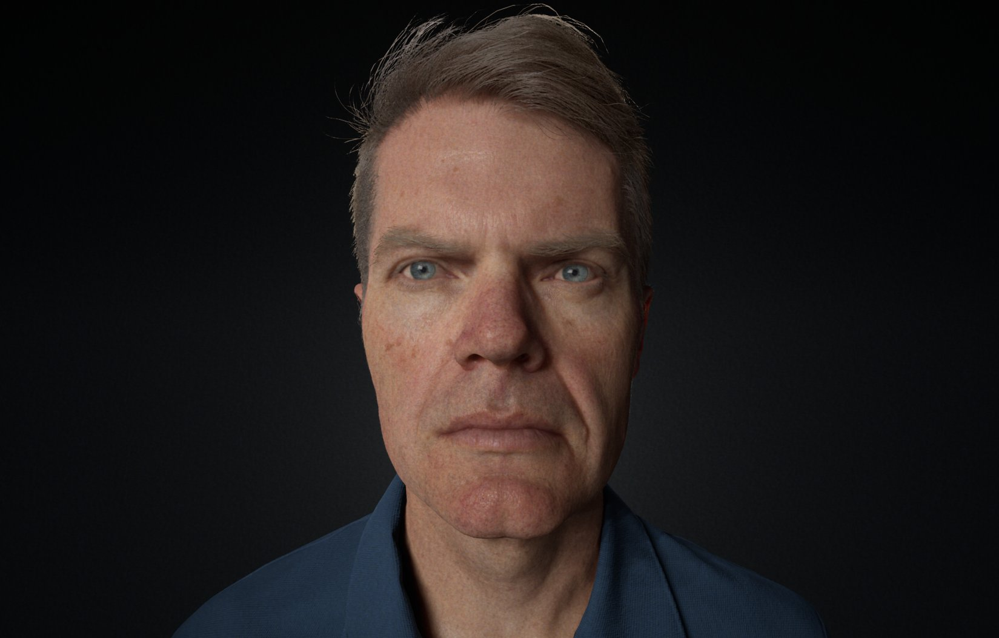

# 次表面轮廓明暗处理模型

> 路径：虚幻引擎5.7文档 / 设计视觉、渲染和图形效果 / 材质 / 材质属性 / 着色模型 / 次表面轮廓明暗处理模型

> 原始页面：https://dev.epicgames.com/documentation/unreal-engine/subsurface-profile-shading-model-in-unreal-engine

虚幻引擎4（UE4）现在提供特定的着色方法，以渲染真实的皮肤或蜡质表面，这称为 **次表面轮廓** 着色。

次表面轮廓着色方法类似于次表面方法，但本质的区别在于渲染方式：次表面轮廓基于 **屏幕空间**。这是因为屏幕空间渲染能够更有效地显示人类皮肤中可见的细腻次表面效果，而反向散射是仅在少数情况下看到的次级效果，如耳朵。在以下文档中，我们将介绍什么是次表面轮廓以及如何在您的项目中加以运用。

不使用次表面轮廓

使用次表面轮廓

> [!NOTE]
> 特别感谢Perry-Smith和他的公司[Infinite Realities]（http://ir-ltd.net）协助编写本文档，以及提供3D扫描头部模型。

## 什么是次表面轮廓

次表面散射轮廓数据是一项可以创建、分享和保存在 **内容浏览器** 中的资源。该数据应该由美工编写，用于控制次表面中的照明应该散射的距离、次表面颜色和离开对象后照明的衰减色。然后该数据应用于次表面材质。次表面轮廓数据还可以交互调整，即您无需重新编译材质即可查看编辑结果。

## 启用、创建和使用次表面轮廓

在UE4中使用次表面轮廓有许多不同的方法。在以下部分中，我们将介绍各种方法。

### 创建次表面轮廓

要创建次表面轮廓，首先在 **内容浏览器** 中单击右键。然后，选择 **材质和纹理（Materials & Textures）** 选项，然后选择 **次表面轮廓（Subsurface Profile）** 选项。

要编辑次表面轮廓，可以在 **内容浏览器** 中用 **鼠标左键按钮** 双击以将其打开。 打开后，可以调整次表面散射轮廓的各个属性，方法是使用键盘输入数字，或者使用 **鼠标左键** 来 **单击** 颜色条以显示取色器。

### 启用次表面轮廓

要在材质中使用次表面轮廓，首先在材质的 **细节（Details）** 面板中，将材质的 **着色模型（Shading Model）** 设置为 **次表面轮廓（Subsurface Profile）** 来进行启用。启用后，可以在 **次表面轮廓（Subsurface Profile）** 输入中输入新的次表面轮廓来覆盖所用的默认值。

> [!TIP]
> 次表面轮廓的默认设置接近于高加索皮肤类型。请注意，这只是接近于真实皮肤效果的一个组件。*始终确保纹理的底色符合您的次表面散射轮廓。*

另外，也可以在材质实例中覆盖次表面轮廓。为此，转至材质实例的 **细节（Details）** 面板，并启用 **覆盖次表面轮廓（Override Subsurface Profile）**。启用后，在 **次表面轮廓（Subsurface Profile）** 输入中提供您想要使用的次表面轮廓。

> [!NOTE]
> 请记住，整个计算都是始终考虑节能的，因此可以通过散射创建其他照明。

## Burley次表面轮廓

Burley次表面散射使用了借助Burley算法的屏幕空间模型。它在物理上更为精确，主要用于改善皮肤着色的质量，同时利用物理材质属性来简化设置。它能实现质量远优于传统可分离SSS算法的高端皮肤渲染，让衰减更清晰、更精确。

可分离次表面散射

Burley次表面散射

在次表面轮廓资源中的 **启用Burley（Enable Burley）** 旁边进行勾选即可使用此次表面散射模型。

> [!NOTE]
> 此方法需要临时抗锯齿才能正确显示。

## 材质输入通道

屏幕空间次表面明暗处理轮廓与照亮明暗处理模式没有很大的区别，它们之间的主要区别在于金属色（Metallic）输入的用途已改变，不可使用。

**底色输入：**底色输入照例用于漫射照明。没有额外的次表面散射颜色，因为屏幕空间次表面散射不应该改变颜色或亮度，它只是将照明重新分发到附近的像素。 因此，如果材质应该在特定颜色中散射，需要表示为底色的一部分。 底色应该是最终颜色，就像是从无法区分散射与漫射光线的遥远距离观察材质一样。

> [!NOTE]
> 人类皮肤是薄薄的一层，会阻挡一定数量的照明和颜色，并且其表面下面是充满活力的红色的血肉。浅色人类皮肤的可见散射距离约为1.2 CM。

**金属色输入：**使用次表面轮廓时，金属色输入通道不可用，这是因为金属色输入的GBuffer空间的用途已改变，无法容纳次表面轮廓数据。

**不透明输入：**不透明度输入通道用来屏蔽次表面散射的影响。 它的工作原理是使用0-1范围内的值，以使次表面散射强度的不同区域之间平滑过渡，其中0表示无散射，1表示完全散射。

为了更好地控制次表面散射在哪里应该更强或更弱，最好使用遮罩纹理。 遮罩纹理中值更接近于1的区域或白色区域将拥有最强的次表面散射效果，而接近于0的区域或黑色区域将拥有最少的这种效果。 调整次表面颜色将有助于补偿区域变暗的情况。请记住，使用更亮的颜色会产生更强的次表面散射。

在这里，您可以看到如何使用蒙版来使用一个材质渲染两种表面类型。请注意，过渡效果是柔和的，不限于三角形边界。

单击查看大图。

## 全分辨率皮肤着色

UE4支持次表面轮廓着色模型的全分辨率皮肤着色。这样可以提供表面细节的高保真照明，如毛孔和皱纹。

> 图片已省略：棋盘格渲染皮肤布局

> 图片已省略：全分辨率皮肤

棋盘格渲染皮肤布局

全分辨率皮肤

之前，皮肤上的照明是使用棋盘格图案表示的，而有一半像素仅使用漫散射照明，另一个半使用高光照明。照明是在最终次表面轮廓全屏通道中重新组合的。这种方法对于次表面照明（本质上是低频的）提供了良好的结果，但可能会导致次表面细节照明保真度降低。而在新方法中，每个像素都包含漫反射和高光照明信息，封装到RGBA编码中。这允许我们在最终次表面轮廓全屏通道中重新构造全分辨率照明，让表面细节获得更好的结果，以及时间性抗锯齿获得更稳定的行为。

### 兼容性

全分辨率皮肤着色需要至少具有完整alpha通道的64位场景颜色格式。默认的FloatRGBA场景颜色格式可以使用，但不支持32位表示，如FloatRGB。如果场景颜色格式不兼容全分辨率皮肤，我们将回退到基于棋盘格的照明。

该行为可以使用 **r.SSS.Checkerboard** 控制台变量覆盖。可能的值包括：

| 属性名称 | 值 | 描述 |
| --- | --- | --- |
| **r.SSS.Checkerboard** | 0 | 禁用棋盘格 |
| **r.SSS.Checkerboard** | 1 | 启用棋盘格（旧行为） |
| **r.SSS.Checkerboard** | 2 | 自动（默认）- 场景颜色像素格式支持的话，将使用全分辨率照明。 |

### 限制

值得注意的是，全分辨率皮肤着色是近似值。它适用于大多数情况，但特定材质功能可能会因为编码方法而出现问题。具体而言：

- 金属色材质
- 自发光材质

这些功能可以使用，但您会注意到与棋盘格对比的输出差异，这些差异是因为封装RGBA漫散射/高光编码引起的。在编写材质时可以绕过这些问题，方法是在不需要皮肤着色的区域将 **不透明度（Opacity）** 设置为 **0**。不透明度为0的像素将被视为默认光照来进行着色。

> [!NOTE]
> 如果是出于性能考量，也可以这样的方式遮罩透光像素，因为次表面后期处理绕过会这些像素。

### 性能考虑

如果您的作品使用64位场景颜色格式，通常全分辨率次表面照明会比棋盘格更快，因为纹理拾取次数会减少。但是，如果您的作品使用32位场景颜色，则降低纹理带宽得到的性能增益可能比这些优势更有价值（尽管这与硬件有关）。

## 技术细节

目前，次表面散射轮廓着色模型与光照（Lambert漫反射，高光GGX，无金属色）没有太大区别。大部分效果发生于完成所有照明计算之后的后期处理中。

> [!NOTE]
> 次表面散射轮廓基于[Jorge Jimenez](http://www.iryoku.com/)的作品。请确保查看他网页，以了解有关如何让您的3D图像看起来更加真实的有用提示。

我们将非高光（非视图相关）照明贡献区分出来，以在次表面材质上支持高光，并支持下采样以获得更好的性能。 类似于高斯模糊，我们通过双通道（假设可分离内核）后期处理来过滤图像。 过滤内核取决于存储在GBuffer（每个场景坐高255个活跃轮廓）中的次表面散射轮廓。 此内核具有彩色权重以及特定的取样位置，它们在轮廓中可进行比例调整（以每厘米单位数定义）。 在最后一步，我们将散射照明贡献与全分辨率图像重新合并。为了区分视图相关和非视图相关照明，我们将加权值存储在场景颜色alpha通道中。 该近似值需要64位渲染目标（请参阅r.SceneColorFormat），该近似值适用于大多数情况。

它成功地去除了高光，但在视图相关颜色上，这些高光像素会获得更强的去饱和效果。您可以通过将两个32位渲染目标用于所有照明通道加以改善。这占用相同的内存带宽，但在某些硬件上，速度可能会变慢。这可能是我们想要更改的情况（已增加代码复杂性）。

在以下示例中，我们在应用模糊之前去除了高光。请注意，最后一张图中高光反射的清晰光滑的效果（最右侧的图像）。这就是我们想要实现的效果。

> 图片已省略：undefined

单击查看大图。

在以下示例中，我们在应用模糊之前未去除高光。请注意，最后一张图中高光反射的阴暗程度，而看起来有一点拉伸效果（最右侧的图像）。这不是渲染这种效果的正确方法。

> 图片已省略：undefined

单击查看大图。

## 可延展性和控制台命令

您可使用一些比例调整和性能控制台命令，来帮助在高品质视觉效果与更好的性能之间进行良好平衡。

**r.SSS.Scale**：可以用于调节效果以便快速试验。设置为 **0** 将禁用这种效果。在下图序列可以看到，设置大于0的数字将增强效果。

> 图片已省略：拖动滑块会看到 r.SSS.Scale 设置为0到10的变化。

拖动滑块会看到 **r.SSS.Scale** 设置为0到10的变化。

**r.SSS.SampleSet**：设置所用的样本数量。减小该值将使该效果更快速地运行。但是，这意味着效果将有更低的质量，可能会出现渲染瑕疵。

> 图片已省略：r.SSS.SampleSet = 0

> 图片已省略：r.SSS.SampleSet = 1

r.SSS.SampleSet = 0

r.SSS.SampleSet = 1

下图显示系统的更多一些内部信息。该视图可以使用 **ShowFlag.VisualizeSSS 1** 来启用。

> 图片已省略：undefined

单击查看大图。

虽然次表面散射轮廓明暗处理模型在渲染皮肤方面取得很大进步，但在处理能力方面还是有所局限。 *请注意，由于该系统变得越来越精细，因此该列表可能会有所改变。*

- 该功能不适用于非延迟（移动）渲染模式。
- 将大屏幕设置为散射半径，将会在极端照明条件下显示出带状瑕疵。
- 目前，没有照明反向散射。
- 目前，当非SSS材质遮挡SSS材质时，会出现灰色轮廓。

## 次表面轮廓属性参考

> 图片已省略：Subsurface Profile Editor Reference

| 属性名称 | 说明 |
| --- | --- |
| Burley规格化 |  |
| **表面反射率（Surface Albedo）** | 应设为与对应材质的底色尽可能匹配。 |
| **平均自由路径颜色（Mean Free Path Color）** | 控制光线在红、绿、蓝通道中进入次表面的距离。它按 **平均自由路径距离（Mean Free Path Distance）** 缩放。 |
| **平均自由路径距离（Mean Free Path Distance）** | 控制 **平均自由路径颜色（Mean Free Path Color）** 进入次表面的距离。 |
| **场景单位缩放（World Unit Scale）** | 控制世界场景/虚幻单位的缩放（单位为厘米）。 |
| **启用Burley（Enable Burley）** | 仅在使用Burley时有效 |
| 次表面轮廓 |  |
| **散射半径：** | 以场景空间单位表示的用于执行散射的距离。 |
| **次表面颜色：** | 可以用作次表面效果权重的次表面颜色。黑色表示没有次表面散射。白色表示，所有照明进入材质并四处散射。非灰阶值可以更多地控制哪些颜色贡献进入表面，产生更复杂的外观着色。 |
| **衰减颜色** | 衰减颜色定义光照进入材质后的材质散射颜色。如果想要在看到散射的区域获得更复杂的着色变化，您应避免在此使用生动的颜色。 |
| **边界颜色泄出（Boundary Color Bleed）** | 控制一个次表面材质混入另一个次表面材质的方式。 |
| 透射 |  |
| **消光比例（Extinction Scale）** | 控制吸收比例。 |
| **法线比例（Normal Scale）** | 控制法线对透射的贡献。 |
| **散射分布（Scattering Distribution）** | 控制透射结果的散射分布。 |
| **IOR** | 设置透射结果的折射率。 |
| **透射色调颜色（Transmission Tint Color）** | 将此值乘以透射结果来控制透射色调。需要在 **Burley规格化（Burley Normalized）** 类目中启用 **启用Burley（Enable Burley）** 框。 |
| 双镜面 |  |
| **粗糙度0（Roughness 0）** | 控制柔和叶的粗糙度。 |
| **粗糙度1（Roughness 1）** | 控制紧密叶的粗糙度。 |
| **叶混合（Lobe Mix）** | 控制两个独立叶的粗糙度值，两者结合将得到最终结果。将其结合在一起将形成极佳的子像素微频率，使皮肤外观真实自然。使用 **粗糙度0（Roughness 0）** 和 **粗糙度1（Roughness 1）** 控制双镜面的单独叶 |

## 特别鸣谢

- 特别感谢Lee Perry-Smith及其公司[Infinite Realities](http://ir-ltd.net/)提供的头部模型和协助。 此外，还要特别感谢[Jorge Jimenez](http://www.iryoku.com/)发布他的实现，因为本功能正是基于他的努力成果。
- 特别感谢Mike Seymore和3Lateral对"Meet Mike"数字扫描的贡献。
