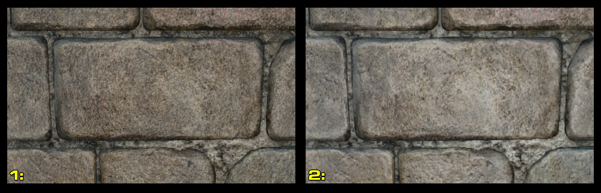
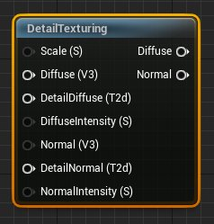
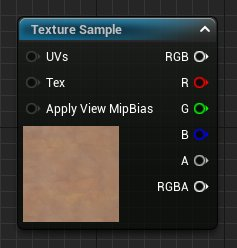
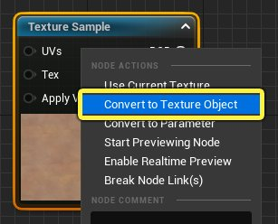
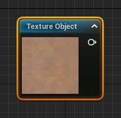
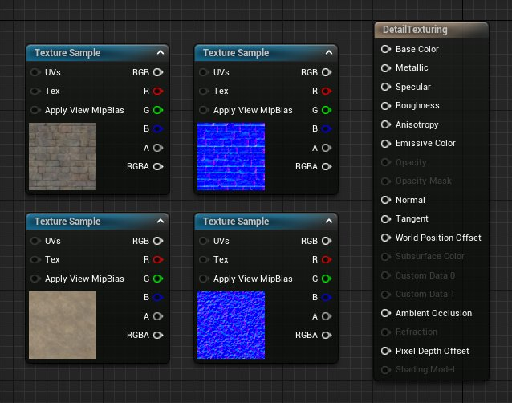
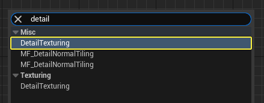

# 添加细节纹理

> 路径：虚幻引擎5.7文档 / 设计视觉、渲染和图形效果 / 材质 / 材质教程 / 添加细节纹理

> 原始页面：https://dev.epicgames.com/documentation/unreal-engine/adding-detail-textures-to-unreal-engine-materials

近距离观看材质时，你会发现材质纹理会出现分解和像素化的现象。为了优化性能，纹理通常会缩放其分辨率，让它在中等距离外看起来还不错，但可能经不住细看。

要解决此问题，你可以使用所谓的 **细节纹理（detail texture）** 来防止材质在细看时出现像素化瑕疵。

## 细节纹理化

**细节纹理化（Detail texturing）** 技术在对象的原始漫反射和法线纹理上叠加高度重复的漫反射和法线纹理，从而产生纹理包含更多细节的视觉效果。 此技术可以改善材质的近距离外观，让人感觉细节级别有所提高。

此处有一个实际使用细节纹理技术的示例。

在左侧（标签1），材质使用一个细节纹理为表面添加了额外的高频细节。在右侧（标签2），材质未使用细节纹理。请注意，左侧的图像比右侧的图像看起来更清晰、包含更多细节。

## 细节纹理化节点明细

如果在 **控制板** 或上下文菜单中搜索"细节纹理（detail texturing）"，则会找到 **细节纹理（Detail Texturing）** 材质函数。虽然这不是可以将细节纹理应用于材质的唯一方法，但从工作流程的视角来看，这种方法是最快的，因为所有逻辑都包含在[材质函数](../../material-functions/index.md)中。只需提供纹理输入即可。

| 属性 | 说明 |
| --- | --- |
| **缩放（Scale(S)）** | 设置细节纹理的缩放。数值越大，产生的平铺就越多；数值越小，产生的平铺就越少。 |
| **漫射（Diffuse(V3)）** | 这是漫射纹理的输入。 |
| **细节漫射（DetailDiffuse(T2d)）** | 这是漫射细节纹理的输入。此输入只能接受纹理对象。 |
| **漫射强度（DiffuseIntensity(S)）** | 控制细节漫射纹理的强度。 |
| **法线（Normal(V3)）** | 这是法线贴图纹理的输入。 |
| **细节法线（DetailNormal(T2D)）** | 这是法线贴图细节纹理的输入。此输入只能接受纹理对象。 |
| **法线强度（NormalIntensity(S)）** | 控制细节法线贴图纹理的强度。 |

### 将纹理采样转换为纹理对象

为了让"细节纹理化"材质函数正确工作，必须将你要用作细节纹理的纹理从常规纹理转换为纹理对象。要将纹理转换为纹理对象。请按照以下步骤执行此操作。

1. 找到要用作细节纹理的纹理采样。

   
2. 右键单击纹理采样节点，然后从上下文菜单中选择 **转换为纹理对象（Convert To Texture Object）**。

   
3. 纹理采样会转换为纹理对象。

   

## 如何在材质中使用细节纹理化功能

有两种方法可以配置材质来使用细节纹理，这两种方法如下文所述。这两种方法的主要区别在于是使用预制的"细节纹理（Detail Texturing）"材质函数，还是在材质图表中手动创建细节纹理逻辑。这两种方法并没有好坏之分，因为它们最终会产生相同的结果。选用哪种方法取决于具体材质和项目的需求。

> [!NOTE]
> 如果你的项目包含 **起步内容**，那么你可找到下列各节中使用的所有内容。虽然此处展示的技巧适用于任何纹理，但如果你想采用这些技巧，请确保项目包含 **起步内容**。

创建一个用于测试的新材质。在 **内容浏览器（Content Browser）** 中进行 **右键单击**，然后从上下文菜单的"创建基本资产（Create Basic Asset）"分段中选择 **材质（Material）**。为材质指定一个描述性名称，如 **DetailTexturing**。

### 使用"细节纹理化"材质函数

1. 在 **内容浏览器（Content Browser）** 中 **双击** 相应的资产以打开材质。随即将打开"材质编辑器（Material Editor）"。
2. 在初学者内容包中找到以下四个纹理。将这些纹理从"内容浏览器（Content Browser）"拖到材质图表中。

   - T_Brick_Clay_Old_D
   - T_Brick_Clay_Old_N
   - T_Ground_Gravel_D
   - T_Ground_Moss_N

   完成之后，你的材质图应该类似于下图：

   
3. 在材质图表中 **右键单击**，然后从上下文菜单中搜索"细节纹理（Detail Texturing）"。单击"杂项（Misc）"类目下的 **DetailTexturing**，为图表添加该材质函数。

   
4. 材质图表中将创建 **DetailTexturing** 材质函数。

   > 图片已省略：DetailTexturing Material Function in graph
5. 此示例将使用 **T_GroundGravel_D** 和 **T_Ground_Moss_N** 作为细节纹理。为了将细节纹理连接到材质函数，必须将细节纹理转换为纹理对象。右键单击 **T_GroundGravel_D** 和 **T_Ground_Moss_N** 并将它们转换为纹理对象。

   > 图片已省略：Detail textures converted to texture objects
6. 如下所示，连接所有节点。两个砖块纹理应该连接到 **漫反射（Diffuse）** 和 **法线（Normal）** 输入，两个纹理对象应该连接到 **DetailDiffuse** 和 **DetailNormal** 引脚。将"漫反射（Diffuse）"输出传递到主材质节点（Main Material Node）上的"基础颜色（Base Color）"输入中，将"法线（Normal）"输出传递到主材质节点上的"法线（Normal）"输入中。

   > 图片已省略：Material Function wired
7. 还需要其他值来控制纹理的缩放和强度。对于这些输入，可以使用 **常量** 材质表达式或 **标量参数**。此示例使用名为 **缩放（Scale）**、**漫反射强度（Diffuse Intensity）** 和 **法线强度（Normal Intensity）** 的三个标量参数。所有这三个节点的默认值都设置为 **1**。

   > 图片已省略：Three scalar parameters
8. 将标量参数连接到相应的输入。完成后，材质图表应如图所示。

   > 图片已省略：Final Material graph
9. 通过调整标量参数中的值，可以修改细节纹理的外观。此处的一个示例说明了将"缩放（Scale）"的值分别设置为1、5以及最后设置为10时产生的结果。细节纹理在网格体上平铺的次数越多，意味着纹理本身看起来更小或更精细。

   > 图片已省略：Detail tiling at different scales

### 手动设置细节纹理

如果由于某种原因无法使用 **细节纹理（Detail Texturing）** 材质函数，可以使用材质表达式节点并根据以下说明在材质图表中构建此功能。

1. 在 **内容浏览器（Content Browser）** 中复制第一个材质：右键单击相应的缩略图，然后从上下文菜单中选择 **复制（Duplicate）**。将这个新材质重命名为 **DetailTexturing_02**，然后双击该材质在"材质编辑器（Material Editor）"中将其打开。

   > 图片已省略：Create another Material
2. 仅保留四个纹理，删除其他所有内容。还需要将两个纹理对象转换回纹理采样。右键单击每个纹理对象节点，然后从上下文菜单中选择 **转换为纹理采样（Convert to Texture Sample）**。

   > 图片已省略：Convert to texture sample
3. 为了手动创建细节纹理，需要以下材质表达式节点。为了找到以下各项，可以在

   控制板

   中进行搜索或使用

   右键单击

   上下文菜单中的搜索栏。

   - 纹理坐标（Texture Coordinate）

     x 1
   - 限制（Clamp）

     x 1
   - 标量参数（Scalar Parameter）

     x 2
   - 加法（Add）

     x 2
   - 乘法（Multiply）

     x 3

   完成上述操作后，材质图应该如下所示。

   > 图片已省略：All required Material expression nodes
4. 将所有节点添加到图表后，即可如图所示开始连接它们。The image below shows the correct configuration for the Base Color portion of the graph.完成上述操作后，材质图应该如下所示。

   > 图片已省略：undefined

   点击图片以查看大图。
5. 在"基础颜色（Base Color）"分段中创建的用于控制纹理缩放的逻辑可以重复用于法线贴图。如下所示连接节点。

   > 图片已省略：undefined

   点击图片以查看大图。
6. 现在，"底色"（Base Color）和法线贴图（Normal map）都已彼此连接，你可以编译、保存和使用此材质了。

   > 图片已省略：undefined

   点击图片以查看大图。

## 细节纹理化提示与技巧

本小节介绍了一些在材质中使用细节纹理化的提示与技巧。

### 基于距离的细节纹理化

在处理大表面（例如地貌）时可能会注意到，即使纹理无缝平铺，也会出现明显的重复，这会削弱纹理的外观效果，尤其是在远处观看时。

要解决此问题，可以修改先前创建的细节材质，使其在摄像机靠近时显示一个纹理，而在摄像机远离时显示另一个纹理。这种方法通常称为基于距离的纹理混合。为了实现这一点，可以按照以下说明操作。

1. 首先复制 **DetailTexturing_02** 材质并将其重命名为 **DistanceFade**。打开这个材质。
2. 可以删除原始材质的大部分节点连接，但不要删除这四个纹理。还应该保留下面标有 **缩放控制（Scale Controls）** 字样的分段。搜索以下材质表达式并将其添加到图表中。

   - 全局位置（World_Position）x 1
   - 摄像机位置 WS（Camera_Position_WS）x 1
   - 距离（Distance）x 1
   - 除法（Divide）x 1
   - 幂（Power）x 1
   - 限制（Clamp）x 1
   - 常量（Constant）x 2

   完成后，材质图表应如图所示。

   > 图片已省略：Distance fade nodes
3. 将两个 **常量** 材质表达式中的值更改为 **512** 和 **4**，然后按照下图所示的配置连接节点。插入到 **除法** 材质表达式中的第一个 **常量**（在示例图像中设置为512）决定了进行纹理混合的距离。下面显示的材质图表提供了基于距离进行纹理混合所需的所有逻辑。

   > 图片已省略：Distance fade Material logic
4. 现在可以将距离消退逻辑连接到图表的其余部分。首先在图表中添加两个 **线性插值（Lerp）**。Lerp节点上的Alpha输入将驱动两个纹理之间的过渡。如下所示完成材质的连接。

   > 图片已省略：undefined
5. 要预览效果，请在材质预览视口中按住 **鼠标右键**，并上下移动鼠标以进行放大和缩小。当摄像机距离球体512个单位时，材质将从砖块转换到砾石。如果看不到这一变化，可以调整插入到"除法（Divide）"节点中的 **常量** 的值。将该值从512减小到更小的值将加快这一转换的速度。

## 结论

细节纹理技术的功能非常强大，可以使用高度重复的细节纹理来补充基础纹理，从而改善材质的外观。请注意，细节纹理技术只能帮助将像素化问题隐藏于某个点，因此，如果让玩家的摄像机将对象放大到不合理的程度，可能会抵消细节纹理带来的好处。另外还要注意，添加细节纹理可能会为材质添加两个或更多额外的纹理查找，因此可能会带来性能或内存问题，尤其是在移动平台上。
