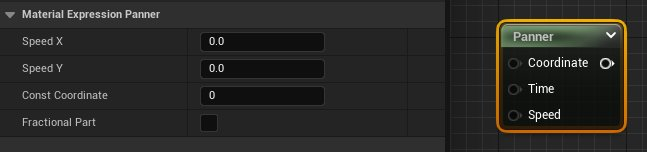
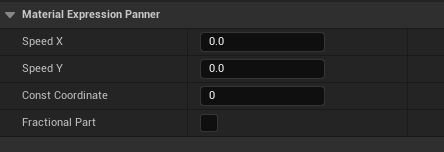
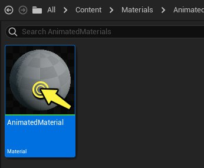
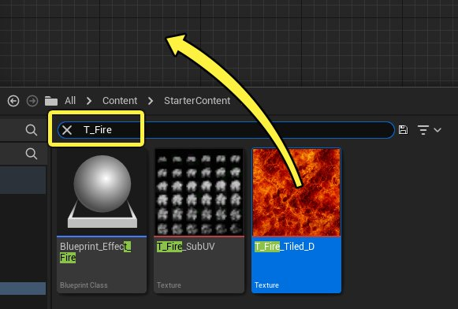
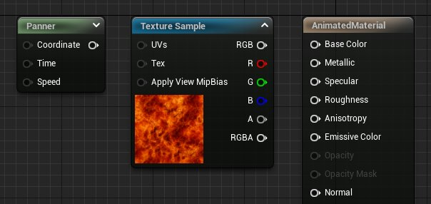
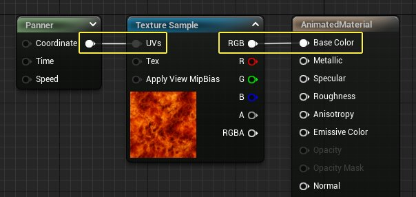
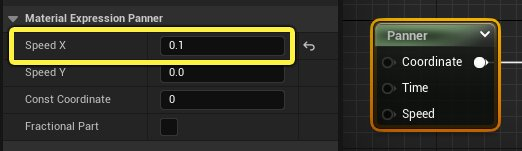

# UV坐标动画

> 路径：虚幻引擎5.7文档 / 设计视觉、渲染和图形效果 / 材质 / 材质教程 / UV坐标动画

> 原始页面：https://dev.epicgames.com/documentation/unreal-engine/animating-uv-coordinates-in-unreal-engine

材质能否添加动态效果十分重要，特别是对于火焰、流水或烟雾之类的效果尤其如此。有一种低成本、高效的实现方法：使用 **平移（Panner）材质表达式** 节点。"平移"（Panner）材质表达式节点允许沿 U 或 V 方向或者同时沿这两个方向移动纹理的 UV 坐标。

## 什么是UV坐标动画

UV坐标动画或 UV 平移的含义是，沿着水平 (U) 和/或垂直 (V) 方向，移动纹理的 UV 坐标，以产生复杂动画的错觉。在以下示例中，来自初学者内容包的 **T_Fire_Tiled_D** 纹理，沿着 U（水平）方向平移，使火焰看起来像是在移动一样。

## "平移"（Panner）节点明细

可以通过在控制板中搜索 **Panner** 或使用右键单击上下文菜单，将 **Panner材质表达式（Panner Material Expression）** 添加到材质图表。还可以按住 **P** 键并左键单击材质图表中的任意位置，在鼠标指针处插入一个Panner。Panner材质表达式接受两个输入：**坐标（Coordinates）** 和 **时间（Time）**。

| 属性 | 说明 |
| --- | --- |
| **坐标（Coordinate）** | 接收可以通过表达式来修改的基本 UV 纹理坐标。 |
| **时间（Time）** | 接收用来确定当前平移位置的值。这通常是用来提供常量平移效果的时间表达式，但是，也可以使用常量或标量参数来设置特定偏移，或者通过蓝图来控制平移。 |

| 属性 | 说明 |
| --- | --- |
| **速度 X（Speed X）** | 纹理坐标沿水平或 X 轴方向移动的速度。 |
| **速度 Y（Speed Y）** | 纹理坐标沿垂直或 Y 轴方向移动的速度。 |
| **常量坐标（Const Coordinate）** | 仅在未连接坐标的情况下使用。 |
| **小数部分（Fractional Part）** | 仅输出平移计算结果的小数部分，以提高精度。输出将大于或等于 0 并且小于 1。 |

## 如何在材质中使用动画 UV 坐标

请按照以下步骤创建一个材质，以便使用UV平移方法为纹理创建动画。

> [!NOTE]
> 本教程将使用 **初学者内容包** 中的内容。如果您的项目未包含该内容，请参阅 [迁移](../../../../understanding-the-basics/assets-and-content-packs/migrating-assets/index.md)内容页面，了解有关如何在项目之间移动内容的信息。通过这种方法，您可以将起步内容添加到项目中，而不必建立新项目。

1. 首先创建一个新材质。在"内容浏览器（Content Browser）"中进行 **右键单击**，然后从上下文菜单的"创建基本资产（Create Basic Asset）"分段中选择 **材质（Material）**。

   
2. 在"内容浏览器（Content Browser）"中 **双击** 相应的材质缩略图，在"材质编辑器（Material Editor）"中打开此材质。

   
3. 在 **初学者内容包（Starter Content）** 文件夹中，搜索 **T_Fire**。左键单击 **T_Fire_Tiled_D** 纹理并将该纹理从"内容浏览器（Content Browser）"直接拖到材质图表中。

   
4. 在图表中添加一个 **Panner** 材质表达式。可以按住热键（**P**）并在材质图表中单击鼠标左键，或在控制板中搜索"panner"。图表应如图所示。

   
5. 将Panner的输出连接到纹理样本（Texture Sample）上的 **UV** 输入。将纹理的 **RGB** 输出传递到主材质节点（Main Material Node）上的 **基础颜色（Base Color）** 输入中。

   
6. 要使纹理平移，首先选择 **Panner** 材质表达式，然后在 **细节（Details）** 面板中将 **速度X（Speed X）** 参数设置为 **0.1**。

   
7. 将 **速度X（Speed X）** 更改为 **0.1** 后，应该会在预览窗口中立即看到火纹理（Fire Texture）开始水平移动。
8. **编译（Compile）** 并 **保存（Save）** 材质，以便可以将该材质应用于关卡中的对象。

   > 图片已省略：Compile and save

## 提示和技巧

为了进一步控制平移，一种好方法是将平移与其他材质表达式结合使用。以下示例为材质添加了三个标量参数来控制纹理的 **平铺（Tiling）**、**速度X（Speed X）** 和 **速度Y（Speed Y）**。由于它们是参数，所以美术师可覆盖它们在材质实例中的值以自定义材质的外观。

> 图片已省略：undefined

还可以叠加多个 **Panner** 材质表达式，使移动视觉效果更加复杂。为了产生复杂的结果，可以对大量纹理进行分层并以不同的速度平移它们，或者通过遮罩对它们进行混合，这些方法对烟雾、水和视觉效果很有用。

在此示例中，首先选择了所有材质表达式节点并按键盘上的 **CTRL + D** 来创建所有原始材质表达式节点的副本。然后，更改了这些新建节点的缩放、平移方向和速度，从而实现一种分层运动的效果。这组新节点传递到了 **自发光颜色（Emissive Color）** 中，而不是"基础颜色（Base Color）"中，目的是赋予材质更像火一样的外观。

## 结语

为UV坐标创建动画是为材质引入运动的好方法。这种方法对于需要复杂运动的视觉效果（如烟雾或火）也非常有用。但是请注意，为UV坐标创建动画这种做法最适合于具有连续UV设置的对象。为UV坐标创建动画后，网格体UV坐标中的任何间隙或接缝都会显示出来。
