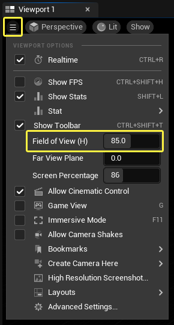
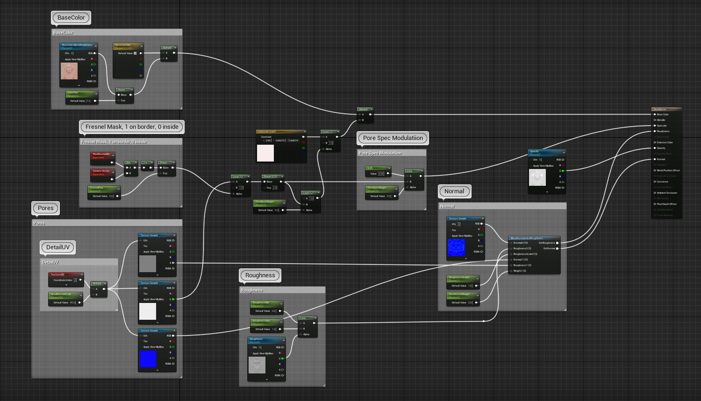
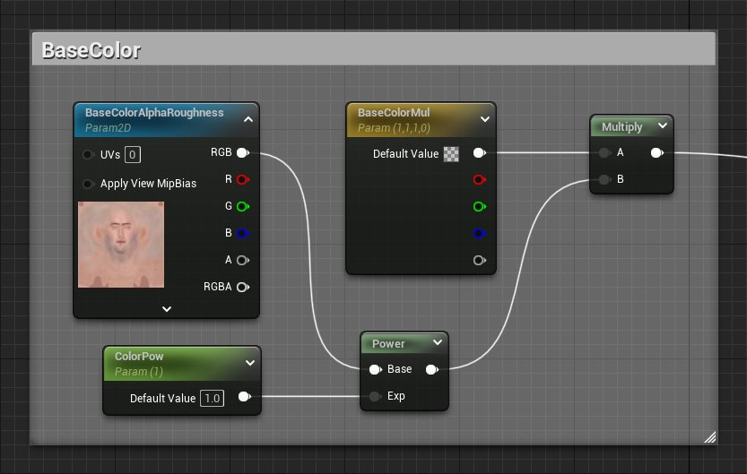
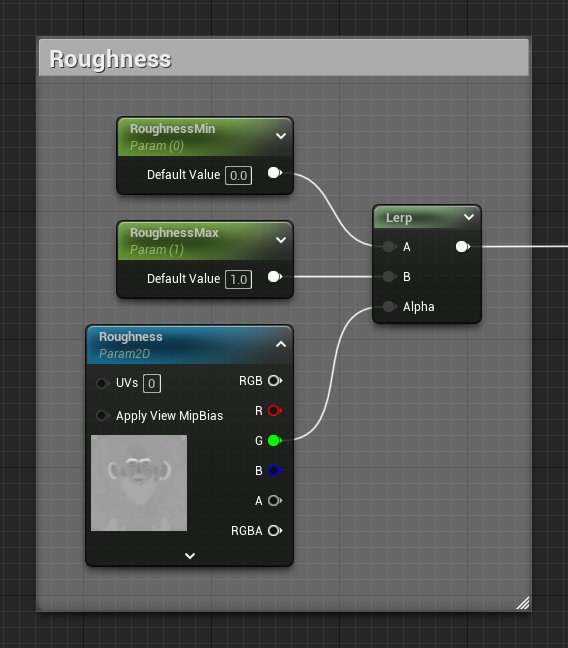
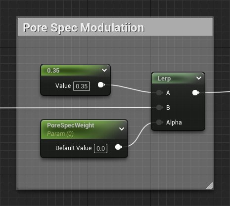
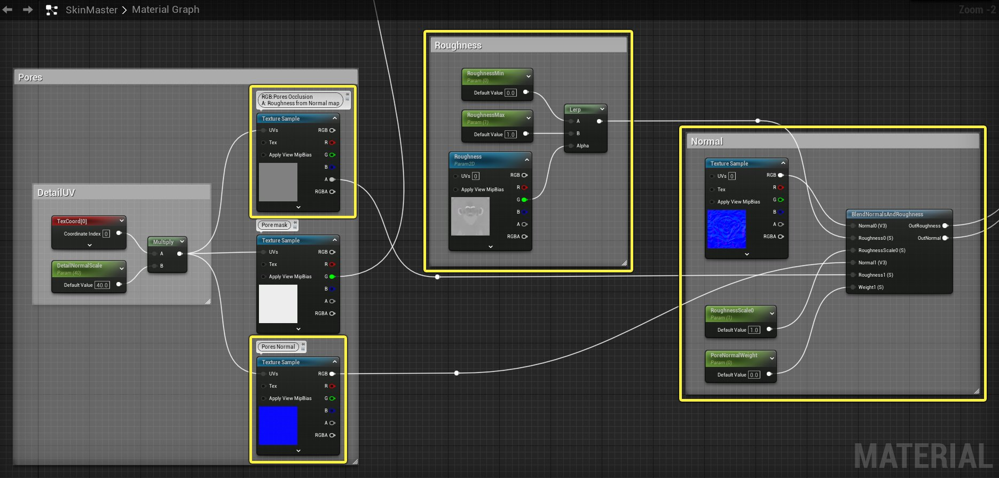

# 创建人体皮肤

> 路径：虚幻引擎5.7文档 / 设计视觉、渲染和图形效果 / 材质 / 材质教程 / 创建人体皮肤

> 原始页面：https://dev.epicgames.com/documentation/unreal-engine/creating-human-skin-in-unreal-engine

未使用此表面轮廓

使用此表面轮廓

让人体皮肤拥有正确的渲染效果是一个非常复杂的话题，并没有一劳永逸的完美方案。 为此，请将以下信息视为你的工作的 *起始点*，因为要获得逼真的图像，需要完成大量的工作。 这是因为我们的眼睛经过非常良好的训练，能够探测到人体面部很细微的细节。 正确做到这一点非常具有挑战性，但一旦精通了工具，就可以将它们应用于许多其他情况。

## 设置

在开始制作材质之前，我们应该先收集一些参考资料。 这是因为通常最好从多个具有不同光照情况的照片参考资料着手，以便你可以验证材质在不同光照情况下的外观。 如果可能，对源数据进行扫描和校准是理想情况，因为这有助于确保你获得可能的最佳结果。 在编辑器中查看内容时，请确保禁用 **编辑器的人眼适应** 功能，以获得更可控的环境：*"编辑（Edit）"菜单 > 项目设置（Project Settings） > 渲染（Rendering）> 默认后置处理（Default Post Processing Settings） > 自动曝光（Auto Exposure）*

> [!TIP]
> 经过校准的环境有助于你确保颜色正确，但并非必需。

在以下示例中，我们将会使用可以在商城中下载到的内容示例（Content Example）中的 "皮肤渲染内容" 来示例。 如果你尚未下载，请前往应用商城下载 Content Example，并打开 皮肤渲染（SkinRendering） 地图。 你还需要记住，本文档中的图像明显分辨率过低，无法用作源素材。

> [!NOTE]
> 请确保正确设置法线贴图以使其能够在虚幻引擎中使用，这一点至关重要。某些引擎使用绿色通道已翻转的法线贴图。你可以通过比较下图中的颜色和你的法线贴图，检查你的法线贴图的绿色通道是否已翻转。

下面列出了在你开始创建皮肤纹理和材质之前需要了解的一些事项。

- 请记住，在创建纹理时，理想情况是从分辨率非常高的纹理（例如 2K x 2K 或更高分辨率）着手，因为这会产生最佳结果。
- 为了更快迭代，最好创建一个材质实例并显示标量和矢量参数，以更快、更简单地进行微调，因为材质在微调期间无需重新编译。
- 请记住，应该在不同光照条件下对资源进行验证，以确保它们正确。 比如如果在"后处理体积"（Post Process Volume）中启用了"人眼适应"，可能会使最终结果大相径庭。
- 为了避免阴影，人工制品需要额外的工作，因为你需要微调阴影偏移之类的项，或者使用聚光效果更好的光锥来获得更好的照明清晰度。
- 微调时，通过调整编辑器 FOV 来放大可能非常有用，因为这不会导致几何体被裁剪，并且产生的变形较少。
- 可以通过以下方法来调整编辑器视野 (FOV)：单击"视角"（Perspective）图标旁的下拉箭头，然后使用鼠标调整 FOC 值。

  
- 在查看你的工作时，你可能会注意到流系统不考虑缩放，并且可能会让你的纹理变得模糊不清（当你并不希望如此时）。这是针对 3D 游戏做出的一个设计上的决策，但在将来某个时间可能会更改。为了防止发生这种情况，你可以在网格实例中更改"流距离乘数"（Streaming Distance Multiplier）。

## 材质（Material）

下面是"内容示例"图中一个完整材质的图像。 虽然此材质看起来很复杂，但我们会在接下来的小节中对该材质的每个部分进行分解。

点击查看大图。

### 底色

首先需要了解的一件事是，从非常远的距离很难察觉到表面散射效果。 这意味着最好让纹理的底色在从远处查看时显得正常。 你也可以使用灰度纹理使底色变深，并使用高光效果（由于散射导致）使皮肤呈现一个较好的整体外观。 还可以添加一些矢量和标量控件来调整皮肤的颜色及活力，以帮助你进一步微调，从而获得想要的外观。

### 粗糙度

对于皮肤，最好从 0.4 左右的粗糙度常量值开始，并从此值进行微调。 请记住，实际值取决于影调范围/距离、年龄以及你试图模拟的皮肤的干湿程度。

与其他纹理不同，我们明确地想要纹理映射看起来不一样。下面是这种 MIP 链看起来的样子：

请注意，MIP 越小，就具有越明亮的灰度值，这意味着材质转变为更粗燥的材质。 还要注意，可以将此纹理放入另一个纹理的通道中（这样可减少纹理查找和纹理内存）。 理想情况下，此纹理应该与法线贴图纹理具有相同的分辨率。

### 高光

皮肤的高光值设置为值 **0.35**。 使用数字 0.35 是因为此数字是从真实世界测量出的高光值转换为我们使用的范围后得出的。

### 法线

点击查看大图。

为了让法线贴图适合于皮肤，你需要确保法线贴图满足下列条件。

- 用于面部的法线贴图应该只包含有关皱纹的细节。毛孔细节应该通过平铺纹理来完成，因为这样可以得到更好的结果。
- 将对象的法线贴图与细节法线贴图合并时，请确保使用材质函数 BlendAngleCorrectedNormals 进行合并，因为你将获得更好的结果。 显示参数以调整法线贴图的混合同样非常重要。你可以采用细节法线贴图值，对其 Z 分量增加特定标量值，然后标准化。 这样就可以将一个普通的法线贴图转变成一个平面细节法线贴图。
- 由于皮肤的不同区域具有不同的阴影属性，最好将粗糙度与对象映射（非拼贴）的纹理结合起来。 由于细节法线贴图会导致粗糙度随着距离增大而增加，我们必须做出补偿。我们还需要从多个影调范围/视野距离验证阴影，以确保无论距离摄像头多远，阴影看起来都正常。
- 现代的实时渲染技术使用基于像素的光照计算来产生阴影。通常，这会得到十分高质量的结果，但适用于非常精细的法线贴图。使用 Mip 贴图可以避免闪光并得到较好的性能，但 Mip 贴图对于法线贴图表现不佳，这是因为较低的 MIP 中的细节根本不存在，并且表面会显得比应有效果明亮得多。为了抵消这种效果，我们可以相应地调整粗糙度。这并不会捕获屈光参差的细节，但对于无方向的特性，这是一个不错的近似值。

### 透明度

> 图片已省略：Opacity graph

透明度输入控制所发生的次表面散射量。 值 1 或纯白意味着应全力进行次表面散射。 值 0 或纯黑意味着不应发生次表面散射。

### 毛孔

> 图片已省略：undefined

点击查看大图。

让皮肤拥有毛孔是获得逼真皮肤过程中非常重要的一个细节。 然而，由于毛孔需要非常细致，因此，仅仅通过向基本法线贴图中添加毛孔很难达到所需的质量。

将毛孔作为单独的拼贴纹理添加不仅使它们更加突出，还可方便对它们进行调整。

由于此着色器中毛孔拼贴细节的变化，已使用 TexCoord 材质表达式乘以标量参数，以便我们能够在材质实例内部获得所需的毛孔。

下面是近距离查看时毛孔蒙版和法线纹理贴图的外观。

由于毛孔略低于表面区域，因此从切线角查看时，实际上很难看到它们。 我们可以模拟当调整被观察平面的角度时，毛孔逐渐变淡的现象。 此计算类似于菲涅尔公式，在 SkinMaster 材质中已按如下所示实现：

> 图片已省略：Fresnel Mask

皮肤毛孔和菲涅尔效果的材质图组件通过下面的逻辑，被混合到更大的图表中。

> 图片已省略：undefined

点击查看大图。

## 使用次表面轮廓

次表面轮廓用来使皮肤显得逼真。 要在材质中使用次表面轮廓，你只需要提供材质或材质实例以及要使用的次表面轮廓。

要在材质中更改次表面轮廓，你只需要在材质编辑器（Material Editor）的 **细节（Details）**面板中提供要使用的次表面轮廓。

> 图片已省略：Add Subsurface Profile

要更改在材质实例内使用的次表面轮廓，你只需要首先检查 **覆盖次表面轮廓（Override Subsurface Profile）**，然后在材质实例的 **次表面轮廓（Subsurface Profile）**部分中提供你想要应用的次表面轮廓。

> 图片已省略：undefined

点击查看大图。

## 实用链接

下述链接指向的外部网站，提供了如何创建高真实度游戏角色的丰富信息。

[次世代角色渲染技术](http://www.iryoku.com/stare-into-the-future)

## 总结

设置皮肤并使其正确渲染是一个较长的复杂过程，需要花一些时间才能获得满意的结果。 请记住，本指南应该只用来帮助你在设置皮肤时指明正确的方向。 如果你发现使用与此处提供的设置略有不同的设置能够获得你想要的结果，这是正常的。 再次强调，上述信息并不是你在设置皮肤时必须严格遵循的规则，而应该被视为可以遵循的准则。
