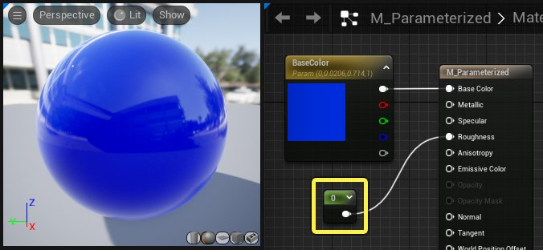
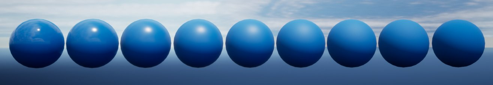
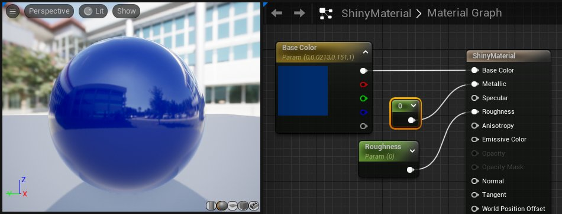
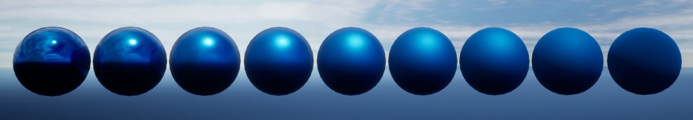
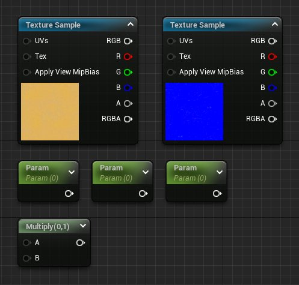
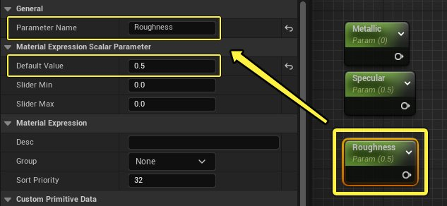
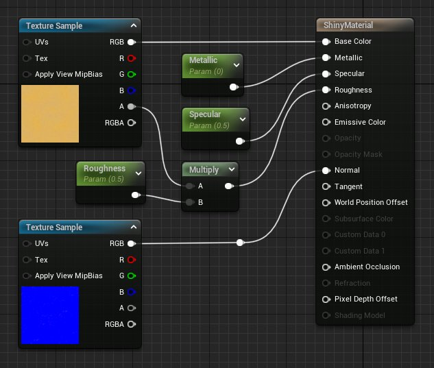

# 创建有光泽的材质

> 路径：虚幻引擎5.7文档 / 设计视觉、渲染和图形效果 / 材质 / 材质教程 / 创建有光泽的材质

> 原始页面：https://dev.epicgames.com/documentation/unreal-engine/creating-shiny-materials-in-unreal-engine

现实世界中的每个物体都有一定程度的光泽。在一些情况下这种光泽（或者反射度）很明显，比如镜子、镀铬或者玻璃。其它情况下光泽的差异比较细微，比如刷漆的木头，平整但不光滑的石头或者水泥。

在虚幻引擎中，你可以使用 **金属感（Metallic）、高光度（Specular）和粗糙度（Roughness）等[材质输入](../../material-inputs/index.md)来模拟物体的光泽度。该教程将介绍在材质中引入光泽度的几种常见方式。

## 光泽度

在现实世界中，当光线照射在物体表面时，一些会被吸收，一些会被散射，而一些会被直接反射。散射的光线被称为 **漫反射（diffuse reflection）**。你在现实世界中看到没有反射性的物体，比如树桩，你看到的大部分是散射光线。直接反射的光线被称为 **高光反射（specular reflection）**。在镀铬的水龙头或者一滩水中看到自己的倒影，那么你看到的便是高光反射。

在虚幻引擎中，光泽度并不是一个技术性的名称，而是一个美学上的名称。在该教程中，光泽度用来表示表面能够产生多少聚合的像镜面一样的反射。而这些反射的准确属性由金属感、高光度和粗糙度输入来定义。

## 粗糙度与光泽度

**粗糙度（Roughness）** 在帮助确定表面光泽度方面扮演着重要角色。其输入数值为 **0** 到 **1**。

- 粗糙度越高，材质看起来就越像镜面。当粗糙度为

  0

  时材质为完美的镜面。
- 粗糙度越高，材质的光泽就越少。当粗糙度为

  1

  时，材质为完全漫反射。

以下展示了粗糙度如何影响材质的光泽。在该示例中，球体位于一个空白的环境中，所以模型上的高光为光源的直接反射。

最左侧的球体粗糙度值为 **0**，光源反射为一个锐利精准的高光。随着粗糙度慢慢由 **0** 增加至 **1**，这个高光变得越来越模糊，球体也失去了光泽。

## 金属感与光泽度

**金属（Metallic）** 物体观感上的光泽也由粗糙度数值决定。低粗糙度数值会产生有光泽的金属材质，而高粗糙度数值会产生光泽较少的材质。金属和非金属之间的关键区别在于高光反射的颜色如何计算。

- 金属感数值为

  0

  ，高光反射环境和光源的颜色。
- 金属感数值为

  1

  ，高光反射会加入材质的基础颜色。

**随着金属感数值从0变为1，注意反射的颜色受基础颜色影响程度变化。**

以下示例展示粗糙度数值如何影响金属材质。该材质金属感数值为 **1**，在多个图片中保持不变。**基础颜色（Base Color）** 输入为蓝色，以此来展示基础颜色如何影响金属材质上反射的颜色。

金属材质上粗糙度从0到1。

在最左侧，球体的粗糙度数值为 **0** ，看起来和镜面一样。随着粗糙度由 **0增加到1**，球体也失去了光泽。注意材质的基础颜色影响了反射的颜色

## 高光度与光泽度

> [!NOTE]
> 在99%的情况下，你从不需要调整 **高光度（Specular）** 输入，其默认值 **0.5** 对于大部分材质来说已经足够。

**高光度（Specular）** 也可影响材质的光泽度。将高光度值调整到接近1时，将使材质的反射和反射高光显得特别强特别显眼， 而将该值减小到接近0会弱化反射及反射高光，直到它们几乎不存在为止。

以下示例展示当高光度值从0更改为1时，对反射及反射高光强度的影响。

粗糙度可以无视高光度影响物体的光泽。即使高光度（Specular）输入数值为1，通过将粗糙度的值设置为1，也可以取消高光度效果。如果启用了金属感，那么调整高光度不会影响材质。

默认高光度数值0.5已经可以准确的模拟真实世界中大部分物体的高光度。所以，对于大部分材质，你应该不需要修改该数值。当然你可以从艺术的角度进行选择，但是如果数值与0.5差别太大会使物体看起来不真实。

## 在材质中使用光泽度

通过以下步骤来创建有光泽度的材质。

> [!NOTE]
> 本教程将使用项目中包含 **初学者内容包** 时可以找到的内容。如果你未将初学者内容包包括在项目中，请参阅 [迁移内容](../../../../understanding-the-basics/assets-and-content-packs/migrating-assets/index.md)内容页面，以了解有关如何在项目之间移动内容的信息。 通过这种方法，你可以将初学者内容包添加到项目中。

1. 在内容浏览器中右键单击，然后在弹出菜单的创建基本资源（Create Basic Asset）部分中，选择 **材质（Material）**。

   
2. 将材质命名为 **ShinyMaterial**，然后 **双击** 图标来将其在[材质编辑器](../../unreal-engine-material-editor-user-guide/index.md)中打开。
3. 打开材质之后，将以下纹理和材质表达式节点添加到材质图中。这些纹理位于内容浏览器的 **StarterContent > Textures** 文件夹中。

   - 纹理取样：

     T_Metal_Gold_D x 1
   - 纹理取样：

     * T_Metal_Gold_N x 1
   - 标量参数

     x 3
   - 乘数

     x 1

   
4. 需要对标量参数进行命名并填写默认值。选中每个标量参数，然后在细节面板中如下对其进行重命名并且设置 **默认值（Default Value）**。

   - 金属感（Metallic）:

     默认值为

     0
   - 高光度（Specular）:

     默认值为

     0.5
   - 粗糙度（Roughness）:

     默认值为

     0.5

   
5. 将所有材质表达式节点连接到[主材质节点](../../unreal-engine-material-editor-user-guide/using-the-main-material-node/index.md)上相应的输入。完成之后，材质图应该类似于下图：

   
6. 点击工具栏中的 **应用（Apply）** 和 **保存（Save）** 按钮来编译材质，然后关闭材质编辑器。

   > 图片已省略：应用并保存材质
7. 在内容浏览器中找到 **ShinyMaterial** 资产，然后 **右键单击** 它，并从显示的菜单中选择 **创建材质实例（Create Material Instance）** 选项。

   > 图片已省略：创建材质实例
8. 在内容浏览器中 **双击** 来将材质实例在[材质实例编辑器](../../instanced-materials/unreal-engine-material-instance-editor-ui/index.md)中打开。在实例编辑器中，选中复选框来启用全部三个 **全局标量参数值（Global Scalar Parameter Values）** 。

   > 图片已省略：undefined

**标量参数值（Scalar Parameter Values）** 现已启用，将它们设置为不同的值，可以在预览视口中看到其产生的影响。例如，将 **金属感（Metallic）设置为1**，然后将 **粗糙度（Roughness）设置为0.2**，可得到像金子一样闪闪发亮的金属，其表面有一些不同于通常映射的瑕疵。

> 图片已省略：金色材质实例

如果将粗糙度设置为 **0.7**，可以看到反射变得模糊，表面失去光泽，但是反射并没有完全消失。

> 图片已省略：提高粗糙度

最后，如果将 **金属感设为0**，**粗糙度设为0.15**，表面看起来不再像是金属，而是刮蹭过的塑料或者涂料。

> 图片已省略：刮蹭过的塑料材质

## 总结

当你为材质调整 **粗糙度** 数值时，记住绝大部分物体都有或多或少的光泽。即便是一些你不认为是反光的表面也会在强光照射下反射出高光。

大多数情况下你应该避免使用粗糙度数值0或者1，而是取其中间的值。纹理遮罩通常用来给粗糙度数值添加变化和噪点。这样产生的表面不会是完全光泽或者暗淡，而是二者混合而成的有趣的结果。请参阅[纹理遮罩](../using-texture-masks/index.md)。

请记住，反射材质会产生性能成本，尤其是大量距离较近的金属感物体。互相反射或者反射其它反射的金属感对象可能会引起成本高昂的性能问题。
