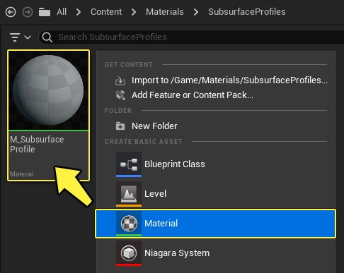
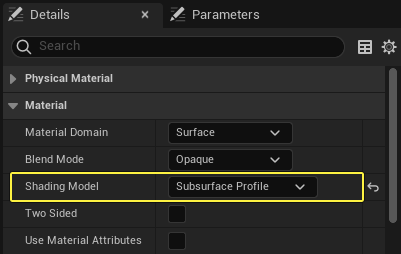
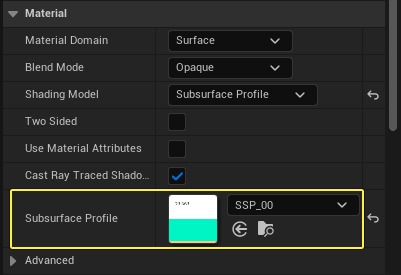
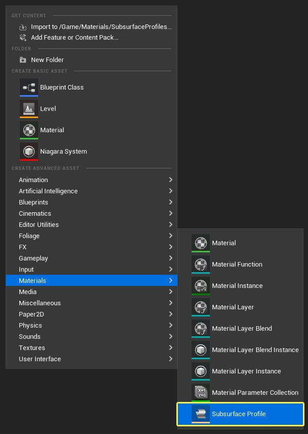
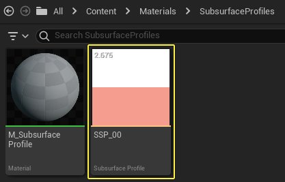
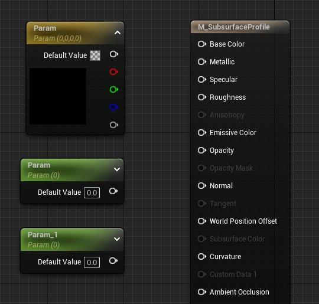
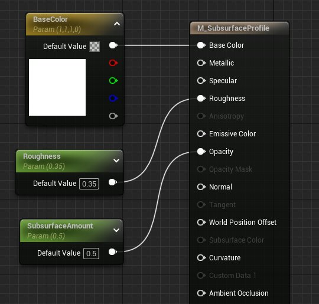
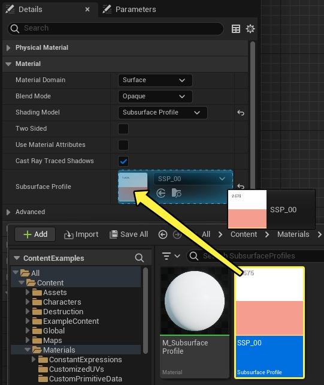

# 在材质中使用次表面轮廓

> 路径：虚幻引擎5.7文档 / 设计视觉、渲染和图形效果 / 材质 / 材质教程 / 在材质中使用次表面轮廓

> 原始页面：https://dev.epicgames.com/documentation/unreal-engine/using-a-subsurface-profile-in-your-unreal-engine-materials

渲染逼真人体皮肤的能力，对于任何现代电子游戏引擎来说都不可或缺。为了满足此需求，虚幻引擎现在提供了一种专门用于皮肤或蜡状表面的明暗处理方法，称为 **次表面轮廓**。 次表面轮廓明暗处理模型有与 **次表面** 明暗处理模型类似的属性，其关键区别在于渲染方式有所不同。 次表面轮廓使用基于屏幕空间的渲染方法，因为这有助于更好地显示人体皮肤上的微妙次表面效果，而反向散射是仅在少数情况（例如，耳朵）下才会出现的次级效果。 以下文档将阐述什么是次表面轮廓以及如何在工作中使用它们。

## 使材质能够使用次表面轮廓

你可通过下列步骤使材质能够使用次表面轮廓。

1. 首先，在 **内容浏览器** 中 **右键单击**，然后从 **创建基本资源（Create Basic Asset）** 列表中选择"材质（Material）"，创建新材质。 创建之后，务必对该材质进行命名。在本例中，该材质将命名为 **M_Subsurface_Profile**。 完成后，你的 **内容浏览器** 应该如下所示。

   
2. 在 **内容浏览器（Content Browser）** 中 **双击** 该材质，在"材质编辑器（Material Editor）"中打开该材质。
3. 现在打开材质后，我们需要在"细节（Details）"面板中将材质的 **着色模型（Shading Model）** 从 **默认光照（Default Lit）** 更改为 **次表面轮廓（Subsurface Profile）**。

   
4. 现在，你可以通过在 **细节（Details）** 面板的 **次表面轮廓（Subsurface Profile）** 部分中输入，指定一个 **次表面轮廓**。

   
5. 现在，此材质已准备好与次表面轮廓配合使用。

## 创建次表面轮廓

以下是创建次表面轮廓的步骤。

1. 首先在 **内容浏览器（Content Browser）** 中 **单击右键**，打开 **材质（Materials）** 上下文菜单，然后选择 **次表面轮廓（Subsurface Profile）** 选项。

   
2. 选择并创建次表面轮廓之后，可以对其进行命名。 在此示例中，我们将这个次表面轮廓命名为 **SSP_00**。 完成后，结果如下图所示。

   

## 创建使用次表面轮廓的材质

材质和次表面轮廓现已创建完毕，你可以开始在其中填充数据。 在下列步骤中，我们将创建可以使用次表面轮廓的材质和材质实例。

1. 在"材质编辑器（Material Editor）"中打开 **M_Subsurface_Profile** 材质（如果尚未打开）。
2. 打开材质后，可以布置一些材质表达式节点。在本教程中，我们将使用下列节点。

   - 矢量参数（Vector Parameter）

     x 1
   - 标量参数（Scalar Parameter）

     x 2

   
3. 现在我们已将材质表达式参数节点添加到图表中，接下来需要为它们命名并填写其默认值。在本例中，我们将为节点提供以下名称和默认值。

| 属性名称 | 值 |
| --- | --- |
| **BaseColor** | R：1.0 G：1.0 B：1.0 |
| **Roughness** | 0.35 |
| **SubsurfaceAmount** | 0.5 |

将每个节点连接到主材质节点（Main Material Node）上的相应输入。 填写完所有内容后，着色器图应如下所示。

1. 现在一切准备就绪，接下来可为材质添加次表面轮廓。 为此，请先在 **细节（Details）** 面板的 **材质（Material）** 分段中找到 **次表面轮廓（Subsurface Profile）** 输入。 使用下拉菜单选择之前创建的 **SSP_00** 资产，或从"内容浏览器（Content Browser）"直接将该资产拖到输入上。

   

   > [!NOTE]
   > 如果你未提供次表面轮廓，那么系统将会使用默认的次表面轮廓。使用的默认次表面轮廓是白种人皮肤的近似表示。
2. 次表面轮廓已应用，材质表达式已链接至主材质节点，你现在可以编译着色器并准备好根据此材质建立材质实例。 完成材质后，它应该如下所示。

   > 图片已省略：undefined

## 在材质实例中使用次表面轮廓

1. 材质现已创建并通过编译，你现在可以建立一些材质实例，以便更快地微调参数。 要根据材质来建立材质实例，请先在 **内容浏览器** 中找到该材质，然后 **右键单击** 该材质并选择 **创建材质实例（Create Material Instance）** 选项。 完成后，你的 **内容浏览器** 应该如下所示。

   > 图片已省略：Create Material Instance
2. 材质实例现已创建完毕，请在 **内容浏览器** 中使用 **鼠标左键** **双击** 将其打开。打开后，你应该会看到类似下图的内容。

   > 图片已省略：undefined
3. 要更改材质实例中的次表面轮廓，可通过选中相应复选框来启用 **次表面轮廓（Subsurface Profile）** 覆盖，然后使用下拉菜单选择其他次表面轮廓资产。单击输入后，应该会看到可供选择的次表面轮廓。

   > 图片已省略：undefined

   > [!NOTE]
   > 如果已在父材质中提供了次表面轮廓，无需在材质实例中覆盖该次表面轮廓。仅当需要使用的次表面轮廓与已在使用的次表面轮廓不同时，才需要进行覆盖。

## 应用次表面轮廓材质

1. 材质实例现已创建完毕，我们可以开始测试新材质。为此，我们首先需要创建新的空白关卡以便在其中工作，方法如下：打开主菜单，然后从 **文件（File）** 选项中选择 **新建关卡（New Level）**。当系统提示选择关卡类型时，请选择 **空白关卡（Empty Level）**。

   > 图片已省略：Create empty level
2. 为了测试材质，我们将使用来自"初学者内容包（Starter Content）"的静态网格体，从前面用 **点光源（Point Light）** 照亮，从后面用非常亮的 **聚光源（Spot Light）** 照亮。 这种强烈的背光将有助于展示次表面轮廓材质如何透射和散射光线。 光照配置应如下图所示。

   > 图片已省略：Lighting Configuration
3. 在"内容浏览器（Content Browser）"中的 **StarterContent** > **Props** 下找到 **SM_Statue** 资产，并将其添加到你的关卡中。 我们示例中的位置和旋转设置如下所示。

   | 属性名称 | 值 |
   | --- | --- |
   | 位置（Location）： | X：0，Y：0，Z：0 |
   | 旋转（Rotation）： | X：0，Y：0，Z：-23 |
4. 打开 **放置Actor（Place Actors）** 菜单，然后将一个 **点光源（Point Light）** 和一个 **聚光源（Spot Light）** 添加到你的关卡中。

   > 图片已省略：Add lights to level
5. 选择点光源，然后在"细节（Details）"面板中为其配置以下设置。

   | 属性名称 | 值 |
   | --- | --- |
   | 位置（Location）： | X：380，Y：0，Z：80 |
   | 强度（Intensity）： | 8.0 cd |

   > 图片已省略：Point Light Details
6. 选择聚光源，然后在"细节（Details）"面板中为其配置以下设置。

   | 属性名称 | 值 |
   | --- | --- |
   | 位置（Location）： | X：-650，Y：100，Z：-75 |
   | 旋转（Rotation）： | X：0，Y：20，Z：0 |
   | 强度（Intensity）： | 1500 cd |

   > 图片已省略：Spot Light Details
7. 将 **M_Subsurface_Profile_Inst** 材质实例应用于雕像（Statue），方法是将该实例从"内容浏览器（Content Browser）"拖到关卡中的静态网格体上，或拖到"细节（Details）"面板中雕像的两个材质元素上， 确保将其拖到雕塑的两个部分上。

   > 图片已省略：Statue details panel
8. 次表面轮廓的效果在高光的边缘上最为明显，聚光源在此处落入阴影中。 沿着这个轮廓，可看到有粉红色的次表面颜色进入，与雕像的薰衣草基础颜色和强烈的白色高光形成鲜明对比。

## 调整次表面轮廓

1. 将材质实例应用于雕像后，可调整次表面轮廓设置。为此，请双击"内容浏览器（Content Browser）"中的 **SSP_00** 资产以打开次表面轮廓。 应该会看到如下所示的内容。

   > 图片已省略：Subsurface Profile editor

   可通过在编辑器中更改值或颜色来调整 **次表面轮廓** 的属性。

   - **表面反射率（Surface Albedo）**：应尽可能与相应父材质的基础颜色匹配。
   - **平均自由路径颜色（Mean Free Path Color）**：控制红色、绿色和蓝色通道的光线穿透表面的距离，并确定光线散射在表面下方的区域的颜色。 较亮的值允许更多的透射，黑色相当于关闭次表面散射。
   - **平均自由路径距离（Mean Free Path Distance）**：以世界/虚幻单位（cm）为单位的距离，用于缩放光线穿透表面的距离。减小此值会使次表面区域更紧密/更锐利，增加此值会使次表面区域更大更模糊。
2. 请记住，你可以实时调整次表面轮廓的参数，如下所示。

## 提示与技巧

次表面轮廓的渲染方式决定了你需要了解一些提示与技巧，才能充分地加以利用。

### 散射半径

将次表面轮廓的 **平均自由路径距离（Mean Free Path Distance）** 设置为非常大的数字将导致渲染错误，如下图所示。

> 图片已省略：Scatter Radius example

在左侧图像中，"平均自由路径距离（Mean Free Path Distance）"设置为50。 请注意，这看起来就像是在表面渲染了多幅图像一样。 现在看看右侧的图像。在此图像中，"平均自由路径距离（Mean Free Path Distance）"设置为5.0。 请注意，图像看上去更加柔和更加自然。这就是我们尝试实现的效果类型。

### 将材质实例与次表面轮廓相结合

将材质实例与次表面轮廓结合使用是一种相当不错的方法，这样就可以 对结果进行最大程度的控制，其原因如下。

- 材质实例允许你实时地调整值，这样就可以更迅速地看到结果。
- 你可使用

  不透明（Opacity）

  输入来限制次表面对表面的影响。但是，建议你保持此值设置为1，并在次表面轮廓内调整参数。仅当你发现单单调整次表面轮廓无法实现所需的结果时，才应调整此值。
- 每个取色器的

  值（Value）

  滑块都控制次表面效果的影响范围。这个值设置得越接近白色，效果越显著。这个值设置得越接近黑色，效果就越不明显。
