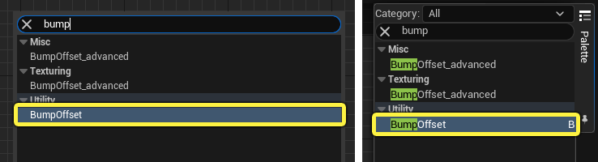
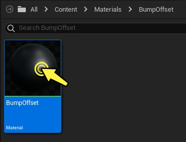
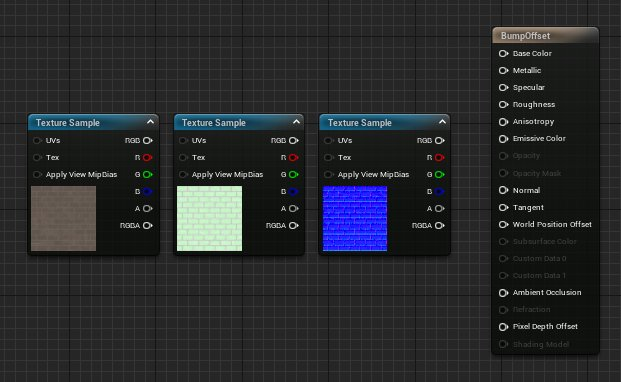
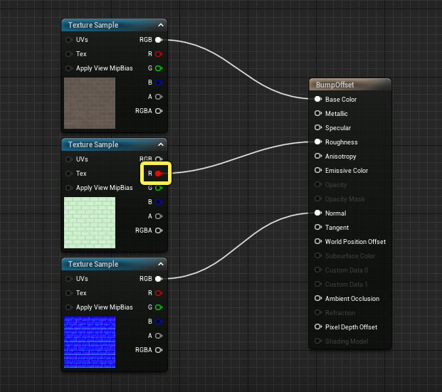
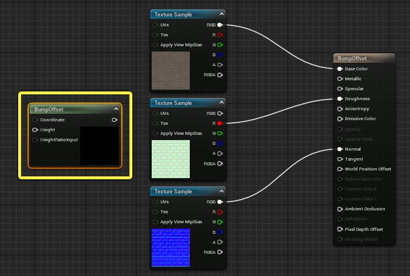
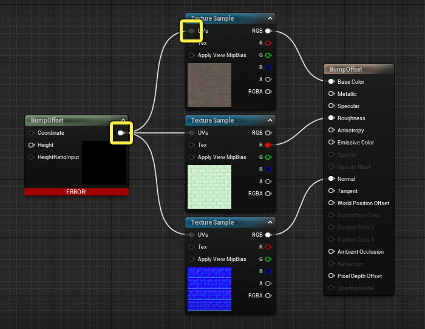
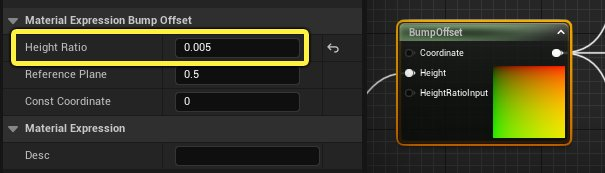

# 使用凹凸贴图偏移

> 路径：虚幻引擎5.7文档 / 设计视觉、渲染和图形效果 / 材质 / 材质教程 / 使用凹凸贴图偏移

> 原始页面：https://dev.epicgames.com/documentation/unreal-engine/using-bump-offset-in-unreal-engine

**凹凸贴图偏移（Bump Offset）** 材质表达式通过修改材质的UV坐标来改进物体表面对深度的描绘。凹凸贴图偏移会替换物体表面的纹素，创建对象表面的错位，从而营造出表面细节超出实际情况的错觉。凹凸贴图偏移表达式通常和正常的贴图搭配使用，并且可以提供比正常贴图更好的深度。

本教程将展示如何在材质中使用凹凸贴图偏移节点。

## 凹凸贴图偏移

**凹凸贴图偏移（BumpOffset）** 是虚幻引擎术语，就是通常所谓的 *视差贴图* 。凹凸贴图偏移表达式可以使材质产生深度错觉，而不需要额外的几何体。凹凸贴图偏移材质使用灰阶高度贴图来提供深度信息。高度贴图中的值越亮，材质的凸出效果越明显；当摄像机在表面上移动时，这些区域将产生视差（移位）。高度贴图中较暗的区域将显得"距离较远"，其移位程度最小。

## 查找凹凸贴图偏移（Bump Offset）材质表达式

你可以通过在 **选用板（Palette）** 搜索框中进行搜索来找到凹凸贴图偏移材质表达式，或者在材质图中 **右键单击** 并进行搜索来查找。

凹凸贴图偏移节点还有[材质编辑器快捷键](../../unreal-engine-material-editor-user-guide/placing-material-expressions-and-functions/index.md#keyboardshortcuts)。按住 **B键** 并 **左键点击** 材质图表的任何地方来放置一个凹凸贴图偏移节点。

> [!NOTE]
> 搜索凹凸贴图偏移材质表达式时，你将看到名为 **高级凹凸贴图偏移（BumpOffset_Advanced）** 的另一个材质表达式。高级凹凸贴图偏移是为了添加一些在常规凹凸贴图偏移表达式中不可用的额外控件而创建的材质函数。尽管它有更多的输出和输入，但其工作方式相同，都是通过处理其所在对象的 UV，营造对象表面比实际情况有更多细节的错觉。

## 使用凹凸贴图偏移材质表达式

可以通过下列步骤将材质设置为使用凹凸贴图偏移"（Bump Offset）材质表达式。

> [!NOTE]
> 本教程将使用项目中包含 **起步内容（Starter Content）** 时可以找到的内容。 如果你的项目未包含起步内容，请参阅 [迁移内容](../../../../understanding-the-basics/assets-and-content-packs/migrating-assets/index.md)页面，以了解有关如何在项目之间移动内容的信息。通过这种方法，你可以将起步内容添加到项目中，而不必建立新项目。

1. 首先，使用鼠标在 **内容浏览器（Content Browser）** 中 **右键单击**，然后从弹出菜单的 **创建基本资产（Create Basic Asset）** 部分中选择 **材质（Material）**，并将材质命名为 'BumpOffset'。

   
2. 在 **内容浏览器（Content Browser）** 中 **双击** 该材质以将其在材质编辑器中打开。

   
3. 本示例使用三个纹理示例来将数据传送到 **底色（Base Color）、粗糙度（Roughness）、以及法线（Normal）** 输入中。在内容浏览器中，找到 **Content > Starter Content > Textures** 并找到以下三个材质。

   - T_Brick_Clay_New_D
   - T_Brick_Clay_New_M
   - T_Brick_Clay_New_N

   将三个材质全部从内容浏览器拖入材质图表，并将其作为材质样本添加。你的图表应该如下所示。

   
4. 将纹理样本连接到[主材质节点](../../unreal-engine-material-editor-user-guide/using-the-main-material-node/index.md)，如下图所示。

   

   - 将

     T_Brick_Clay_New_D

     的RGB输出连接到

     底色（Base Color）

     输入。
   - 将

     T_Brick_Clay_New_M

     材质的

     红色（Red）

     通道连接到

     粗糙度（Roughness）

     输入。确保你使用的是

     R

     输出引脚而不是RGB。
   - 将

     T_Brick_Clay_New_N

     的RGB输出连接到

     法线（Normal）

     输入。
5. 使用[以上三种方式](#findingthebumpoffsetmaterialexpression)来向你的图表中添加一个凹凸贴图偏移材质表达式。

   
6. 凹凸贴图偏移材质表达式会修改图表中已有的三个纹理样本的UV。将凹凸贴图偏移节点的输出引脚连接到纹理样本的 **UV** 引脚上。你的图表应该如下所示。

   

   > [!NOTE]
   > 当你第一次将凹凸贴图偏移材质表达式连接到三个纹理中任何一个的 UV 输入时，凹凸贴图偏移节点底部会显示红色警告。凹凸贴图偏移材质表达式需要高度贴图才能正常工作，但是，当前未提供任何高度贴图。将纹理连接到 **高度（Height）** 输入后，此错误将消失。
7. 凹凸贴图偏移材质表达式的**高度（Height）** 输入需要一个黑白高度贴图。用于材质底色的 **T_Brick_Clay_New_D** 纹理样本也在其 **Alpha channel** 中包含了高度信息。选择T_Brick_Clay_New_D纹理样本并按下 **Ctrl + D** 来复制一个节点。将其移动到图表的左侧然后将 **A** 输出连接到凹凸贴图偏移节点的**高度（Height）** 输入上。
8. 需要调整凹凸贴图偏移材质表达式的设置，确保不会产生称为 "UV 漂浮" 的效果，这会导致视差效果过于强烈，移动摄像机时纹理看起来会像是在网格体表面滑动。 选中凹凸贴图偏移节点，然后在细节（Details）面板中，将 **高度比（Height Ratio）** 从0.05设置为 **0.005**。

   
9. 设置好高度比之后，确保点击工具栏中的 **保存（Save）** 或者 **应用（Apply）** 来编译材质。编译并保存后，材质便可以在关卡中的物体上使用。

   > 图片已省略：应用材质

前后移动滑块来比较使用了和没有使用凹凸贴图偏移的球体。注意使用凹凸贴图偏移时砖块有更好的深度。摄像机运动起来的时候该效果会更明显。

> 图片已省略：A brick Material before and after BumpOffset is added.

**A brick Material before and after BumpOffset is added.**

## 结论

使用凹凸贴图偏移材质表达式是一种非常有效并低成本方法，你可以采用这种方法为材质添加额外的深度信息，而无需添加额外的 3D 几何体。 但是请记住，凹凸贴图偏移材质表达式并不实际修改网格体的形状或者几何体。因此这种错觉在大多数情况下有效，但在特定情况下可能会不起作用，比如玩家/用户可能会移动摄像机，使其与应用了凹凸贴图偏移效果的表面平行。
