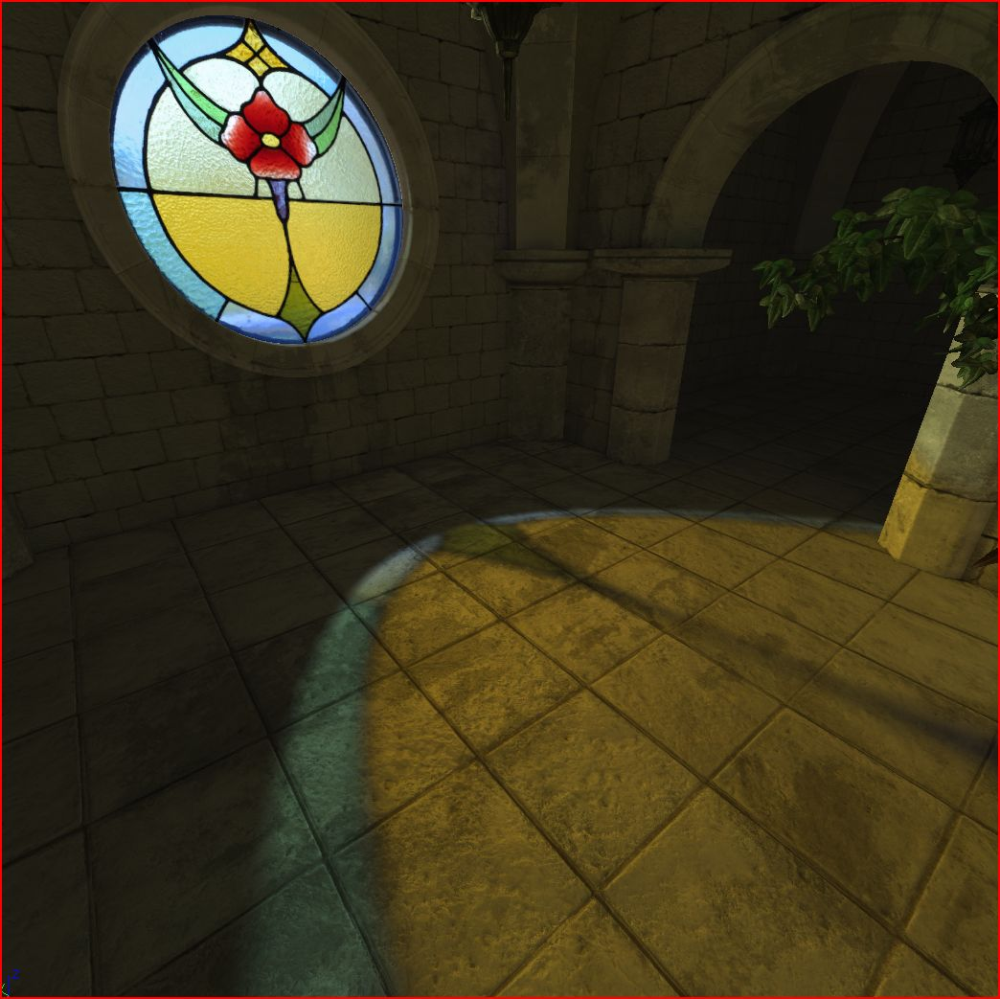
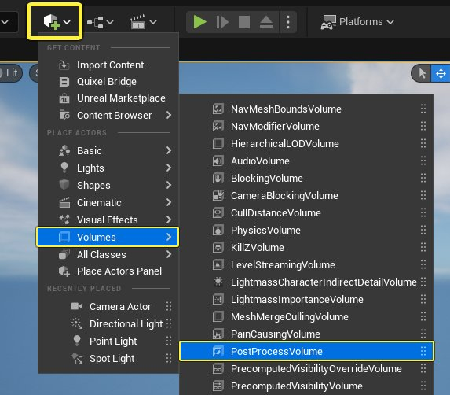
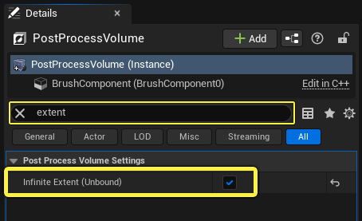
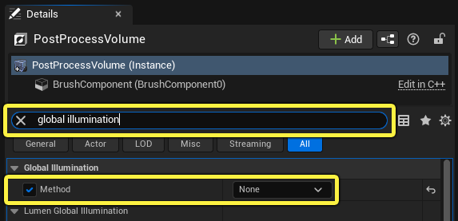
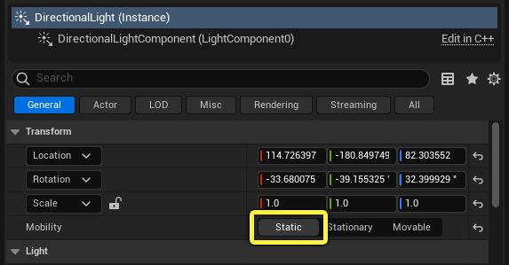
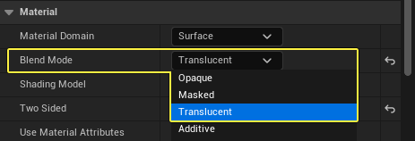
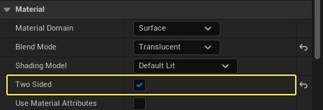
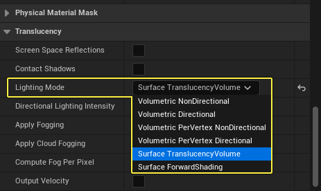

# 使用彩色半透明阴影

> 路径：虚幻引擎5.7文档 / 设计视觉、渲染和图形效果 / 材质 / 材质教程 / 使用彩色半透明阴影

> 原始页面：https://dev.epicgames.com/documentation/unreal-engine/using-colored-translucent-shadows-in-unreal-engine

本教程将介绍如何配置虚幻引擎来投射彩色半透明阴影。 此功能在许多应用中都很有用，常见例子就是透过彩色玻璃窗的彩色光。

虚幻引擎中的半透明阴影颜色。

## 半透明阴影颜色

阴影在穿过半透明表面时所呈现的颜色即为半透明阴影颜色。 这个过程也称为 **透射**透过材质的彩色光量由其 **不透明度（Opacity）** 值（介于0和1之间）以及投射到材质上的光强度决定。

- 例如，如果不透明度值设置为

  0

  ，则材质完全透明，不会透射颜色或投射阴影。
- 如果不透明度设置为

  1

  ，则材质完全不透明并且完全不透光。
- 当不透明度值

  介于0和1

  之间时，透过该对象的光将染上材质的

  基础颜色

  ，并且阴影会继承一些颜色。

### 与各种光照系统的兼容性

并非所有虚幻引擎的光照和[全局光照](../../../../building-virtual-worlds/lighting-the-environment/global-illumination/index.md)系统都支持半透明阴影颜色。 下方图表详细说明了哪些光照功能支持半透明彩色阴影。

| 光照系统 | 半透明彩色阴影 |
| --- | --- |
| CPU Lightmass | 是，仅限静态光源 |
| GPU Lightmass | 是，仅限静态光源 |
| Lumen全局光照 | 否 |
| 硬件光线追踪 | 否 |
| 路径追踪器 | 是，需要薄的半透明着色模型 |

此列表中值得注意的一点是 **Lumen全局光照** ，它目前不支持半透明阴影颜色。

因为[Lumen全局光照](../../../../building-virtual-worlds/lighting-the-environment/global-illumination/lumen-global-illumination-and-reflections/index.md)在所有新的UE5项目中默认启用，这意味着如果你要在关卡中使用彩色半透明阴影，你需要在 **项目设置（Project Settings）** 或 **PostProcessVolume** 中手动禁用Lumen。

以下小节介绍了如何设置场景和材质才能投射半透明彩色阴影。

## 在UE5中禁用Lumen

按照以下步骤在当前关卡中禁用Lumen全局光照。

1. 在工具栏中点击 **创建** 图标，并选择 **体积（Volumes）** > **PostProcessVolume** 。

   
2. 在关卡中选择PostProcessVolume，并在细节面板（Details Panel）中，搜索 **"extent"** 。启用 **无限范围（未限制）（Infinite Extent (Unbound)）** 设置，这样PostProcessVolume的影响范围为整个关卡。

   
3. 在细节面板（Details Panel）中搜索 **Global Illumination** 。 启用 **方法（Method）** 设置，并使用下拉菜单将全局光照方法从 **Lumen** 更改为 **无（None）** 。

   

   此设置可禁用当前关卡中的动态全局光照，但你仍然可以使用Lightmass从静态光源烘焙全局光照。

## 光照设置

对于光照，最要紧的是，你只能从 **移动性（Mobility）** 设置为了 **静态（Static）** 的光源Actor投射彩色半透明阴影。你可以使用以下光源类型。

- 定向光源
- 点光源
- 聚光光源
- 矩形光源

此页面上的所有示例都使用虚幻引擎 **昼夜变换（Time of Day）** 关卡模板中的定向光源。 在大纲视图（Outliner）中选择 **定向光源（Directional Light）** ，然后在细节面板（Details Panel）中将 **移动性（Mobility）** 更改为 **静态（Static）** 。

> [!NOTE]
> 间接光照可以冲淡彩色阴影，使它们看起来没有材质的基础颜色饱和。如果你无法在关卡中看到彩色半透明阴影，请考虑降低光源的 **间接照明强度（Indirect Lighting Intensity）** ，或尝试使用较暗的环境。

## 材质设置

### 材质属性

你可以使用下面列出的混合模式和着色模型来投射彩色半透明阴影。

- 混合模式：

  半透明、累加、AlphaComposite或调制
- 着色模型：

  默认光照、无光照或薄半透明

> [!WARNING]
> 若使用 **调制（Modulate）** 混合模式，需要在细节面板（Details Panel）属性中禁用 **移动单独半透明度（Mobile Separate Translucency）** 。

#### 双面

启用 **双面（Two Sided）** 属性是可选项，但如果你希望玩家使用材质查看网格体的两面，则必须启用该属性。 如果禁用了 **双面（Two Sided）**，则必须将光源投射到材质的可见面才能投射彩色阴影。

### 创建光照半透明材质

1. 创建新的

   材质

   资产，并在

   材质编辑器

   中打开它。点击材质图表（Material Graph）中的任意位置以便在细节面板（Details Panel）中显示

   材质属性

   。
2. 在细节面板（Details Panel）中，将 **混合模式（Blend Mode）** 更改为 **半透明（Translucent）** 。

   
3. 启用 **双面（Two Sided）** 材质属性（可选）。

   
4. 向下滚动并展开 **半透明（Translucency）** 分段。 将 **光照模式（Lighting Model）** 设为 **表面半透明体积（Surface Translucency Volume）** 。

   
5. 将 **纹理样本（Texture Sample）** 添加到材质图表（Material Graph）。此示例使用彩色几何图案模拟彩色玻璃窗，但任何彩色纹理都可行。 与饱和度低的图像相比，颜色饱和度高的图像生成的阴影更鲜艳。将纹理样本（Texture Sample）的 **RGB** 输出连接到[主材质节点](../../unreal-engine-material-editor-user-guide/using-the-main-material-node/index.md)上的 **基础颜色（Base Color）** 输入。

   > 图片已省略：彩色玻璃纹理样本
6. 创建 **标量参数（Scalar Parameter）** ，并将其重命名为 **不透明度（Opacity）** 。选择标量参数（Scalar Parameter）并在细节面板（Details Panel）中将 **默认值（Default Value）** 设置为0到1之间的值。你还可以将 **滑块最大值（Slider Max）** 设置为 **1** ，限制不透明度的值范围。

   > 图片已省略：标量参数值
7. 将标量参数连接到 **不透明度（Opacity）** 输入。 你的材质图表看起来应该类似于下图。

   > 图片已省略：默认光照材质图表
8. 点击工具栏中的 **应用（Apply）** 和 **保存（Save）** 可编辑材质并保存资产。

   > 图片已省略：编译并保存材质

## 构建光照

关闭材质编辑器并将材质应用到关卡中的静态网格体。此示例使用来自虚幻引擎初学者内容包的简单平面。定向光源的角度大致垂直于平面，因此阴影将直接落到下面的地面。

在工具栏中，前往 **构建（Build）** > **仅限构建光照（Build Lighting Only）** 。 当Lightmass构建完成时，应该会出现彩色半透明阴影。

> 图片已省略：为关卡构建Lightmass

### 阴影锐度

有几个因素会影响阴影的锐度，包括接收透射阴影颜色的网格体的光照贴图分辨率、光源的源角度以及纹理样本的质量。如果你的结果像下图一样模糊且不聚焦，则很可能是接收网格体上的光照贴图分辨率太低。

> 图片已省略：模糊的Lighmass效果

选择阴影落在其上的静态网格体，在本例中为地板（Floor）资产。 在细节面板（Details Panel）中，向下滚动到 **光照（Lighting）** 分段。启用 **已覆盖光照贴图分辨率（Overriden Light Map Res）** 设置，输入新的光照贴图分辨率。

> 图片已省略：覆盖Lightmass分辨率

根据静态网格体的大小，可能需要相对较大的分辨率你才能看到清晰的阴影。 下面的滑块显示了当光照贴图分辨率逐渐增加时的情况。

> 图片已省略：光照贴图分辨率从256增至1024、2048，最后增至3072。

**光照贴图分辨率从256增至1024、2048，最后增至3072。**

在此情况中，从 **256** 到 **2048** 是大幅提升，但是当分辨率提升到3072时收益递减。 较大的光照贴图会产生性能开销，因此请注意不要使用超出需求的分辨率。

## 材质变体

### 不透明度和阴影饱和度

材质的不透明度值会影响阴影的饱和度和强度。 在下面的对比中，这三个滑块显示了当 **不透明度（Opacity）** 值从0.2增加到0.9时的情况。 在这样的户外环境中，使用较高的不透明度值，更容易看到彩色阴影。然而，在昏暗室内，不透明度值较低可能会产生更好的效果。

> 图片已省略：材质不透明度为0.2、0.5和0.9。

**材质不透明度为0.2、0.5和0.9。**

### 遮罩不透明度

投射彩色半透明阴影时，不透明遮罩将正常运转。 你可以使用纹理的Alpha通道，或将黑白纹理插入 **不透明度（Opacity）** 输入，以便控制材质的哪些部分可见并投射阴影。 如果你不熟悉该过程，请在此处阅读有关[纹理遮罩](../using-texture-masks/index.md)的更多信息。

下面的示例展示了投射彩色半透明阴影的遮罩材质。没有更改材质属性，但修改了材质图表，如下所示。

> 图片已省略：带有不透明遮罩的彩色阴影

并非将 **不透明度（Opacity）** 标量参数直接插入主材质节点，而是增加黑白纹理样本。 遮罩的黑色区域是透明的，而白色圆形区域是可见的。

这是光照重建后的效果。

> 图片已省略：来自遮罩材质的彩色半透明阴影

## 使用路径追踪器的彩色阴影

> [!NOTE]
> 路径追踪器（Path Tracer）是测试功能，需要在项目设置中启用多项设置。 [在此页面上](../../../../building-virtual-worlds/lighting-the-environment/ray-tracing-and-path-tracing-features/path-tracer/index.md)阅读有关启用路径追踪器的信息。

路径追踪器（Path Tracer）支持动态彩色阴影，但仅当材质使用 **薄半透明（Thin Translucent）** 着色模型时支持。 按照以下步骤修改上述材质，这样材质可以使用路径追踪器投射彩色半透明阴影。

1. 点击材质图表背景的任意位置，在细节面板（Details Panel）中显示材质属性。
2. 将 **着色模型（Shading Model）** 更改为薄半透明。

   > 图片已省略：薄半透明着色模型
3. 向下滚动到 **半透明（Translucency）** 分段，并将 **光照模式（Lighting Mode）** 更改为 **表面前向着色（Surface Forward Shading）** 。

   > 图片已省略：表面前向着色
4. 在右键菜单或材质控制板（Material Palette）中搜索"thin translucent"，然后将 **ThinTranslucentMaterialOutput** 节点添加到你的图表中。

   > 图片已省略：Thin Translucent Material节点
5. 将第二个连接从纹理样本（Texture Sample）的 **RGB** 输出拖到Thin Translucent Material节点上的 **透射颜色（Transmittance Color）** 输入。 图表的其余部分与前面的示例没有变化，应该如下图所示。

   > 图片已省略：薄半透明材质图表
6. 编译材质，并将其应用到你关卡中的网格体。

下面的视频显示了启用路径追踪器时薄半透明彩色玻璃材质的效果。 彩色阴影在路径追踪模式下是完全动态的，如果平面或光源旋转，它会立即更新。 该视频还演示了更改材质的不透明度和定向光源的源角度时的情况。
