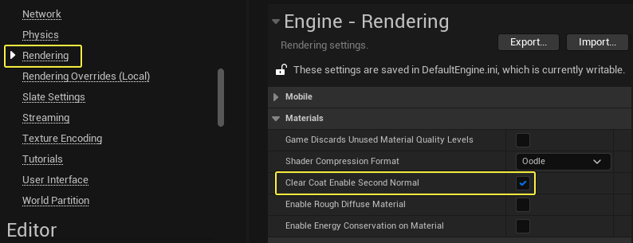
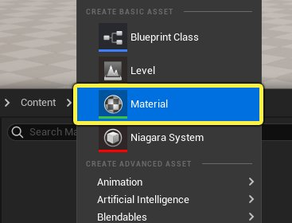
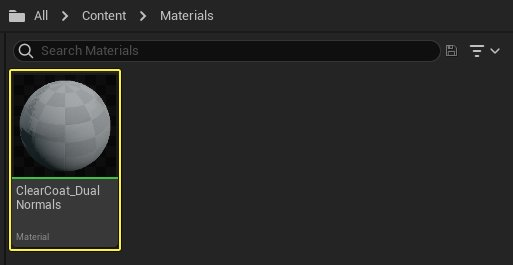
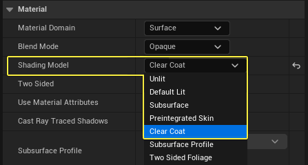

# 将双法线用于透明涂层

> 路径：虚幻引擎5.7文档 / 设计视觉、渲染和图形效果 / 材质 / 材质教程 / 将双法线用于透明涂层

> 原始页面：https://dev.epicgames.com/documentation/unreal-engine/using-dual-normals-with-clear-coat-in-unreal-engine

使用 **透明涂层（Clear Coat）** 着色模型时，你可以启用选项，将第二法线贴图用于透明涂层下的表面。该选项为碳纤维等复杂材质提供了更准确的模型，其中底层有不同于透明涂层的几何表面属性。本教程将介绍如何在 **透明涂层着色模型（Clear Coat Shading Model）** 中启用双法线，以及如何在你的项目中使用此功能。

## 第二法线的用途

下面的比较显示了使用透明涂层着色模型将第二法线贴图添加到碳纤维材质时会发生什么情况。

透明涂层底部法线关闭

透明涂层底部法线开启

在左图中，**透明涂层底部法线（Clear Coat Bottom Normal）** 已关闭。 透明涂层下的表面与光照交互时，光源仅在一个方向影响该表面。这会使得表面扁平而光滑，但这对于碳纤维而言并不准确，因为碳纤维应该呈现交错的编织图案。

在右图中，**透明涂层底部法线（Clear Coat Bottom Normal）** 已启用。 你会注意到，现在光源会与碳纤维编织式样交互，生成有方向感的明暗交替图案。

## 必要文件

要学习本教程，你需要下载、提取并导入以下纹理文件到虚幻引擎项目中。 若不熟悉具体做法，请阅读[纹理导入指南](../../../textures/index.md#%E5%AF%BC%E5%85%A5%E7%BA%B9%E7%90%86)，了解更多信息。

**[必要纹理下载](https://d1iv7db44yhgxn.cloudfront.net/documentation/attachments/f9674011-1212-47d7-962d-91169f177782/clearcoatdualnormaltextures.zip)** （右键点击将链接另存为。）

## 启用透明涂层第二法线选项

要在透明涂层着色模型中使用两组法线，你需要在项目设置（Project Settings）中启用该功能。

1. 在 **主工具栏（Main Toolbar）** 中，前往 **编辑（Edit）** > **项目设置（Project Settings）** 。

   
2. 在项目设置（Project Settings）窗口中，前往 **渲染（Rendering）** > **材质（Materials）** ，然后选中 **透明涂层启用第二法线（Clear Coat Enable Second Normal）** 选项旁边的复选框，即可启用该功能。

   
3. 你必须重启编辑器，才能完成功能的启用。 系统提示时，点击对话框中的 **立即重启（Restart Now）** 。

   

## 使用透明涂层第二法线选项

使用以下步骤创建将第二法线贴图用于底层的透明涂层材质。

1. 在 **内容浏览器（Content Browser）** 中右键点击，在上下文菜单的 **创建基本资产（Create Basic Asset）** 分段中选择 **材质（Material）** 。

   
2. 为材质资产提供描述性名称，如 **ClearCoat_DualNormals** 。 双击材质，在材质编辑器中打开。

   
3. 在材质编辑器中，点击材质图表的任意位置，在细节面板（Details Panel）中显示材质属性。 将材质的 **着色模型（Shading Model）** 从默认光照（Default Lit）更改为 **透明涂层（Clear Coat）** 。

   
4. 将四个 **Scalar Parameter Expression** 节点添加到材质图表。 为它们提供以下名称和默认值，然后将其连接到主材质节点，以便与下图一致。

   | 材质表达式类型 | 名称 | 默认值 |
   | --- | --- | --- |
   | 标量参数 | 基础颜色 | 0.04 |
   | 标量参数 | 金属感 | 1.0 |
   | 标量参数 | 透明涂层 | 1.0 |
   | 标量参 数 | 透明涂层粗糙度 | 0.1225 |

   > 图片已省略：添加标量参数
5. 要设置材质的 **粗糙度（Roughness）** 分段，请将以下材质表达式添加到图表中。 更改每个标量参数的名称和默认值，使其与下表一致。 重命名参数后，连接所有材质表达式，使你的图表与表下面的图一致。

   | 材质表达式类型 | 名称 | 默认值 |
   | --- | --- | --- |
   | 标量参数 | 粗糙度比例（Roughness Scaling） | 30.0 |
   | 标量参数 | 粗糙度最小值（Roughness Min） | 0. 1 |
   | 标量参数 | 粗糙度最大值（Roughness Max） | 1.349 |
   | 纹理取样 | 不适用 | T_CarbonFiber_R_00 |
   | 纹理坐标 | 不适用 | 不适用 |
   | 乘以 | 不适用 | 不适用 |
   | 线性插值 | 不适用 | 不适用 |

   > 图片已省略：粗糙度材质图表
6. 由于该材质使用两个法线贴图，你需要在材质图表中创建两个不同的 **法线贴图（Normal map）** 分段。第一个分段将定义透明涂层表面的法线，并且需要以下材质表达式节点。 根据该表重命名标量参数并设置其默认值。连接材质表达式，使其与下图一致。

   | 材质表达式类型 | 名称 | 默认值 |
   | --- | --- | --- |
   | 标量参数 | 透明涂层法线强度 | 0.98 |
   | 标量参数 | 透明涂层法线比例 | 30.0 |
   | 纹理取样 | 不适用 | T_CarPaint_N_00 |
   | 纹理坐标 | 不适用 | 不适用 |
   | 乘以 | 不适用 | 不适用 |
   | FlattenNormal | 不适用 | 不适用 |

   > 图片已省略：透明涂层法线
7. 第二法线贴图将定义透明涂层下面的碳纤维表面。添加下面列出的材质表达式，并为其提供以下名称和默认值。连接材质表达式节点，使其与下图一致。

   | 材质表达式类型 | 名称 | 默认值 |
   | --- | --- | --- |
   | 标量参数 | 碳纤维比例 | 30.0 |
   | 标量参数 | 碳纤维强度 | 0.5 |
   | 纹理取样 | 不适用 | T_CarbonFiber_N_00 |
   | 纹理坐标 | 不适用 | 不适用 |
   | 乘以 | 不适用 | 不适用 |
   | FlattenNormal | 不适用 | 不适用 |
   | ClearCoatBottomNormal (ClearCoatNormalCustomOutput) | 不适用 | 不适用 |

   > 图片已省略：undefined

   点击查看大图

   > [!NOTE]
   > 确保将 **ClearCoatBottomNormal** 材质表达式节点添加到材质图表，并将你想使用的法线贴图连接到其输入。否则，在材质中看不到第二法线贴图。
8. 现在材质图表的所有各个分段都已完成，将粗糙度（Roughness）分段中的 **插值（Lerp）** 连接到主材质节点上的 **粗糙度（Roughness）** 输入。 将 **FlattenNormal** 节点的输出连接到主材质节点上的 **法线（Normal）** 输入。 碳纤维法线贴图不需要额外的连接，因为它已经连接到 **ClearCoatBottomNormal** 自定义输出节点。 最终材质图表如下图所示。

   > 图片已省略：undefined

   点击查看大图。
9. 在材质编辑器工具栏中点击 **应用（Apply）** 和 **保存（Save）** ，编译材质并保存资产。 完成的碳纤维材质应该类似于如下所示的预览。

   > 图片已省略：最终碳纤维材质
