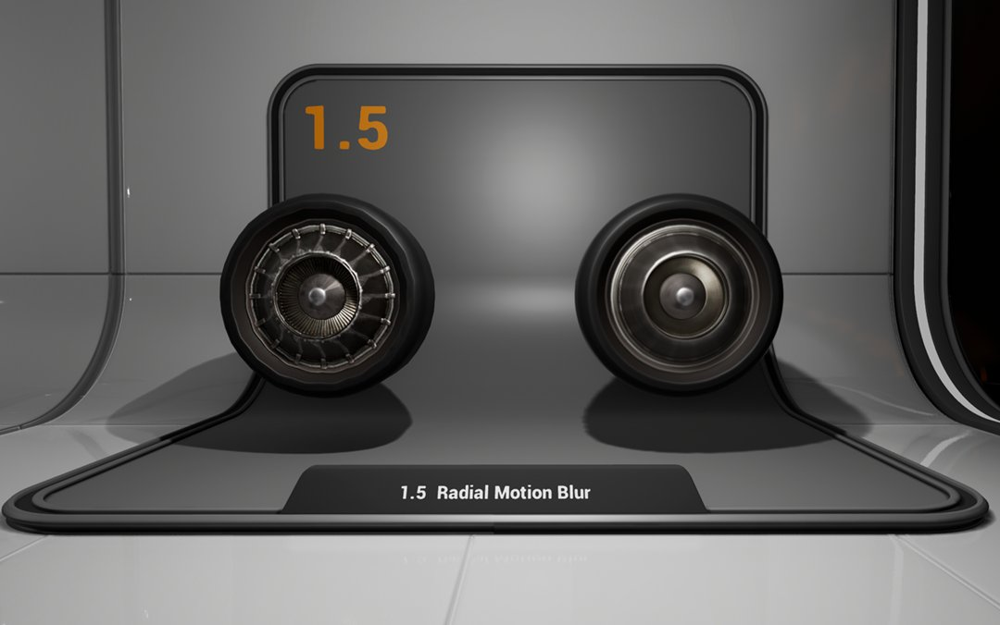
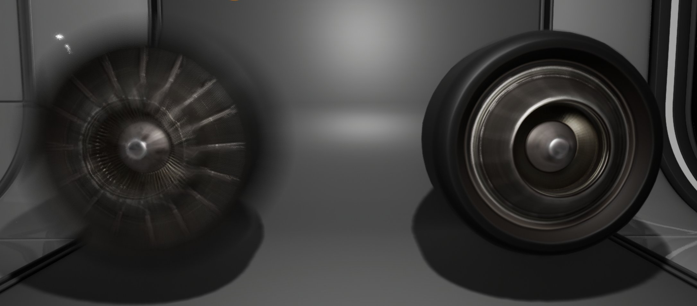
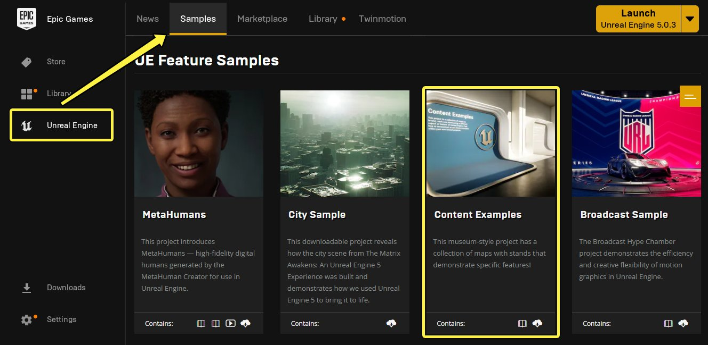
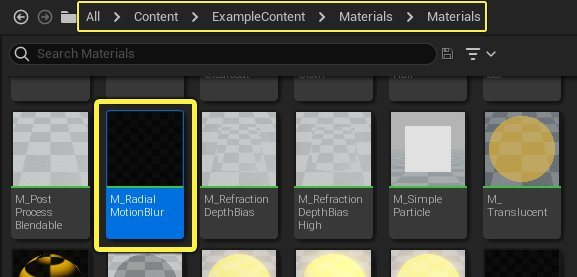
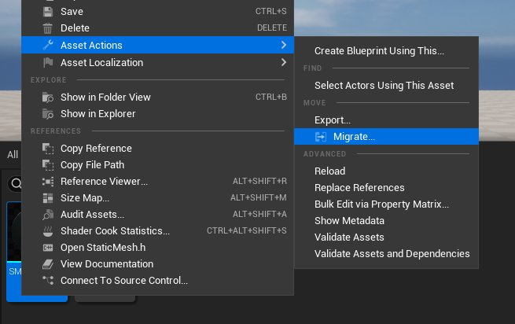
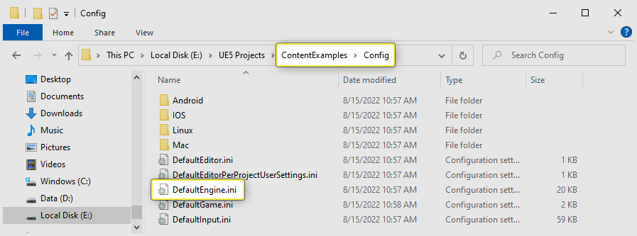
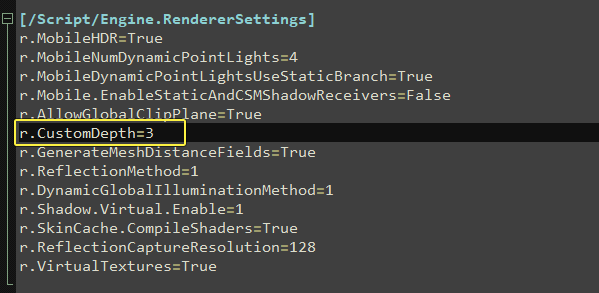
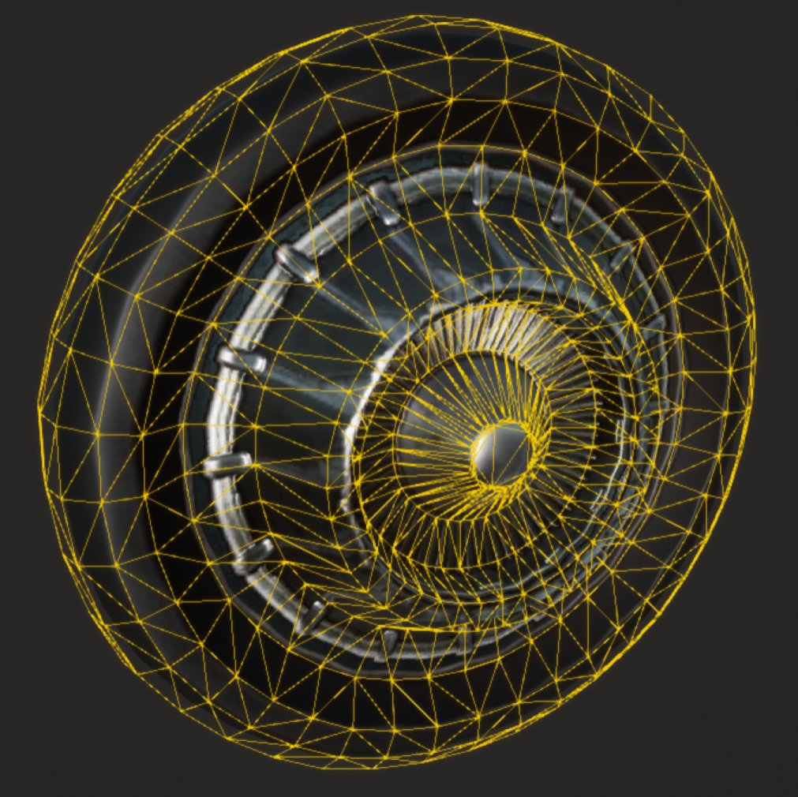

# 径向动态模糊

> 路径：虚幻引擎5.7文档 / 设计视觉、渲染和图形效果 / 材质 / 材质教程 / 径向动态模糊

> 原始页面：https://dev.epicgames.com/documentation/unreal-engine/using-radial-motion-blur-in-unreal-engine

虚幻引擎(UE)支持的标准 **动态模糊** 假设对象表面上的点在帧间保持直线移动，然后利用其在上一帧所处位置的信息来应用模糊效果。

此设置适用于从一个位置将对象移至另一位置。但在应用于单帧内旋转180度的对象时，例如飞速旋转的汽车车轮，此方法会产生视觉误差。在本例中，动态模糊朝向于车轮一侧的点，然后假设其以直线运动至车轮另一侧，而非圆周运动。

为了协助解决此问题，我们开发了特殊 **径向动态模糊** 材质，并在免费的虚幻引擎 **内容示例（Content Examples）** 项目中发布。你可以使用该材质应用径向而非线性动态模糊，让对象仿佛在快速旋转。在下列范例图像中，可以看到在旋转对象上使用标准动态模糊的结果（左侧）与使用径向动态模糊材质的结果（右侧）的对比。

本教程将对在项目中设置径向动态模糊材质的过程进行讲解。

## 必要设置

本教程需要使用 **内容示例** 项目中的资源。若尚无此样本项目，请在Epic Games启动程序的 **学习（Learn）** 选项卡下载并安装。

点击查看全图。

在内容示例项目中，你可以在 **Materials_Advanced** 地图中找到径向动态模糊的工作示例。

鉴于其复杂性，本教程不再赘述从头构建基础 **M_RadialMotionBlur** 材质的过程。如果你想要查看基础材质图表，可以在内容浏览器的 **Content > Example Content > Materials > Materials** 文件夹中找到该材质资产。

出于教学演示的目的我们将使用内容浏览器中的以下资产重新构建径向动态模糊示例：

- SM_Wheel

  - 静态网格体
- SM_Wheel_Blur

  - 静态网格体
- MI_RadialMotionBlur

  - 材质实例

要在你自己的项目中使用径向动态模糊材质，你可以在 **内容浏览器** 中右键点击 **MI_RadialMotionBlur** 材质实例，并在快捷菜单中选择 **资产操作（Asset Actions）** > **迁移（Migrate）**。

迁移资源工具将自动在迁移中包括MI_RadialMotionBlur和基础径向运动模糊（RadialMotionBlur）材质。欲了解本主题更多信息，参见[迁移资源](../../../../understanding-the-basics/assets-and-content-packs/migrating-assets/index.md)相关指南。

## 步骤

1. 确保关闭虚幻编辑器。在项目文件夹中，找到 **Config** 文件夹并找到 **DefaultEngine.ini**。

   

   点击查看大图。
2. 用文本编辑器打开 **DefaultEngine.ini**，然后在 **[/Script/Engine.RendererSettings]** 段添加 **r.CustomDepth=3**。

   
3. 径向动态模糊需要两个 **静态网格体**：要应用径向动态模糊的网格体，以及将其覆盖的"虚拟"网格体。虚拟网格体不仅要覆盖将被模糊的对象，还要完全覆盖其旋转时掠过的空间，其应尽量紧密包裹掠过的空间，而不与原始对象的几何体相交。

   

   点击查看大图。

   在上述示例图像中，要应用模糊效果的网格体应用了标准材质，而"仿真"网格体是一个环绕它的凸包，用黄色线框显示。注意，它与静态网格体紧密贴合，但不穿透静态网格体。可以决定使用自己的网格体，但出于本指南的目的，将使用资源 **SM_Wheel** 和 **SM_Wheel_Blur**，可在 **Content > ExampleContent > Materials > Meshes** 下的内容示例项目中找到它们。

   > 图片已省略：SM_Wheel Static Mesh location
4. 将 **SM_Wheel** 拖入场景来新建 **StaticMeshActor**。

   > 图片已省略：undefined

   点击查看全图。
5. 在此 StaticMeshActor 的 **细节面板（Details Panel）** 中，点击 **从所选项创建蓝图（Create Blueprint from Selection）** 按钮，基于此Actor新建蓝图。将蓝图命名为 **BP_StaticMesh_MotionBlur**，并保存到 **Blueprints** 文件夹。此静态网格体将被转换为新的蓝图Actor类型，同时自动打开 **蓝图编辑器**。

   > 图片已省略：undefined

   点击查看全图。
6. 在 **蓝图编辑器** 中，找到 **组件面板（Components Panel）** 并选择网格体的 **静态网格体组件（StaticMeshComponent）**。然后，在 **细节面板（Details Panel）** 中，展开 **渲染（Rendering）** 下的 **高级（Advanced）** 分段。将 **渲染自定义深度通道（Render Custom Depth Pass）** 设为True，然后将 **自定义深度模具值（Custom Depth Stencil Value）** 设为5。

   > 图片已省略：undefined

   点击查看全图。
7. 在 **组件面板（Components Panel）** 中，点击 **添加组件（Add Component）** 按钮。在下拉列表中选择 **静态网格体（Static Mesh）** 以添加新的静态网格体组件（StaticMeshComponent）作为基础网格体的子级。将此网格体重命名为"**MotionBlur Mesh**"。

   > 图片已省略：Add Static Mesh component
8. 在 **细节面板（Details Panel）** 中，将动态模糊（MotionBlur）网格体的静态网格体设为 **SM_Wheel_Blur**。将其延X轴旋转 **90°** 以适应基础网格体。在材质（Materials）分段中确保其已应用 **MI_RadialMotionBlur** 材质实例。

   > 图片已省略：undefined

   点击查看大图。

## 结果

应用 **MI_RadialMotionBlur** 材质实例后，基础网格体现会仿佛在快速旋转。下图中展示的是普通静态网格体（左侧），与之相对的是一个将径向运动模糊（RadialMotionBlur）应用于虚拟网格体（围绕基础网格体）的网格体（右侧）。

注意：无需旋转基础网格体或Actor即可获得此效果。相反，径向运动模糊材质自身将创造对象在旋转的假象。你可以使用 **MI_RadialMotionBlur** 材质实例中的 **角度（Angle）** 和 **边缘半径（RimRadius）** 参数来调整此效果的表现。

> 图片已省略：Radial Blur aterial Instance

在以下两个图像序列中，展示了调整 **角度（Angle）** 和 **边缘半径（RimRadius）** 材质输入值后，径向模糊的视觉效果所受到的影响。

> 图片已省略：该角度（Angle）参数用于控制径向模糊的强度。参数越高，对象旋转得越快。

该角度（Angle）参数用于控制径向模糊的强度。参数越高，对象旋转得越快。

> 图片已省略：边缘半径参数用于限制径向模糊的对象。应对边缘半径进行设置，以匹配用于径向模糊的网格体半径。

边缘半径参数用于限制径向模糊的对象。应对边缘半径进行设置，以匹配用于径向模糊的网格体半径。

可复用此新建Actor类型来创建使用径向动态模糊效果的所有对象。变更同时用于基础网格体和虚拟网格体的静态网格体，并确保虚拟网格体使用了RadialMotionBlur材质的材质实例。记住，虚拟网格体在旋转时需要尽量与基础网格体掠过的区域紧密相匹。

> 图片已省略：Radial Motion Blur on multiple shapes

最后，若要让不同对象使用不同设置，可基于 **径向运动模糊** 材质新建材质实例，并对其进行相应设置。欲了解创建材质实例方式的更多信息，参见[创建和使用材质实例](../../instanced-materials/creating-and-using-material-instances/index.md)相关指南。
