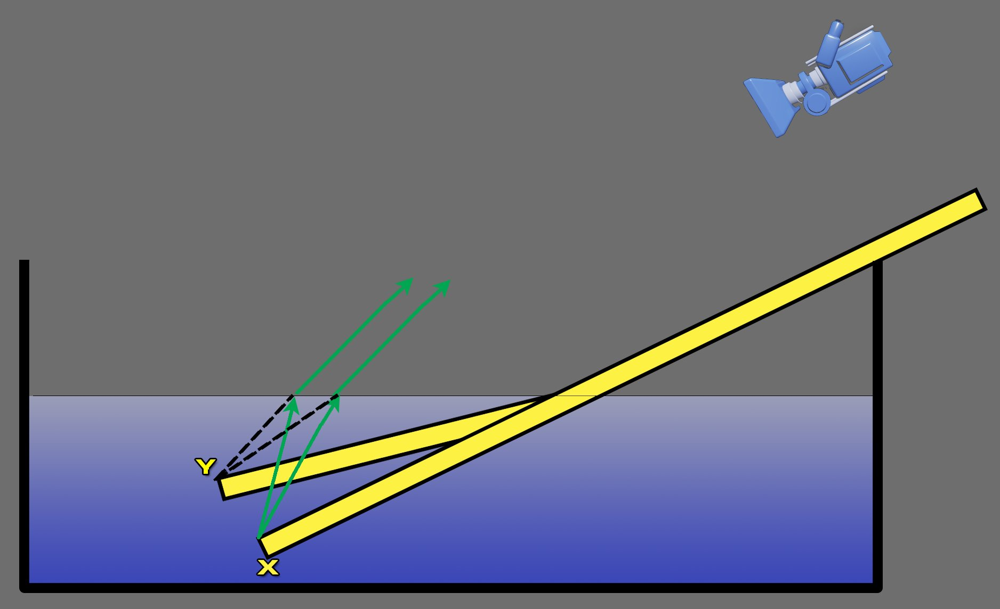
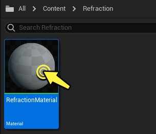
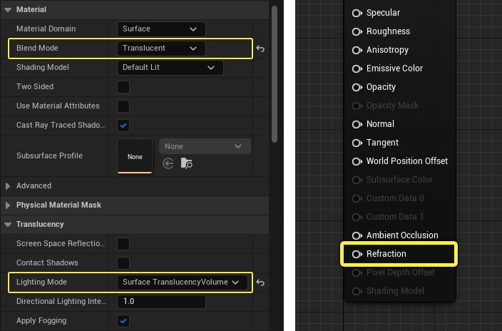
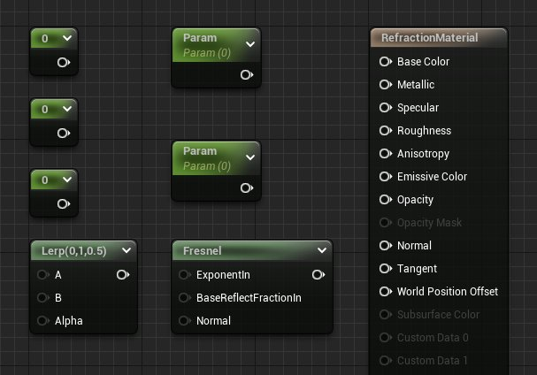
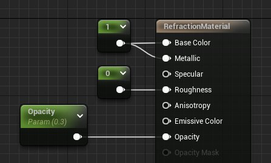
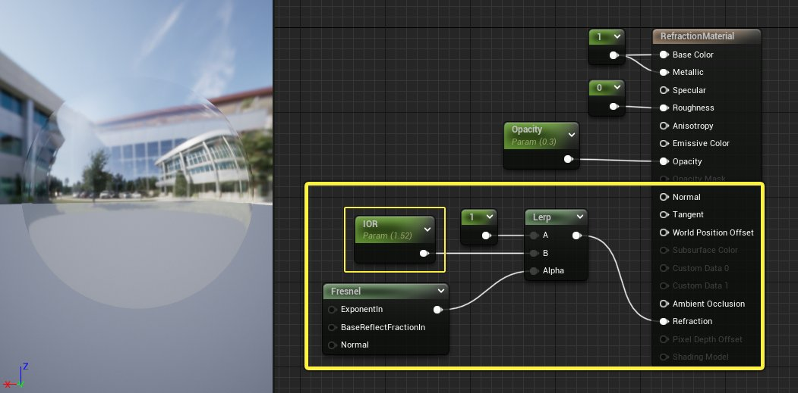
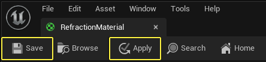

# 使用折射

> 路径：虚幻引擎5.7文档 / 设计视觉、渲染和图形效果 / 材质 / 材质教程 / 使用折射

> 原始页面：https://dev.epicgames.com/documentation/unreal-engine/using-refraction-in-unreal-engine

当光线从一种媒介传播到另一种媒介时，例如从空气传播到水时，光线传播方向会在这两种媒介的交界处发生改变。 这种照明现象称为"折射"，是因为光线所接触的不同类型材质会改变光线传播速度而发生。在虚幻引擎中，你可以在[主材质节点](../../unreal-engine-material-editor-user-guide/using-the-main-material-node/index.md)上使用 **折射** 输入来在材质中模拟这种照明现象。

## 折射

术语 **折射** 用于描述因传输媒介改变而使光波方向改变的现象。 换而言之，当光线投射到某些表面（例如水面或玻璃）时，光线会发生轻微弯折，因为这些表面会影响光线穿透它们的速度。

将铅笔的一部分放入水中，即可看到折射效果的最佳示例。 由于折射原因，放入水中的铅笔部分看起来像是在铅笔与水接触的位置发生弯折。下图可以说明折射如何发生。

**X** 表示铅笔在水中的真实位置。来自原始铅笔位置 X 的光线在水和空气交界处受折射影响，改变了速度和方向。从摄像机查看时，位于水下的铅笔部分像是在水面发生弯折。铅笔尖看起来像是在 **Y** 而不是它原来的位置 **X**。

## 折射率或IOR

光学测量值 **折射率（Index of Refraction）** 简称IOR，可用于准确说明光线从一种媒介传播到另一种媒介时的弯折程度。这种光学数据可以测量，并且常见介质的现实数值都很常见。我们在虚化引擎中创建折射材质时最好使用这些真实的测量值，从而使现实感更加强烈。下表是一些常见表面类型的IOR值

| 材质 | IOR值 |
| --- | --- |
| **空气** | 1.00 |
| **水** | 1.33 |
| **并** | 1.31 |
| **有机玻璃** | 1.49 |
| **玻璃** | 1.52 |
| **钻石** | 2.42 |

## 在材质中使用折射

通过执行以下步骤来设置使用折射的材质。

> [!NOTE]
> 本教程使用初学者内容包中的资产。如果未包括该内容，请参考[迁移内容](../../../../understanding-the-basics/assets-and-content-packs/migrating-assets/index.md)页面来了解如何将初学者内容包从另一项目迁移 到当前项目。

1. 在 **内容浏览器（Content Browser）** 中 **右键点击**，然后从创建基础资产部分选择 **材质（Material）**。将材质重命名为 **RefractionMaterial**。

   
2. **双击** 材质资产来将其在材质编辑器中打开。

   
3. 在详情面板中，将 **混合模式（Blend Mode）** 从 **不透明（Opaque）** 更改为 **半透明（Translucent）**，并将 **照明模型（Lighting Model）** 从 **体积无方向（Volumetric Non Directional）** 更改为 **表面半透明体积（Surface Translucency Volume）**。更改这些设置会启用主材质节点上的 **折射（Refraction）** 引脚。完成之后，材质 **细节（Details）** 面板应该类似于下图。

   
4. 找到下列的材质表达式节点并将它们按照下列的数量添加到图表中。你的材质图表应该类似于下图所示。

   - 常量（Constant）

     x 3
   - 标量参数（Scalar Parameter）

     x 2
   - 插值（Lerp）

     x 1
   - 菲涅耳效果（Fresnel）

     x 1

   
5. 开始像下图一样将材质连接到一起。将流入基础颜色和金属的常量值修改为 **1**。将其中一个标量参数重命名为 **Opacity** 并赋予默认值 **0.3**，将其连接到不透明度输入。

   
6. 将第二个标量参数重命名为 **IOR** 并且将其默认值修改为 **1.52**（玻璃的IOR）。如下图划线部分所示完成连接材质。

   

   由于玻璃折射从各个角度观看的时候都不一样，我们需要一个 **菲涅耳效果（Fresnel）** 材质表达式来混合 **插值（Lerp）** 节点中的两个数值。玻璃在正面观察时看不出太多折射，但是斜视的时候折射非常明显。菲涅耳效果节点会模拟该效应 - 输入A中的 **常量（Constant）** 数值映射至材质的中心，而输入B中的 **IOR参数（IOR parameter）** 映射到球体远离摄像机的边缘。

   > [!TIP]
   > 阅读关于[在材质中使用菲涅耳效果](../using-fresnel-in-your-unreal-engine-materials/index.md)的页面来更好地了解菲涅耳效果材质表达式如何运作。
7. 点击工具栏中的 **应用（Apply）** 和 **保存（Save）** 来编译材质并保存资产。材质保存后便可以关闭材质编辑器。

   
8. 在内容浏览器中找到 **RefractionMaterial** 资产， **右键点击** 图标然后在菜单中选择 **创建材质实例（Create Material Instance）**。
9. 向场景中放入几个物体来测试材质。以下示例使用 **初学者内容包（Starter Content）** 中 **形状（Shapes）** 文件夹下的物体，但是你也可以使用任意物体。将 **RefractiveMaterial_Inst** 资产从内容浏览器中拖到场景中的网格体上。注意球体看起来只在边缘折射光线，而不是摄像机正前方的中心。这就是前面提到的菲涅耳逻辑的结果。

   > 图片已省略：应用折射材质实例
10. 双击 **RefractionMasterial_Inst** 来将其在材质实例编辑器中打开。通过使用点击复选框来启用 **IOR参数（IOR Parameter）**。激活后，可以将IOR设置为不同的值，以模拟不同的表面相互作用。在以下视频展示IOR设为不同值时折射的变化：1.0（空气）、1.33（水）、1.52（玻璃）以及2.42（钻石）。

## 折射提示与技巧

在下一节中，我们会说明将折射与材质编辑器的其他方面结合使用的一些其他方法，会产生一些非常有趣的折射表面。

### 折射与法线贴图

添加折射材质的选项以使用法线贴图，可产生一些非常有趣的结果，这在法线贴图中有大量有趣细节的区域尤其明显。 按以下方式修改刚才创建的 **RefractiveMaterial**，以允许它与法线贴图配合使用。

1. 首先，找到要使用的法线贴图。在本示例中，使用的是 初学者内容包中的 **T_Water_N**，但可以使用任何法线贴图。找到法线贴图之后，请打开 **RefractionMaterial** 资产，然后将该法线贴图从 **内容浏览器（Content Browser）** 拖到材质图表中。

   > 图片已省略：将法线贴图加入图表
2. **右键点击** 法线贴图的纹理样本（Normal map Texture Sampler）然后选择 **转换为参数（Convert to Parameter）**。将参数重命名为 **Normal Map** 然后将其连接到主材质节点的 **法线（Normal）** 输入上。将材质参数化，可以不需要编辑父级材质就在[材质实例](../../instanced-materials/index.md)中将其覆盖，从而更自由地进行艺术创作。
3. 点击工具栏中的 **应用（Apply）** 和 **保存（Save）** 按钮，然后关闭材质。

   > 图片已省略：编译并保存材质
4. 现在在材质实例编辑器中应该可以看到 **Normal Map** 参数被列在全局纹理参数值之下。你可以通过启用参数并从下拉菜单中选择另一个纹理来覆盖该法线贴图。

   > 图片已省略：法线贴图参数
5. 通过更改法线贴图，你可以通过非常有趣的方式影响折射效果。以下示例仅使用初学者内容包中纹理（Textures）文件夹下的法线贴图。

   > 图片已省略：法线贴图示例

### 折射和移动

将折射与运动结合是多种材质都需要的关键部分。水中的涟漪便是一个例子，但是其背后的原理可以通过类似的方式应用到很多不同的VFX材质中，比如热浪、剧烈爆炸造成的空气扭曲或者能量特效。

下图展示了向法线添加有机运动的一种方式。复制法线贴图，然后将其连接到插值（Lerp）节点的A和B输入上。将两个 **平移（Panner）** 材质表达式添加到图表，并将其连接到法线贴图纹理的UV。

> 图片已省略：法线贴图动画图表

修改 **平移（Panner）** 节点中的数值来给纹理添加动作。将一些数值设为负值将会让纹理向相反的方向移动，这样可以创建有机的、看起来随机的运动。以下是示例中使用的两个平移节点的数值。

> 图片已省略：平移运动数值

结果由下面视频所示。在其当前状态下，它看起来像是油状和金属状的流体，但是经过一些修改便可以作为水材质的基础。

### 折射深度偏移

**折射深度偏移（Refraction depth bias）** 用于防止距离较近的对象以锐视角渲染进扭曲的表面。但是，这可能会增加表面与折射开始位置之间分开的距离。 可以在以下两个地方调整 **折射深度偏离（Refraction Depth Bias）**。

- **材质编辑器（Material Editor）** - 你可以在 **详情（Details）** 面板的材质部分中找到 **折射深度偏离（Refraction Depth Bias）**。需要按下白色三角形（高光显示为绿色）才能显示此属性。

  > 图片已省略：材质编辑器中的折射深度偏移
- **材质实例编辑器（Material Instance Editor）** - 可以在 **细节（Details）** 面板的 **常规（General）** 部分中找到 **折射深度偏离（Refraction Depth Bias）**。

  > 图片已省略：实例编辑器中的折射深度偏移

## 结论

向透明材质（特别是玻璃和水）添加折射可产生非常逼真的效果。 请确保参考文档顶部的表格来使用要模拟表面类型的正确IOR值。IOR值源自现实世界中的测量值，所以如果你想要真实性，不建议将IOR值增大或减小到合理水平以外。但是对于VFX和其它对折射不那么严格的应用中，你完全可以尝试不同的数值来达到你想要的效果。
